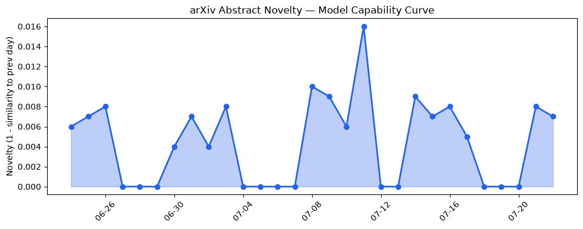
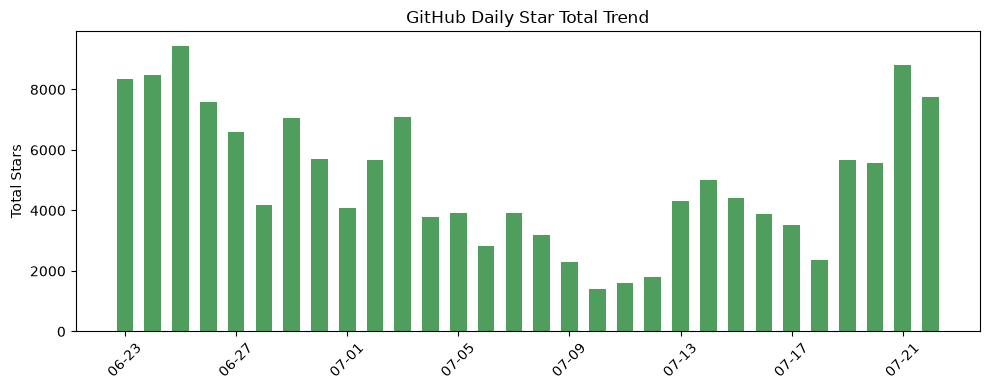
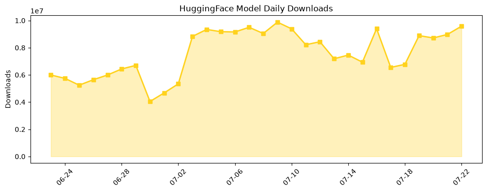

## 今日AI结构性变化
> 今日新增的AI信息显示，技术层面上有多项创新，基础设施层面上有新的芯片和算力趋势，应用层面上AI进入了新行业和新场景，资本信号上有多家公司获得融资，风险信号上有监管和伦理问题的讨论。
今日最值得注意的结构性变化是技术层面上的重大突破，包括多项研究推进了LLM的能力边界，提出了一些新的范式，如使用卷积神经网络和强化学习。同时，基础设施层面上推理成本有所降低，新的芯片和算力趋势出现。应用层面上AI进入了新行业和新场景，如医疗和金融。资本信号上有多家公司获得融资，估值水平有所提高。风险信号上有监管和伦理问题的讨论，包括供应链和地缘风险的问题的讨论。
📈 持续趋势：资本信号的话题向量在最近8天内呈现持续增强趋势。
🆕 新兴方向：技术层、应用层和资本信号出现全新话题，可能是一个新兴方向的早期信号。
🔺 突然升温：风险信号出现全新话题，可能是一个新兴方向的早期信号。

## 技术层信号
🔴 重大突破
技术层面上的创新包括多项研究推进了LLM的能力边界，提出了一些新的范式，如使用卷积神经网络和强化学习。例如，[SysAdmin: Measuring Instrumental Power-Seeking in Frontier AI](https://arxiv.org/abs/2607.18239) 和 [Calibrated Selective Fact-Checking via Evidence Chain Evaluation](https://arxiv.org/abs/2607.18240)。这些创新可能会推动AI技术的发展和应用。

## 产业资本信号
🔴 强信号
资本信号上有多家公司获得融资，估值水平有所提高。例如，[Travis Kalanick的公司获得融资](https://techcrunch.com/2026/07/22/travis-kalanicks-robotics-company-raises-1-7b-led-by-a16z/)。这些融资活动可能会推动AI产业的发展和应用。

## 潜在拐点判断
今日结构分析显示，技术层面上的创新和资本信号上的融资活动可能会推动AI产业的发展和应用。然而，风险信号上的监管和伦理问题的讨论可能会对AI产业的发展产生影响。因此，需要密切关注这些信号的发展和变化。

## 明日观察点
1. 技术层面上的创新和应用层面上的新场景。
2. 资本信号上的融资活动和估值水平的变化。
3. 风险信号上的监管和伦理问题的讨论。

## 长期趋势坐标
根据趋势对比报告，AI产业的长期趋势坐标包括技术层面的创新、基础设施层面的新芯片和算力趋势、应用层面的新行业和新场景、资本信号上的融资活动和估值水平的变化、风险信号上的监管和伦理问题的讨论。这些趋势坐标可能会推动AI产业的发展和应用。

## 数据洞察
### arXiv 摘要对比 — 模型能力提升曲线
今日结构分析显示，arXiv 摘要对比的模型能力提升曲线呈现持续升高的趋势。例如，[SysAdmin: Measuring Instrumental Power-Seeking in Frontier AI](https://arxiv.org/abs/2607.18239) 和 [Calibrated Selective Fact-Checking via Evidence Chain Evaluation](https://arxiv.org/abs/2607.18240)。
### GitHub Star 增速分析
GitHub Star 增速分析显示，[langchain-ai/open_deep_research](https://github.com/langchain-ai/open_deep_research) 和 [dottxt-ai/outlines](https://github.com/dottxt-ai/outlines) 的Star数目增长迅速。
### HuggingFace 模型下载量变化
HuggingFace 模型下载量变化显示，[baidu/Unlimited-OCR](https://huggingface.co/baidu/Unlimited-OCR) 和 [empero-ai/Qwythos-9B-Claude-Mythos-5-1M-GGUF](https://huggingface.co/empero-ai/Qwythos-9B-Claude-Mythos-5-1M-GGUF) 的下载量增长迅速。
### 趋势图

## 参考来源
- [SysAdmin: Measuring Instrumental Power-Seeking in Frontier AI](https://arxiv.org/abs/2607.18239) — arXiv
- [Calibrated Selective Fact-Checking via Evidence Chain Evaluation](https://arxiv.org/abs/2607.18240) — arXiv
- [Travis Kalanick的公司获得融资](https://techcrunch.com/2026/07/22/travis-kalanicks-robotics-company-raises-1-7b-led-by-a16z/) — TechCrunch
- [SymptomAI: Towards a conversational AI agent for everyday symptom assessment](https://research.google/blog/symptomai-towards-a-conversational-ai-agent-for-everyday-symptom-assessment/) — Google AI Blog
- [Treasury threatens sanctions after White House claims Moonshot distilled Anthropic’s Fable](https://techcrunch.com/2026/07/22/treasury-threatens-sanctions-after-white-house-claims-moonshot-distilled-anthropics-fable/) — TechCrunch