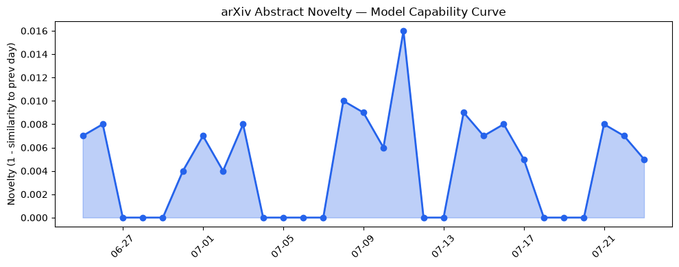
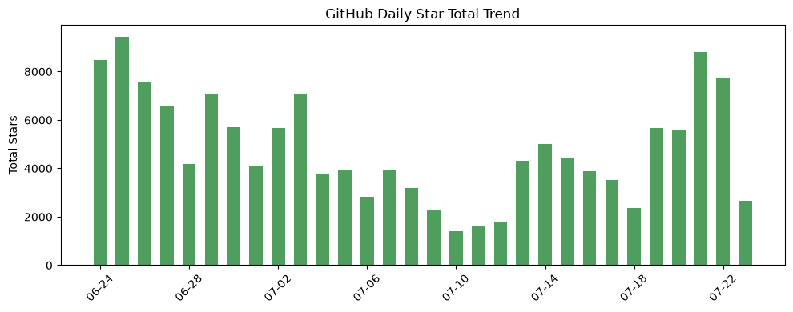
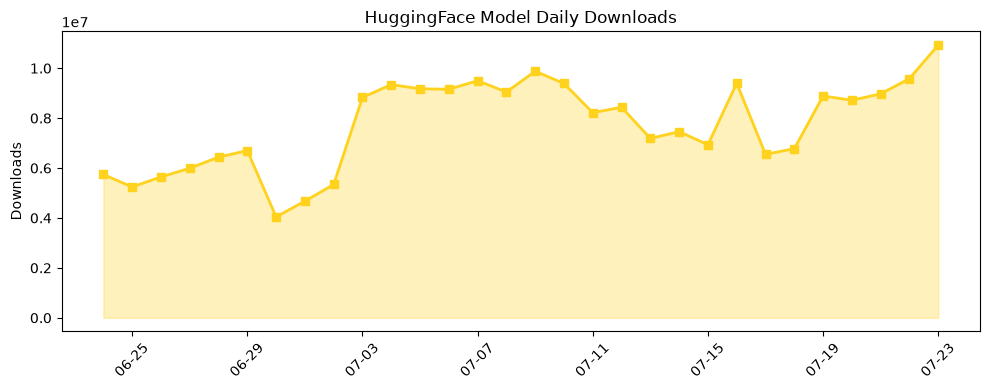

## 今日AI结构性变化
> 今日新增的AI信息表明，技术层面上有多项创新，如新的SOTA和范式，基础设施层面上有新的高效推理方案和芯片趋势，应用层面上AI进入了新行业和新场景，资本信号上有融资方向和估值变化，风险信号上有监管和伦理争议。
今天最值得注意的结构性变化是技术层面上的重大突破和基础设施层面的高效推理方案，这些变化将推动AI的进一步发展和应用。同时，应用层面上的新行业和新场景也将为AI的发展带来新的机遇。
以下是趋势报告中的一些信号：
- 📈 持续趋势：技术层面上的创新和基础设施层面的高效推理方案。
- 🆕 新兴方向：AI进入了新行业和新场景。
- 🔺 突然升温：监管和伦理争议。
- 🔑 新关键词：LLM、SOTA、新范式、高效推理、芯片趋势。
- 📉 消退关键词：RAG、机器学习、深度学习、自然语言处理、计算机视觉、语音识别。

## 技术层信号
🔴 重大突破

技术层面上的创新包括新的SOTA和范式，例如 [Cross-Dialect Generalization Without Retraining](https://arxiv.org/abs/2607.18254) 和 [Probabilistic Concept-Aware Steering for Trustworthy LLM Inference](https://arxiv.org/abs/2607.18259)。这些创新将推动AI的进一步发展和应用。

## 产业资本信号
🔴 强信号

资本信号上有融资方向和估值变化，例如 [Etched defies skeptics, hits $10.3B valuation from big-name investors](https://techcrunch.com/2026/07/23/ai-chip-startup-etched-defies-skeptics-hits-10-3b-valuation-from-big-name-investors/)。这些变化将推动AI的进一步发展和应用。

## 潜在拐点判断
根据趋势报告，技术层面上的创新和基础设施层面的高效推理方案可能会带来新的机遇和挑战。同时，监管和伦理争议也可能会对AI的发展带来影响。

## 明日观察点
1. 技术层面上的创新和基础设施层面的高效推理方案。
2. 应用层面上的新行业和新场景。
3. 资本信号上的融资方向和估值变化。

## 长期趋势坐标
从月/季视角来看，AI的发展趋势是向上的，技术层面上的创新和基础设施层面的高效推理方案将推动AI的进一步发展和应用。同时，应用层面上的新行业和新场景也将为AI的发展带来新的机遇。

## 数据洞察
### arXiv 摘要对比 — 模型能力提升曲线
今日暂无数据。

### GitHub Star 增速分析
今日 GitHub Star 增速分析显示，[ComposioHQ/awesome-claude-skills](https://github.com/ComposioHQ/awesome-claude-skills) 的 Star 数量增长最快，达到 3.11 倍。

### HuggingFace 模型下载量变化
今日 HuggingFace 模型下载量变化显示，[baidu/Unlimited-OCR](https://huggingface.co/baidu/Unlimited-OCR) 的下载量最高，达到 2414259 次。

### 趋势图

## 参考来源
- [Cross-Dialect Generalization Without Retraining](https://arxiv.org/abs/2607.18254)
- [Probabilistic Concept-Aware Steering for Trustworthy LLM Inference](https://arxiv.org/abs/2607.18259)
- [Etched defies skeptics, hits $10.3B valuation from big-name investors](https://techcrunch.com/2026/07/23/ai-chip-startup-etched-defies-skeptics-hits-10-3b-valuation-from-big-name-investors/)
- [OpenAI makes ChatGPT Health available to all US users](https://techcrunch.com/2026/07/23/openai-makes-chatgpt-health-available-to-all-u-s-users/)
- [NTT DATA Group cuts incident analysis to 30 minutes with Codex](https://openai.com/index/ntt-data)