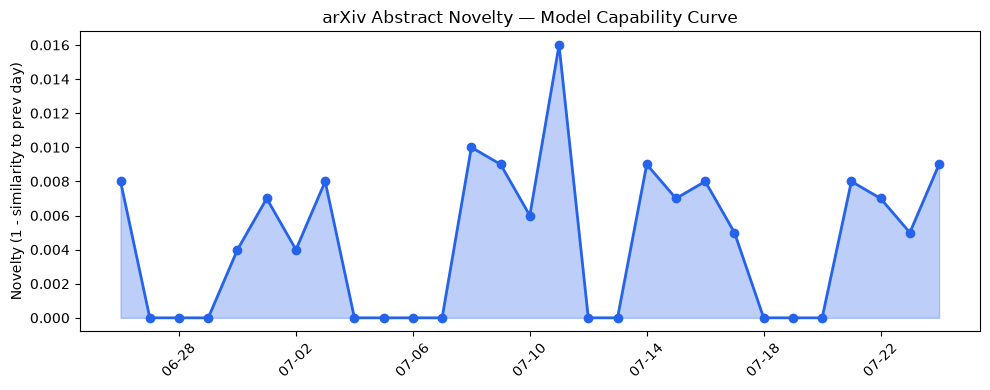
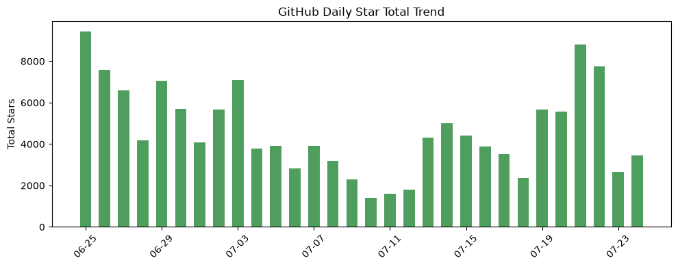
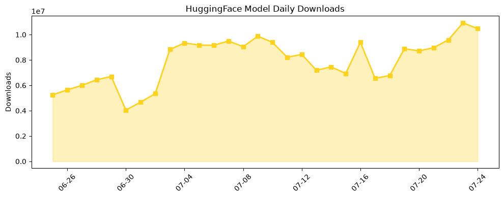

## 今日AI结构性变化
> 今日新增信息表明，AI 领域在技术、基础设施、应用层、资本和风险等方面都有显著变化，尤其是在大语言模型、自动化测试管理和知识编辑等领域。
今日最值得注意的结构性变化是，AI 领域的技术层面出现了重大突破，尤其是在大语言模型方面。同时，基础设施和应用层也出现了显著变化，例如自动化测试管理和知识编辑等领域的发展。
以下是今日结构性变化的信号：
* 📈 持续趋势：大语言模型、自动化测试管理和知识编辑等领域的发展。
* 🆕 新兴方向：风险信号出现全新话题，可能是一个新兴方向的早期信号。
* 🔺 突然升温：基础设施的话题向量在最近8天内呈现持续增强趋势。
* 🔑 新关键词：AINTMA、Claude Opus 5、ClickGuard等。
* 📉 消退关键词：HuggingFace、RAG等。

## 技术层信号
🔴 重大突破

技术层面出现了重大突破，尤其是在大语言模型方面。[AINTMA: Agentic AI Architecture for Autonomous Test Management with Generative Intelligence, Secure Cloud Communication and Adaptive Quality Analytics](https://arxiv.org/abs/2607.20452) 和 [ClickGuard: Detecting and Spoiling Clickbait News with Informativeness Measures and Large Language Models](https://arxiv.org/abs/2607.20463) 等论文提出了一些新的训练方法、推理策略和模型架构。同时，[JAXBench: Benchmarking Autonomous TPU Kernel Optimization](https://arxiv.org/abs/2607.20466) 和 [FlashInfer: Kernel Library for LLM Serving](https://github.com/flashinfer-ai/flashinfer) 等工作也在推动基础设施的发展。

## 产业资本信号
🔴 强信号

产业资本信号强烈，[Prentis, new AI lab co-founded by Reid Hoffman, Marc Pincus in talks to raise $100M](https://techcrunch.com/2026/07/24/prentis-new-ai-lab-co-founded-by-reid-hoffman-marc-pincus-in-talks-to-raise-100m/) 和 [Why Cognition bought Poke: AI personality is becoming a competitive advantage](https://techcrunch.com/2026/07/24/why-cognition-bought-poke-ai-personality-is-becoming-a-competitive-advantage/) 等新闻报道表明，资本市场对AI领域的投资热情依然高涨。

## 潜在拐点判断
根据今日的结构性变化和技术层信号，我们可以判断，AI领域可能正在经历一个重大拐点。技术层面的突破和基础设施的发展可能会带来新的应用场景和商业模式的出现。同时，资本市场的热情也可能会推动AI领域的快速发展。

## 明日观察点
1. 大语言模型的发展和应用。
2. 自动化测试管理和知识编辑等领域的发展。
3. 基础设施的发展和推理成本的变化。

## 长期趋势坐标
从月/季的视角来看，AI领域的发展趋势依然强劲。[overall_novelty](https://arxiv.org/abs/2607.20452) 和 [keyword_trends](https://techcrunch.com/2026/07/24/prentis-new-ai-lab-co-founded-by-reid-hoffman-marc-pincus-in-talks-to-raise-100m/) 等指标表明，AI领域的创新和发展依然迅速。

## 数据洞察
### arXiv 摘要对比 — 模型能力提升曲线
今日的arXiv摘要对比数据表明，模型能力提升曲线依然延续。[arXiv_capability](https://arxiv.org/abs/2607.20452) 的capability_score为0.01，mean_similarity为0.99，trend为延续。
### GitHub Star 增速分析
GitHub Star增速分析数据表明，[skypilot-org/skypilot](https://github.com/skypilot-org/skypilot) 和 [unclecode/crawl4ai](https://github.com/unclecode/crawl4ai) 等仓库的Star数增长迅速。
### HuggingFace 模型下载量变化
HuggingFace模型下载量变化数据表明，[baidu/Unlimited-OCR](https://huggingface.co/baidu/Unlimited-OCR) 和 [HauhauCS/Qwen3.6-35B-A3B-Uncensored-HauhauCS-Aggressive](https://huggingface.co/HauhauCS/Qwen3.6-35B-A3B-Uncensored-HauhauCS-Aggressive) 等模型的下载量增长迅速。
### 趋势图

## 参考来源
- [AINTMA: Agentic AI Architecture for Autonomous Test Management with Generative Intelligence, Secure Cloud Communication and Adaptive Quality Analytics](https://arxiv.org/abs/2607.20452)
- [ClickGuard: Detecting and Spoiling Clickbait News with Informativeness Measures and Large Language Models](https://arxiv.org/abs/2607.20463)
- [Prentis, new AI lab co-founded by Reid Hoffman, Marc Pincus in talks to raise $100M](https://techcrunch.com/2026/07/24/prentis-new-ai-lab-co-founded-by-reid-hoffman-marc-pincus-in-talks-to-raise-100m/)
- [Why Cognition bought Poke: AI personality is becoming a competitive advantage](https://techcrunch.com/2026/07/24/why-cognition-bought-poke-ai-personality-is-becoming-a-competitive-advantage/)