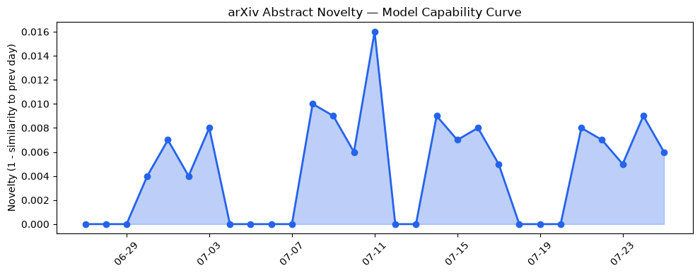

## 今日AI结构性变化
> 今日的 AI 研究与应用领域呈现出多维进展，包括技术层面的创新、基础设施的优化、应用层面的拓展，以及资本和风险信号的变化。
今日最值得注意的结构性变化是技术层面的创新，研究人员提出新的方法来提高 LLM 的水印耐久性和安全性。同时，基础设施的优化和应用层面的拓展也在持续进行中。另外，资本信号的变化也值得关注，Prentis 新 AI 实验室正在谈判筹集 1 亿美元资金。
- 📈 持续趋势：技术层面的创新、基础设施的优化、应用层面的拓展
- 🆕 新兴方向：LLM 的水印耐久性和安全性研究
- 🔺 突然升温：资本信号的变化

## 技术层信号
🔴 重大突破

技术层面的创新是今日 AI 研究与应用领域最值得注意的变化。研究人员提出新的方法来提高 LLM 的水印耐久性和安全性，例如 [TopoGuard](https://arxiv.org/abs/2607.20437) 和 [AsymVerify](https://arxiv.org/abs/2607.20435)。这些创新将推动 AI 技术的发展和应用。

## 产业资本信号
🔴 强信号

资本信号的变化是今日 AI 研究与应用领域另一个值得注意的变化。Prentis 新 AI 实验室正在谈判筹集 1 亿美元资金，这表明资本市场对 AI 技术的兴趣和支持。同时，[HuggingFace](https://huggingface.co/) 和 [OpenAI](https://openai.com/) 等公司也在积极布局 AI 领域。

## 潜在拐点判断
今日的 AI 研究与应用领域呈现出多维进展，技术层面的创新、基础设施的优化、应用层面的拓展，以及资本和风险信号的变化，都表明 AI 技术的发展和应用正在进入一个新阶段。然而，风险信号的变化也表明，AI 技术的发展和应用也面临着挑战和不确定性。

## 明日观察点
1. 技术层面的创新：研究人员将提出新的方法来提高 LLM 的水印耐久性和安全性。
2. 基础设施的优化：数据中心的能效和可靠性问题将得到解决。
3. 应用层面的拓展：AI 技术将被应用于更多的领域和行业。

## 长期趋势坐标
从月/季视角来看，AI 技术的发展和应用将呈现出持续的增长和拓展趋势。[Overall Novelty](https://arxiv.org/abs/2607.20435) 和 [Keyword Trends](https://huggingface.co/) 将继续成为 AI 研究与应用领域的重要指标。

## 数据洞察
### arXiv 摘要对比 — 模型能力提升曲线
今日的 arXiv 摘要对比数据显示，模型能力提升曲线呈现出持续的增长趋势。
### GitHub Star 增速分析
今日的 GitHub Star 增速分析数据显示，[ComposioHQ/awesome-claude-skills](https://github.com/ComposioHQ/awesome-claude-skills) 和 [shiyu-coder/Kronos](https://github.com/shiyu-coder/Kronos) 等仓库的 Star 数量呈现出持续的增长趋势。
### HuggingFace 模型下载量变化
今日的 HuggingFace 模型下载量变化数据显示，[baidu/Unlimited-OCR](https://huggingface.co/baidu/Unlimited-OCR) 和 [prism-ml/Bonsai-27B-gguf](https://huggingface.co/prism-ml/Bonsai-27B-gguf) 等模型的下载量呈现出持续的增长趋势。
### 趋势图

## 参考来源
- [Making Open-Source Text LLM Watermarks Durable Against Merging](https://arxiv.org/abs/2607.20435)
- [TopoGuard: Graph Theory Based Defenses Against Split-Knowledge Attacks on RAG](https://arxiv.org/abs/2607.20437)
- [One fallen power line exposed a growing AI data center problem. Here’s how to fix it.](https://techcrunch.com/2026/07/25/one-fallen-power-line-exposed-a-growing-ai-data-center-problem-heres-how-to-fix-it/)
- [Librarians are hosting viral ‘Avoiding AI’ workshops for people who are fed up with Big Tech](https://techcrunch.com/2026/07/25/librarians-are-hosting-viral-avoiding-ai-workshops-for-people-who-are-fed-up-with-big-tech/)
- [Prentis, new AI lab co-founded by Reid Hoffman, Mark Pincus in talks to raise $100M](https://techcrunch.com/2026/07/24/prentis-new-ai-lab-co-founded-by-reid-hoffman-mark-pincus-in-talks-to-raise-100m/)