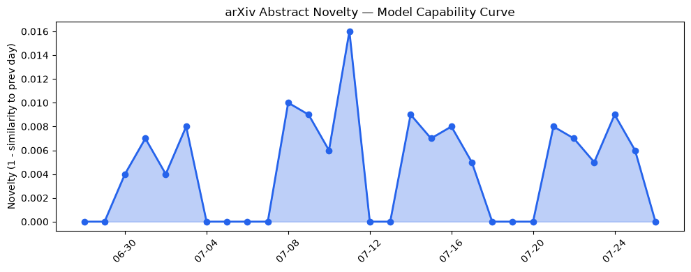
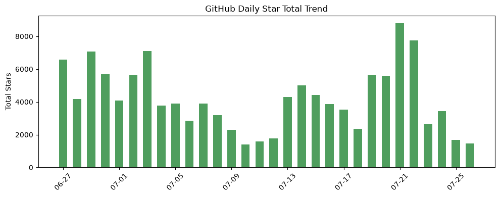
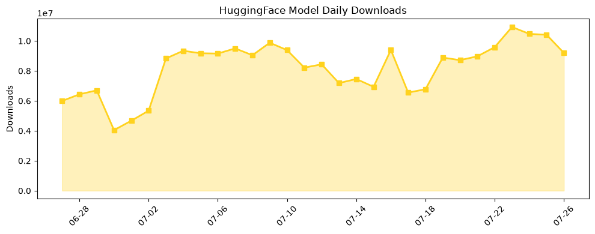

## 今日AI结构性变化
> 今日核心判断：开源生态中出现多个高性能LLM和代码探索工具，同时资本市场对AI的关注度增加，监管和安全问题引起重视。
今天最值得注意的结构性变化是开源生态中出现的多个高性能LLM和代码探索工具，如[jcodemunch-mcp](https://github.com/jgravelle/jcodemunch-mcp)和[litgpt](https://github.com/Lightning-AI/litgpt)，这表明开源社区在AI技术方面的创新和贡献力度不断增强。同时，资本市场对AI的关注度增加，监管和安全问题引起重视，这意味着AI产业正在经历快速发展和深化的过程。
📈 持续趋势：开源生态中LLM和代码探索工具的发展。
🆕 新兴方向：代码探索工具的应用和发展。
🔺 突然升温：监管和安全问题的关注度。

## 技术层信号
🟡 渐进改善

模型能力边界如何推进？有何新范式？开源生态中出现的高性能LLM和代码探索工具，如[jcodemunch-mcp](https://github.com/jgravelle/jcodemunch-mcp)和[litgpt](https://github.com/Lightning-AI/litgpt)，表明AI技术正在不断进步和创新。这些工具的出现将推动AI应用的发展和深化。

## 产业资本信号
🟡 中等信号

资本市场对AI的关注度增加，监管和安全问题引起重视，这意味着AI产业正在经历快速发展和深化的过程。[Hugging Face CEO呼吁‘激进透明度’](https://techcrunch.com/2026/07/26/hugging-face-ceo-calls-for-radical-transparency-after-unprecedented-openai-hack/)，这表明资本市场对AI安全和监管问题的关注度日益增加。

## 潜在拐点判断
监管和安全问题的关注度日益增加，这可能是AI产业发展的一个拐点。随着AI技术的不断进步和应用，监管和安全问题将变得越来越重要。

## 明日观察点
1. 开源生态中LLM和代码探索工具的发展。
2. 资本市场对AI的关注度和监管政策的变化。
3. 监管和安全问题的解决方案和进展。

## 长期趋势坐标
AI技术的发展和应用将继续推动产业的进步和深化。监管和安全问题将成为AI产业发展的一个重要方面。

## 数据洞察
### arXiv 摘要对比 — 模型能力提升曲线
今日无 arXiv 摘要数据。
### GitHub Star 增速分析
[andrewyng/aisuite](https://github.com/andrewyng/aisuite) 的 star 数量增加了 189，growth_pct 为 1.52。
### HuggingFace 模型下载量变化
[baidu/Unlimited-OCR](https://huggingface.co/baidu/Unlimited-OCR) 的下载量为 2593460，[prism-ml/Bonsai-27B-gguf](https://huggingface.co/prism-ml/Bonsai-27B-gguf) 的下载量为 2187304。
### 趋势图

## 参考来源
- [Making sense of the panic over Chinese AI](https://techcrunch.com/2026/07/26/making-sense-of-the-panic-over-chinese-ai/)
- [Hugging Face CEO calls for ‘radical transparency’ after ‘unprecedented’ OpenAI hack](https://techcrunch.com/2026/07/26/hugging-face-ceo-calls-for-radical-transparency-after-unprecedented-openai-hack/)
- [jcodemunch-mcp](https://github.com/jgravelle/jcodemunch-mcp)
- [litgpt](https://github.com/Lightning-AI/litgpt)