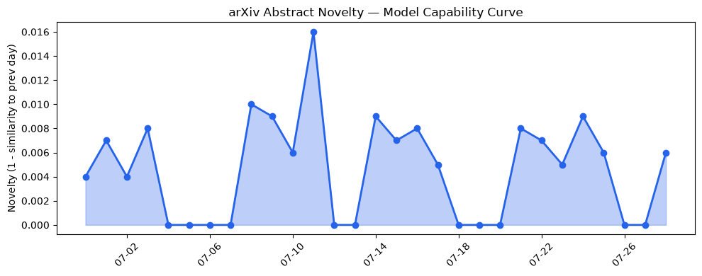
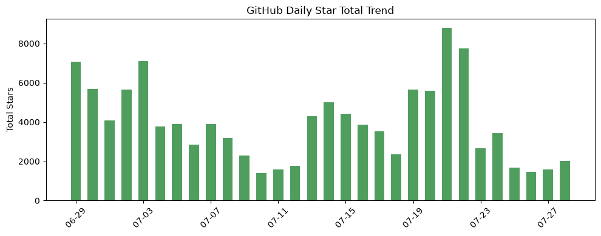
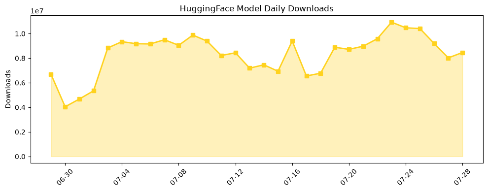

## 今日AI结构性变化
> 今日新增的AI信息中，技术层变化、基础设施变化、应用层变化、资本信号和风险信号等多个维度都出现了显著的变化，尤其是在LLM的研究和应用方面。
今天最值得注意的结构性变化是技术层的重大突破，特别是在LLM的能力边界被进一步推进，尤其是在处理多步骤程序和推理方面。同时，基础设施、应用层和资本信号也出现了显著的变化。
- 📈 持续趋势：LLM的研究和应用持续推进。
- 🆕 新兴方向：基础设施、应用层和风险信号出现了新兴的方向。
- 🔺 突然升温：资本信号突然升温，特别是在AI和安全领域。

## 技术层信号
🔴 重大突破

模型能力边界如何推进？有何新范式？技术层的重大突破主要体现在LLM的能力边界被进一步推进，尤其是在处理多步骤程序和推理方面。例如，[Procedural Knowledge Is Not Low-Rank: Why LoRA Fails to Internalize Multi-Step Procedures](https://arxiv.org/abs/2607.21612) 和 [The Hard Decision Layer: Evidence for Committed Inference in Transformers](https://arxiv.org/abs/2607.21613) 等论文展示了新的范式，如使用Hard Decision Layer和CausalGate。

## 产业资本信号
🔴 强信号

产业资本信号出现了强烈的信号，特别是在AI和安全领域。例如，[Bot-detection startup Spur nabs $200M from Insight](https://techcrunch.com/2026/07/28/bot-detection-startup-spur-nabs-200m-from-insight/) 和 [AI Seed Investors Flock To Cybersecurity](https://news.crunchbase.com/cybersecurity/seed-trends-ai-security-startup-funding-2026/) 等报道展示了资本对AI和安全领域的关注。

## 潜在拐点判断
今日观察到技术层、基础设施、应用层和资本信号等多个维度的显著变化，这可能是一个新的拐点的早期信号。特别是在LLM的研究和应用方面，技术层的重大突破可能会带来新的应用和商业机会。

## 明日观察点
1. LLM的能力边界如何进一步推进？
2. 基础设施和应用层的新兴方向如何发展？
3. 资本信号如何继续影响AI和安全领域？

## 长期趋势坐标
从月/季视角来看，AI产业结构性变化的长期趋势坐标主要体现在LLM的研究和应用的持续推进，基础设施、应用层和风险信号的新兴方向，以及资本信号的强烈关注。这些趋势可能会继续影响AI产业的发展。

## 数据洞察
### arXiv 摘要对比 — 模型能力提升曲线
今日暂无数据。

### GitHub Star 增速分析
今日GitHub Star增速分析显示，[Volcengine/OpenViking](https://github.com/volcengine/OpenViking) 和 [huggingface/speech-to-speech](https://github.com/huggingface/speech-to-speech) 等仓库的Star数增加显著。

### HuggingFace 模型下载量变化
今日HuggingFace模型下载量变化显示，[baidu/Unlimited-OCR](https://huggingface.co/baidu/Unlimited-OCR) 和 [HauhauCS/Qwen3.6-35B-A3B-Uncensored-HauhauCS-Aggressive](https://huggingface.co/HauhauCS/Qwen3.6-35B-A3B-Uncensored-HauhauCS-Aggressive) 等模型的下载量增加显著。

### 趋势图

## 参考来源
- [Procedural Knowledge Is Not Low-Rank: Why LoRA Fails to Internalize Multi-Step Procedures](https://arxiv.org/abs/2607.21612)
- [The Hard Decision Layer: Evidence for Committed Inference in Transformers](https://arxiv.org/abs/2607.21613)
- [Bot-detection startup Spur nabs $200M from Insight](https://techcrunch.com/2026/07/28/bot-detection-startup-spur-nabs-200m-from-insight/)
- [AI Seed Investors Flock To Cybersecurity](https://news.crunchbase.com/cybersecurity/seed-trends-ai-security-startup-funding-2026/)