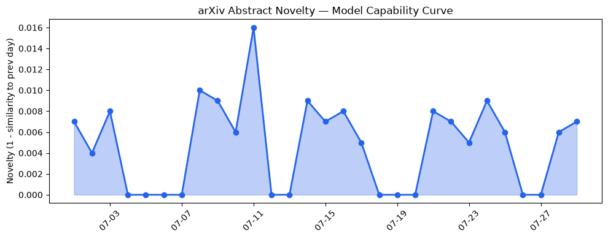
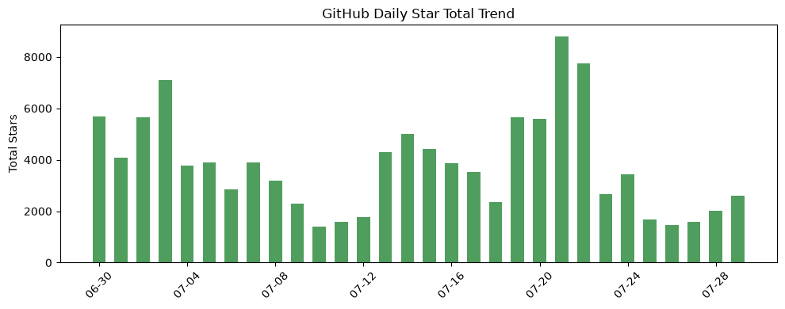
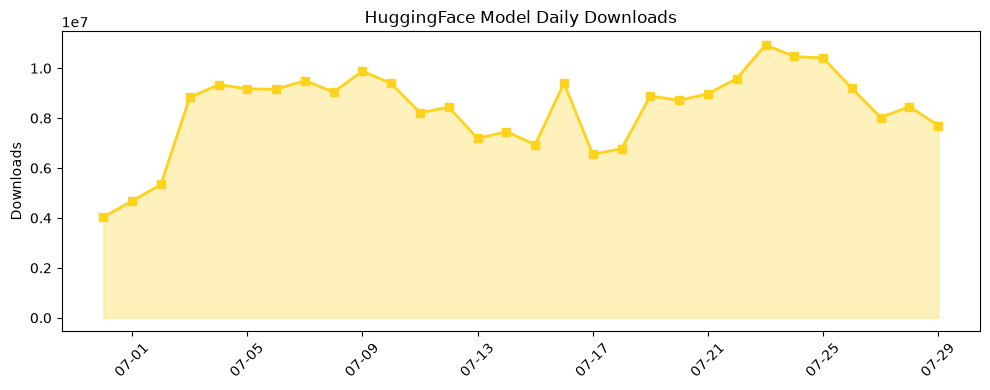

## 今日AI结构性变化
> 今日新增的AI信息显示，技术层面上有多项创新，基础设施层面上推理成本和芯片/算力趋势有所变化，应用层面上AI进入了新行业和新场景，资本信号显示融资方向有所集中，风险信号显示监管/立法层面有新动向。
今日最值得注意的结构性变化是技术层面上的创新和应用层面上的扩张，这些变化表明AI的发展正在加速。同时，资本信号的变化也表明投资者对AI的兴趣正在增加。然而，风险信号的变化也提醒我们需要关注监管/立法层面的新动向。
📈 持续趋势：技术层面上的创新和应用层面上的扩张。
🆕 新兴方向：AI进入了新行业和新场景。
🔺 突然升温：资本信号显示融资方向有所集中。
🔑 新关键词：LLM、RAG、AI安全、AI伦理。
📉 消退关键词：Apple、ChatGPT、Meta AI、机器学习、自然语言处理、计算机视觉、语音识别。

## 技术层信号
🔴 重大突破
技术层面上的创新包括多项研究论文展示了LLM和RAG的新进展，例如 [Do Models Fake Alignment Without Clear Consequences?](https://arxiv.org/abs/2607.24758) 和 [Beyond Memory: A Templated Substrate for Heterogeneous Collaborative Knowledge Work with LLM Agents](https://arxiv.org/abs/2607.24759)。这些创新表明AI的技术能力正在快速提高。

## 产业资本信号
🔴 强信号
资本信号显示融资方向有所集中，例如 [Mark Zuckerberg predicts that billions of people will have personal AI agents in five years](https://techcrunch.com/2026/07/29/mark-zuckerberg-predicts-that-billions-of-people-will-have-personal-ai-agents-in-five-years/)。这表明投资者对AI的兴趣正在增加。

## 潜在拐点判断
根据趋势对比报告，技术层面上的创新和应用层面上的扩张可能是AI行业的拐点。这些变化可能会带来新的商业机会和新的挑战。

## 明日观察点
1. 技术层面上的创新是否会继续推动AI的发展。
2. 应用层面上的扩张是否会带来新的商业机会。
3. 资本信号的变化是否会影响AI行业的发展。

## 长期趋势坐标
根据趋势对比报告，AI行业的长期趋势包括技术层面上的创新、应用层面上的扩张和资本信号的变化。这些趋势可能会带来新的商业机会和新的挑战。

## 数据洞察
### arXiv 摘要对比 — 模型能力提升曲线
今日暂无数据。
### GitHub Star 增速分析
今日GitHub Star增速分析显示，[microsoft/agent-governance-toolkit](https://github.com/microsoft/agent-governance-toolkit) 和 [huggingface/speech-to-speech](https://github.com/huggingface/speech-to-speech) 的Star数增加最快。
### HuggingFace 模型下载量变化
今日HuggingFace模型下载量变化显示，[baidu/Unlimited-OCR](https://huggingface.co/baidu/Unlimited-OCR) 和 [HauhauCS/Qwen3.6-35B-A3B-Uncensored-HauhauCS-Aggressive](https://huggingface.co/HauhauCS/Qwen3.6-35B-A3B-Uncensored-HauhauCS-Aggressive) 的下载量最高。
### 趋势图

## 参考来源
- [Do Models Fake Alignment Without Clear Consequences?](https://arxiv.org/abs/2607.24758)
- [Beyond Memory: A Templated Substrate for Heterogeneous Collaborative Knowledge Work with LLM Agents](https://arxiv.org/abs/2607.24759)
- [Mark Zuckerberg predicts that billions of people will have personal AI agents in five years](https://techcrunch.com/2026/07/29/mark-zuckerberg-predicts-that-billions-of-people-will-have-personal-ai-agents-in-five-years/)
- [The Hugging Face AI break-in, as told through an increasingly committed bear metaphor](https://techcrunch.com/2026/07/29/the-hugging-face-ai-break-in-as-told-through-an-increasingly-committed-bear-metaphor/)