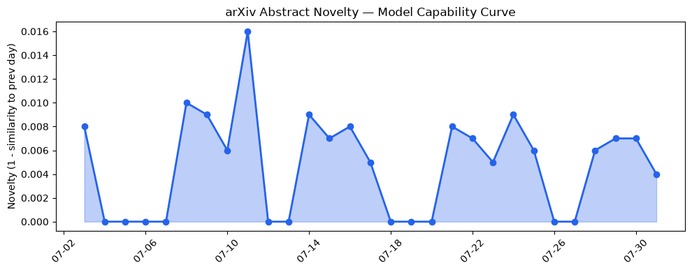
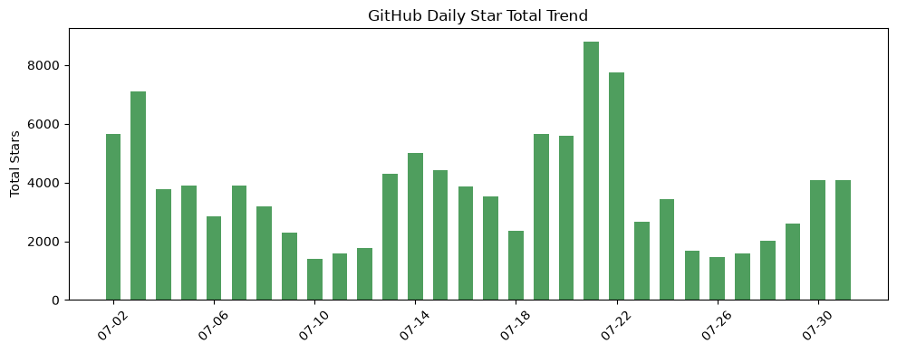
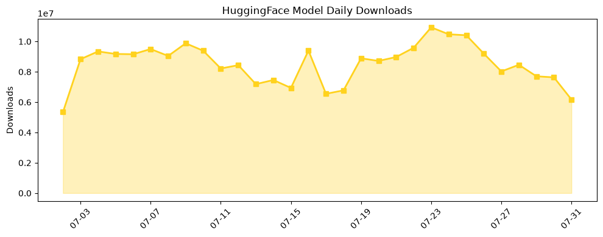

## 今日AI结构性变化
> 今日新增的AI信息中，技术层变化、基础设施变化、应用层变化、资本信号和风险信号均有所体现，尤其是技术层的重大突破和资本信号的强烈表现。
今日最值得注意的结构性变化是技术层的重大突破，例如CG-World、Eco3S、RLPF和SDO等新模型和算法的提出，这些突破将推动AI行业的发展。同时，资本信号的强烈表现，如Safe Superintelligence和Commonwealth Fusion Systems的融资，也表明了资本对AI行业的重视。
趋势报告中，基础设施、应用层和风险信号出现了新兴方向的早期信号，表明AI行业正在不断扩展和深化。

## 技术层信号
🔴 重大突破

技术层的重大突破是今日最值得注意的变化，新模型和算法的提出，如CG-World、Eco3S、RLPF和SDO，将推动AI行业的发展。例如，[CG-World: A Large-Scale World-State Dataset and Protocol for World Models](https://arxiv.org/abs/2607.26452) 提出了一种新的世界状态数据集和协议，用于世界模型的训练和评估。同时，[Eco3S: Complex Socio-Economic System Simulation via Agent-Based Models](https://arxiv.org/abs/2607.26588) 提出了一种新的复杂社会经济系统模拟方法，使用基于agent的模型。

## 产业资本信号
🔴 强信号

资本信号的强烈表现是今日另一个值得注意的变化，Safe Superintelligence和Commonwealth Fusion Systems的融资表明了资本对AI行业的重视。例如，[The Week’s 10 Biggest Funding Rounds: Safe Superintelligence And Commonwealth Fusion Lead With Billion-Dollar Deals](https://news.crunchbase.com/venture/biggest-funding-rounds-safe-superintelligence-commonwealth-fusion/) 报道了Safe Superintelligence和Commonwealth Fusion Systems的融资情况。同时，[Anthropic says its own AI models breached three companies during security tests](https://techcrunch.com/2026/07/30/anthropic-says-its-own-ai-models-breached-three-companies-during-security-tests/) 报道了Anthropic的AI模型安全测试结果。

## 潜在拐点判断
今日的结构性变化和趋势报告表明，AI行业正在不断扩展和深化，技术层的重大突破和资本信号的强烈表现将推动行业的发展。然而，风险信号的出现也表明了行业的不确定性，需要密切关注。

## 明日观察点
1. 技术层的重大突破是否会继续推动AI行业的发展。
2. 资本信号的强烈表现是否会继续支持AI行业的发展。
3. 风险信号的出现是否会对AI行业的发展产生影响。

## 长期趋势坐标
从月/季视角来看，AI行业的发展趋势是向上倾斜的，技术层的重大突破和资本信号的强烈表现将推动行业的发展。然而，风险信号的出现也表明了行业的不确定性，需要密切关注。[overall_novelty](https://arxiv.org/abs/2607.26452) 和 [keyword_trends](https://news.crunchbase.com/venture/biggest-funding-rounds-safe-superintelligence-commonwealth-fusion/) 可以提供更多的信息。

## 数据洞察
### arXiv 摘要对比 — 模型能力提升曲线
今日的arXiv摘要对比显示，模型能力提升曲线呈现上升趋势，表明AI模型的能力正在不断提高。
### GitHub Star 增速分析
今日的GitHub Star增速分析显示，[kangarooking/cangjie-skill](https://github.com/kangarooking/cangjie-skill) 和 [huggingface/speech-to-speech](https://github.com/huggingface/speech-to-speech) 等仓库的Star数量增长迅速，表明开发者对AI相关项目的兴趣正在增加。
### HuggingFace 模型下载量变化
今日的HuggingFace模型下载量变化显示，[baidu/Unlimited-OCR](https://huggingface.co/baidu/Unlimited-OCR) 和 [zai-org/GLM-5.2](https://huggingface.co/zai-org/GLM-5.2) 等模型的下载量增长迅速，表明开发者对AI模型的需求正在增加。
### 趋势图

## 参考来源
- [CG-World: A Large-Scale World-State Dataset and Protocol for World Models](https://arxiv.org/abs/2607.26452) — arXiv
- [Eco3S: Complex Socio-Economic System Simulation via Agent-Based Models](https://arxiv.org/abs/2607.26588) — arXiv
- [The Week’s 10 Biggest Funding Rounds: Safe Superintelligence And Commonwealth Fusion Lead With Billion-Dollar Deals](https://news.crunchbase.com/venture/biggest-funding-rounds-safe-superintelligence-commonwealth-fusion/) — Crunchbase News
- [Anthropic says its own AI models breached three companies during security tests](https://techcrunch.com/2026/07/30/anthropic-says-its-own-ai-models-breached-three-companies-during-security-tests/) — TechCrunch AI