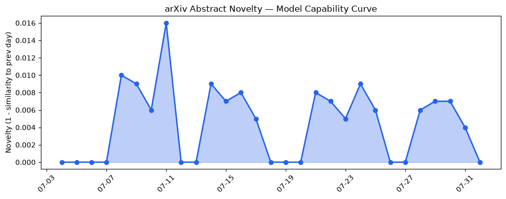
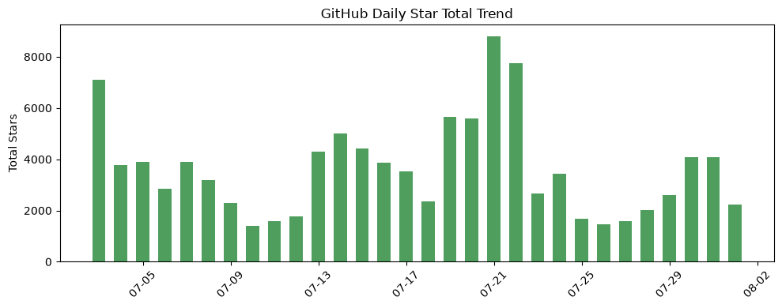
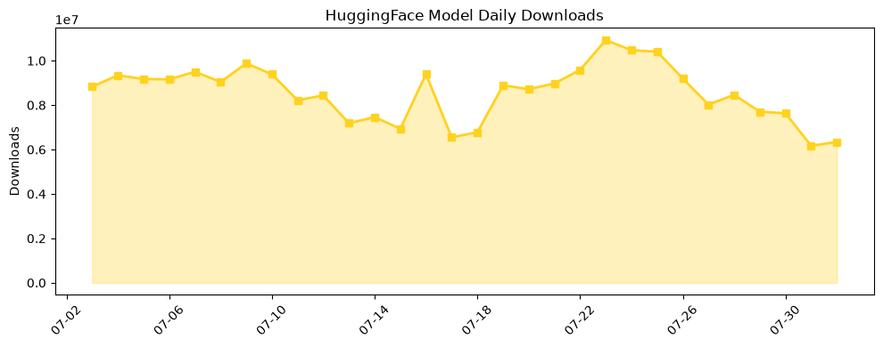

## 今日AI结构性变化
> 今日AI领域出现了多个结构性变化信号，包括数学和理论计算机科学的进展、LLM驱动的数据提取技术的发展，以及AI在各个行业中的应用和监管的变化。
今天最值得注意的结构性变化是技术层面的重大突破，包括OpenAI在数学和理论计算机科学领域取得的多项进展，例如几何、密码学和复杂性理论的突破。同时，LLM驱动的数据提取技术的发展为数据处理和分析提供了新的范式。这些变化表明AI领域正在持续推进和演进。
📈 持续趋势：技术层面的重大突破，包括数学和理论计算机科学的进展。
🆕 新兴方向：LLM驱动的数据提取技术的发展。
🔺 突然升温：AI在各个行业中的应用和监管的变化。

## 技术层信号
🔴 重大突破

技术层面的重大突破包括OpenAI在数学和理论计算机科学领域取得的多项进展，例如几何、密码学和复杂性理论的突破。这些进展表明AI领域正在持续推进和演进。同时，LLM驱动的数据提取技术的发展为数据处理和分析提供了新的范式。这些技术的发展将对AI领域产生深远的影响。
例如，[OpenAI的数学和理论计算机科学进展](https://openai.com/index/ten-advances-in-mathematics) 和 [unstract](https://github.com/Zipstack/unstract) 等项目的发展，表明技术层面的创新正在持续推进。

## 产业资本信号
🟡 中等信号

产业资本信号表明AI领域的投资继续增长，包括风险投资和战略投资。例如，[AI hedge fund Situational Awareness](https://techcrunch.com/2026/07/30/ai-hedge-fund-situational-awareness-may-have-sold-its-public-portfolio-but-it-still-has-its-anthropic-shares/) 的投资行为，表明资本市场对AI领域的信心正在增长。同时，[大厂在AI领域的战略投资和收购](https://techcrunch.com/2026/08/01/judge-denies-xais-request-to-block-minnesota-ban-on-nudify-apps/) 也表明AI领域的竞争正在加剧。

## 潜在拐点判断
今日观察到AI领域的结构性变化信号，包括技术层面的重大突破、产业资本信号的中等强度和监管的变化，表明AI领域可能正在进入一个新的发展阶段。这些变化可能会对AI领域的发展产生深远的影响，包括技术的进步、产业的演变和监管的加强。

## 明日观察点
1. 技术层面的进展，包括数学和理论计算机科学的突破。
2. 产业资本信号的变化，包括风险投资和战略投资的增长。
3. 监管的变化，包括对AI应用的监管和审查。

## 长期趋势坐标
从月度视角来看，AI领域的发展趋势仍然是技术的进步和产业的演变。[overall_novelty](https://openai.com/index/ten-advances-in-mathematics) 的变化表明AI领域的创新正在持续推进。同时，[keyword_trends](https://techcrunch.com/2026/08/01/youtuber-hank-green-says-his-ai-usage-is-not-healthy/) 的变化表明AI领域的热点正在转移。

## 数据洞察
### arXiv 摘要对比 — 模型能力提升曲线
今日无 arXiv 摘要数据。

### GitHub Star 增速分析
GitHub Star 的增速分析表明，[bytedance/deer-flow](https://github.com/Zipstack/unstract) 和 [mvanhorn/last30days-skill](https://github.com/mvanhorn/last30days-skill) 等项目的 Star 数量正在增长。

### HuggingFace 模型下载量变化
HuggingFace 模型下载量的变化表明，[baidu/Unlimited-OCR](https://huggingface.co/baidu/Unlimited-OCR) 和 [zai-org/GLM-5.2](https://huggingface.co/zai-org/GLM-5.2) 等模型的下载量正在增长。

### 趋势图

## 参考来源
- [OpenAI的数学和理论计算机科学进展](https://openai.com/index/ten-advances-in-mathematics)
- [unstract](https://github.com/Zipstack/unstract)
- [AI hedge fund Situational Awareness](https://techcrunch.com/2026/07/30/ai-hedge-fund-situational-awareness-may-have-sold-its-public-portfolio-but-it-still-has-its-anthropic-shares/)
- [大厂在AI领域的战略投资和收购](https://techcrunch.com/2026/08/01/judge-denies-xais-request-to-block-minnesota-ban-on-nudify-apps/)
- [bytedance/deer-flow](https://github.com/Zipstack/unstract)
- [mvanhorn/last30days-skill](https://github.com/mvanhorn/last30days-skill)
- [baidu/Unlimited-OCR](https://huggingface.co/baidu/Unlimited-OCR)
- [zai-org/GLM-5.2](https://huggingface.co/zai-org/GLM-5.2)