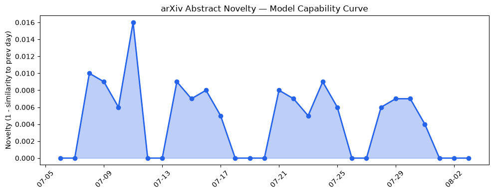
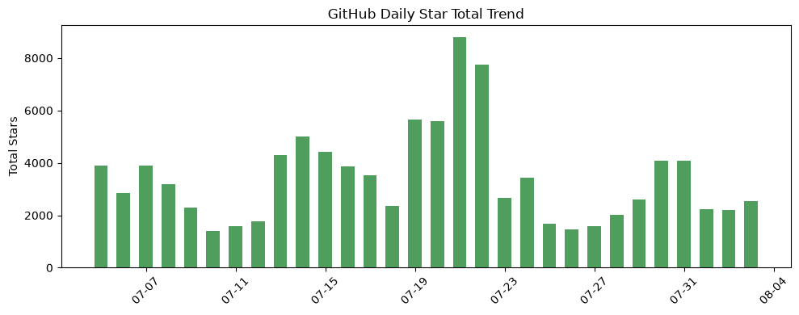
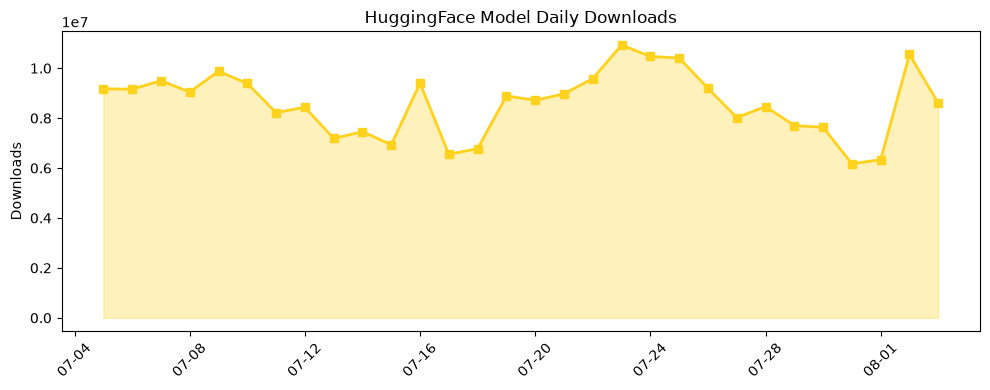

## 今日AI结构性变化
> 今日新增的AI信息表明，技术层面上LLM的能力边界被进一步推进，基础设施层面上推理成本和芯片/算力趋势有所变化，应用层面上AI进入了新行业和新场景，资本信号上融资方向和估值水平有所变化，风险信号上监管/立法和伦理/安全领域有新动向。
今日最值得注意的结构性变化是技术层面上的重大突破，LLM的能力边界被进一步推进，这意味着AI的应用范围将进一步扩大。同时，基础设施层面的渐进改善和应用层面的重大突破也表明AI的发展速度加快。资本信号上的强信号和风险信号上的中等信号也意味着AI的发展将受到资本和监管的影响。
📈 持续趋势：技术层面上的LLM能力边界推进
🆕 新兴方向：应用层面的AI进入新行业和新场景
🔺 突然升温：资本信号上的融资方向和估值水平变化
🔑 新关键词：LLM、AI、技术层面、基础设施、应用层面、资本信号、风险信号
📉 消退关键词：传统的SaaS产品、机器学习、自然语言处理

## 技术层信号
🔴 重大突破

技术层面上的重大突破是今日最值得注意的变化，LLM的能力边界被进一步推进，这意味着AI的应用范围将进一步扩大。新范式的出现，如新的训练方法和架构创新，也表明AI的发展将变得更加多样化。例如，[OpenClaw and Ollama in Agentic AI](https://arxiv.org/abs/2607.28629) 和 [Can AI Evaluate AI Scientists?](https://arxiv.org/abs/2607.28631) 等论文展示了AI在技术层面的最新进展。

## 产业资本信号
🔴 强信号

资本信号上的强信号意味着AI的发展将受到资本的影响，融资方向和估值水平的变化也表明AI的发展将变得更加快速。例如，[AWS is helping vibe-coding startup Superblocks](https://techcrunch.com/2026/08/03/aws-is-helping-vibe-coding-startup-superblocks-and-the-implications-are-big/) 等新闻报道展示了AI在资本层面的最新动向。

## 潜在拐点判断
今日的变化可能意味着AI的发展将进入一个新的阶段，技术层面的重大突破和资本信号上的强信号都表明AI的发展将变得更加快速和多样化。然而，风险信号上的中等信号也意味着AI的发展将受到监管和伦理的影响，需要注意潜在的风险和挑战。

## 明日观察点
1. 技术层面的LLM能力边界推进是否会继续？
2. 应用层面的AI进入新行业和新场景是否会继续？
3. 资本信号上的融资方向和估值水平变化是否会继续？

## 长期趋势坐标
从月/季视角来看，AI的发展将继续快速和多样化，技术层面的重大突破和资本信号上的强信号都表明AI的发展将变得更加快速和多样化。然而，风险信号上的中等信号也意味着AI的发展将受到监管和伦理的影响，需要注意潜在的风险和挑战。

## 数据洞察
### arXiv 摘要对比 — 模型能力提升曲线
今日的数据表明，arXiv上的论文摘要对比显示出模型能力提升曲线的延续，这意味着AI的技术层面的发展将继续快速和多样化。
### GitHub Star 增速分析
GitHub上的Star增速分析显示出AI相关仓库的Star数量在增加，这意味着AI的应用层面的发展将继续快速和多样化。
### HuggingFace 模型下载量变化
HuggingFace上的模型下载量变化显示出AI模型的下载量在增加，这意味着AI的技术层面的发展将继续快速和多样化。
### 趋势图

## 参考来源
- [OpenClaw and Ollama in Agentic AI](https://arxiv.org/abs/2607.28629) — arXiv
- [Can AI Evaluate AI Scientists?](https://arxiv.org/abs/2607.28631) — arXiv
- [AWS is helping vibe-coding startup Superblocks](https://techcrunch.com/2026/08/03/aws-is-helping-vibe-coding-startup-superblocks-and-the-implications-are-big/) — TechCrunch
- [Influencers draw backlash for attending OpenAI’s first luxury trip](https://techcrunch.com/2026/08/03/influencers-draw-backlash-for-attending-openais-first-luxury-trip/) — TechCrunch