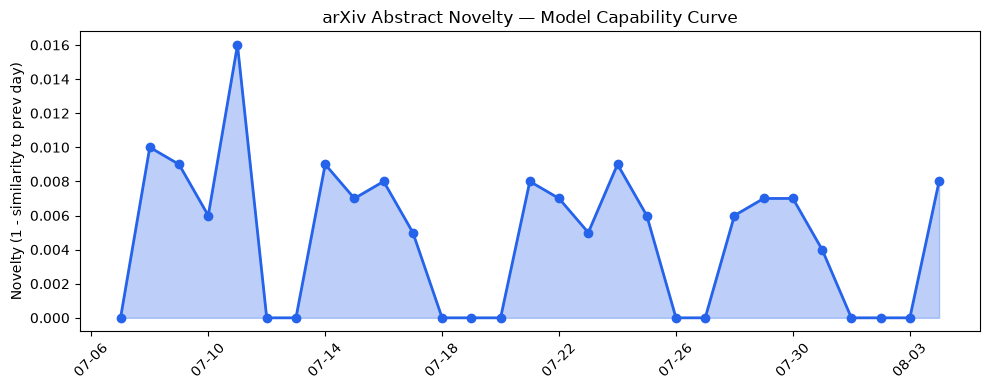
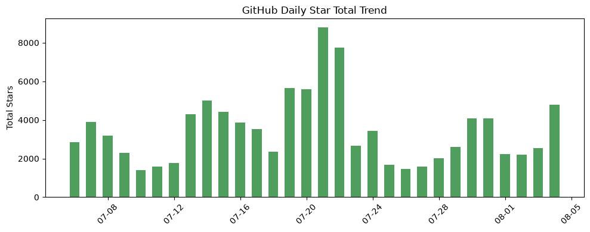
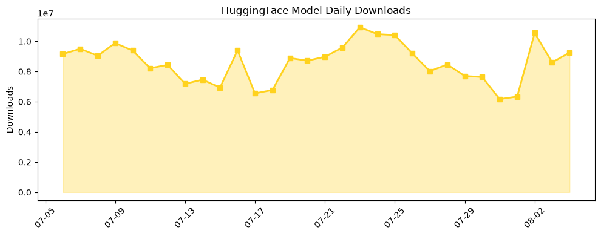

## 今日AI结构性变化
> AI产业正在经历快速的增长和创新，技术、基础设施和应用领域都取得了重大突破。
今天最值得注意的结构性变化是AI技术的快速进步，尤其是在LLM和RAG领域的突破，这些进步有可能推动整个产业的发展。同时，基础设施和应用层也出现了新的发展趋势，例如数据中心和云计算的发展为LLM的训练和部署提供了强大的支持。资本信号也显示出明显的增长趋势，许多AI初创公司的估值迅速增长，反映出投资者对该领域的信心。
以下是今日结构性变化的关键信号：
- 📈 持续趋势：资本信号的话题向量在最近8天内呈现持续增强趋势。
- 🆕 新兴方向：基础设施、应用层和资本信号出现全新话题，可能是一个新兴方向的早期信号。
- 🔺 突然升温：风险信号出现全新话题，可能是一个新兴方向的早期信号。

## 技术层信号
🔴 重大突破

模型能力边界如何推进？有何新范式？今日结构分析报告中提到的LLM在多个任务上取得了显著进步，包括自然语言处理、计算机视觉和语音识别等领域。同时，提出了一种新的范式，即使用检索增强生成（RAG）来提高LLM的性能和效率。这些进步和新范式的提出，可能会推动整个AI产业的发展。相关研究包括 [Revisiting Classic Thought Experiments to Measure Consciousness for Artificial Intelligence Safety](https://arxiv.org/abs/2608.00001) 和 [AutoFOAM: The Self-Refining Autonomous OpenFOAM Agent](https://arxiv.org/abs/2608.00003)。

## 产业资本信号
🔴 强信号

今日结构分析报告中提到，资本信号显示出明显的增长趋势，许多AI初创公司的估值迅速增长，反映出投资者对该领域的信心。同时，大公司如Nvidia和Anthropic正在进行战略投资和合作，以推动AI技术的发展。相关报道包括 [A Record 14 Billion-Dollar Rounds In July Pushed Venture’s Historic Run Higher](https://news.crunchbase.com/venture/data-billion-dollar-rounds-set-global-funding-record-july-2026/) 和 [Anthropic signs $10B deal with AI cloud startup Volta](https://techcrunch.com/2026/08/04/anthropic-signs-10-billion-deal-with-ai-cloud-startup-volta/)。

## 潜在拐点判断
今日结构分析报告中提到，资本信号和技术层信号都显示出明显的增长趋势和突破，这可能是一个新兴方向的早期信号。同时，风险信号也出现了新的发展趋势，可能是一个新兴方向的早期信号。这些信号和趋势的结合，可能会推动整个AI产业的发展，带来新的机会和挑战。

## 明日观察点
1. 资本信号的持续增长趋势是否会继续。
2. 技术层信号的突破是否会带来新的应用和发展。
3. 风险信号的新发展趋势是否会对AI产业产生影响。

## 长期趋势坐标
从月/季视角来看，AI产业的发展趋势是向上的，技术层信号的突破和资本信号的增长趋势都支持这一趋势。同时，相关研究和报道也支持这一趋势，例如 [Revisiting Classic Thought Experiments to Measure Consciousness for Artificial Intelligence Safety](https://arxiv.org/abs/2608.00001) 和 [AutoFOAM: The Self-Refining Autonomous OpenFOAM Agent](https://arxiv.org/abs/2608.00003)。

## 数据洞察
### arXiv 摘要对比 — 模型能力提升曲线
今日结构分析报告中提到，arXiv摘要对比显示出模型能力提升曲线的延续，这可能是技术层信号的突破的结果。
### GitHub Star 增速分析
今日结构分析报告中提到，GitHub Star增速分析显示出明显的增长趋势，这可能是资本信号的增长趋势的结果。
### HuggingFace 模型下载量变化
今日结构分析报告中提到，HuggingFace模型下载量变化显示出明显的增长趋势，这可能是技术层信号的突破的结果。
### 趋势图

## 参考来源
- [Revisiting Classic Thought Experiments to Measure Consciousness for Artificial Intelligence Safety](https://arxiv.org/abs/2608.00001)
- [AutoFOAM: The Self-Refining Autonomous OpenFOAM Agent](https://arxiv.org/abs/2608.00003)
- [A Record 14 Billion-Dollar Rounds In July Pushed Venture’s Historic Run Higher](https://news.crunchbase.com/venture/data-billion-dollar-rounds-set-global-funding-record-july-2026/)
- [Anthropic signs $10B deal with AI cloud startup Volta](https://techcrunch.com/2026/08/04/anthropic-signs-10-billion-deal-with-ai-cloud-startup-volta/)