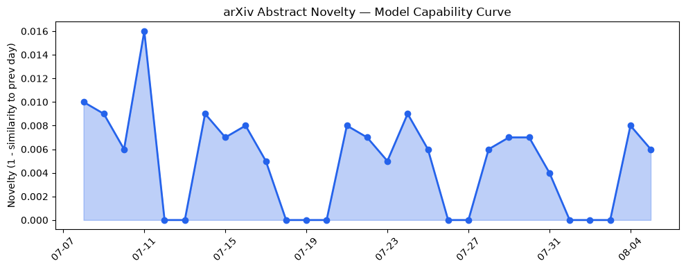

## 今日AI结构性变化

> 今日新增的 AI 信息显示，技术层面上有多项研究成果，基础设施层面上有新型芯片和算力趋势，应用层面上有新行业和新场景的进入，资本信号上有多项投资和收购动向，风险信号上有监管和伦理问题的讨论。

今日最值得注意的结构性变化是应用层面的重大突破，新行业和新场景的进入正在持续升温。同时，基础设施层面的新型芯片和算力趋势的出现，也为 AI 的发展提供了强有力的支持。资本信号上，多项投资和收购动向表明，AI 行业仍然是资本的热点。风险信号上，监管和伦理问题的讨论凸显了 AI 发展中需要关注的重要问题。

*   📈 持续趋势：应用层面的新行业和新场景的进入
*   🆕 新兴方向：基础设施层面的新型芯片和算力趋势
*   🔺 突然升温：资本信号上的多项投资和收购动向
*   🔑 新关键词：AI芯片、云厂商、供应链、地缘风险、战略投资、算力
*   📉 消退关键词：AI伦理、AI安全、Apple、Google DeepMind、Hugging Face、Meta AI、Transformer、机器学习、自然语言处理、计算机视觉

## 技术层信号

🔴 重大突破

技术层面上的重大突破主要体现在新型检索增强生成模型和大语言模型的提出，这些新型模型和技术的出现，标志着 AI 研究的又一次重大进展。例如，[SIRIN: A Unified Toolkit for Detecting Contextual Hallucinations in Retrieval-Augmented and Memory-Grounded LLM Systems](https://arxiv.org/abs/2608.00033) 和 [RAG-TESTER: Automated End-to-End Testing of Retrieval-Augmented Large Language Models](https://arxiv.org/abs/2608.00054) 的提出，展示了检索增强生成技术的最新进展。

## 产业资本信号

🔴 强信号

产业资本信号上，多项投资和收购动向表明，AI 行业仍然是资本的热点。例如，[Klaviyo acquires Elias Torres’ Agency in full-circle reunion for tech founders](https://techcrunch.com/2026/08/05/klaviyo-acquires-elias-torres-agency-in-full-circle-reunion-for-tech-founders/) 和 [Jeff Dean and other top AI researchers are leaving Google to launch their own startup](https://techcrunch.com/2026/08/05/jeff-dean-and-other-top-ai-researchers-are-leaving-google-to-launch-their-own-startup/) 的报道，展示了 AI 行业的资本动向。

## 潜在拐点判断

根据今日的结构性变化和趋势分析，可以判断出 AI 行业可能正在经历一个潜在的拐点。应用层面的新行业和新场景的进入，基础设施层面的新型芯片和算力趋势的出现，资本信号上的多项投资和收购动向，都表明 AI 行业正在经历一个快速发展的阶段。然而，风险信号上的监管和伦理问题的讨论，也凸显了 AI 发展中需要关注的重要问题。

## 明日观察点

1.  应用层面的新行业和新场景的进入是否会继续升温
2.  基础设施层面的新型芯片和算力趋势的出现是否会带来更大的影响
3.  资本信号上的多项投资和收购动向是否会继续

## 长期趋势坐标

从月/季视角来看，AI 行业的长期趋势坐标仍然是向上的。技术层面的进展，基础设施层面的改善，应用层面的扩张，资本信号上的支持，都表明 AI 行业仍然有很大的发展潜力。然而，风险信号上的监管和伦理问题的讨论，也需要引起关注。

## 数据洞察

### arXiv 摘要对比 — 模型能力提升曲线

今日的 arXiv 摘要对比数据显示，模型能力提升曲线仍然在延续。新型检索增强生成模型和大语言模型的提出，标志着 AI 研究的又一次重大进展。

### GitHub Star 增速分析

GitHub Star 增速分析数据显示，AI 相关项目的 Star 数量仍然在增加。例如，[uber/ADR](https://github.com/uber/ADR) 和 [browser-use/video-use](https://github.com/browser-use/video-use) 的 Star 数量增长较快。

### HuggingFace 模型下载量变化

HuggingFace 模型下载量变化数据显示，AI 模型的下载量仍然在增加。例如，[baidu/Unlimited-OCR](https://huggingface.co/baidu/Unlimited-OCR) 和 [zai-org/GLM-5.2](https://huggingface.co/zai-org/GLM-5.2) 的下载量增长较快。

### 趋势图

## 参考来源

*   [SIRIN: A Unified Toolkit for Detecting Contextual Hallucinations in Retrieval-Augmented and Memory-Grounded LLM Systems](https://arxiv.org/abs/2608.00033)
*   [RAG-TESTER: Automated End-to-End Testing of Retrieval-Augmented Large Language Models](https://arxiv.org/abs/2608.00054)
*   [Klaviyo acquires Elias Torres’ Agency in full-circle reunion for tech founders](https://techcrunch.com/2026/08/05/klaviyo-acquires-elias-torres-agency-in-full-circle-reunion-for-tech-founders/)
*   [Jeff Dean and other top AI researchers are leaving Google to launch their own startup](https://techcrunch.com/2026/08/05/jeff-dean-and-other-top-ai-researchers-are-leaving-google-to-launch-their-own-startup/)