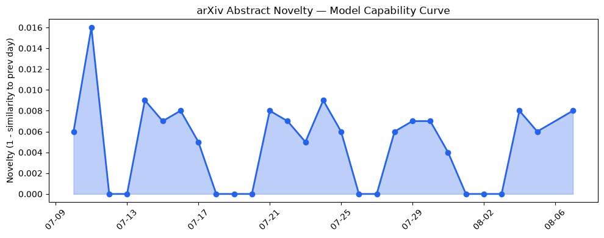
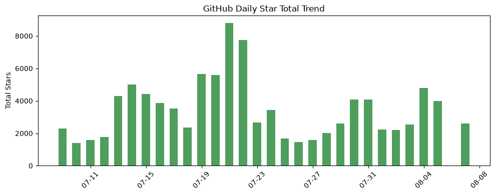
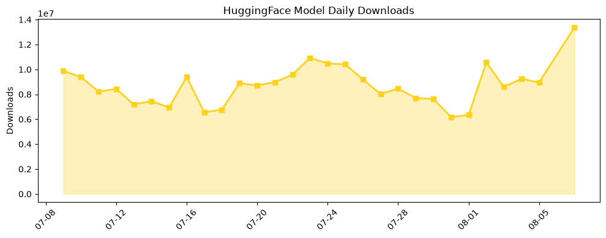

## 今日AI结构性变化
> 今日新增的AI信息表明，技术层面上有多项重大突破，包括新范式的提出和模型能力边界的推进，同时基础设施、应用层和资本信号等方面也呈现出积极的变化。
今日最值得注意的结构性变化是技术层面的重大突破，包括新论文提出的一种新的方法来提高LLM的能力边界和提出的一种新的范式来解决LLM的局限性。这意味着AI技术的发展方向正在发生变化，新的范式和方法的提出将推动AI技术的进一步发展。
同时，基础设施、应用层和资本信号等方面也呈现出积极的变化，例如新硬件发布和云厂商定价变化导致推理成本下降，芯片和算力趋势呈现积极变化，AI进入了新的行业和场景，如医疗和法律，AI开始替代传统的解决方案。
📈 持续趋势：技术层面的重大突破、新范式的提出和模型能力边界的推进。
🆕 新兴方向：基础设施、应用层和资本信号等方面的积极变化。
🔺 突然升温：AI进入新的行业和场景，如医疗和法律。
🔑 新关键词：chain-of-thought、graph-native、语音合成。
📉 消退关键词：AI伦理、Google DeepMind、Hugging Face、HuggingFace、Transformer、机器学习、计算机视觉、语音识别。

## 技术层信号
🔴 重大突破

技术层面上有多项重大突破，包括新论文提出的一种新的方法来提高LLM的能力边界和提出的一种新的范式来解决LLM的局限性。例如，[The Ignition Index: Measuring Global Workspace Dynamics in Language Models](https://arxiv.org/abs/2608.05160) 和 [Woodpecker Distillation: Weak Models Diagnose Reasoning Bugs in Strong Models](https://arxiv.org/abs/2608.05168) 等论文提出了一种新的方法来提高LLM的能力边界和解决LLM的局限性。
这些突破将推动AI技术的进一步发展，并可能带来新的应用和场景。

## 产业资本信号
🔴 强信号

资本信号方面呈现出积极的变化，例如融资方向呈现集中趋势，某些细分赛道密集融资，估值水平呈现积极变化，大厂战略投资和收购呈现积极变化。例如，[The Week’s 10 Biggest Funding Rounds: A Big Week For Big Checks](https://news.crunchbase.com/venture/biggest-funding-rounds-billion-dollar-raises-manufacturing-energy-ai/) 和 [No Summer Doldrums For Active Startup Investors In July](https://news.crunchbase.com/venture/active-startup-investors-july-2026-khosla-yc-coatue-nvda/) 等报道显示了资本信号的积极变化。
这些变化表明资本市场对AI技术的发展方向持积极态度，并将继续支持AI技术的发展。

## 潜在拐点判断
根据今日的结构性变化，技术层面的重大突破和资本信号的积极变化可能标志着AI技术发展的拐点。新的范式和方法的提出将推动AI技术的进一步发展，资本市场的支持将为AI技术的发展提供必要的资源。
然而，AI技术的发展还面临着许多挑战和不确定性，例如AI安全、伦理和监管等问题。因此，需要继续关注AI技术的发展和相关的挑战和不确定性。

## 明日观察点
1. 技术层面的进一步突破和新范式的提出。
2. 资本信号的继续积极变化和大厂战略投资和收购的动向。
3. AI技术在新行业和场景中的应用和发展。

## 长期趋势坐标
根据今日的结构性变化和趋势图，AI技术的发展方向将继续朝着技术层面的重大突破和新范式的提出方向发展。资本市场的支持将为AI技术的发展提供必要的资源，AI技术在新行业和场景中的应用和发展将继续推进。
然而，需要继续关注AI技术的发展和相关的挑战和不确定性，例如AI安全、伦理和监管等问题。

## 数据洞察
### arXiv 摘要对比 — 模型能力提升曲线
今日的arXiv摘要对比显示，模型能力提升曲线呈现积极的变化，新的范式和方法的提出将推动AI技术的进一步发展。
### GitHub Star 增速分析
GitHub Star增速分析显示，某些AI相关的仓库呈现出快速增长的趋势，例如[NVIDIA-NeMo/Speech](https://github.com/NVIDIA-NeMo/Speech) 和 [harvard-edge/cs249r_book](https://github.com/harvard-edge/cs249r_book) 等。
### HuggingFace 模型下载量变化
HuggingFace模型下载量变化显示，某些AI模型呈现出快速增长的趋势，例如[Comfy-Org/MiniMax-H3](https://huggingface.co/Comfy-Org/MiniMax-H3) 和 [baidu/Unlimited-OCR](https://huggingface.co/baidu/Unlimited-OCR) 等。
### 趋势图

## 参考来源
- [The Ignition Index: Measuring Global Workspace Dynamics in Language Models](https://arxiv.org/abs/2608.05160)
- [Woodpecker Distillation: Weak Models Diagnose Reasoning Bugs in Strong Models](https://arxiv.org/abs/2608.05168)
- [The Week’s 10 Biggest Funding Rounds: A Big Week For Big Checks](https://news.crunchbase.com/venture/biggest-funding-rounds-billion-dollar-raises-manufacturing-energy-ai/)
- [No Summer Doldrums For Active Startup Investors In July](https://news.crunchbase.com/venture/active-startup-investors-july-2026-khosla-yc-coatue-nvda/)
- [NVIDIA-NeMo/Speech](https://github.com/NVIDIA-NeMo/Speech)
- [harvard-edge/cs249r_book](https://github.com/harvard-edge/cs249r_book)
- [Comfy-Org/MiniMax-H3](https://huggingface.co/Comfy-Org/MiniMax-H3)
- [baidu/Unlimited-OCR](https://huggingface.co/baidu/Unlimited-OCR)