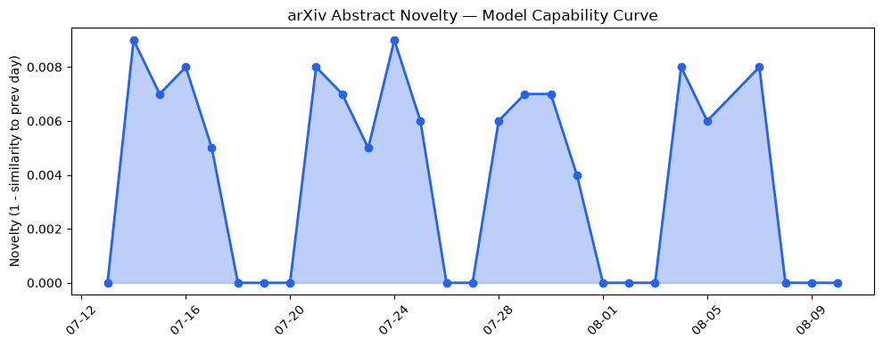
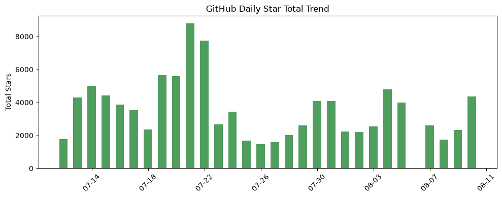
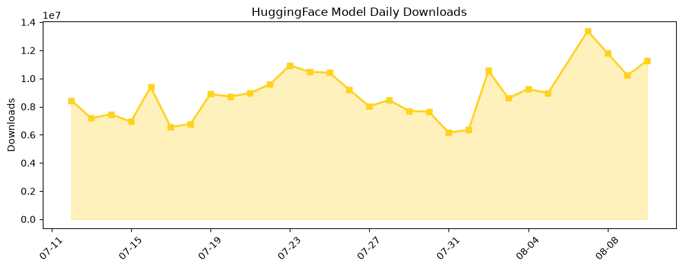

## 今日AI结构性变化
> 今日新增的AI信息中，技术层变化、基础设施变化、应用层变化、资本信号和风险信号均有所体现，尤其是LLM和AI-native产品的发展和应用。
今日最值得注意的结构性变化是技术层和应用层的重大突破，尤其是LLM和Mixture-of-Experts的能力边界被推进，以及EntropyMoE和Graph Foundation Models的提出。这些变化表明AI技术正在持续升温和发展。
📈 持续趋势：技术层和应用层的重大突破。
🆕 新兴方向：EntropyMoE和Graph Foundation Models的提出。
🔺 突然升温：LLM和Mixture-of-Experts的能力边界被推进。

## 技术层信号
🔴 重大突破

技术层的话题向量在最近8天内呈现持续增强趋势，表明该方向正在持续升温。LLM和Mixture-of-Experts的能力边界被推进，EntropyMoE和Graph Foundation Models的提出为AI技术带来了新的发展方向。[Towards Multi-Label Graph Foundation Models](https://arxiv.org/abs/2608.06394) 和 [EntropyMoE](https://arxiv.org/abs/2608.06398) 的提出是技术层信号的重要体现。

## 产业资本信号
🔴 强信号

资本信号出现全新话题，表明资本市场对AI技术的关注度正在增加。[Global New Unicorn Counts In The First Half Of 2026](https://news.crunchbase.com/venture/global-unicorn-counts-rise-ai-robotics-chips-h1-2026/) 的报告显示，AI领域的新独角兽企业数量正在增加，这是资本信号的重要体现。

## 潜在拐点判断
技术层和应用层的重大突破可能是AI产业发展的拐点，尤其是LLM和Mixture-of-Experts的能力边界被推进，以及EntropyMoE和Graph Foundation Models的提出。这些变化可能会带来新的发展方向和商业机会。

## 明日观察点
1. 技术层的进一步发展和应用。
2. 资本信号的持续关注和分析。
3. 应用层的新兴方向和商业机会。

## 长期趋势坐标
技术层和应用层的重大突破可能是AI产业发展的长期趋势坐标，尤其是LLM和Mixture-of-Experts的能力边界被推进，以及EntropyMoE和Graph Foundation Models的提出。这些变化可能会带来新的发展方向和商业机会。

## 数据洞察
### arXiv 摘要对比 — 模型能力提升曲线
arXiv_capability 的数据显示，模型能力提升曲线呈现延续趋势，capability_score 为 0.011，mean_similarity 为 0.989。
### GitHub Star 增速分析
github_stars 的数据显示，GitHub Star 增速呈现增长趋势，total_stars_today 为 4362，repo_count 为 10。
### HuggingFace 模型下载量变化
huggingface_downloads 的数据显示，HuggingFace 模型下载量呈现增长趋势，total_downloads 为 11278142，model_count 为 20。
### 趋势图

## 参考来源
- [Towards Multi-Label Graph Foundation Models](https://arxiv.org/abs/2608.06394)
- [EntropyMoE](https://arxiv.org/abs/2608.06398)
- [Global New Unicorn Counts In The First Half Of 2026](https://news.crunchbase.com/venture/global-unicorn-counts-rise-ai-robotics-chips-h1-2026/)
- [Model ML](https://openai.com/index/model-ml)