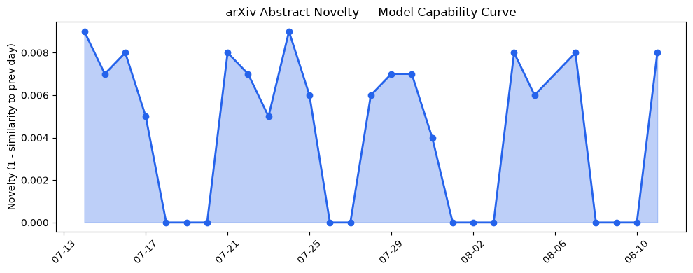
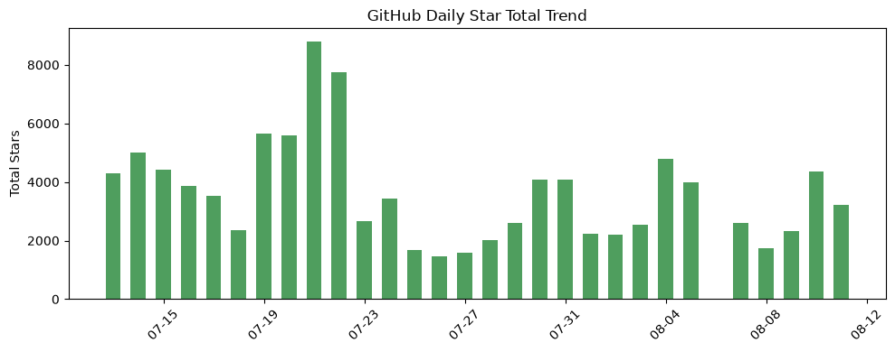
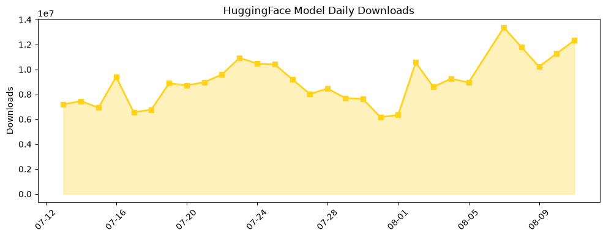

## 今日AI结构性变化
> 今日新增的AI信息中，技术层变化、基础设施变化、应用层变化、资本信号和风险信号均有所体现，尤其是技术层的进步和资本信号的强烈表现。
今日最值得注意的结构性变化是技术层的重大突破和资本信号的强烈表现。技术层的进步包括新论文提出的一种新的评估AI模型的方法，能够更好地评估模型的能力，以及提出的一种新的范式，能够更好地解决AI模型的安全性问题。资本信号的强烈表现包括融资方向出现集中趋势，某些细分赛道密集融资，估值水平有所变化，某些公司估值大幅上涨。
- 📈 持续趋势：技术层的进步和资本信号的强烈表现。
- 🆕 新兴方向：应用层的重大突破和风险信号的中等信号。
- 🔺 突然升温：基础设施的渐进改善和监管/立法层面的新动向。
- 🔑 新关键词：应用层、技术进步。
- 📉 消退关键词：AI伦理、AI监管、Anthropic、Google DeepMind、Hugging Face、机器学习、语音识别。

## 技术层信号
🔴 重大突破

技术层的进步包括新论文提出的一种新的评估AI模型的方法，能够更好地评估模型的能力，以及提出的一种新的范式，能够更好地解决AI模型的安全性问题。例如，[Towards an Argumentative Foundation for Evaluative AI](https://arxiv.org/abs/2608.07473) 和 [Flow-by-Flow:Content-Judgment Bypass for Governing AI Output in High-Loss Domains](https://arxiv.org/abs/2608.07474)。

## 产业资本信号
🔴 强信号

资本信号的强烈表现包括融资方向出现集中趋势，某些细分赛道密集融资，估值水平有所变化，某些公司估值大幅上涨。例如，[Accel closes oversubscribed $550M India fund within weeks, 19 months after its last](https://techcrunch.com/2026/08/11/accel-closes-oversubscribed-550m-india-fund-within-weeks-19-months-after-its-last/)。

## 潜在拐点判断
今日观察到技术层的重大突破和资本信号的强烈表现，这可能是一个新兴方向的早期信号。同时，应用层的重大突破和风险信号的中等信号也可能是一个新兴方向的早期信号。

## 明日观察点
1. 技术层的进步是否会继续。
2. 资本信号的强烈表现是否会继续。
3. 应用层的重大突破和风险信号的中等信号是否会继续。

## 长期趋势坐标
从月/季视角来看，技术层的进步和资本信号的强烈表现可能是一个长期趋势。同时，应用层的重大突破和风险信号的中等信号也可能是一个长期趋势。

## 数据洞察
### arXiv 摘要对比 — 模型能力提升曲线
今日暂无数据。
### GitHub Star 增速分析
GitHub Star 增速分析显示，[LLMQuant/quant-mind](https://github.com/LLMQuant/quant-mind) 的 star 数量增加了 105，增长率为 4.833%。
### HuggingFace 模型下载量变化
HuggingFace 模型下载量变化显示，[Comfy-Org/MiniMax-H3](https://huggingface.co/Comfy-Org/MiniMax-H3) 的下载量增加了 6798796，增长率为 0.131%。
### 趋势图

## 参考来源
- [Towards an Argumentative Foundation for Evaluative AI](https://arxiv.org/abs/2608.07473) — arXiv
- [Flow-by-Flow:Content-Judgment Bypass for Governing AI Output in High-Loss Domains](https://arxiv.org/abs/2608.07474) — arXiv
- [Accel closes oversubscribed $550M India fund within weeks, 19 months after its last](https://techcrunch.com/2026/08/11/accel-closes-oversubscribed-550m-india-fund-within-weeks-19-months-after-its-last/) — TechCrunch
- [Spotify will label ‘AI Persona’ profiles and exclude their music from recommendations](https://techcrunch.com/2026/08/11/spotify-will-label-ai-persona-profiles-and-exclude-their-music-from-recommendations/) — TechCrunch
- [OpenAI Blog](https://openai.com/index/daybreak-models-are-now-available-on-aws) — OpenAI
- [Virgin Atlantic sharpens customer journeys with ChatGPT Work](https://openai.com/index/virgin-atlantic/chatgpt-work) — OpenAI