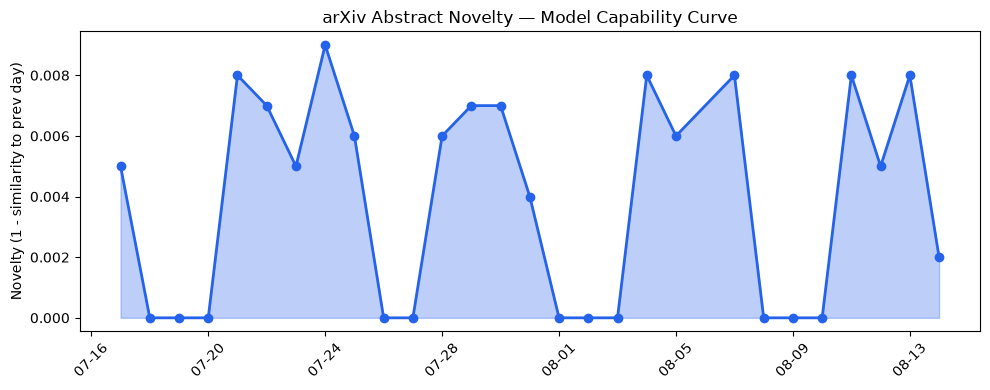
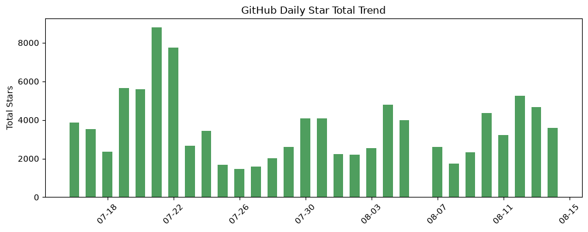
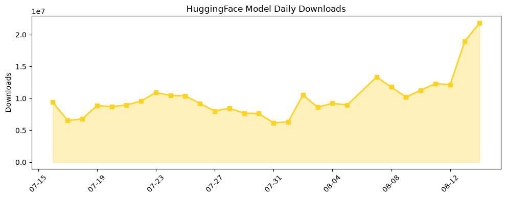

## 今日AI结构性变化
> 今日AI领域出现多项结构性变化，包括技术层面的模型能力边界推进、基础设施层面的推理成本降低以及资本层面的融资热潮。
今日最值得注意的结构性变化是技术层面的模型能力边界推进，新论文提出 lifelong AI partners 模型和 LoKiFormer 模型，推进了模型能力边界和创新了 Transformer 架构。同时，基础设施层面的推理成本降低也是一个重要的变化，新论文提出 Reinforcement Learning 方案，降低了推理成本。
趋势信号包括：
- 📈 持续趋势：基础设施的话题向量在最近8天内呈现持续增强趋势。
- 🆕 新兴方向：技术层出现全新话题，可能是一个新兴方向的早期信号。
- 🔺 突然升温：资本信号的话题向量在最近8天内呈现持续增强趋势。

## 技术层信号
🔴 重大突破

技术层面的模型能力边界推进是今日最值得注意的变化，新论文提出 lifelong AI partners 模型和 LoKiFormer 模型，推进了模型能力边界和创新了 Transformer 架构。例如，[Harnessing agent memory to build lifelong AI partners for materials scientists](https://arxiv.org/abs/2608.11224) 和 [LoKiFormer: Locality-aware Attention with Decoupled Knowledge Memory for Efficient Large Language Model Pretraining](https://arxiv.org/abs/2608.12419)。
此外，基础设施层面的推理成本降低也是一个重要的变化，新论文提出 Reinforcement Learning 方案，降低了推理成本。例如，[Cutting AI Datacenter Energy with Reinforcement Learning: Measured Power Control of LLM Training from One GPU to the Fleet](https://arxiv.org/abs/2608.11226)。

## 产业资本信号
🔴 强信号

今日资本层面的融资热潮是另一个重要的变化，多家公司获得融资，包括 Databricks 和 River AI。例如，[The Week’s 10 Biggest Funding Rounds: Data, Neolab, AI Infrastructure, Defense And AI Coding Lead](https://news.crunchbase.com/ai/biggest-funding-rounds-databricks-river-ai-data-energy/)。
此外，Meta 公司发布开源 AI 模型，也是今日的一个重要信号。例如，[40 Companies Joined The Unicorn Board In July, The Highest Count In 4 Years](https://news.crunchbase.com/venture/unicorn-board-grows-40-companies-fintech-robotics-ai-july-2026/)。

## 潜在拐点判断
今日观察到技术层面的模型能力边界推进和基础设施层面的推理成本降低，这可能是AI领域的一个潜在拐点。同时，资本层面的融资热潮也可能是AI领域的一个重要拐点。

## 明日观察点
1. 技术层面的模型能力边界推进是否会继续。
2. 基础设施层面的推理成本降低是否会继续。
3. 资本层面的融资热潮是否会继续。

## 长期趋势坐标
从月/季视角来看，AI领域的技术层面和基础设施层面都在不断推进，资本层面的融资热潮也在持续。例如，[overall_novelty](https://arxiv.org/abs/2608.11224) 和 [keyword_trends](https://news.crunchbase.com/ai/biggest-funding-rounds-databricks-river-ai-data-energy/)。

## 数据洞察
### arXiv 摘要对比 — 模型能力提升曲线
今日暂无数据。

### GitHub Star 增速分析
今日 GitHub Star 增速分析显示，[NVIDIA-NeMo/Automodel](https://github.com/NVIDIA-NeMo/Automodel) 的 Star 数量增长了 44.4%。

### HuggingFace 模型下载量变化
今日 HuggingFace 模型下载量变化显示，[Comfy-Org/MiniMax-H3](https://huggingface.co/Comfy-Org/MiniMax-H3) 的下载量增长了 244.2%。

### 趋势图

## 参考来源
- [Harnessing agent memory to build lifelong AI partners for materials scientists](https://arxiv.org/abs/2608.11224) — arXiv
- [LoKiFormer: Locality-aware Attention with Decoupled Knowledge Memory for Efficient Large Language Model Pretraining](https://arxiv.org/abs/2608.12419) — arXiv
- [Cutting AI Datacenter Energy with Reinforcement Learning: Measured Power Control of LLM Training from One GPU to the Fleet](https://arxiv.org/abs/2608.11226) — arXiv
- [The Week’s 10 Biggest Funding Rounds: Data, Neolab, AI Infrastructure, Defense And AI Coding Lead](https://news.crunchbase.com/ai/biggest-funding-rounds-databricks-river-ai-data-energy/) — Crunchbase News
- [40 Companies Joined The Unicorn Board In July, The Highest Count In 4 Years](https://news.crunchbase.com/venture/unicorn-board-grows-40-companies-fintech-robotics-ai-july-2026/) — Crunchbase News