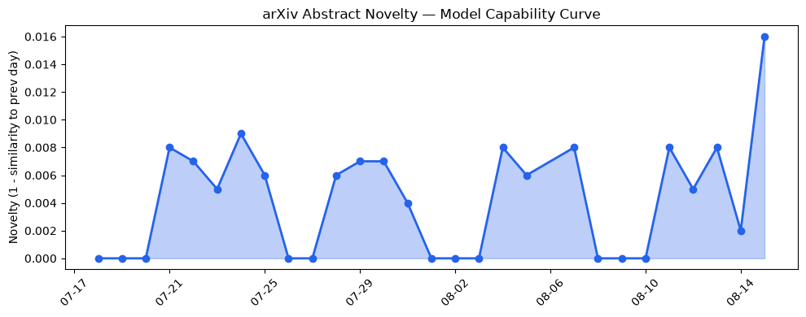
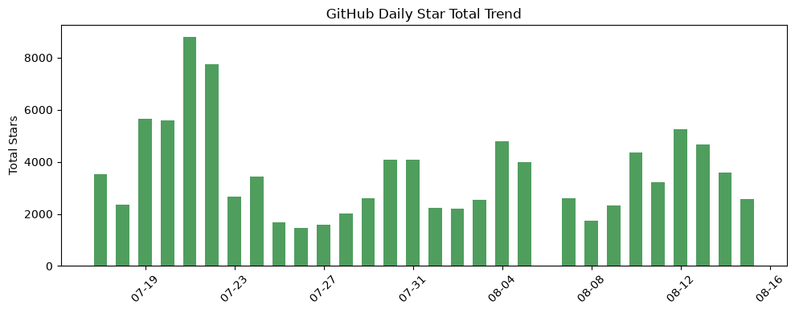
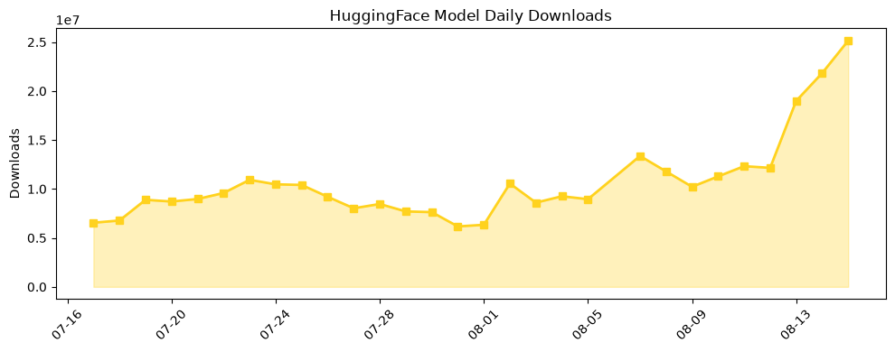

## 今日AI结构性变化
> 今日新增的 AI 信息显示，LLM 研究与应用领域正在多维度推进，包括技术层面的模型能力边界扩展、基础设施的高效推理方案、应用层面的新行业和新场景，以及资本和风险信号的变化。
今天最值得注意的结构性变化是技术层面的重大突破，包括 LLM 的能力边界被进一步扩展，出现了新的范式，如使用 LLM 进行决策和推理。同时，应用层面也出现了新行业和新场景的应用，资本信号显示出强烈的投资意愿。
📈 持续趋势：技术层面的模型能力边界扩展和应用层面的新行业应用。
🆕 新兴方向：基础设施的高效推理方案和资本信号的变化。
🔺 突然升温：风险信号的变化，包括 AI 安全和伦理问题。

## 技术层信号
🔴 重大突破

技术层面的模型能力边界扩展是今日最值得注意的变化，包括多模态处理和上下文长度的增加。新的范式如使用 LLM 进行决策和推理也在出现。[Position: Reasoning is a Learnable Rule-Based Process](https://arxiv.org/abs/2608.12325) 和 [Dual-Flow Transformers: Decoupling the Primary Prefill Path from Additional Decode Computation](https://arxiv.org/abs/2608.12385) 是两个值得注意的论文。

## 产业资本信号
🔴 强信号

资本信号显示出强烈的投资意愿，包括 SpaceX 收购 Cursor。这表明资本市场对 AI 的关注度增加，投资方向包括 LLM 和相关技术。[SpaceX officially closes its Cursor acquisition](https://techcrunch.com/2026/08/15/spacex-officially-closes-its-cursor-acquisition/) 是一个值得注意的事件。

## 潜在拐点判断
今日的变化表明，LLM 研究与应用领域正在经历一个潜在的拐点，技术层面的重大突破和应用层面的新行业应用可能会带来新的发展机会。然而，风险信号的变化也需要关注，包括 AI 安全和伦理问题。

## 明日观察点
1. 技术层面的模型能力边界扩展是否会继续。
2. 应用层面的新行业应用是否会进一步扩展。
3. 资本信号的变化是否会带来新的投资机会。

## 长期趋势坐标
从月度视角来看，LLM 研究与应用领域的发展趋势是持续的，技术层面的重大突破和应用层面的新行业应用将继续推动行业的发展。同时，资本信号的变化也需要长期关注，包括投资方向和估值水平的变化。

## 数据洞察
### arXiv 摘要对比 — 模型能力提升曲线
今日的 arXiv 摘要对比显示，模型能力提升曲线呈现持续上升趋势，表明技术层面的重大突破正在持续推进。
### GitHub Star 增速分析
GitHub Star 增速分析显示，今日的 Star 数量呈现增长趋势，表明开源社区对 LLM 研究与应用的关注度正在增加。
### HuggingFace 模型下载量变化
HuggingFace 模型下载量变化显示，今日的下载量呈现增长趋势，表明开发者对 LLM 模型的需求正在增加。
### 趋势图

## 参考来源
- [Position: Reasoning is a Learnable Rule-Based Process](https://arxiv.org/abs/2608.12325)
- [Dual-Flow Transformers: Decoupling the Primary Prefill Path from Additional Decode Computation](https://arxiv.org/abs/2608.12385)
- [SpaceX officially closes its Cursor acquisition](https://techcrunch.com/2026/08/15/spacex-officially-closes-its-cursor-acquisition/)
- [MakazhanAlpamys / Soup](https://github.com/MakazhanAlpamys/Soup)
- [Research Assistant: AstraZeneca's Agentic System for R&D](https://arxiv.org/abs/2608.12395)