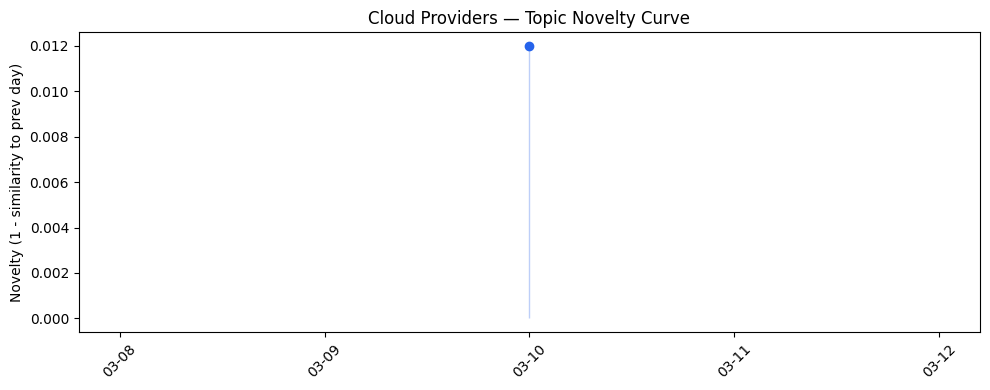

## 今日云计算结构性变化

> 今日核心判断：火山引擎全系云产品发布标志着中国云服务进入全栈化阶段，同时全球主要云厂商加速 AI 与基础设施深度融合。

今天最值得注意的云计算/SaaS 结构性变化是火山引擎发布全系云产品，这标志着中国云服务正式进入全栈化阶段。与此同时，全球主要云厂商，包括 AWS、Google Cloud 和 Microsoft Azure，正在加速 AI 与基础设施的深度融合。这一系列变化体现了云计算和 SaaS 领域正在从基础设施、应用层到资本流向的全面深化。

- 📈 **持续趋势**：技术层话题已连续多天增强，特别是在 AI 与云融合方面。  
- 🆕 **新兴方向**：火山引擎全系云产品的发布为中国云市场带来新的变量。  
- 🔺 **突然升温**：网络韧性相关话题近 3 天突然集中出现，Cloudflare 引入 QUIC 流和动态路径 MTU 发现提升网络韧性。  

## 技术层信号

🔴 重大突破  

云原生、容器、K8s 与 Serverless 领域出现了重大进展：  

- **AWS** 在 Lightsail 推出 OpenClaw 私有 AI 代理，实现自主 AI 代理的低成本部署。  
- **Google Cloud** 在 GKE 原生支持自定义指标，并发布面向政府的 Gemini for Government，提供定制化 AI 解决方案。  
- **Microsoft Azure** 通过 IaaS 系列、Mistral Document AI 等功能深化 AI 与云的融合，并在 Foundry 中上线 GPT‑5.4。  
- **Cloudflare** 引入 QUIC 流和动态路径 MTU 发现，显著提升网络韧性与 SASE 客户端的可靠性。  

**证据文章**  
- [Introducing OpenClaw on Amazon Lightsail](https://aws.amazon.com/blogs/aws/introducing-openclaw-on-amazon-lightsail-to-run-your-autonomous-private-ai-agents/)  
- [Grow your own way: Introducing native support for custom metrics in GKE](https://cloud.google.com/blog/products/containers-kubernetes/gke-now-supports-custom-metrics-natively/)  
- [Gemini for Government: Build custom AI agents for unclassified work on GenAI.mil](https://cloud.google.com/blog/topics/public-sector/gemini-for-government-build-custom-ai-agents-for-unclassified-work-on-genaimil/)  
- [Ending the "silent drop": how Dynamic Path MTU Discovery makes the Cloudflare One Client more resilient](https://blog.cloudflare.com/client-dynamic-path-mtu-discovery/)  

## 产业资本信号

🟡 中等信号  

### 基础设施变化  
- **火山引擎** 正式发布全系云产品，标志着中国云服务进入全栈化阶段。  
- **AWS** 推出基于第 5 代 AMD EPYC 的 EC2 Hpc8a 实例，提供高性能计算能力。  

### 应用层变化  
- **Salesforce** 引入面向初创企业的垂直 AI 代理，推动 AI 在 SaaS 场景的落地。  
- **火山引擎** OpenClaw 与飞书机器人、企业周报、AI 助手等垂直场景深度结合，降低企业上云与 AI 应用门槛。  

### 资本流向  
- **AgentMail** 完成 600 万美元融资，用于构建面向 AI 代理的邮件服务，显示 AI 代理生态的资本兴趣。  

**证据文章**  
- [火山引擎正式对外发布全系云产品](https://www.cnblogs.com/volcengine/p/15640981.html)  
- [Amazon EC2 Hpc8a Instances powered by 5th Gen AMD EPYC processors are now available](https://aws.amazon.com/blogs/aws/amazon-ec2-hpc8a-instances-powered-by-5th-gen-amd-epyc-processors-are-now-available/)  
- [The Rise of Vertical AI Agents: A New Pillar for Startups](https://www.salesforce.com/blog/vertical-ai-agents-for-startups/)  
- [AgentMail raises $6M to build an email service for AI agents](https://techcrunch.com/2026/03/10/agentmail-raises-6m-to-build-an-email-service-for-ai-agents/)  

## 潜在拐点判断

基于今日信号与已有趋势，判断存在以下潜在拐点：

1. **全栈云产品发布**：火山引擎全系云产品的发布可能是中国云计算市场的关键拐点，标志着从“功能块”向“一站式全栈”服务的转变，预计将加速本土企业上云进程并对国际厂商形成竞争压力。  
2. **AI 与云深度融合**：AWS、Google Cloud、Azure 同步推出 AI 与基础设施的深度集成（OpenClaw、Gemini for Government、GPT‑5.4），预示着云计算能力将围绕大模型算力进行重新布局，后续可能出现算力定价模型的根本性变革。  

若上述拐点实现，预计将导致：  
- **市场格局重塑**：本土全栈云服务提升竞争力，国际厂商需加速本地化与差异化。  
- **算力成本结构变化**：共享 GPU、加量不加价等计费模式可能成为新标配，降低 AI 应用的进入门槛。  

## 明日观察点

1. **火山引擎全系云产品的市场反馈**：关注客户签约量、行业案例以及竞争对手（如阿里云、腾讯云）的应对策略。  
2. **AI 与云融合的进一步动作**：留意 AWS、Google Cloud、Azure 是否发布新一代 AI 加速实例或大模型即服务（Model-as-a-Service）细节。  
3. **网络韧性技术的落地**：观察 Cloudflare QUIC 流和动态路径 MTU 发现在企业 SASE 部署中的实际性能提升情况。  

## 长期趋势坐标

今天的信号位于云计算与 SaaS 产业的“加速融合、全栈化”阶段。AI 与基础设施的深度耦合、全栈云产品的推出以及网络韧性技术的提升，都是从“功能叠加”向“能力协同”转变的关键节点。随着这些趋势的持续叠加，预计未来 6‑12 个月内，云服务将从“算力+存储”向“算力+AI+网络韧性+低代码”全方位能力平台演进。

## 数据洞察

### 云厂商话题演化  
历史数据不足（需至少 3 天），今日云厂商内容与历史的延续/跃迁情况暂无法评估。

### SaaS 厂商话题演化  
同样因历史数据不足，今日 SaaS 内容的延续/跃迁情况暂无法评估。

### 趋势图  

  

## 参考来源

### 云厂商  
- [Introducing OpenClaw on Amazon Lightsail](https://aws.amazon.com/blogs/aws/introducing-openclaw-on-amazon-lightsail-to-run-your-autonomous-private-ai-agents/) — AWS Blog  
- [Amazon EC2 Hpc8a Instances powered by 5th Gen AMD EPYC processors are now available](https://aws.amazon.com/blogs/aws/amazon-ec2-hpc8a-instances-powered-by-5th-gen-amd-epyc-processors-are-now-available/) — AWS Blog  
- [Grow your own way: Introducing native support for custom metrics in GKE](https://cloud.google.com/blog/products/containers-kubernetes/gke-now-supports-custom-metrics-natively/) — Google Cloud Blog  
- [Gemini for Government: Build custom AI agents for unclassified work on GenAI.mil](https://cloud.google.com/blog/topics/public-sector/gemini-for-government-build-custom-ai-agents-for-unclassified-work-on-genaimil/) — Google Cloud Blog  
- [火山引擎正式对外发布全系云产品](https://www.cnblogs.com/volcengine/p/15640981.html) — 火山引擎 Blog  

### SaaS 厂商  
- [The Rise of Vertical AI Agents: A New Pillar for Startups](https://www.salesforce.com/blog/vertical-ai-agents-for-startups/) — Salesforce Blog  
- [Competitor analysis tools marketing teams actually use in 2026](https://blog.hubspot.com/marketing/competitor-analysis-tools) — HubSpot Blog  

### 行业资讯  
- [AgentMail raises $6M to build an email service for AI agents](https://techcrunch.com/2026/03/10/agentmail-raises-6m-to-build-an-email-service-for-ai-agents/) — TechCrunch  
- [Protecting Your Data: Essential Actions to Secure Experience Cloud Guest User Access](https://www.salesforce.com/blog/protecting-your-data-essential-actions-to-secure-experience-cloud-guest-user-access/) — Salesforce Blog  
- [Proactive Preparation and Hardening Against Destructive Attacks: 2026 Edition](https://cloud.google.com/blog/topics/threat-intelligence/preparation-hardening-destructive-attacks/) — Google Cloud Blog  