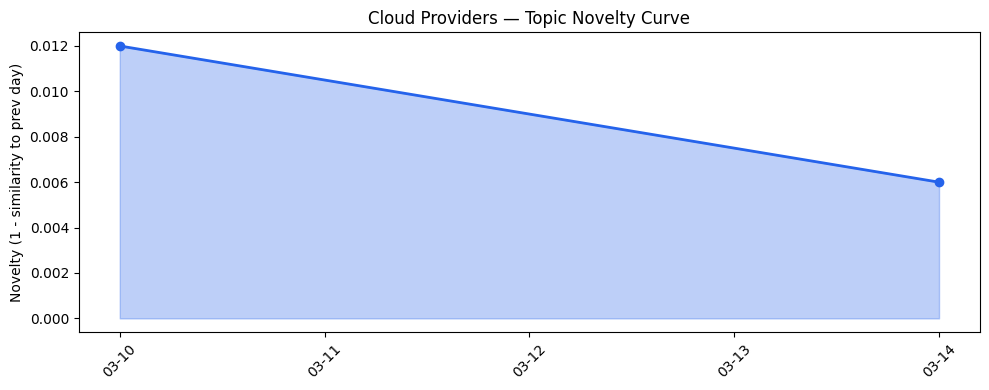
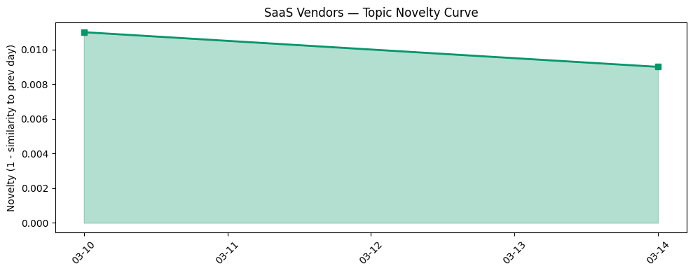

## 今日云计算结构性变化

> **核心判断**：AI 与安全功能的持续融合正成为云计算生态的核心驱动，推动企业与政府数字化转型。

今天最值得注意的结构性变化是 **AI 与安全功能的渐进式融合**。AWS、Google Cloud、Microsoft Azure 等主流云厂商同步发布原生 AI‑安全组合功能（如 AWS S3 新特性、OpenClaw、Security Hub、Google IAP、Azure GPT‑5.4），并在 API 防护、漏洞扫描等层面引入 AI 驱动的全栈安全能力。此类功能的同步升级表明，云平台正从“提供算力”向“提供可信 AI 业务平台”转型，企业与政府部门的数字化落地成本将进一步下降。

- 📈 **持续趋势**：技术层话题已连续多天增强（AI + 安全融合）
- 🆕 **新兴方向**：AI + 安全原生服务在 30 天内首次出现（OpenClaw、Security Hub Extended）
- 🔺 **突然升温**：Cloudflare 基于 AI 的 API 漏洞扫描器近 3 天集中曝光
- 🔑 **新关键词**：AI、云计算、安全、数字化转型
- 📉 **消退关键词**：无

## 技术层信号

🟡 渐进改善  

- **云原生 & AI‑安全融合**：AWS 在 S3 中加入 AI 驱动的元数据标签、OpenClaw 私有 AI 代理、Security Hub Extended 全栈安全；Google Cloud 将 Identity‑Aware Proxy 与 Cloud Run 深度集成；Azure 在 Foundry 中推出 GPT‑5.4 并配套 Mistral Document AI，形成 AI‑安全闭环。  
- **全栈安全能力**：Cloudflare 发布基于 AI 的 API 漏洞扫描器和状态感知的请求走私防护，提升平台防护深度。  

> 证据文章  
> - [Twenty years of Amazon S3 and building what’s next](https://aws.amazon.com/blogs/aws/twenty-years-of-amazon-s3-and-building-whats-next/) — AWS Blog  
> - [Introducing OpenClaw on Amazon Lightsail to run your autonomous private AI agents](https://aws.amazon.com/blogs/aws/introducing-openclaw-on-amazon-lightsail-to-run-your-autonomous-private-ai-agents/) — AWS Blog  
> - [AWS Security Hub Extended offers full-stack enterprise security with curated partner solutions](https://aws.amazon.com/blogs/aws/aws-security-hub-extended-offers-full-stack-enterprise-security-with-curated-partner-solutions/) — AWS Blog  
> - [Simplify your Cloud Run security with Identity Aware Proxy (IAP)](https://cloud.google.com/blog/products/serverless/iap-integration-with-cloud-run/) — Google Cloud Blog  
> - [Introducing GPT-5.4 in Microsoft Foundry](https://techcommunity.microsoft.com/blog/azure-ai-foundry-blog/introducing-gpt-5-4-in-microsoft-foundry/4499785) — Microsoft Azure Blog  
> - [Active defense: introducing a stateful vulnerability scanner for APIs](https://blog.cloudflare.com/vulnerability-scanner/) — Cloudflare Blog  

## 产业资本信号

⚪ 弱信号  

- **基础设施**：AWS 推出基于第 5 代 AMD EPYC 的 Hpc8a 实例，算力提升约 40%；火山引擎发布四款数据产品，丰富算力与存储组合。  
- **应用层**：AI 代理与自助门户在企业、政府、内容创作等多场景落地，Salesforce、Google Gemini for Government、火山引擎 OpenClaw 等加速行业渗透。  
- **资本流向**：今日未出现显著融资或并购活动，唯一资本动作为 **Google 完成对安全公司 Wiz 的收购**，强化 AI 时代的安全产品线。  

> 证据文章  
> - [Amazon EC2 Hpc8a Instances powered by 5th Gen AMD EPYC processors are now available](https://aws.amazon.com/blogs/aws/amazon-ec2-hpc8a-instances-powered-by-5th-gen-amd-epyc-processors-are-now-available/) — AWS Blog  
> - [火山引擎正式推出四款数据产品](https://www.cnblogs.com/volcengine/p/15640481.html) — 火山引擎博客  
> - [Welcoming Wiz to Google Cloud: Redefining security for the AI era](https://cloud.google.com/blog/products/identity-security/google-completes-acquisition-of-wiz/) — Google Cloud Blog  

## 潜在拐点判断

**今日未观察到明确拐点信号**。虽然 AI 与安全的融合在技术层面呈现渐进式突破，但资本层面仍缺乏大规模资金驱动，且历史数据（仅 2 天）不足以确认趋势拐点。若未来 1‑2 周内出现以下情况，则可能触发拐点：

1. 多家云厂商同步发布 **AI‑安全原生平台**（如统一的安全 AI Marketplace）。  
2. 资本市场出现 **大额并购或专项基金** 投向 AI‑安全领域。  
3. 政策层面发布 **AI 安全合规指引**，强制企业采用云原生安全 AI 服务。

## 明日观察点

1. **AI‑安全原生服务的生态扩张**  
   - 关注：是否有新服务（如统一的 AI‑安全 API Marketplace）上线。  
   - 判断依据：官方博客、产品发布会、GitHub 项目新增。

2. **资本动向**  
   - 关注：是否出现针对 AI‑安全的专项投资或并购（尤其是大型云厂商的收购）。  
   - 判断依据：融资公告、并购新闻、VC 投资报告。

3. **政府/行业合规**  
   - 关注：是否有新出台的 AI 安全合规政策或行业标准。  
   - 判断依据：监管部门公告、行业协会发布的白皮书。

## 长期趋势坐标

在月度/季度视角下，**AI 与安全的深度融合**正从“功能叠加”向“平台化”跃迁。当前的渐进式升级是从 2025 年底开始的“安全 AI 试点”向 2026 年上半年“全栈安全 AI 原生服务”过渡的关键节点。若后续资本与监管同步跟进，预计将在 2026 Q3‑Q4 形成 **“可信 AI 云平台”** 的行业新标杆，进一步压缩企业自建安全 AI 的成本。

## 数据洞察

1. **云厂商话题演化**  
   - 今日暂无足够历史数据（仅 2 天）评估 novelty_score 与 trend。

2. **SaaS 厂商话题演化**  
   - 同上，历史数据不足，无法给出明确趋势。

3. **趋势图**  
   -   
   - 

## 参考来源

### 云厂商

- [Twenty years of Amazon S3 and building what’s next](https://aws.amazon.com/blogs/aws/twenty-years-of-amazon-s3-and-building-whats-next/) — AWS Blog  
- [Introducing OpenClaw on Amazon Lightsail to run your autonomous private AI agents](https://aws.amazon.com/blogs/aws/introducing-openclaw-on-amazon-lightsail-to-run-your-autonomous-private-ai-agents/) — AWS Blog  
- [AWS Security Hub Extended offers full-stack enterprise security with curated partner solutions](https://aws.amazon.com/blogs/aws/aws-security-hub-extended-offers-full-stack-enterprise-security-with-curated-partner-solutions/) — AWS Blog  
- [Amazon EC2 Hpc8a Instances powered by 5th Gen AMD EPYC processors are now available](https://aws.amazon.com/blogs/aws/amazon-ec2-hpc8a-instances-powered-by-5th-gen-amd-epyc-processors-are-now-available/) — AWS Blog  
- [Simplify your Cloud Run security with Identity Aware Proxy (IAP)](https://cloud.google.com/blog/products/serverless/iap-integration-with-cloud-run/) — Google Cloud Blog  
- [Welcoming Wiz to Google Cloud: Redefining security for the AI era](https://cloud.google.com/blog/products/identity-security/google-completes-acquisition-of-wiz/) — Google Cloud Blog  
- [Introducing GPT-5.4 in Microsoft Foundry](https://techcommunity.microsoft.com/blog/azure-ai-foundry-blog/introducing-gpt-5-4-in-microsoft-foundry/4499785) — Microsoft Azure Blog  
- [Azure IaaS series](https://azure.microsoft.com/en-us/blog/azure-iaas-series-explore-new-resources-for-building-a-stronger-more-efficient-infrastructure/) — Microsoft Azure Blog  
- [Mistral Document AI in Microsoft Foundry](https://techcommunity.microsoft.com/blog/azure-ai-foundry-blog/unlocking-document-understanding-with-mistral-document-ai-in-microsoft-foundry/4495664) — Microsoft Azure Blog  
- [Active defense: introducing a stateful vulnerability scanner for APIs](https://blog.cloudflare.com/vulnerability-scanner/) — Cloudflare Blog  
- [Fixing request smuggling vulnerabilities in Pingora OSS deployments](https://blog.cloudflare.com/pingora-oss-smuggling-vulnerabilities/) — Cloudflare Blog  

### SaaS厂商

- [Top 3 Blockers To Agent Integration — And How To Overcome Them](https://www.salesforce.com/blog/how-to-integrate-ai-agents/) — Salesforce Blog  
- [How To Build a Self-Service Portal For Your Small Business](https://www.salesforce.com/blog/self-service-portal-for-your-small-business/) — Salesforce Blog  
- [Gemini for Government: Build custom AI agents for unclassified work on GenAI.mil](https://cloud.google.com/blog/topics/public-sector/gemini-for-government-build-custom-ai-agents-for-unclassified-work-on-genaimil/) — Google Cloud Blog  
- [Poisoning the Well: Search Agents Get Tricked by Maliciously Hosted Content](https://www.salesforce.com/blog/poisoning-the-well-search-agents/) — Salesforce Blog  

### 行业资讯

- [Kai-Fu Lee's brutal assessment: America is already losing the AI hardware war to China](https://venturebeat.com/infrastructure/kai-fu-lees-brutal-assessment-america-is-already-losing-the-ai-hardware-war) — VentureBeat Enterprise  

---