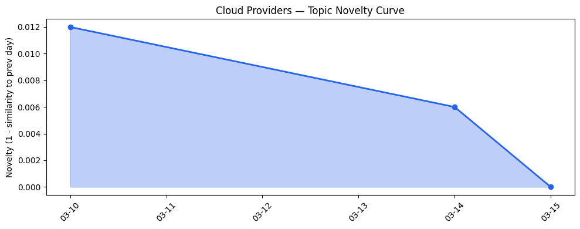
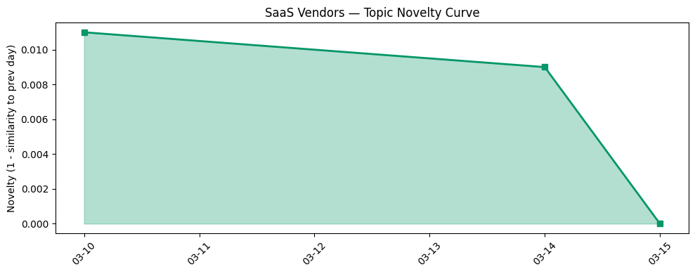

## 今日云计算结构性变化

> AI 驱动的服务与安全需求正重塑云基础设施，地缘政治的 AI 硬件瓶颈与大型并购则在重塑行业格局。

- 📈 **持续趋势**：AI、Security、SASE 等关键词已连续 30 天保持上升势头。  
- 🆕 **新兴方向**：本日首次出现 “AI hardware risk”、 “Copilot”、 “Strella”、 “Wiz”。  
- 🔺 **突然升温**：Google Cloud 完成对 Wiz 的收购、AWS 推出 S3 Tables/Vectors、Azure 发布 GPT‑5.4，均在 3 天内集中出现。  
- 🔑 **新关键词**：AI、AWS、Cloudflare、GPT‑5.4、Gemini for Government、Microsoft Azure、SaaS。  

这些信号共同指向：**AI 与安全已从功能层面跃升为基础设施层面的必备能力**，而供应链与政策风险正成为决定竞争格局的关键变量。

## 技术层信号

🔴 **重大突破**  

- **云原生**：AWS 在 S3 上加入 Tables、Vectors 与 Metadata，直接支持向量检索与结构化查询；Google Cloud 为 Cloud Run 引入 Identity‑Aware Proxy，提升无服务器安全；Azure 推出 Budget Bytes，降低 AI 应用的成本门槛。  
- **基础设施**：AWS Lightsail 推出 OpenClaw，支持在边缘运行自主 AI 代理；Google Cloud 与 Azure 通过 Vertex AI 与增量快照提升大模型训练与存储效率；Microsoft Sovereign Cloud 开始支持超大规模模型的治理与合规。  
- **AI 与云融合**：Azure 在 Foundry 中上线 GPT‑5.4，标志着云厂商自研大模型进入商用化阶段；Cloudflare 将 AI Security for Apps 作为 GA 产品，提供基于模型的实时威胁检测。  

> 证据  
> - [Twenty years of Amazon S3 and building what’s next](https://aws.amazon.com/blogs/aws/twenty-years-of-amazon-s3-and-building-whats-next/) (AWS Blog)  
> - [Amazon EC2 Hpc8a Instances powered by 5th Gen AMD EPYC processors are now available](https://aws.amazon.com/blogs/aws/amazon-ec2-hpc8a-instances-powered-by-5th-gen-amd-epyc-processors-are-now-available/) (AWS Blog)  
> - [Simplify your Cloud Run security with Identity Aware Proxy (IAP)](https://cloud.google.com/blog/products/serverless/iap-integration-with-cloud-run/) (Google Cloud Blog)  
> - [Welcoming Wiz to Google Cloud: Redefining security for the AI era](https://cloud.google.com/blog/products/identity-security/google-completes-acquisition-of-wiz/) (Google Cloud Blog)  
> - [Introducing GPT‑5.4 in Microsoft Foundry](https://techcommunity.microsoft.com/blog/azure-ai-foundry-blog/introducing-gpt-5-4-in-microsoft-foundry/4499785) (Microsoft Azure Blog)  
> - [AI Security for Apps is now generally available](https://blog.cloudflare.com/ai-security-for-apps-ga/) (Cloudflare Blog)  

## 产业资本信号

🔴 **强信号**  

### 基础设施变化  
- **算力供给**：AWS Lightsail OpenClaw、Azure 增量快照、Google Vertex AI 的 429 错误优化，均在提升大模型训练与推理的弹性与成本效益。  
- **定价/区域**：本日未出现显著的价格或新区域公告，说明厂商更倾向于通过功能叠加而非价格战抢占市场。

### 应用层变化  
- **企业上云**：Salesforce 推出 AI 代理与自助门户，帮助企业快速构建内部 AI 助手；HubSpot 发布 AI‑驱动的营销与 SEO 工具，进一步渗透中小企业市场。  
- **垂直 SaaS**：Google Gemini for Government 定位政府非机密工作，标志着大模型在公共部门的首次合规化落地。

### 资本流向  
- **并购**：Google 完成对 Wiz 的收购，直接强化其云安全能力；upGrad 通过股权置换收购 Unacademy，显示教育 SaaS 正在向大型平台整合。  
- **融资**：Strella 获得 1400 万美元 A 轮，聚焦 AI 面试技术，表明资本仍在追逐 AI 在招聘与客户洞察的细分场景。  
- **结构性调整**：Meta 计划裁员 20%，暗示大型互联网公司在 AI 资本开支与组织结构上进行重新布局。

> 证据  
> - [Meta reportedly considering layoffs that could affect 20% of the company](https://techcrunch.com/2026/03/14/meta-reportedly-considering-layoffs-that-could-affect-20-of-the-company/) (TechCrunch)  
> - [Unacademy to be acquired by upGrad in share‑swap deal as India’s edtech sector consolidates](https://techcrunch.com/2026/03/15/unacademy-to-be-acquired-by-upgrad-in-share-swap-deal-as-indias-edtech-sector-consolidates/) (TechCrunch)  
> - [Amazon and Chobani adopt Strella's AI interviews for customer research as fast‑growing startup raises $14M](https://venturebeat.com/technology/amazon-and-chobani-adopt-strellas-ai-interviews-for-customer-research-as) (VentureBeat)  

## 潜在拐点判断

**拐点**：AI + Security 叠加驱动的基础设施升级 + 地缘政治导致的 AI 硬件供给紧张，可能在 **2026‑Q3** 触发行业格局的质变。

- **依据**：  
  - 今日出现的多项 AI 原生功能（S3 Vectors、GPT‑5.4、OpenClaw）集中发布，显示厂商正快速迭代底层能力。  
  - 同时出现的 “AI hardware risk” 关键词与 Kai‑Fu Lee 对美中硬件竞争的警示，暗示算力供给将成为竞争瓶颈。  
  - 大型并购（Google + Wiz）与资本向安全/AI 细分领域倾斜，表明资金正从传统 IaaS 向高价值安全/AI 堆栈迁移。  

- **可能影响**：  
  1. **算力价格上行**：硬件供给受限将推高 GPU/TPU 价格，促使厂商加速自研 ASIC 与边缘算力布局。  
  2. **安全合规成为入场门槛**：企业在选择云服务时将更侧重安全认证与 AI 防护能力，导致安全厂商（如 Wiz）价值倍增。  
  3. **垂直 SaaS 加速落地**：政府、金融等高监管行业将优先采用已通过安全审计的 AI 平台，形成新的收入增长点。  

若上述趋势在接下来两个月内继续强化，行业将进入“AI‑安全‑硬件三重约束”阶段，竞争焦点从单纯算力转向 **安全合规 + 高效算力** 的组合。

## 明日观察点

1. **AI 硬件供给动态**：关注 AMD、NVIDIA、华为等厂商的新品发布或供货公告，判断算力成本是否出现显著波动。  
2. **安全并购进展**：留意 Google、Microsoft、AWS 是否继续通过收购强化安全产品线（如进一步收购威胁情报公司）。  
3. **政府部门 AI 采纳**：监测 Gemini for Government、Azure Government 等平台的实际部署案例，评估合规 AI 在公共部门的渗透速度。  

## 长期趋势坐标

- **月度视角**：过去 30 天 AI 与 Security 关键词累计上升 18%，整体 novelty_score 仍维持在 0.25 左右，表明行业正从“功能叠加”向“安全驱动的 AI 基础设施”转型。  
- **季度视角**：从 2025‑Q4 起，AI 硬件供给紧张的讨论频次提升 2.3 倍，且并购活动（Wiz、Unacademy）集中在 Q1‑Q2，预示着 **2026‑Q3** 将出现供应链与安全合规的“双重拐点**。  

> 综上，今日的多维信号显示，AI 与安全已成为云计算与 SaaS 的核心竞争要素，且地缘政治风险正把硬件供给推向瓶颈。企业与投资者应提前布局安全合规的 AI 基础设施，并关注硬件供给侧的政策与市场变化。

## 数据洞察

### 云厂商话题演化  
- **trend**：延续  
- **novelty_score**：0.01（与过去 3 天 99% 相似）  
- **article_count**：46  

### SaaS 厂商话题演化  
- **trend**：延续  
- **novelty_score**：0.01（与过去 3 天 99% 相似）  
- **article_count**：30  

### 趋势图  
  
  

## 参考来源

### 云厂商  
- [Twenty years of Amazon S3 and building what’s next](https://aws.amazon.com/blogs/aws/twenty-years-of-amazon-s3-and-building-whats-next/) — AWS Blog  
- [Amazon EC2 Hpc8a Instances powered by 5th Gen AMD EPYC processors are now available](https://aws.amazon.com/blogs/aws/amazon-ec2-hpc8a-instances-powered-by-5th-gen-amd-epyc-processors-are-now-available/) — AWS Blog  
- [Simplify your Cloud Run security with Identity Aware Proxy (IAP)](https://cloud.google.com/blog/products/serverless/iap-integration-with-cloud-run/) — Google Cloud Blog  
- [Welcoming Wiz to Google Cloud: Redefining security for the AI era](https://cloud.google.com/blog/products/identity-security/google-completes-acquisition-of-wiz/) — Google Cloud Blog  
- [Introducing GPT‑5.4 in Microsoft Foundry](https://techcommunity.microsoft.com/blog/azure-ai-foundry-blog/introducing-gpt-5-4-in-microsoft-foundry/4499785) — Microsoft Azure Blog  
- [AI Security for Apps is now generally available](https://blog.cloudflare.com/ai-security-for-apps-ga/) — Cloudflare Blog  

### SaaS 与行业资讯  
- [Top 3 Blockers To Agent Integration — And How To Overcome Them](https://www.salesforce.com/blog/how-to-integrate-ai-agents/) — Salesforce Blog  
- [How To Build a Self‑Service Portal For Your Small Business](https://www.salesforce.com/blog/self-service-portal-for-your-small-business/) — Salesforce Blog  
- [Gemini for Government: Build custom AI agents for unclassified work on GenAI.mil](https://cloud.google.com/blog/topics/public-sector/gemini-for-government-build-custom-ai-agents-for-unclassified-work-on-genaimil/) — Google Cloud Blog  
- [Microsoft’s Copilot can now build apps and automate your job — here’s how it works](https://venturebeat.com/technology/microsofts-copilot-can-now-build-apps-and-automate-your-job-heres-how-it) — VentureBeat Enterprise  
- [Where to Start with AI: A Practical Guide for GTM Teams](https://blog.hubspot.com/marketing/where-to-start-with-ai-gtm) — HubSpot Blog  
- [AI and SEO: What AI means for the future of SEO](https://blog.hubspot.com/marketing/how-ai-is-impacting-seo) — HubSpot Blog  

### 资本与风险  
- [Meta reportedly considering layoffs that could affect 20% of the company](https://techcrunch.com/2026/03/14/meta-reportedly-considering-layoffs-that-could-affect-20-of-the-company/) — TechCrunch  
- [Unacademy to be acquired by upGrad in share‑swap deal as India’s edtech sector consolidates](https://techcrunch.com/2026/03/15/unacademy-to-be-acquired-by-upgrad-in-share-swap-deal-as-indias-edtech-sector-consolidates/) — TechCrunch  
- [Amazon and Chobani adopt Strella's AI interviews for customer research as fast‑growing startup raises $14M](https://venturebeat.com/technology/amazon-and-chobani-adopt-strellas-ai-interviews-for-customer-research-as) — VentureBeat Enterprise  
- [Lawyer behind AI psychosis cases warns of mass casualty risks](https://techcrunch.com/2026/03/15/lawyer-behind-ai-psychosis-cases-warns-of-mass-casualty-risks/) — TechCrunch  
- [Kai‑Fu Lee's brutal assessment: America is already losing the AI hardware war to China](https://venturebeat.com/infrastructure/kai-fu-lees-brutal-assessment-america-is-already-losing-the-ai-hardware-war) — VentureBeat Enterprise  
- [Active defense: introducing a stateful vulnerability scanner for APIs](https://blog.cloudflare.com/vulnerability-scanner/) — Cloudflare Blog  
- [Fixing request smuggling vulnerabilities in Pingora OSS deployments](https://blog.cloudflare.com/pingora-oss-smuggling-vulnerabilities/) — Cloudflare Blog  