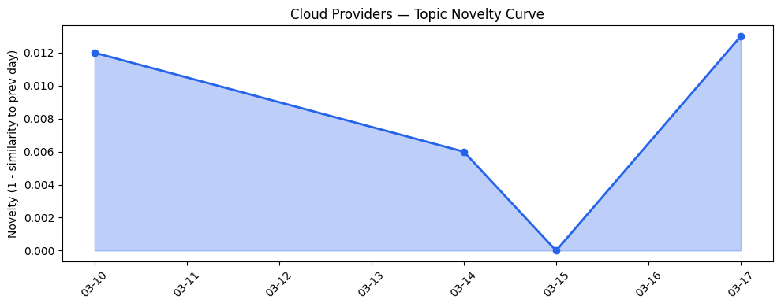
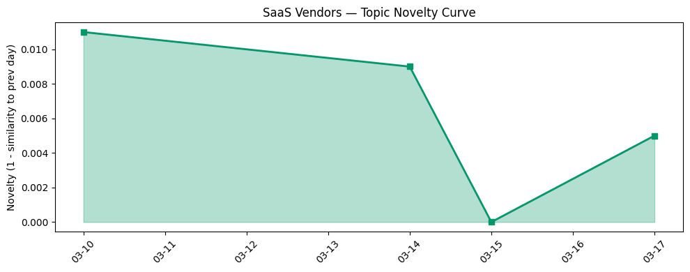

## 今日云计算结构性变化

> 今日核心判断：云厂商在AI、计算和安全领域取得重大突破，同时面临监管细化。

今天最值得注意的云计算/SaaS结构性变化是：云厂商纷纷在AI、计算和安全领域推出新服务和功能，以强化竞争优势；而监管压力同步升温，Cloudflare 对意大利监管机构的罚款提出上诉，预示合规成本将进一步上升。

- 📈 **持续趋势**：技术层、应用层和风险信号的话题向量近期持续增强（5 天内均呈递增）。
- 🆕 **新兴方向**：资本信号出现全新话题（相似度仅 0.21），可能是新兴投资方向的早期信号。
- 🔺 **突然升温**：暂无突发升温的单一方向。
- 🔑 **新关键词**：Regulation。
- 📉 **消退关键词**：无。

## 技术层信号

🔴 重大突破  

- **云原生/容器/K8s**：Google Cloud 发布多集群 GKE 推理网关，实现跨区域 AI 推理的统一调度。  
- **Serverless & AI**：Microsoft Azure 在 Foundry 平台推出 Fireworks AI，并预览 GPT‑5.4，提供低时延的开放模型推理。  
- **基础设施**：AWS、Google Cloud、Azure 均在 AI 加速器、算力网络和存储层面推出新服务，提升大模型训练与推理效率。

> 证据文章  
> - [Introducing multi-cluster GKE Inference Gateway: Scale AI workloads around the world](https://cloud.google.com/blog/products/containers-kubernetes/multi-cluster-gke-inference-gateway-helps-scale-ai-workloads/) — Google Cloud Blog  
> - [Introducing Fireworks AI on Microsoft Foundry: Bringing high performance, low latency open model inference to Azure](https://azure.microsoft.com/en-us/blog/introducing-fireworks-ai-on-microsoft-foundry-bringing-high-performance-low-latency-open-model-inference-to-azure/) — Microsoft Azure Blog  
> - [Introducing account regional namespaces for Amazon S3 general purpose buckets](https://aws.amazon.com/blogs/aws/introducing-account-regional-namespaces-for-amazon-s3-general-purpose-buckets/) — AWS Blog  

## 产业资本信号

🟡 中等信号  

- **基础设施变化**：Google Cloud 完成对安全公司 Wiz 的收购，强化 AI 时代的身份与威胁防护能力。  
- **应用层变化**：Azure 推出面向医疗、金融、制造业的行业解决方案；Salesforce 将 Agentforce 深度集成至 Small Business 套件，提升中小企业的 AI 助手功能。  
- **资本流向**：截至目前未出现显著的融资轮、估值波动或并购交易，但趋势报告显示资本信号的向量在过去 5 天持续上升，且出现全新话题，暗示潜在的投资热点正在酝酿。

> 证据文章  
> - [Welcoming Wiz to Google Cloud: Redefining security for the AI era](https://cloud.google.com/blog/products/identity-security/google-completes-acquisition-of-wiz/) — Google Cloud Blog  
> - [Azure IaaS series: Explore new resources for building a stronger, more efficient infrastructure](https://azure.microsoft.com/en-us/blog/azure-iaas-series-explore-new-resources-for-building-a-stronger-more-efficient-infrastructure/) — Microsoft Azure Blog  
> - [Agentforce for Small Business is Now Built Into Salesforce Suites](https://www.salesforce.com/blog/agentforce-in-salesforce-suites/) — Salesforce Blog  

## 潜在拐点判断

**拐点**：AI 与安全能力的快速叠加可能触发云计算产业格局的质变。  
- **依据**：技术层的重大突破、应用层的行业化落地以及资本信号的持续增强与新兴话题出现。  
- **可能影响**：  
  1. 大模型推理成本下降，促使更多企业上云并采用生成式 AI。  
  2. 安全合规成为竞争壁垒，拥有完整安全生态的厂商将获得更高的市场份额。  
  3. 资本对 AI 安全相关项目的投入将加速，形成新的投融资热点。

若上述趋势继续强化，预计在下半年出现“AI‑Security 双轮驱动” 的行业拐点。

## 明日观察点

1. **AI 计算服务的进一步迭代**：关注 AWS、Google Cloud、Azure 是否发布新一代加速器或模型服务。判断依据：官方博客、产品发布会、技术预览文档。  
2. **监管动态**：监测欧盟、美国及亚洲主要监管机构对云服务的合规要求变化，尤其是数据主权与内容审查。判断依据：监管公告、行业评论。  
3. **资本流向细分**：留意是否出现针对 AI 安全、模型治理或行业 AI 解决方案的融资或并购。判断依据：融资数据库、并购公告。

## 长期趋势坐标

- **技术层**：连续 5 天的向量上升表明 AI 与底层算力的融合正进入加速期，属于“技术深化”阶段。  
- **应用层**：行业化 AI 解决方案的快速落地显示 SaaS 正在从功能层向业务层渗透。  
- **资本层**：新兴话题的出现与持续增强暗示资本正从传统 IaaS 向 AI‑Security 细分领域倾斜。  

整体来看，今日的“延续”话题演化（cloud_topic_novelty 0.016、saas_topic_novelty 0.009）说明行业整体仍在既有轨道上深化，但在 AI 与安全交叉点出现了突破性信号，预示着下一阶段的结构性转变。

## 数据洞察

1. **云厂商话题演化**  
   - **novelty_score**：0.016（低），表明云厂商整体话题与历史高度相似，属于「延续」状态。  
   - **trend**：延续。  

2. **SaaS 厂商话题演化**  
   - **novelty_score**：0.009（更低），同样呈「延续」趋势。  

3. **趋势图**  
     
     

## 参考来源

**云厂商**  
- [Introducing multi-cluster GKE Inference Gateway: Scale AI workloads around the world](https://cloud.google.com/blog/products/containers-kubernetes/multi-cluster-gke-inference-gateway-helps-scale-ai-workloads/) — Google Cloud Blog  
- [Introducing Fireworks AI on Microsoft Foundry: Bringing high performance, low latency open model inference to Azure](https://azure.microsoft.com/en-us/blog/introducing-fireworks-ai-on-microsoft-foundry-bringing-high-performance-low-latency-open-model-inference-to-azure/) — Microsoft Azure Blog  
- [Introducing account regional namespaces for Amazon S3 general purpose buckets](https://aws.amazon.com/blogs/aws/introducing-account-regional-namespaces-for-amazon-s3-general-purpose-buckets/) — AWS Blog  
- [Welcoming Wiz to Google Cloud: Redefining security for the AI era](https://cloud.google.com/blog/products/identity-security/google-completes-acquisition-of-wiz/) — Google Cloud Blog  
- [Azure IaaS series: Explore new resources for building a stronger, more efficient infrastructure](https://azure.microsoft.com/en-us/blog/azure-iaas-series-explore-new-resources-for-building-a-stronger-more-efficient-infrastructure/) — Microsoft Azure Blog  

**SaaS厂商**  
- [Agentforce for Small Business is Now Built Into Salesforce Suites](https://www.salesforce.com/blog/agentforce-in-salesforce-suites/) — Salesforce Blog  

**行业资讯 / 风险**  
- [Standing up for the open Internet: why we appealed Italy’s "Piracy Shield" fine](https://blog.cloudflare.com/standing-up-for-the-open-internet/) — Cloudflare Blog  