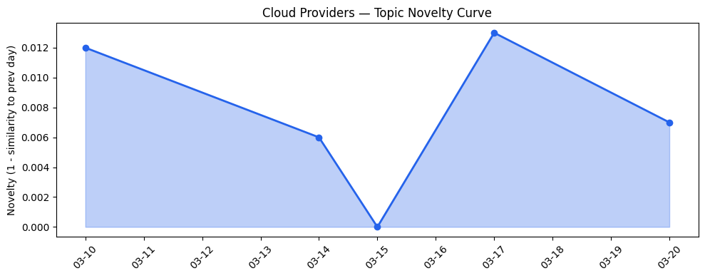
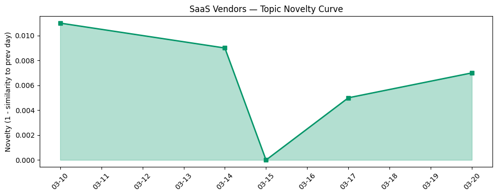

# 今日云计算结构性变化

> AI Agent架构从概念验证走向企业级规模化部署，同时主权云能力突破标志云计算进入智能驱动与合规增强的新范式。

今天云计算产业最显著的结构性变化是AI Agent架构正式跨越技术概念阶段，通过Google Cloud的GKE Inference Gateway、AWS OpenClaw等产品实现全球规模化部署能力。这意味着云厂商正在将AI从工具层升级为基础设施层，同时主权云和空间数据中心等创新正在重塑全球算力分布格局。这种双重演进标志着云计算从资源供给模式向智能驱动模式的根本转变。

- 📈 **持续趋势**：技术层、应用层、资本信号、风险信号已连续6天增强
- 🆕 **新兴方向**：AI Agent、主权云、空间数据中心、分布式AI架构
- 🔑 **新关键词**：GKE Inference Gateway、Agentic Architecture、多云安全、现代化改造

# 技术层信号

🔴 重大突破

云原生AI架构迎来分水岭时刻。Google Cloud推出的[多集群GKE Inference Gateway](https://cloud.google.com/blog/products/containers-kubernetes/multi-cluster-gke-inference-gateway-helps-scale-ai-workloads/)实现了AI工作负载的全球规模化部署，标志着容器化AI推理从单集群走向多云多区域协同。AWS和火山引擎的OpenClaw生态成熟，使AI代理架构进入企业级应用阶段。同时，Cloudflare Workers AI支持大型模型Kimi K2.5并优化推理堆栈，Azure集成Fireworks AI提供高性能开源模型推理，形成了完整的AI推理基础设施栈。这种技术突破意味着云计算正在从"AI ready"向"AI native"演进，AI能力成为云原生的核心组件而非附加功能。

# 产业资本信号

🟡 中等信号

资本流向显示AI应用层投资持续活跃，但基础设施投资呈现战略重构特征。Strella完成1400万美元A轮融资，Amazon和Chobani采用其AI访谈技术，验证了AI驱动客户研究领域的商业化前景。大厂战略合作深化，Google Cloud与NVIDIA扩大AI基础设施合作，微软推进Copilot能力扩展。更值得注意的是，Blue Origin宣布进入空间数据中心领域，Project Sunrise计划部署5万颗卫星进行轨道高性能计算，这标志着算力供应开始向太空扩展，可能重构全球数据中心地理分布。主权云能力的增强也反映了资本向合规和地缘政治韧性基础设施的倾斜。

# 潜在拐点判断

今日观察到两个潜在拐点信号：**AI Agent架构规模化拐点**和**主权云能力质变拐点**。

AI Agent架构拐点的依据是：技术层出现多厂商协同突破（Google、AWS、火山引擎、Cloudflare均推出成熟产品），应用层在零售、医疗、金融等垂直行业深度渗透，且趋势报告显示技术层和应用层话题连续6天增强。如果这一拐点成立，意味着企业AI应用将从单点工具进入系统级智能代理时代。

主权云能力拐点的标志是微软主权云新增断开连接操作能力和大型AI模型支持，Cloudflare推出自定义区域功能实现精确地理边界控制。结合地缘政治风险上升趋势，这可能推动主权云从合规需求项变为核心竞争力。

# 明日观察点

1. **AI Agent跨云互操作性**：关注各厂商OpenClaw实现是否开始形成标准接口，判断分布式AI架构是否会引发新一轮云锁定的担忧
2. **主权云商业模式验证**：观察大型企业采用断开连接主权云的案例，判断这一能力是否真正解决合规痛点还是技术炫耀
3. **空间数据中心可行性**：跟踪Blue Origin项目细节，评估轨道计算在延迟、成本、可靠性方面的实际竞争力

# 长期趋势坐标

今日信号在云计算向"智能基础设施"演进的大图中处于关键节点。数据洞察显示云厂商话题演化趋势为"延续"（新颖度0.017），SaaS厂商同样为"延续"（新颖度0.012），表明当前变化是在既有AI和云原生方向上的深化而非颠覆。但这种延续性积累正在引发质变——AI从应用层下沉到基础设施层，合规要求从边界防护升级为架构级设计。产业正在从"云上AI"向"AI定义云"过渡，智能能力和数据主权成为新的竞争维度。

# 数据洞察

**云厂商话题演化**：今日云厂商内容新颖度得分0.017，与历史5天平均相似度0.983，趋势为"延续"。这表明云厂商讨论仍在既有AI和基础设施方向深化，但技术实现层面有重要突破。

**SaaS厂商话题演化**：SaaS厂商新颖度得分0.012，平均相似度0.988，同样呈现"延续"态势。SaaS层正在吸收云厂商的AI能力，将其转化为垂直行业解决方案。

# 参考来源

**云厂商**
- [Introducing multi-cluster GKE Inference Gateway: Scale AI workloads around the world](https://cloud.google.com/blog/products/containers-kubernetes/multi-cluster-gke-inference-gateway-helps-scale-ai-workloads/) — Google Cloud Blog
- [Building Distributed AI Agents](https://cloud.google.com/blog/topics/developers-practitioners/building-distributed-ai-agents/) — Google Cloud Blog
- [Introducing OpenClaw on Amazon Lightsail to run your autonomous private AI agents](https://aws.amazon.com/blogs/aws/introducing-openclaw-on-amazon-lightsail-to-run-your-autonomous-private-ai-agents/) — AWS Blog
- [Powering the agents: Workers AI now runs large models, starting with Kimi K2.5](https://blog.cloudflare.com/workers-ai-large-models/) — Cloudflare Blog
- [Introducing Fireworks AI on Microsoft Foundry](https://azure.microsoft.com/en-us/blog/introducing-fireworks-ai-on-microsoft-foundry-bringing-high-performance-low-latency-open-model-inference-to-azure/) — Microsoft Azure Blog
- [Transform live video for mobile audiences with AWS Elemental Inference](https://aws.amazon.com/blogs/aws/transform-live-video-for-mobile-audiences-with-aws-elemental-inference/) — AWS Blog
- [Slashing agent token costs by 98% with RFC 9457-compliant error responses](https://blog.cloudflare.com/rfc-9457-agent-error-pages/) — Cloudflare Blog
- [BigQuery Studio is more useful than ever, with enhanced Gemini assistant](https://cloud.google.com/blog/products/data-analytics/gemini-supercharges-the-bigquery-studio-assistant/) — Google Cloud Blog
- [Introducing account regional namespaces for Amazon S3 general purpose buckets](https://aws.amazon.com/blogs/aws/introducing-account-regional-namespaces-for-amazon-s3-general-purpose-buckets/) — AWS Blog
- [Introducing Custom Regions for precision data control](https://blog.cloudflare.com/custom-regions/) — Cloudflare Blog
- [Microsoft Sovereign Cloud adds governance, productivity, and support for large AI models securely running even when completely disconnected](http://aka.ms/MicrosoftSovereignCloudDisconnectedBlog) — Microsoft Azure Blog
- [Google Cloud and NVIDIA expand AI innovation across industries at GTC 2026](https://cloud.google.com/blog/products/compute/google-cloud-ai-infrastructure-at-nvidia-gtc-2026/) — Google Cloud Blog
- [The Proliferation of DarkSword: iOS Exploit Chain Adopted by Multiple Threat Actors](https://cloud.google.com/blog/topics/threat-intelligence/darksword-ios-exploit-chain/) — Google Cloud Blog
- [Standing up for the open Internet: why we appealed Italy's "Piracy Shield" fine](https://blog.cloudflare.com/standing-up-for-the-open-internet/) — Cloudflare Blog
- [Investigating multi-vector attacks in Log Explorer](https://blog.cloudflare.com/investigating-multi-vector-attacks-in-log-explorer/) — Cloudflare Blog

**SaaS厂商**
- [Modernizing regulated industries with cloud and agentic AI](https://www.microsoft.com/en-us/industry/blog/general/2026/03/11/modernizing-regulated-industries-with-cloud-and-agentic-ai/) — Microsoft Azure Blog
- [Many agents, one team: Scaling modernization on Azure](https://azure.microsoft.com/en-us/blog/many-agents-one-team-scaling-modernization-on-azure/) — Microsoft Azure Blog
- [Small Team, Big Game: How We Built Mr. Beast's AI-Powered Puzzle in 27 Days](https://www.salesforce.com/blog/small-team-big-game/) — Salesforce Blog
- [WordPress.com now lets AI agents write and publish posts, and more](https://techcrunch.com/2026/03/20/wordpress-com-now-lets-ai-agents-write-and-publish-posts-and-more/) — TechCrunch
- [ArkClaw x 飞书，唤醒你的龙虾助理](https://developer.volcengine.com/articles/7615509894233325614) — 火山引擎 Blog
- [Deciphering Customer Signals and Bridging Retail's Loyalty Gap with Agentic AI](https://www.salesforce.com/blog/bridging-the-retail-loyalty-gap-with-agentic-ai/) — Salesforce Blog
- [The economics of enterprise AI: What the Forrester TEI study reveals about Microsoft Foundry](https://azure.microsoft.com/en-us/blog/the-economics-of-enterprise-ai-what-the-forrester-tei-study-reveals-about-microsoft-foundry/) — Microsoft Azure Blog
- [Where to Start with AI: A Practical Guide for GTM Teams](https://blog.hubspot.com/marketing/where-to-start-with-ai-gtm) — HubSpot Blog
- [Unpacking your top questions on agentic AI: The Shift podcast](https://azure.microsoft.com/en-us/blog/unpacking-your-top-questions-on-agentic-ai-the-shift-podcast/) — Microsoft Azure Blog
- [OpenClaw 多 Agent 实战：从零搭建 AI 开发团队](https://developer.volcengine.com/articles/7617825213975920703) — 火山引擎 Blog
- [OpenClaw报API Rate Limit Reached 如何排查？](https://developer.volcengine.com/articles/7618480646865682473) — 火山引擎 Blog

**行业资讯**
- [Jeff Bezos' Blue Origin enters the space data center game](https://techcrunch.com/2026/03/20/jeff-bezos-blue-origin-enters-the-space-data-center-game/) — TechCrunch
- [Amazon and Chobani adopt Strella's AI interviews for customer research as fast-growing startup raises $14M](https://venturebeat.com/technology/amazon-and-chobani-adopt-strellas-ai-interviews-for-customer-research-as) — VentureBeat Enterprise
- [Microsoft’s Copilot can now build apps and automate your job — here’s how it works](https://venturebeat.com/technology/microsofts-copilot-can-now-build-apps-and-automate-your-job-heres-how-it) — VentureBeat Enterprise
- [Trump's AI framework targets state laws, shifts child safety burden to parents](https://techcrunch.com/2026/03/20/trumps-ai-framework-targets-state-laws-shifts-child-safety-burden-to-parents/) — TechCrunch
- [A French Navy officer accidentally leaked the location of an aircraft carrier by logging his run on Strava](https://techcrunch.com/2026/03/20/a-french-navy-officer-accidentally-leaked-the-location-of-an-aircraft-carrier-by-logging-his-run-on-strava/) — TechCrunch
- [Kai-Fu Lee's brutal assessment: America is already losing the AI hardware war to China](https://venturebeat.com/infrastructure/kai-fu-lees-brutal-assessment-america-is-already-losing-the-ai-hardware-war) — VentureBeat Enterprise