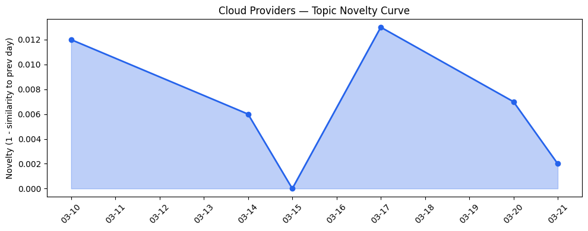
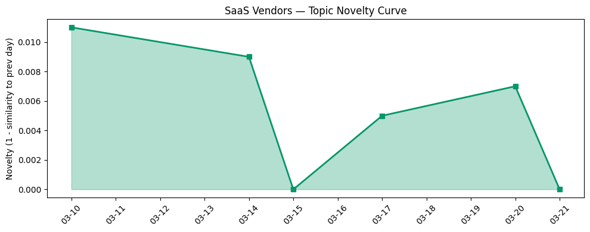

# 今日云计算结构性变化

> Google Cloud多集群GKE推理网关与微软Agentic云运营模式标志AI基础设施进入规模化自主管理新阶段。

今日云计算产业最显著的结构性变化是AI基础设施正从单点能力建设转向全局智能调度。Google Cloud的[多集群GKE推理网关](https://cloud.google.com/blog/products/containers-kubernetes/multi-cluster-gke-inference-gateway-helps-scale-ai-workloads/)实现了AI工作负载的全球扩展能力，而微软的[Agentic云运营模式](https://azure.microsoft.com/en-us/blog/agentic-cloud-operations-a-new-way-to-run-the-cloud/)则标志着云管理向自主决策演进。这意味着云厂商不再仅仅提供算力，而是构建能够自我优化的智能基础设施层。

- 📈 **持续趋势**：技术层话题已连续7天增强
- 🔺 **突然升温**：资本信号、基础设施近3天突然集中出现
- 🔑 **新关键词**：AI基础设施、Agentic Cloud Operations、多集群推理网关、Sovereign Cloud

# 技术层信号
🔴 重大突破

云原生AI架构今日迎来质变：多集群推理、Agentic运营与安全智能三大方向同步突破。Google Cloud的[多集群GKE推理网关](https://cloud.google.com/blog/products/containers-kubernetes/multi-cluster-gke-inference-gateway-helps-scale-ai-workloads/)解决了AI工作负载的全球调度难题，微软的Agentic运营模式则让AI代理自主管理基础设施，而Cloudflare的[Workers AI支持大型模型](https://blog.cloudflare.com/workers-ai-large-models/)并将token成本降低98%。这标志着云原生AI从技术演示进入规模化生产阶段。

AWS通过[OpenClaw on Lightsail](https://aws.amazon.com/blogs/aws/introducing-openclaw-on-amazon-lightsail-to-run-your-autonomous-private-ai-agents/)布局私有AI代理，火山引擎的[OpenClaw与豆包模型集成](https://developer.volcengine.com/articles/7615547765435432996)显示中国厂商的快速跟进。技术层连续7天的增强趋势验证了这一突破的持续性。

# 产业资本信号
🟡 中等信号

资本明显向AI基础设施和应用层双向流动。AI初创公司Strella完成[1400万美元A轮融资](https://venturebeat.com/technology/amazon-and-chobani-adopt-strellas-ai-interviews-for-customer-research-as)，其AI访谈技术被Amazon和Chobani采用，显示企业级AI工具获得市场验证。Google Cloud与NVIDIA在[GTC 2026深化合作](https://cloud.google.com/blog/products/compute/google-cloud-ai-infrastructure-at-nvidia-gtc-2026/)，微软[Copilot功能扩展](https://venturebeat.com/technology/microsofts-copilot-can-now-build-apps-and-automate-your-job-heres-how-it)显示大厂在AI自动化领域持续投入。

基础设施层面，Cloudflare推出[自定义区域](https://blog.cloudflare.com/custom-regions/)支持精确地理边界控制，应对数据主权需求。资本信号近3天的突然增强表明投资者对AI基础设施成熟度的信心提升。

# 潜在拐点判断

今日观察到AI基础设施管理的拐点信号：从人工运维向自主运营转变。微软的Agentic云运营模式结合Google的多集群推理网关，标志着云管理即将进入"设置目标，自动执行"的新阶段。依据是技术层连续7天增强与资本突然集中投入的双重验证。

如果这一拐点成立，影响将是深远的：企业云团队将从技术运维转向业务目标定义，云厂商的竞争焦点将从算力价格转向智能调度效率。Cloudflare将token成本降低98%的技术突破进一步加速了这一趋势。

# 明日观察点

1. **AI代理跨云调度能力**：关注各大云厂商是否推出类似多集群推理网关的标准化接口，判断AI工作负载能否实现真正的多云部署。
2. **主权云合规实践**：观察微软[Sovereign Cloud](http://aka.ms/MicrosoftSovereignCloudDisconnectedBlog)在大型AI模型场景下的落地案例，判断数据主权与AI算力的平衡点。
3. **AI安全标准化**：跟踪Cloudflare[AI Security for Apps](https://blog.cloudflare.com/ai-security-for-apps-ga/)的市场接受度，评估企业级AI应用的安全基线要求。

# 长期趋势坐标

今日信号在云计算产业演进中处于AI原生基础设施的建设中期。云厂商话题演化呈现"延续"态势（新颖度0.016），表明当前创新是在既有云原生架构上的深化而非颠覆。SaaS厂商同样保持延续（新颖度0.011），显示应用层正在消化基础设施能力。

从月度视角看，AI基础设施正从"有AI能力"向"是AI系统"转变。多集群推理、Agentic运营等新关键词的出现，标志着云计算产业开始解决AI规模化部署的实际工程问题，而非仅仅堆砌算力。

# 数据洞察

**云厂商话题演化**
今日云厂商内容与历史高度延续（相似度0.984），新颖度评分0.016。表明云厂商在既有AI基础设施方向上进行深度优化，而非开辟全新赛道。多集群推理网关和Agentic运营都是在容器化、Serverless等成熟技术上的AI化升级。

**SaaS厂商话题演化**  
SaaS厂商同样呈现延续态势（相似度0.989），新颖度0.011。Salesforce的零售AI代理、微软Foundry的文档AI等应用都在既有的SaaS工作流中融入AI能力，显示应用层正在系统化吸收基础设施创新。

# 参考来源

**云厂商**
- [Introducing multi-cluster GKE Inference Gateway: Scale AI workloads around the world](https://cloud.google.com/blog/products/containers-kubernetes/multi-cluster-gke-inference-gateway-helps-scale-ai-workloads/) — Google Cloud Blog
- [Agentic cloud operations: A new way to run the cloud](https://azure.microsoft.com/en-us/blog/agentic-cloud-operations-a-new-way-to-run-the-cloud/) — Microsoft Azure Blog
- [Powering the agents: Workers AI now runs large models, starting with Kimi K2.5](https://blog.cloudflare.com/workers-ai-large-models/) — Cloudflare Blog
- [Introducing OpenClaw on Amazon Lightsail to run your autonomous private AI agents](https://aws.amazon.com/blogs/aws/introducing-openclaw-on-amazon-lightsail-to-run-your-autonomous-private-ai-agents/) — AWS Blog
- [Next-gen caching with Memorystore for Valkey 9.0, now GA](https://cloud.google.com/blog/products/databases/memorystore-for-valkey-9-0-is-now-ga/) — Google Cloud Blog
- [Building Distributed AI Agents](https://cloud.google.com/blog/topics/developers-practitioners/building-distributed-ai-agents/) — Google Cloud Blog
- [Investigating multi-vector attacks in Log Explorer](https://blog.cloudflare.com/investigating-multi-vector-attacks-in-log-explorer/) — Cloudflare Blog
- [Slashing agent token costs by 98% with RFC 9457-compliant error responses](https://blog.cloudflare.com/rfc-9457-agent-error-pages/) — Cloudflare Blog
- [Introducing account regional namespaces for Amazon S3 general purpose buckets](https://aws.amazon.com/blogs/aws/introducing-account-regional-namespaces-for-amazon-s3-general-purpose-buckets/) — AWS Blog
- [OpenClaw × 豆包模型：构建图像与视频生成 Skills 实践](https://developer.volcengine.com/articles/7615547765435432996) — 火山引擎 Blog
- [Introducing Custom Regions for precision data control](https://blog.cloudflare.com/custom-regions/) — Cloudflare Blog
- [Google Cloud and NVIDIA expand AI innovation across industries at GTC 2026](https://cloud.google.com/blog/products/compute/google-cloud-ai-infrastructure-at-nvidia-gtc-2026/) — Google Cloud Blog
- [Azure IaaS series: Explore new resources for building a stronger, more efficient infrastructure](https://azure.microsoft.com/en-us/blog/azure-iaas-series-explore-new-resources-for-building-a-stronger-more-efficient-infrastructure/) — Microsoft Azure Blog
- [Can high-temperature superconductors transform the power infrastructure of datacenters?](https://azure.microsoft.com/en-us/blog/can-high-temperature-superconductors-transform-the-power-infrastructure-of-datacenters/) — Microsoft Azure Blog
- [Introducing Budget Bytes: Build powerful AI apps for under $25](https://devblogs.microsoft.com/azure-sql/introducing-budget-bytes/) — Microsoft Azure Blog
- [Standing up for the open Internet: why we appealed Italy's "Piracy Shield" fine](https://blog.cloudflare.com/standing-up-for-the-open-internet/) — Cloudflare Blog
- [AI Security for Apps is now generally available](https://blog.cloudflare.com/ai-security-for-apps-ga/) — Cloudflare Blog
- [Announcing Cloudflare Account Abuse Protection: prevent fraudulent attacks from bots and humans](https://blog.cloudflare.com/account-abuse-protection/) — Cloudflare Blog
- [The Proliferation of DarkSword: iOS Exploit Chain Adopted by Multiple Threat Actors](https://cloud.google.com/blog/topics/threat-intelligence/darksword-ios-exploit-chain/) — Google Cloud Blog
- [Microsoft Sovereign Cloud adds governance, productivity, and support for large AI models securely running even when completely disconnected](http://aka.ms/MicrosoftSovereignCloudDisconnectedBlog) — Microsoft Azure Blog

**SaaS厂商**
- [Deciphering Customer Signals and Bridging Retail’s Loyalty Gap with Agentic AI](https://www.salesforce.com/blog/bridging-the-retail-loyalty-gap-with-agentic-ai/) — Salesforce Blog
- [Unlocking document understanding with Mistral Document AI in Microsoft Foundry](https://techcommunity.microsoft.com/blog/azure-ai-foundry-blog/unlocking-document-understanding-with-mistral-document-ai-in-microsoft-foundry/4495664) — Microsoft Azure Blog
- [The data behind the design: How Pantone built agentic AI with an AI-ready database](https://azure.microsoft.com/en-us/blog/the-data-behind-the-design-how-pantone-built-agentic-ai-with-an-ai-ready-database/) — Microsoft Azure Blog
- [Small Team, Big Game: How We Built Mr. Beast’s AI-Powered Puzzle in 27 Days](https://www.salesforce.com/blog/small-team-big-game/) — Salesforce Blog
- [OpenClaw进阶配置指南：在飞书打造你的AI员工团队](https://developer.volcengine.com/articles/7618114640601759790) — 火山引擎 Blog

**行业资讯**
- [Kai-Fu Lee's brutal assessment: America is already losing the AI hardware war to China](https://venturebeat.com/infrastructure/kai-fu-lees-brutal-assessment-america-is-already-losing-the-ai-hardware-war) — VentureBeat Enterprise
- [Inside LinkedIn’s generative AI cookbook: How it scaled people search to 1.3 billion users](https://venturebeat.com/infrastructure/inside-linkedins-generative-ai-cookbook-how-it-scaled-people-search-to-1-3) — VentureBeat Enterprise
- [Amazon and Chobani adopt Strella's AI interviews for customer research as fast-growing startup raises $14M](https://venturebeat.com/technology/amazon-and-chobani-adopt-strellas-ai-interviews-for-customer-research-as) — VentureBeat Enterprise
- [Microsoft’s Copilot can now build apps and automate your job — here’s how it works](https://venturebeat.com/technology/microsofts-copilot-can-now-build-apps-and-automate-your-job-heres-how-it) — VentureBeat Enterprise
- [How Anthropic’s ‘Skills’ make Claude faster, cheaper, and more consistent for business workflows](https://venturebeat.com/technology/how-anthropics-skills-make-claude-faster-cheaper-and-more-consistent-for) — VentureBeat Enterprise
- [Delve accused of misleading customers with ‘fake compliance’](https://techcrunch.com/2026/03/21/delve-accused-of-misleading-customers-with-fake-compliance/) — TechCrunch
- [Publisher pulls horror novel ‘Shy Girl’ over AI concerns](https://techcrunch.com/2026/03/21/publisher-pulls-horror-novel-shy-girl-over-ai-concerns/) — TechCrunch
- [Tokenization takes the lead in the fight for data security](https://venturebeat.com/technology/tokenization-takes-the-lead-in-the-fight-for-data-security) — VentureBeat Enterprise
- [From legacy architecture to Cloudflare One](https://blog.cloudflare.com/legacy-to-agile-sase/) — Cloudflare Blog
- [Translating risk insights into actionable protection: leveling up security posture with Cloudflare and Mastercard](https://blog.cloudflare.com/attack-surface-intelligence/) — Cloudflare Blog
- [OpenClaw报API Rate Limit Reached 如何排查？（CodingPlan版)](https://developer.volcengine.com/articles/7618480646865682473) — 火山引擎 Blog