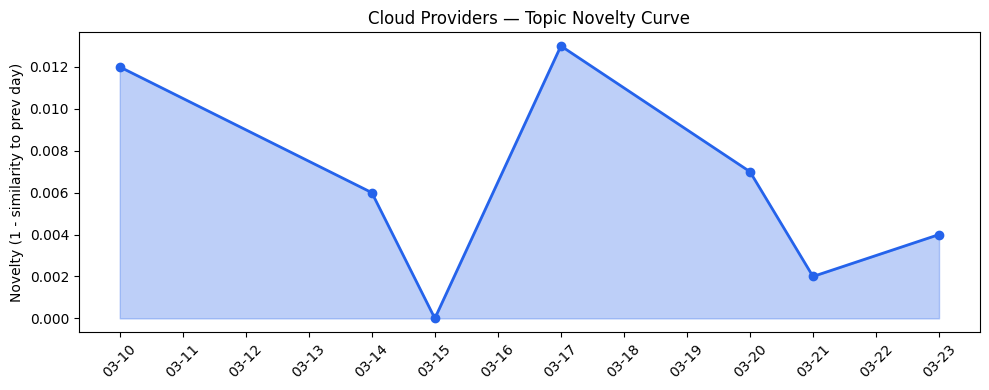
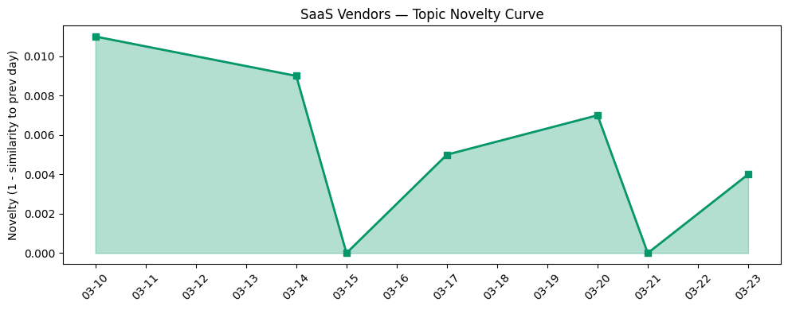

```
---
title: "云厂商加速AI基础设施军备竞赛，智能代理与安全成为差异化竞争新焦点"
date: 2026-03-23
tags: [AI基础设施, Agentic AI, 多云架构, 云原生AI, AI安全]
---

# 今日云计算结构性变化

> 云厂商正从基础设施提供商向AI应用生态构建者转型，通过专用AI芯片、分布式架构和安全工具链升级，推动Agentic AI在垂直行业规模化落地。

今日最显著的结构性变化是云厂商在AI基础设施领域的竞争已从通用算力转向专用化、场景化的智能代理生态构建。Google Cloud推出多集群GKE推理网关，AWS发布OpenClaw on Amazon Lightsail，Cloudflare优化AI代理交互效率，显示云厂商正在为Agentic AI的大规模部署构建底层支撑能力。这意味着云计算竞争焦点正从"谁有更多算力"转向"谁能更好地支撑智能应用落地"。

- 📈 **持续趋势**：技术层话题已连续8天增强
- 🔺 **突然升温**：技术层、资本信号、风险信号近3天突然集中出现
- 🆕 **新兴方向**：Agentic AI、多云架构、智能办公、生成式AI、边缘计算
- 🔑 **新关键词**：Agentic AI, 多云架构, 智能办公

# 技术层信号
🔴 重大突破

云原生AI架构迎来重大突破，核心变化体现在分布式推理架构的成熟和专用AI芯片的差异化竞争。Google Cloud的[多集群GKE推理网关](https://cloud.google.com/blog/products/containers-kubernetes/multi-cluster-gke-inference-gateway-helps-scale-ai-workloads/)实现了跨集群AI工作负载调度，AWS的[OpenClaw on Amazon Lightsail](https://aws.amazon.com/blogs/aws/introducing-openclaw-on-amazon-lightsail-to-run-your-autonomous-private-ai-agents/)则专注于私有AI代理部署，标志着云原生AI从实验阶段进入规模化部署阶段。同时，Google Cloud发布专门针对万亿参数模型训练的[Ironwood TPU](https://cloud.google.com/blog/products/compute/training-large-models-on-ironwood-tpus/)，Cloudflare Gen13服务器性能提升2倍，显示专用AI硬件竞赛白热化。

# 产业资本信号
🟡 中等信号

资本流向显示AI基础设施和应用层同时获得关注。Zipline获得[2亿美元融资](https://techcrunch.com/2026/03/23/zipline-snaps-up-another-200m-to-fuel-its-drone-delivery-expansion/)扩展无人机配送，Gimlet Labs获8000万美元A轮融资解决AI推理瓶颈，表明资本正投向AI的实际落地场景。基础设施层面，微软与NVIDIA深度合作推出[Microsoft Foundry和Azure AI基础设施新解决方案](https://blogs.microsoft.com/blog/2026/03/16/microsoft-at-nvidia-gtc-new-solutions-for-microsoft-foundry-azure-ai-infrastructure-and-physical-ai/)，Google持续投资TPU生态，大厂在AI硬件领域的战略布局加速。

# 潜在拐点判断

今日观察到AI代理规模化部署的拐点信号。依据是：技术层连续8天增强，多家云厂商同时推出面向Agentic AI的专用基础设施（Google多集群推理网关、AWS OpenClaw、Cloudflare AI代理优化），且应用层出现[Salesforce在零售行业](https://www.salesforce.com/blog/bridging-the-retail-loyalty-gap-with-agentic-ai/)和[Azure在受监管行业](https://www.microsoft.com/en-us/industry/blog/general/2026/03/11/modernizing-regulated-industries-with-cloud-and-agentic-ai/)的规模化案例。如果这一趋势持续，将意味着AI从工具性应用向自主代理系统演进，云厂商的竞争维度将从IaaS能力转向AI生态完整性。

# 明日观察点

1. **AI代理部署成本优化**：关注Cloudflare通过RFC 9457实现的[98%成本削减](https://blog.cloudflare.com/rfc-9457-agent-error-pages/)是否成为行业标准，其他云厂商是否会跟进类似优化
2. **专用AI芯片落地进度**：观察Google Ironwood TPU和Cloudflare Gen13服务器的实际性能数据，判断专用硬件对模型训练和推理的实际提升效果
3. **垂直行业AI代理案例**：跟踪Salesforce零售AI代理和Azure行业解决方案的客户采用情况，验证Agentic AI在具体业务场景的价值

# 长期趋势坐标

今日信号在云计算向AI原生架构转型的大趋势中处于关键节点。云厂商话题延续性得分0.98（7日均值），SaaS话题延续性0.987，表明产业正在既有AI方向上深化而非转向。新兴的Agentic AI、多云架构等关键词显示，云计算竞争正从基础设施层向上延伸到应用生态层，未来云厂商的价值将更多体现在能否为智能应用提供端到端的支撑能力。

# 数据洞察

**云厂商话题演化**
今日云厂商内容新颖度得分0.02，与历史相似度达0.98，趋势为"延续"。表明云厂商仍在既有AI基础设施方向上深化，话题连续性较强。

**SaaS厂商话题演化**  
SaaS厂商新颖度得分0.013，相似度0.987，同样呈现"延续"态势。SaaS厂商正将AI能力深度集成到现有产品矩阵中。

**趋势图**



# 参考来源

**云厂商**
- [Introducing multi-cluster GKE Inference Gateway: Scale AI workloads around the world](https://cloud.google.com/blog/products/containers-kubernetes/multi-cluster-gke-inference-gateway-helps-scale-ai-workloads/) — Google Cloud Blog
- [A developer’s guide to training with Ironwood TPUs](https://cloud.google.com/blog/products/compute/training-large-models-on-ironwood-tpus/) — Google Cloud Blog
- [Introducing OpenClaw on Amazon Lightsail to run your autonomous private AI agents](https://aws.amazon.com/blogs/aws/introducing-openclaw-on-amazon-lightsail-to-run-your-autonomous-private-ai-agents/) — AWS Blog
- [Launching Cloudflare’s Gen 13 servers: trading cache for cores for 2x edge compute performance](https://blog.cloudflare.com/gen13-launch/) — Cloudflare Blog
- [Slashing agent token costs by 98% with RFC 9457-compliant error responses](https://blog.cloudflare.com/rfc-9457-agent-error-pages/) — Cloudflare Blog
- [AWS Weekly Roundup: NVIDIA Nemotron 3 Super on Amazon Bedrock, Nova Forge SDK, Amazon Corretto 26, and more](https://aws.amazon.com/blogs/aws/aws-weekly-roundup-nvidia-nemotron-3-super-on-amazon-bedrock-nova-forge-sdk-amazon-corretto-26-and-more-march-23-2026/) — AWS Blog
- [Many agents, one team: Scaling modernization on Azure](https://azure.microsoft.com/en-us/blog/many-agents-one-team-scaling-modernization-on-azure/) — Microsoft Azure Blog
- [Next-gen caching with Memorystore for Valkey 9.0, now GA](https://cloud.google.com/blog/products/databases/memorystore-for-valkey-9-0-is-now-ga/) — Google Cloud Blog
- [AI Security for Apps is now generally available](https://blog.cloudflare.com/ai-security-for-apps-ga/) — Cloudflare Blog
- [Powering the agents: Workers AI now runs large models, starting with Kimi K2.5](https://blog.cloudflare.com/workers-ai-large-models/) — Cloudflare Blog
- [Microsoft at NVIDIA GTC: New solutions for Microsoft Foundry, Azure AI infrastructure and Physical AI](https://blogs.microsoft.com/blog/2026/03/16/microsoft-at-nvidia-gtc-new-solutions-for-microsoft-foundry-azure-ai-infrastructure-and-physical-ai/) — Microsoft Azure Blog
- [Introducing Custom Regions for precision data control](https://blog.cloudflare.com/custom-regions/) — Cloudflare Blog
- [Inside Gen 13: how we built our most powerful server yet](https://blog.cloudflare.com/gen13-config/) — Cloudflare Blog
- [谭待：开放云引擎，共创新未来 - 火山引擎](https://www.cnblogs.com/volcengine/p/15640981.html) — 火山引擎博客

**SaaS厂商**
- [Deciphering Customer Signals and Bridging Retail’s Loyalty Gap with Agentic AI](https://www.salesforce.com/blog/bridging-the-retail-loyalty-gap-with-agentic-ai/) — Salesforce Blog
- [Modernizing regulated industries with cloud and agentic AI](https://www.microsoft.com/en-us/industry/blog/general/2026/03/11/modernizing-regulated-industries-with-cloud-and-agentic-ai/) — Microsoft Azure Blog
- [B2C Commerce March release: Removing friction for teams behind the storefront](https://www.salesforce.com/blog/b2c-commerce-march-26-release/) — Salesforce Blog
- [Answer engine optimization case studies that prove the ROI of AEO in 2026](https://blog.hubspot.com/marketing/answer-engine-optimization-case-studies) — HubSpot Blog

**行业资讯**
- [Microsoft’s Copilot can now build apps and automate your job — here’s how it works](https://venturebeat.com/technology/microsofts-copilot-can-now-build-apps-and-automate-your-job-heres-how-it) — VentureBeat Enterprise
- [火山引擎正式推出四款数据产品 将持续完善敏捷数智引擎矩阵](https://www.cnblogs.com/volcengine/p/15640481.html) — 火山引擎博客
- [Inside LinkedIn’s generative AI cookbook: How it scaled people search to 1.3 billion users](https://venturebeat.com/infrastructure/inside-linkedins-generative-ai-cookbook-how-it-scaled-people-search-to-1-3) — VentureBeat Enterprise
- [OpenClaw进阶配置指南：在飞书打造你的AI员工团队](https://developer.volcengine.com/articles/7618114640601759790) — 火山引擎 Blog
- [ArkClaw x 飞书，唤醒你的龙虾助理](https://developer.volcengine.com/articles/7615509894233325614) — 火山引擎 Blog
- [From legacy architecture to Cloudflare One](https://blog.cloudflare.com/legacy-to-agile-sase/) — Cloudflare Blog
- [Zipline snaps up another $200M to fuel its drone delivery expansion](https://techcrunch.com/2026/03/23/zipline-snaps-up-another-200m-to-fuel-its-drone-delivery-expansion/) — TechCrunch
- [Startup Gimlet Labs is solving the AI inference bottleneck in a surprisingly elegant way](https://techcrunch.com/2026/03/23/startup-gimlet-labs-is-solving-the-ai-inference-bottleneck-in-a-surprisingly-elegant-way/) — TechCrunch
- [Amazon and Chobani adopt Strella's AI interviews for customer research as fast-growing startup raises $14M](https://venturebeat.com/technology/amazon-and-chobani-adopt-strellas-ai-interviews-for-customer-research-as) — VentureBeat Enterprise
- [Someone has publicly leaked an exploit kit that can hack millions of iPhones](https://techcrunch.com/2026/03/23/someone-has-publicly-leaked-an-exploit-kit-that-can-hack-millions-of-iphones/) — TechCrunch
- [Russian authorities block paywall removal site Archive.today](https://techcrunch.com/2026/03/23/russian-authorities-block-paywall-removal-site-archive-today/) — TechCrunch
- [The Proliferation of DarkSword: iOS Exploit Chain Adopted by Multiple Threat Actors](https://cloud.google.com/blog/topics/threat-intelligence/darksword-ios-exploit-chain/) — Google Cloud Blog
- [Standing up for the open Internet: why we appealed Italy's "Piracy Shield" fine](https://blog.cloudflare.com/standing-up-for-the-open-internet/) — Cloudflare Blog
- [Kai-Fu Lee's brutal assessment: America is already losing the AI hardware war to China](https://venturebeat.com/infrastructure/kai-fu-lees-brutal-assessment-america-is-already-losing-the-ai-hardware-war) — VentureBeat Enterprise
- [Announcing Cloudflare Account Abuse Protection: prevent fraudulent attacks from bots and humans](https://blog.cloudflare.com/account-abuse-protection/) — Cloudflare Blog
- [Investigating multi-vector attacks in Log Explorer](https://blog.cloudflare.com/investigating-multi-vector-attacks-in-log-explorer/) — Cloudflare Blog