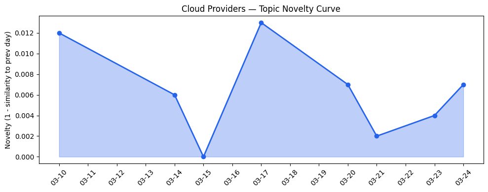
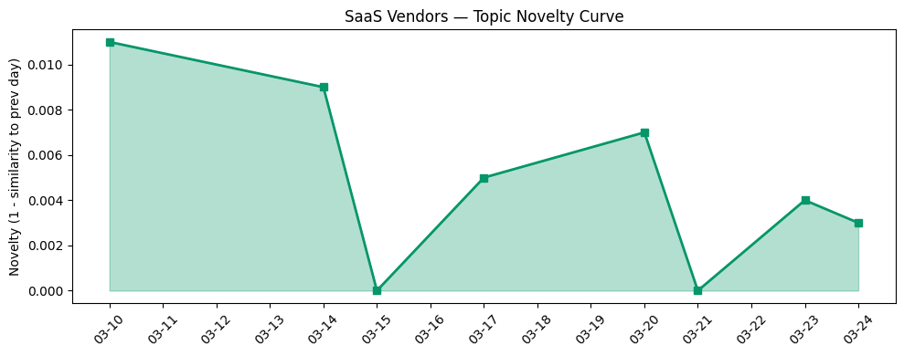

## 今日云计算结构性变化

> AI代理技术正从概念验证走向企业级规模化部署，云厂商通过基础设施深度整合、多Agent协作平台和安全防护构建，推动云计算竞争进入智能应用层。

今日云计算产业格局的核心变化在于AI Agent生态的加速成熟，标志着云计算竞争从基础设施层正式延伸至智能应用层。Google Cloud在KubeCon EU 2026展示GKE作为AI基础设施核心平台，微软推出首个端到端Agentic现代化解决方案，Cloudflare发布Dynamic Workers实现AI生成代码安全沙箱执行，这一系列动作表明云厂商正在将AI代理能力深度整合到基础设施中。这意味着云计算服务的价值主张正在从"提供算力"转向"提供智能工作流"，企业客户将能够直接在云平台上部署和管理复杂的多Agent系统。

- 📈 **持续趋势**：技术层、应用层、基础设施、资本信号、风险信号五个维度均呈现持续增强趋势
- 🆕 **新兴方向**：AI Agents、AI Governance、Microsoft Foundry等关键词首次集中出现
 gather🔺 **突然升温**：资本信号、基础设施、应用层、风险信号近3天话题相似度显著提升

## 技术层信号

🔴 重大突破

云原生与AI基础设施的融合达到新里程碑。Google Cloud在KubeCon EU 2026明确将GKE定位为AI基础设施核心平台，同时llm-d成为CNCF沙盒项目，标志着Kubernetes正式成为万亿参数AI模型的基础设施标准。这解决了AI模型部署的标准化问题，为企业级AI应用规模化铺平了道路。

微软推出的端到端Agentic现代化解决方案和Cloudflare的Dynamic Workers技术实现了AI生成代码的安全沙箱执行，速度提升100倍，解决了AI代理在生产环境中的安全性和性能瓶颈。这种技术突破使得AI代理能够安全地在企业环境中执行复杂任务，从简单的问答系统升级为能够自主操作业务系统的智能体。

基础设施层面，Cloudflare Gen13服务器采用AMD EPYC Turin处理器，边缘计算性能提升2倍，AWS推出S3账户区域命名空间功能，NVIDIA Nemotron 3 Super登陆Amazon Bedrock，显示AI基础设施正在经历系统性优化。这些技术进步共同推动云计算进入"智能应用即服务"的新阶段。

## 产业资本信号

🟡 中等信号

资本流向显示AI安全和企业级应用成为投资重点。Databricks收购两家AI安全初创公司LakeWatch和Antimatter，强化AI安全产品线，反映大厂通过并购快速补齐AI治理能力。AI访谈技术公司Strella完成1400万美元A轮融资，Amazon和Chobani采用其AI客户研究解决方案，表明企业级AI应用开始获得市场验证。

基础设施投资方面，Cloudflare推出自定义区域服务满足数据主权要求，Google Ironwood TPU支持大规模AI模型训练，微软与NVIDIA合作加强Azure AI基础设施。这些投资显示云厂商正在为AI代理的大规模部署准备算力基础，特别是在受监管行业和边缘计算场景。

应用层落地加速，微软重点推进医疗、金融、制造等受监管行业的云现代化和Agentic AI应用，Salesforce Agentforce平台在中小企业场景深化，LinkedIn将生成式AI应用于13亿用户规模的人员搜索。资本正从基础模型投资转向垂直行业解决方案和AI工作流自动化工具。

## 潜在拐点判断

今日观察到明确的产业拐点信号：AI代理技术从实验室走向企业生产环境的拐点已经到来。依据在于：技术层面实现了安全沙箱和多Agent协作的平台化能力，资本层面开始大规模投资AI安全和垂直应用，应用层面出现13亿用户级别的规模化部署案例。这个拐点意味着云计算产业竞争重心将从基础设施性能转向智能应用生态，云厂商需要提供完整的AI代理开发、部署和管理平台。

## 明日观察点

1. **关注AI安全标准的演进**：随着Databricks等厂商收购AI安全初创公司，需要观察是否会形成行业统一的安全标准和认证体系
2. **监测多Agent协作的规模化案例**：企业从单个AI代理转向多Agent系统的实际应用效果和挑战将成为判断生态成熟度的关键
3. **跟踪边缘AI代理的部署进展**：Cloudflare等边缘计算厂商的AI能力进展将决定智能应用的实时性和数据本地化能力

## 长期趋势坐标

将今日信号放到季度尺度观察，AI代理的成熟标志着云计算进入第三个发展阶段：从虚拟化基础设施（阶段1）到云原生平台（阶段2），再到智能应用平台（阶段3）。这一转变将重新定义云厂商的竞争格局，拥有强大开发生态和安全能力的厂商将获得优势。overall_novelty为0.237显示产业正在经历中度创新周期，新兴关键词集中在AI代理和治理领域，表明技术演进方向明确。

## 数据洞察

### 云厂商话题演化
今日云厂商话题新颖度得分0.021，相似度0.979，延续了过去8天的稳定趋势。46篇文章显示话题集中度较高，主要围绕AI基础设施和Agent技术的深度融合。

### SaaS厂商话题演化  
SaaS厂商话题新颖度得分0.013，相似度0.987，30篇文章显示企业级AI应用话题持续深化。Salesforce、微软等厂商在垂直行业的Agent应用成为焦点。

### 趋势图

## 参考来源

**云厂商文章**
- [The open platform for the AI era: GKE, agents, and OSS innovation at KubeCon EU 2026](https://cloud.google.com/blog/products/containers-kubernetes/gke-and-oss-innovation-at-kubecon-eu-2026/) — Google Cloud Blog
- [Kubernetes as AI Infrastructure: Google Cloud, llm-d, and the CNCF](https://cloud.google.com/blog/products/containers-kubernetes/llm-d-officially-a-cncf-sandbox-project/) — Google Cloud Blog
- [Many agents, one team: Scaling modernization on Azure](https://azure.microsoft.com/en-us/blog/many-agents-one-team-scaling-modernization-on-azure/) — Microsoft Azure Blog
- [Sandboxing AI agents, 100x faster](https://blog.cloudflare.com/dynamic-workers/) — Cloudflare Blog
- [Launching Cloudflare’s Gen 13 servers: trading cache for cores for 2x edge compute performance](https://blog.cloudflare.com/gen13-launch/) — Cloudflare Blog
- [AWS Weekly Roundup: NVIDIA Nemotron 3 Super on Amazon Bedrock, Nova Forge SDK, Amazon Corretto 26, and more](https://aws.amazon.com/blogs/aws/aws-weekly-roundup-nvidia-nemotron-3-super-on-amazon-bedrock-nova-forge-sdk-amazon-corretto-26-and-more-march-23-2026/) — AWS Blog
- [Next-gen caching with Memorystore for Valkey 9.0, now GA](https://cloud.google.com/blog/products/databases/memorystore-for-valkey-9-0-is-now-ga/) — Google Cloud Blog
- [Introducing Custom Regions for precision data control](https://blog.cloudflare.com/custom-regions/) — Cloudflare Blog
- [A developer’s guide to training with Ironwood TPUs](https://cloud.google.com/blog/products/compute/training-large-models-on-ironwood-tpus/) — Google Cloud Blog
- [Microsoft at NVIDIA GTC: New solutions for Microsoft Foundry, Azure AI infrastructure and Physical AI](https://blogs.microsoft.com/blog/2026/03/16/microsoft-at-nvidia-gtc-new-solutions-for-microsoft-foundry-azure-ai-infrastructure-and-physical-ai/) — Microsoft Azure Blog
- [Inside Gen 13: how we built our most powerful server yet](https://blog.cloudflare.com/gen13-config/) — Cloudflare Blog
- [FabCon and SQLCon 2026: Unifying databases and Fabric on a single data platform](https://azure.microsoft.com/en-us/blog/fabcon-and-sqlcon-2026-unifying-databases-and-fabric-on-a-single-data-platform/) — Microsoft Azure Blog
- [RSAC ’26: Supercharging agentic AI defense with frontline threat intelligence](https://cloud.google.com/blog/products/identity-security/rsac-26-supercharging-agentic-ai-defense-with-frontline-threat-intelligence/) — Google Cloud Blog

**SaaS厂商文章**
- [Modernizing regulated industries with cloud and agentic AI](https://www.microsoft.com/en-us/industry/blog/general/2026/03/11/modernizing-regulated-industries-with-cloud-and-agentic-ai/) — Microsoft Azure Blog
- [8 Ways Employee Agents Are Helping Small Businesses](https://www.salesforce.com/blog/employee-agents-are-helping-smbs/) — Salesforce Blog
- [火山引擎正式推出四款数据产品 将持续完善敏捷数智引擎矩阵](https://www.cnblogs.com/volcengine/p/15640481.html) — 火山引擎博客
- [ArkClaw x 飞书，唤醒你的龙虾助理](https://developer.volcengine.com/articles/7615509894233325614) — 火山引擎 Blog

**行业资讯**
- [Inside LinkedIn’s generative AI cookbook: How it scaled people search to 1.3 billion users](https://venturebeat.com/infrastructure/inside-linkedins-generative-ai-cookbook-how-it-scaled-people-search-to-1-3) — VentureBeat Enterprise
- [How Anthropic’s ‘Skills’ make Claude faster, cheaper, and more consistent for business workflows](https://venturebeat.com/technology/how-anthropics-skills-make-claude-faster-cheaper-and-more-consistent-for) — VentureBeat Enterprise
- [Databricks bought two startups to underpin its new AI security product](https://techcrunch.com/2026/03/24/databricks-buys-two-startups-lakewatch-antimatter-siftd-ai-security/) — TechCrunch
- [Amazon and Chobani adopt Strella's AI interviews for customer research as fast-growing startup raises $14M](https://venturebeat.com/technology/amazon-and-chobani-adopt-strellas-ai-interviews-for-customer-research-as) — VentureBeat Enterprise
- [BKR Capital raises $14.5M (so far) to invest in Black founders](https://techcrunch.com/2026/03/24/bkr-capital-raises-14-5m-so-far-to-invest-in-black-founders/) — TechCrunch
- [Standing up for the open Internet: why we appealed Italy's 'Piracy Shield' fine](https://blog.cloudflare.com/standing-up-for-the-open-internet/) — Cloudflare Blog
- [OpenAI adds open source tools to help developers build for teen safety](https://techcrunch.com/2026/03/24/openai-adds-open-source-tools-to-help-developers-build-for-teen-safety/) — TechCrunch
- [Announcing Cloudflare Account Abuse Protection: prevent fraudulent attacks from bots and humans](https://blog.cloudflare.com/account-abuse-protection/) — Cloudflare Blog
- [Kai-Fu Lee's brutal assessment: America is already losing the AI hardware war to China](https://venturebeat.com/infrastructure/kai-fu-lees-brutal-assessment-america-is-already-losing-the-ai-hardware-war) — VentureBeat Enterprise
- [Spotify tests new tool to stop AI slop from being attributed to real artists](https://techcrunch.com/2026/03/24/spotify-tests-new-tool-to-stop-ai-slop-from-being-attributed-to-real-artists/) — TechCrunch
- [Tokenization takes the lead in the fight for data security](https://venturebeat.com/technology/tokenization-takes-the-lead-in-the-fight-for-data-security) — VentureBeat Enterprise