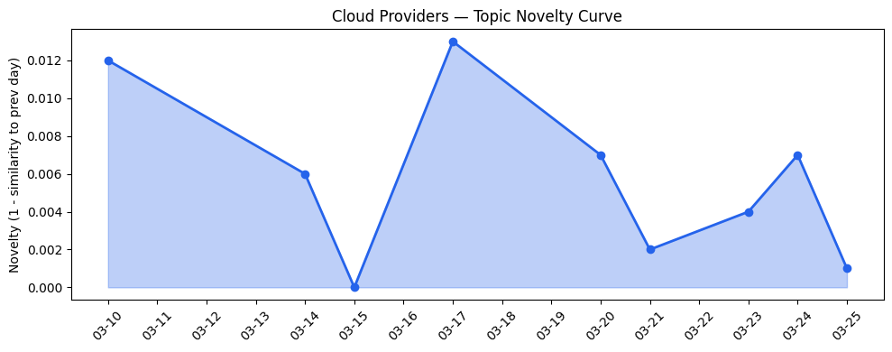
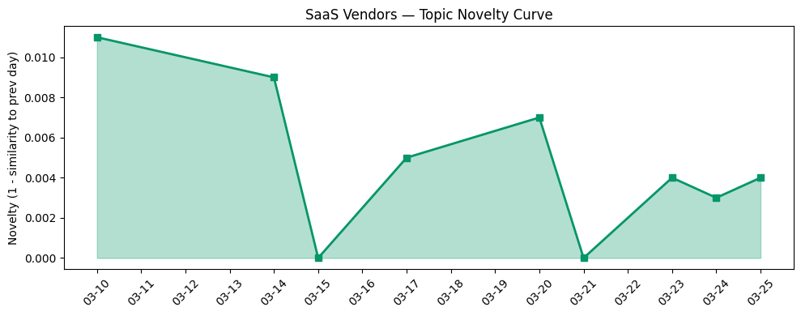

## 今日云计算结构性变化

> Kubernetes正从容器编排平台全面转型为AI基础设施核心，同时美国政界的数据中心建设禁令提案可能对全球云计算扩张路径产生深远影响。

今天云计算产业面临双重结构性转折：技术层Kubernetes正从通用容器编排工具升级为AI工作负载的核心调度器，而政策层的数据中心建设禁令提案则可能重塑全球算力基础设施的扩张逻辑。这意味着云计算厂商必须同时应对技术架构升级和地缘政治风险的双重挑战。

- 📈 **持续趋势**：技术层、应用层、基础设施、资本信号已连续8天持续增强
- 🔺 **突然升温**：基础设施、应用层、资本信号近3天突然集中出现
- 🆕 **新兴方向**：数据中心建设禁令、中美AI硬件竞争、动态资源分配
- 🔑 **新关键词**：AWS Aurora Serverless、动态资源分配、监管风险
- 📉 **消退关键词**：SaaS话题相对减弱

## 技术层信号

🔴 重大突破

Kubernetes正在经历从容器编排平台向AI基础设施核心的根本性转型。Google Cloud推出的[Kubernetes动态资源分配(DRA)技术](https://cloud.google.com/blog/products/containers-kubernetes/kubernetes-device-management-with-dra-dynamic-resource-allocation/)专门针对AI工作负载优化GPU管理，标志着Kubernetes正式成为AI算力调度的核心基础设施。这种转变意味着云原生技术栈正在深度适配AI工作负载特性，而不仅仅是简单支持容器化部署。

同时，Serverless架构正从函数计算向数据库层深度渗透。AWS推出的[Aurora PostgreSQL Serverless数据库秒级创建功能](https://aws.amazon.com/blogs/aws/announcing-amazon-aurora-postgresql-serverless-database-creation-in-seconds/)实现了真正的按需数据库实例化，大幅降低了AI应用的数据层成本。微软的[端到端AI代理现代化解决方案](https://azure.microsoft.com/en-us/blog/many-agents-one-team-scaling-modernization-on-azure/)则展示了分布式AI代理在企业级工作流中的成熟应用。

硬件层面，Cloudflare的[Gen13服务器采用AMD EPYC Turin处理器](https://blog.cloudflare.com/gen13-launch/)实现计算性能提升2倍，Google的[TurboQuant AI内存压缩算法](https://techcrunch.com/2026/03/25/google-turboquant-ai-memory-compression-silicon-valley-pied-piper/)则从软件层优化了AI训练的内存效率。这些技术突破共同指向AI工作负载的全栈优化趋势。

## 产业资本信号

🟡 中等信号

基础设施投资面临政策不确定性风险。美国政界提出的[数据中心建设禁令提案](https://techcrunch.com/2026/03/25/bernie-sanders-and-aoc-propose-a-ban-on-data-center-construction/)可能对云计算巨头的扩张计划产生深远影响，迫使厂商转向现有数据中心的效率优化而非规模扩张。Cloudflare推出的[自定义区域服务](https://blog.cloudflare.com/custom-regions/)支持精确地理边界控制，反映了企业对数据主权和合规性的迫切需求。

应用层资本流向显示AI正在垂直行业深度渗透。VITL获得[750万美元融资聚焦GLP-1药物市场](https://techcrunch.com/2026/03/25/riding-the-glp-1-boom-vitl-an ds-7-5m-to-overhaul-cash-pay-clinic-prescribing/)，Strella获得[1400万美元A轮融资](https://venturebeat.com/technology/amazon-and-chobani-adopt-strellas-ai-interviews-for-customer-research-as)为Amazon和Chobani提供AI访谈技术，表明资本正流向具有明确行业痛点的AI解决方案。

大厂战略聚焦内部技术研发而非外部并购，Google Cloud和Microsoft持续强化AI基础设施能力，而Meta的[数百人裁员包括Reality Labs部门](https://techcrunch.com/2026/03/25/meta-is-cutting-several-hundred-jobs/)显示其对元宇宙投入的重新评估。

## 潜在拐点判断

今日观察到两个潜在拐点信号：技术层面Kubernetes向AI基础设施核心的转型拐点，以及政策层面数据中心建设可能面临的监管拐点。Kubernetes DRA技术的推出标志着云原生技术栈正式适配AI工作负载特性，这将重塑AI应用的部署和运维模式。而数据中心建设禁令提案如果通过，将迫使云计算厂商从粗放式基础设施扩张转向精细化运营和边缘计算布局。这两个拐点的叠加效应可能加速云计算产业的技术架构重构和地域分布重组。

## 明日观察点

1. **美国数据中心禁令提案的立法进展**：关注该提案是否获得更多政治支持，以及云计算巨头的游说反应，这将决定全球算力基础设施的扩张路径
2. **Kubernetes DRA技术的行业采纳速度**：观察主要AI公司是否快速跟进这一技术标准，验证其作为AI基础设施核心的实际价值
3. **中美AI硬件竞争的具体影响**：关注Kai-Fu Lee警告的[中美AI硬件竞争](https://venturebeat.com/infrastructure/kai-fu-lees-brutal-assessment-america-is-already-losing-the-ai-hardware-war)是否开始影响云计算厂商的供应链决策

## 长期趋势坐标

今日信号在月尺度上延续了AI基础设施深度优化的主线，但加入了重要的政策风险维度。技术层的持续创新（连续8天增强趋势）显示云计算厂商正全力优化AI工作负载的全栈性能，而突然升温的基础设施话题则反映了地缘政治因素对算力布局的直接影响。中美AI竞争从技术层面扩展到供应链和政策层面，云计算产业的地缘属性正在强化。

## 数据洞察

### 云厂商话题演化
今日云厂商话题新颖度得分0.019，相似度0.981，呈现延续性趋势。过去9天内云厂商内容保持高度一致性，表明AI基础设施优化是持续的技术主线。

### SaaS厂商话题演化  
SaaS厂商话题新颖度得分0.013，相似度0.987，同样呈现延续趋势。SaaS层正深度集成AI能力，但创新节奏相对云基础设施层更为平稳。

### 趋势图

## 参考来源

**云厂商**
- [DRA: A new era of Kubernetes device management with Dynamic Resource Allocation](https://cloud.google.com/blog/products/containers-kubernetes/kubernetes-device-management-with-dra-dynamic-resource-allocation/) — Google Cloud Blog
- [Many agents, one team: Scaling modernization on Azure](https://azure.microsoft.com/en-us/blog/many-agents-one-team-scaling-modernization-on-azure/) — Microsoft Azure Blog
- [Announcing Amazon Aurora PostgreSQL serverless database creation in seconds](https://aws.amazon.com/blogs/aws/announcing-amazon-aurora-postgresql-serverless-database-creation-in-seconds/) — AWS Blog
- [Launching Cloudflare’s Gen 13 servers: trading cache for cores for 2x edge compute performance](https://blog.cloudflare.com/gen13-launch/) — Cloudflare Blog
- [A developer’s guide to training with Ironwood TPUs](https://cloud.google.com/blog/products/compute/training-large-models-on-ironwood-tpus/) — Google Cloud Blog
- [Introducing Custom Regions for precision data control](https://blog.cloudflare.com/custom-regions/) — Cloudflare Blog
- [AI Security for Apps is now generally available](https://blog.cloudflare.com/ai-security-for-apps-ga/) — Cloudflare Blog
- [RSAC ’26: Supercharging agentic AI defense with frontline threat intelligence](https://cloud.google.com/blog/products/identity-security/rsac-26-supercharging-agentic-ai-defense-with-frontline-threat-intelligence/) — Google Cloud Blog
- [OpenClaw进阶配置指南：在飞书打造你的AI员工团队](https://developer.volcengine.com/articles/7618114640601759790) — 火山引擎 Blog

**SaaS厂商**
- [Modernizing regulated industries with cloud and agentic AI](https://www.microsoft.com/en-us/industry/blog/general/2026/03/11/modernizing-regulated-industries-with-cloud-and-agentic-ai/) — Microsoft Azure Blog
- [Keep your partner, lose the complexity: Introducing Salesforce's native integration with Adyen](https://www.salesforce.com/blog/salesforce-native-integration-adyen/) — Salesforce Blog

**行业资讯**
- [Google unveils TurboQuant, a new AI memory compression algorithm](https://techcrunch.com/2026/03/25/google-turboquant-ai-memory-compression-silicon-valley-pied-piper/) — TechCrunch
- [Bernie Sanders and AOC propose a ban on data center construction](https://techcrunch.com/2026/03/25/bernie-sanders-and-aoc-propose-a-ban-on-data-center-construction/) — TechCrunch
- [Kai-Fu Lee's brutal assessment: America is already losing the AI hardware war to China](https://venturebeat.com/infrastructure/kai-fu-lees-brutal-assessment-america-is-already-losing-the-ai-hardware-war) — VentureBeat Enterprise
- [Inside LinkedIn’s generative AI cookbook: How it scaled people search to 1.3 billion users](https://venturebeat.com/infrastructure/inside-linkedins-generative-ai-cookbook-how-it-scaled-people-search-to-1-3) — VentureBeat Enterprise
- [Riding the GLP-1 boom, VITL lands $7.5M to overhaul cash-pay clinic prescribing](https://techcrunch.com/2026/03/25/riding-the-glp-1-boom-vitl-an ds-7-5m-to-overhaul-cash-pay-clinic-prescribing/) — TechCrunch
- [Amazon and Chobani adopt Strella's AI interviews for customer research as fast-growing startup raises $14M](https://venturebeat.com/technology/amazon-and-chobani-adopt-strellas-ai-interviews-for-customer-research-as) — VentureBeat Enterprise
- [DeleteMe acquires social media security tool Block Party](https://techcrunch.com/2026/03/25/deleteme-acquires-social-media-security-tool-block-party/) — TechCrunch
- [Meta is cutting several hundred jobs](https://techcrunch.com/2026/03/25/meta-is-cutting-several-hundred-jobs/) — TechCrunch
- [Jury finds Meta and Google negligent in landmark social media addiction trial](https://techcrunch.com/2026/03/25/jury-finds-meta-and-youtube-negligent-in-landmark-social-media-addiction-trial/) — TechCrunch
- [Standing up for the open Internet: why we appealed Italy's "Piracy Shield" fine](https://blog.cloudflare.com/standing-up-for-the-open-internet/) — Cloudflare Blog
- [Convicted spyware chief hints that Greece's government was behind dozens of phone hacks](https://techcrunch.com/2026/03/25/convicted-spyware-chief-hints-that-greeces-government-was-behind-dozens-of-phone-hacks/) — TechCrunch