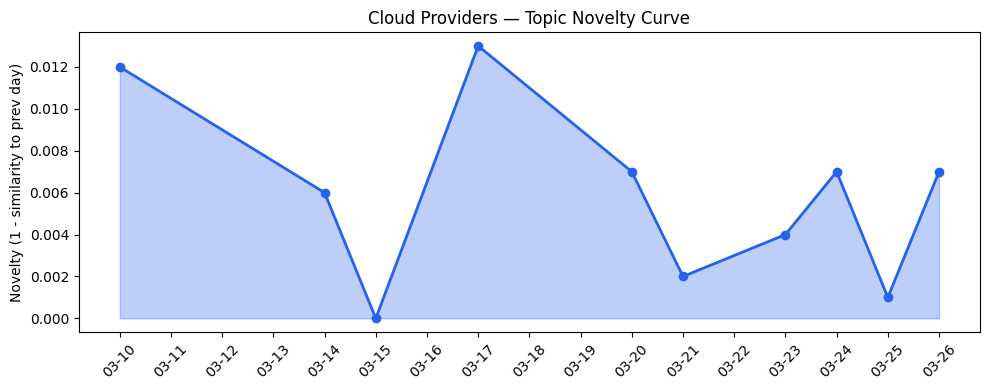
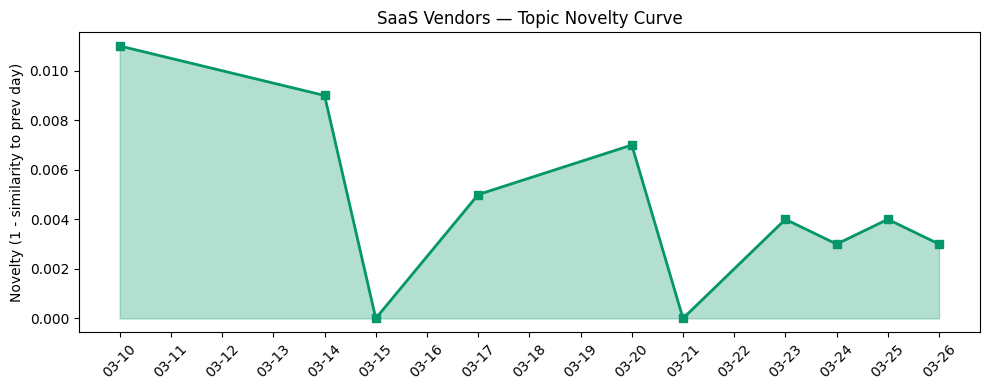

## 今日云计算结构性变化

> Kubernetes正从容器编排平台演进为AI基础设施核心，云厂商通过动态资源分配和专用芯片优化大规模AI工作负载部署，同时面临数据中心能耗监管和AI供应链安全挑战。

今日最显著的结构性变化是Kubernetes完成了从通用容器编排平台向AI基础设施核心的技术跃迁。Google Cloud推出的[Dynamic Resource Allocation（DRA）技术](https://cloud.google.com/blog/products/containers-kubernetes/kubernetes-device-management-with-dra-dynamic-resource-allocation/)专门优化GPU/TPU等AI加速器资源调度，标志着云原生技术栈正式将AI工作负载作为一等公民。与此同时，AWS的[Aurora PostgreSQL Serverless秒级创建功能](https://aws.amazon.com/blogs/aws/announcing-amazon-aurora-postgresql-serverless-database-creation-in-seconds/)和Cloudflare的[RFC 9457标准优化](https://blog.cloudflare.com/rfc-9457-agent-error-pages/)共同指向AI代理成本与性能的极致优化。

- 📈 **持续趋势**：基础设施、应用层、风险信号话题已连续8天增强
- 🆕 **新兴方向**：AI代理、PostgreSQL、供应链安全、数据中心能耗监管
- 🔺 **突然升温**：基础设施话题近3天相似度显著提升（0.42 vs 0.25）
- 🔑 **新关键词**：AI代理、PostgreSQL、供应链安全、开源模型、监管合规

## 技术层信号

🔴 重大突破

Kubernetes设备管理迎来里程碑式突破。Google Cloud的DRA技术解决了AI加速器资源碎片化难题，使Kubernetes能够像调度CPU一样精细管理GPU/TPU资源。这标志着云原生技术栈正式将AI工作负载纳入核心调度体系，而非作为附加功能。同时，[llm-d项目成为CNCF沙箱项目](https://cloud.google.com/blog/products/containers-kubernetes/llm-d-officially-a-cncf-sandbox-project/)进一步巩固了Kubernetes作为AI基础设施标准的核心地位。

数据库层同样迎来重大革新。AWS Aurora PostgreSQL Serverless实现秒级创建，配合Azure的[Fireworks AI集成](https://azure.microsoft.com/en-us/blog/introducing-fireworks-ai-on-microsoft-foundry-bringing-high-performance-low-latency-open-model-inference-to-azure/)提供高性能开源模型推理，形成完整的AI数据流水线。Cloudflare通过[RFC 9457标准优化](https://blog.cloudflare.com/rfc-9457-agent-error-pages/)将AI代理token成本降低98%，这种成本优化幅度在历史上极为罕见。

## 产业资本信号

🔴 强信号

基础设施层出现重大资本配置调整。Cloudflare发布[Gen 13服务器采用AMD EPYC Turin 9965处理器](https://blog.cloudflare.com/gen13-launch/)，边缘计算性能提升2倍，显示边缘AI算力投资加速。Google Cloud推出[Ironwood TPU训练指南](https://cloud.google.com/blog/products/compute/training-large-models-on-ironwood-tpus/)优化万亿参数模型算力供应，专用AI芯片投资持续加码。

应用层资本流向明确聚焦企业级AI场景。Defense AI公司[Shield AI估值达127亿美元增长140%](https://techcrunch.com/2026/03/26/defense-startup-shield-ai-lands-12-7b-valuation-up-140-after-u-s-air-force-deal/)，显示国防科技投资热度。YC W26 Demo Day的16家AI初创公司中，企业级应用占比显著提升，如[Strella完成1400万美元A轮融资](https://venturebeat.com/technology/amazon-and-chobani-adopt-strellas-ai-interviews-for-customer-research-as)并被Amazon和Chobani采用。

## 潜在拐点判断

今日观察到两个重要拐点信号：一是Kubernetes从通用基础设施向AI专用基础设施的技术拐点，通过DRA技术实现了AI加速器资源的精细化调度；二是数据中心能耗监管的政策拐点，美国参议院要求数据中心报告能耗数据预示监管收紧。这两个拐点将重塑云厂商的技术架构和运营成本结构，推动AI基础设施向更高效、更合规的方向演进。

## 明日观察点

1. 关注各大云厂商对DRA技术的跟进速度，特别是Azure和阿里云在Kubernetes AI化方向的布局
2. 监控数据中心能耗监管政策的后续发展，可能引发的云服务定价结构调整
3. 观察AI代理成本优化技术（如RFC 9457）在其他云平台的普及情况

## 长期趋势坐标

从月度视角看，AI基础设施的深度专业化是核心趋势。Kubernetes作为AI基础设施核心的地位已经确立，云厂商正在围绕AI工作负载重构整个技术栈。同时，监管压力（能耗、数据主权）和供应链安全风险将成为长期制约因素，推动云服务向更分散、更合规的架构演进。新兴关键词如AI代理、PostgreSQL、供应链安全显示产业关注点从基础AI能力向规模化部署和风险管理转移。

## 数据洞察

### 云厂商话题演化
今日云厂商话题新颖度得分0.021，相似度0.979，呈现延续性趋势。过去10天内基础设施话题持续增强，特别是近3天突然升温，显示AI基础设施投资加速。

### SaaS厂商话题演化  
SaaS话题新颖度得分0.014，相似度0.986，趋势延续。应用层AI化持续深化，从LinkedIn的生成式AI搜索扩展到企业级AI代理部署。

### 趋势图

## 参考来源

**云厂商**
- [DRA: A new era of Kubernetes device management with Dynamic Resource Allocation](https://cloud.google.com/blog/products/containers-kubernetes/kubernetes-device-management-with-dra-dynamic-resource-allocation/) — Google Cloud Blog
- [Kubernetes as AI Infrastructure: Google Cloud, llm-d, and the CNCF](https://cloud.google.com/blog/products/containers-kubernetes/llm-d-officially-a-cncf-sandbox-project/) — Google Cloud Blog
- [Announcing Amazon Aurora PostgreSQL serverless database creation in seconds](https://aws.amazon.com/blogs/aws/announcing-amazon-aurora-postgresql-serverless-database-creation-in-seconds/) — AWS Blog
- [Slashing agent token costs by 98% with RFC 9457-compliant error responses](https://blog.cloudflare.com/rfc-9457-agent-error-pages/) — Cloudflare Blog
 benefit
- [Introducing Fireworks AI on Microsoft Foundry](https://azure.microsoft.com/en-us/blog/introducing-fireworks-ai-on-microsoft-foundry-bringing-high-performance-low-latency-open-model-inference-to-azure/) — Microsoft Azure Blog
- [What's new with Google Data Cloud](https://cloud.google.com/blog/products/data-analytics/whats-new-with-google-data-cloud/) — Google Cloud Blog
- [Introducing account regional namespaces for Amazon S3 general purpose buckets](https://aws.amazon.com/blogs/aws/introducing-account-regional-namespaces-for-amazon-s3-general-purpose-buckets/) — AWS Blog
- [A one-line Kubernetes fix that saved 600 hours a year](https://blog.cloudflare.com/one-line-kubernetes-fix-saved-600-hours-a-year/) — Cloudflare Blog
- [Sandboxing AI agents, 100x faster](https://blog.cloudflare.com/dynamic-workers/) — Cloudflare Blog
- [Introducing OpenClaw on Amazon Lightsail to run your autonomous private AI agents](https://aws.amazon.com/blogs/aws/introducing-openclaw-on-amazon-lightsail-to-run-your-autonomous-private-ai-agents/) — AWS Blog
- [Launching Cloudflare’s Gen 13 servers: trading cache for cores for 2x edge compute performance](https://blog.cloudflare.com/gen13-launch/) — Cloudflare Blog
- [Introducing Custom Regions for precision data control](https://blog.cloudflare.com/custom-regions/) — Cloudflare Blog
- [A developer's guide to training with Ironwood TPUs](https://cloud.google.com/blog/products/compute/training-large-models-on-ironwood-tpus/) — Google Cloud Blog
- [New ways to migrate and scale Red Hat OpenShift on Google Cloud](https://cloud.google.com/blog/topics/partners/red-hat-openshift-on-google-cloud-migration-and-scaling-updates/) — Google Cloud Blog
- [From legacy architecture to Cloudflare One](https://blog.cloudflare.com/legacy-to-agile-sase/) — Cloudflare Blog

**SaaS厂商**
- [How FM Logistic tackled the traveling salesman problem at warehouse scale with AlphaEvolve](https://cloud.google.com/blog/products/ai-machine-learning/how-fm-logistic-tackled-the-traveling-salesman-problem-at-warehouse-scale-with-alphaevolve/) — Google Cloud Blog
- [Keep your partner, lose the complexity: Introducing Salesforce's native integration with Adyen](https://www.salesforce.com/blog/salesforce-native-integration-adyen/) — Salesforce Blog
- [OpenClaw进阶配置指南：在飞书打造你的AI员工团队](https://developer.volcengine.com/articles/7618114640601759790) — 火山引擎 Blog
- [Meet the New Intent-Aware Search for Agentforce Commerce](https://www.salesforce.com/blog/intent-aware-search/) — Salesforce Blog
- [数字人多模态智能体怎么选？5 家主流平台交互能力横向对比评测](https://developer.volcengine.com/articles/7621398805866840127) — 火山引擎 Blog

**行业资讯**
- [Data centers get ready — the Senate wants to see your power bills](https://techcrunch.com/2026/03/26/data-centers-get-ready-the-senate-wants-to-see-your-power-bills/) — TechCrunch
- [Inside LinkedIn's generative AI cookbook: How it scaled people search to 1.3 billion users](https://venturebeat.com/infrastructure/inside-linkedins-generative-ai-cookbook-how-it-scaled-people-search-to-1-3) — VentureBeat Enterprise
- [Defense startup Shield AI lands $12.7B valuation, up 140%, after US Air Force deal](https://techcrunch.com/2026/03/26/defense-startup-shield-ai-lands-12-7b-valuation-up-140-after-u-s-air-force-deal/) — TechCrunch
- [Modernizing regulated industries with cloud and agentic AI](https://www.microsoft.com/en-us/industry/blog/general/2026/03/11/modernizing-regulated-industries-with-cloud-and-agentic-ai/) — Microsoft Azure Blog
- [From legacy to leadership: How PostgreSQL on Azure powers enterprise agility and innovation](https://azure.microsoft.com/en-us/blog/from-legacy-to-leadership-how-postgresql-on-azure-powers-enterprise-agility-and-innovation/) — Microsoft Azure Blog
- [16 of the most interesting startups from YC W26 Demo Day](https://techcrunch.com/2026/03/26/16-of-the-most-interesting-startups-from-yc-w26-demo-day/) — TechCrunch
- [Amazon and Chobani adopt Strella's AI interviews for customer research as fast-growing startup raises $14M](https://venturebeat.com/technology/amazon-and-chobani-adopt-strellas-ai-interviews-for-customer-research-as) — VentureBeat Enterprise
- [Microsoft's Copilot can now build apps and automate your job — here's how it works](https://venturebeat.com/technology/microsofts-copilot-can-now-build-apps-and-automate-your-job-heres-how-it) — VentureBeat Enterprise
- [Standing up for the open Internet: why we appealed Italy's 'Piracy Shield' fine](https://blog.cloudflare.com/standing-up-for-the-open-internet/) — Cloudflare Blog
- [Silicon Valley's two biggest dramas have intersected: LiteLLM and Delve](https://techcrunch.com/2026/03/26/delve-did-the-security-compliance-on-litellm-an-ai-project-hit-by-malware/) — TechCrunch
- [Kai-Fu Lee's brutal assessment: America is already losing the AI hardware war to China](https://venturebeat.com/infrastructure/kai-fu-lees-brutal-assessment-america-is-already-losing-the-ai-hardware-war) — VentureBeat Enterprise
- [Tokenization takes the lead in the fight for data security](https://venturebeat.com/technology/tokenization-takes-the-lead-in-the-fight-for-data-security) — VentureBeat Enterprise
- [OpenClaw飞书机器人无响应与连接失败：完整排查指南](https://developer.volcengine.com/articles/7618057705978560518) — 火山引擎 Blog
- [MCP广场开源版权声明](https://cloud.tencent.com/developer/article/2537547) — Tencent Cloud Blog