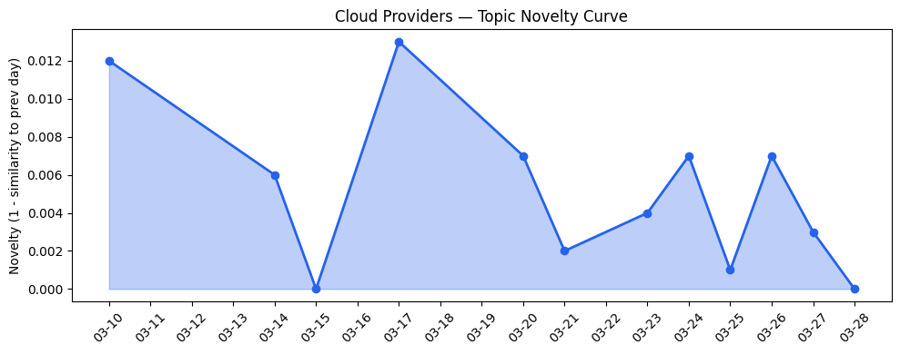
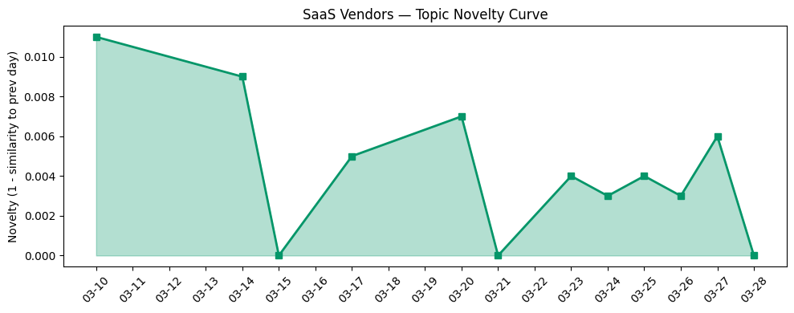

## 今日云计算结构性变化

> 云厂商正加速AI代理能力与基础设施的深度融合，从Kubernetes设备管理到边缘计算，形成新一代智能云架构。

今日云计算产业最显著的结构性变化是AI代理技术正在重塑云基础设施的架构范式。Google Cloud推出基于MCP服务器的生产级AI代理构建方案和Kubernetes动态资源分配技术，标志着云原生架构开始为AI代理进行深度优化。与此同时，Cloudflare通过Dynamic Workers实现AI代码沙箱执行速度提升100倍，AWS Aurora PostgreSQL Serverless实现秒级数据库创建，这些技术突破共同指向一个趋势：云基础设施正在从"资源供给"向"智能执行"平台演进。

- 📈 **持续趋势**：技术层话题已连续8天增强
- 🔺 **突然升温**：技术层和应用层近3天话题集中爆发
- 🆕 **新兴方向**：核能AI为30天内首次出现的关键应用场景
- 🔑 **新关键词**：数据安全、核能AI、火山引擎
- 📉 **消退关键词**：AI、Cloud Computing、SaaS等基础概念

## 技术层信号

🔴 重大突破

云原生技术正经历AI代理驱动的架构重构。Google Cloud的[Kubernetes动态资源分配技术](https://cloud.google.com/blog/products/containers-kubernetes/kubernetes-device-management-with-dra-dynamic-resource-allocation/)实现了GPU等稀缺资源的精细化调度，这是Kubernetes设备管理的重要突破。与此同时，[Cloudflare的Dynamic Workers](https://blog.cloudflare.com/dynamic-workers/)将AI代码执行速度提升100倍，解决了AI代理在边缘环境下的性能瓶颈问题。

基础设施层面，[Cloudflare Gen 13服务器](https://blog.cloudflare.com/gen13-launch/)采用AMD EPYC Turin处理器，边缘计算性能翻倍，体现了边缘算力供给的实质性提升。微软在[Azure SQL数据库的AI集成](https://www.microsoft.com/en-us/sql-server/blog/2026/03/18/advancing-agentic-ai-with-microsoft-databases-across-a-unified-data-estate/)展示了数据库与AI能力的深度融合趋势。这些技术突破共同指向一个明确方向：云基础设施正在从被动资源供给转向主动智能执行平台。

## 产业资本信号

🟡 中等信号

资本层面呈现分化态势：AI基础设施公司[Physical Intelligence洽谈10亿美元融资](https://techcrunch.com/2026/03/27/physical-intelligence-is-reportedly-in-talks-to-raise-1-billion-again/)，估值可能在4个月内翻倍至56亿美元，显示资本对AI底层技术的持续追捧。同时，应用层公司[Strella完成1400万美元A轮融资](https://venturebeat.com/technology/amazon-and-chobani-adopt-strellas-ai-interviews-for-customer-research-as)，其AI访谈技术获亚马逊和Chobani采用，表明垂直场景的AI应用开始获得市场验证。

基础设施投资方面，Cloudflare和AWS的区域定制化服务升级反映了企业对数据主权和合规性的需求增长。[Salesforce与Adyen的原生支付集成](https://www.salesforce.com/blog/salesforce-native-integration-adyen/)则体现了SaaS厂商通过生态合作强化核心竞争力的战略取向。整体来看，资本正从泛AI概念投资转向具体技术栈和落地场景的精准投入。

## 潜在拐点判断

今日观察到AI代理与云基础设施深度融合的技术拐点。Google Cloud的MCP服务器方案和Kubernetes动态资源分配技术标志着云原生架构开始为AI代理进行系统性优化，这不同于此前简单的API集成或算力堆叠。同时，微软将AI应用于核能行业的案例代表了AI向关键基础设施领域的渗透拐点，从消费互联网向产业核心场景的迁移正在加速。

这一拐点的核心影响在于：云厂商的竞争焦点将从算力规模转向智能架构能力，能够提供端到端AI代理支撑平台的厂商将在下一阶段获得结构性优势。基础设施的智能化程度将成为区分云服务商竞争力的关键指标。

## 明日观察点

1. **AI代理平台化进展**：关注各大云厂商如何将今日的技术突破整合为统一的AI代理平台，特别是Google Cloud MCP服务器与Kubernetes集成的后续发展
2. **核能AI落地深度**：观察微软核能AI项目的具体技术架构和商业模式，判断AI在关键基础设施领域的可复制性
3. **边缘计算性能验证**：跟踪Cloudflare Gen 13服务器在实际业务场景中的性能表现，评估边缘AI的商用成熟度

## 长期趋势坐标

从月度尺度看，AI代理正在成为云计算架构演进的核心驱动力。技术层连续8天的增强趋势表明这不是短期热点，而是结构性转变的开始。关键词演变显示行业讨论正从抽象的"AI"概念转向具体的"Kubernetes"、"Serverless"、"边缘计算"等技术实现，反映产业进入务实落地阶段。

核能AI等新兴应用场景的出现，预示着AI技术开始向高门槛、高价值的传统行业渗透，这将为云计算带来新的增长空间。同时，数据安全、监管合规等关键词的上升，表明产业在追求技术创新的同时也在构建治理框架。

## 数据洞察

### 云厂商话题演化
今日云厂商话题新颖度得分0.018，相似度0.982，呈现延续性趋势。过去12天内共分析46篇文章，显示技术讨论保持高度一致性，反映行业对AI代理与基础设施融合方向的共识强化。

### SaaS厂商话题演化  
SaaS厂商话题新颖度得分0.016，相似度0.984，同样呈现延续趋势。30篇文章分析显示SaaS厂商正积极将AI代理能力集成到现有产品中，特别是Salesforce在IT支持场景的实践具有代表性。

### 趋势图

## 参考来源

**云厂商技术更新**
- [How to build production-ready AI agents with Google-managed MCP servers](https://cloud.google.com/blog/products/ai-machine-learning/how-to-build-ai-agents-with-google-managed-mcp-servers/) — Google Cloud Blog
- [DRA: A new era of Kubernetes device management with Dynamic Resource Allocation](https://cloud.google.com/blog/products/containers-kubernetes/kubernetes-device-management-with-dra-dynamic-resource-allocation/) — Google Cloud Blog
- [Sandboxing AI agents, 100x faster](https://blog.cloudflare.com/dynamic-workers/) — Cloudflare Blog
- [Announcing Amazon Aurora PostgreSQL serverless database creation in seconds](https://aws.amazon.com/blogs/aws/announcing-amazon-aurora-postgresql-serverless-database-creation-in-seconds/) — AWS Blog
- [Launching Cloudflare’s Gen 13 servers: trading cache for cores for 2x edge compute performance](https://blog.cloudflare.com/gen13-launch/) — Cloudflare Blog
- [Advancing agentic AI with Microsoft databases across a unified data estate](https://www.microsoft.com/en-us/sql-server/blog/2026/03/18/advancing-agentic-ai-with-microsoft-databases-across-a-unified-data-estate/) — Microsoft Azure Blog
- [Introducing Custom Regions for precision data control](https://blog.cloudflare.com/custom-regions/) — Cloudflare Blog
- [Customize your AWS Management Console experience with visual settings including account color, region and service visibility](https://aws.amazon.com/blogs/aws/customize-your-aws-management-console-experience-with-visual-settings-including-account-color-region-and-service-visibility/) — AWS Blog
- [Five techniques to reach the efficient frontier of LLM inference](https://cloud.google.com/blog/topics/developers-practitioners/five-techniques-to-reach-the-efficient-frontier-of-llm-inference/) — Google Cloud Blog
- [What's new with Microsoft in open-source and Kubernetes at KubeCon + CloudNativeCon Europe 2026](https://opensource.microsoft.com/blog/2026/03/24/whats-new-with-microsoft-in-open-source-and-kubernetes-at-kubecon-cloudnativecon-europe-2026/) — Microsoft Azure Blog

**SaaS厂商应用实践**
- [AI for nuclear energy: Powering an intelligent, resilient future](https://www.microsoft.com/en-us/industry/blog/energy-and-resources/2026/03/24/ai-for-nuclear-energy-powering-an-intelligent-resilient-future/) — Microsoft Azure Blog
- [How Salesforce Built, Tested, and Scaled Our IT Support Agents](https://www.salesforce.com/blog/salesforce-ai-agent-development/) — Salesforce Blog
- [Easy as a green run: How Vail Resorts built an AI assistant to automate personalized recommendations](https://cloud.google.com/blog/products/ai-machine-learning/how-vail-resorts-built-an-ai-assistant-to-automate-personalized-recommendations/) — Google Cloud Blog
- [How FM Logistic tackled the traveling salesman problem at warehouse scale with AlphaEvolve](https://cloud.google.com/blog/products/ai-machine-learning/how-fm-logic-tackled-the-traveling-salesman-problem-at-warehouse-scale-with-alphaevolve/) — Google Cloud Blog
- [Many agents, one team: Scaling modernization on Azure](https://azure.microsoft.com/en-us/blog/many-agents-one-team-scaling-modernization-on-azure/) — Microsoft Azure Blog
- [OpenClaw × 豆包模型：构建图像与视频生成Skills实践](https://developer.volcengine.com/articles/7615547765435432996) — 火山引擎 Blog
- [Keep your partner, lose the complexity: Introducing Salesforce’s native integration with Adyen](https://www.salesforce.com/blog/salesforce-native-integration-adyen/) — Salesforce Blog

**行业资讯与风险**
- [Physical Intelligence is reportedly in talks to raise $1 billion, again](https://techcrunch.com/2026/03/27/physical-intelligence-is-reportedly-in-talks-to-raise-1-billion-again/) — TechCrunch
- [Amazon and Chobani adopt Strella's AI interviews for customer research as fast-growing startup raises $14M](https://venturebeat.com/technology/amazon-and-chobani-adopt-strellas-ai-interviews-for-customer-research-as) — VentureBeat Enterprise
- [Anthropic’s Claude popularity with paying consumers is skyrocketing](https://techcrunch.com/2026/03/28/anthropics-claude-popularity-with-paying-consumers-is-skyrocketing/) — TechCrunch
- [Standing up for the open Internet: why we appealed Italy's 'Piracy Shield' fine](https://blog.cloudflare.com/standing-up-for-the-open-internet/) — Cloudflare Blog
- [Stanford study outlines dangers of asking AI chatbots for personal advice](https://techcrunch.com/2026/03/28/stanford-study-outlines-dangers-of-asking-ai-chatbots-for-personal-advice/) — TechCrunch
- [Tokenization takes the lead in the fight for data security](https://venturebeat.com/technology/tokenization-takes-the-lead-in-the-fight-for-data-security) — VentureBeat Enterprise
- [Kai-Fu Lee's brutal assessment: America is already losing the AI hardware war to China](https://venturebeat.com/infrastructure/kai-fu-lees-brutal-assessment-america-is-already-losing-the-ai-hardware-war) — VentureBeat Enterprise
- [Elon Musk’s last co-founder reportedly leaves xAI](https://techcrunch.com/2026/03/28/elon-musks-last-co-founder-reportedly-leaves-xai/) — TechCrunch