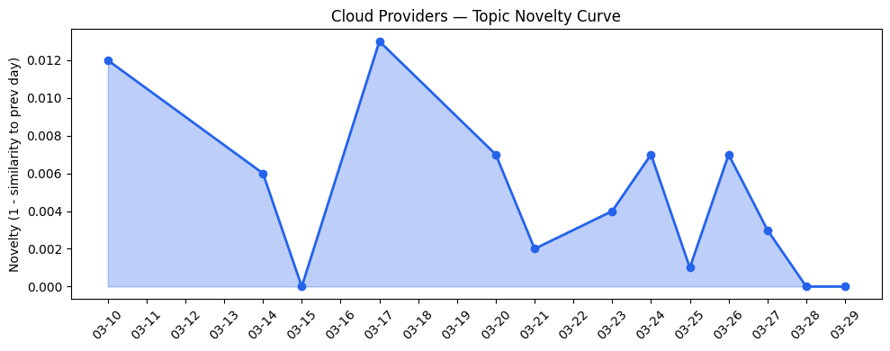
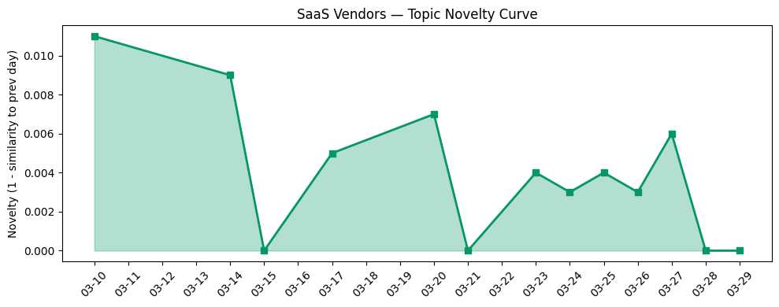

## 今日云计算结构性变化

> AI算力首次大规模涨价标志稀缺性定价时代来临，同时云原生技术在AI代理构建、Kubernetes设备管理和边缘计算性能方面实现重大突破。

云计算产业正经历从基础设施竞争向AI价值深度整合的结构性转变。阿里云宣布AI算力最高涨价34%标志着行业首次承认AI算力的稀缺性价值，打破了长期以来的价格战格局。与此同时，技术层突破集中在AI与云原生深度整合：Google Cloud的[Kubernetes Dynamic Resource Allocation](https://cloud.google.com/blog/products/containers-kubernetes/kubernetes-device-management-with-dra-dynamic-resource-allocation/)实现GPU精细管理，Cloudflare的[Dynamic Workers](https://blog.cloudflare.com/dynamic-workers/)将AI代码安全沙箱执行速度提升100倍，AWS Aurora PostgreSQL Serverless实现秒级创建。

趋势信号显示：
- 📈 **持续趋势**：应用层话题已连续8天增强，AI代理在企业工作流中加速落地
- 🔺 **突然升温**：技术层话题近3天相似度从0.42跃升至0.76，云原生AI技术集中突破
- 🔑 **新关键词**：AI算力、Cloudflare Gen 13、Dynamic Resource Allocation、定价策略
- 📉 **消退关键词**：AI、Cloud Computing、SaaS等泛化概念让位于具体技术实现

## 技术层信号

🔴 重大突破

云原生技术正经历AI驱动下的架构重构。Google Cloud推出的Kubernetes Dynamic Resource Allocation解决了GPU等稀缺资源的精细分配难题，这是容器编排系统面向AI工作负载的重要进化。同时，Cloudflare通过Dynamic Workers实现的100倍AI代码执行加速，标志着边缘计算在AI推理场景的成熟度跃升。AWS Aurora PostgreSQL Serverless的秒级创建能力进一步降低了AI应用的数据层门槛。

AI与云基础设施的融合进入新阶段。Google Cloud发布的[LLM推理效率优化五大技术](https://cloud.google.com/blog/topics/developers-practitioners/five-techniques-to-reach-the-efficient-frontier-of-llm-inference/)展示了云厂商在模型推理优化方面的深度投入，Azure将[Agentic AI集成到SQL数据库](https://www.microsoft.com/en-us/sql-server/blog/2026/03/18/advancing-agentic-ai-with-microsoft-databases-across-a-unified-data-estate/)则体现了数据层智能化的趋势。这些技术突破共同指向一个方向：云平台正在从提供算力基础设施转向提供端到端的AI价值交付能力。

## 产业资本信号

🟡 中等信号

AI算力定价策略出现历史性转折。阿里云的[AI算力涨价34%](https://developer.volcengine.com/articles/7622389487133261875)宣告了廉价算力时代的结束，云计算厂商开始基于AI工作负载的真实价值重新定价。这一变化将重塑产业资本流向，企业需要重新评估AI项目的ROI计算模型。

资本正加速流向AI应用层创新。AI访谈平台Strella完成[1400万美元A轮融资](https://venturebeat.com/technology/amazon-and-chobani-adopt-strellas-ai-interviews-for-customer-research-as)，Amazon和Chobani已采用其技术，显示企业级AI工具的投资热度。微软Copilot扩展应用构建能力，Anthropic推出Skills功能提升Claude在企业工作流性能，这些战略动作表明大厂正通过产品化将AI能力转化为实际收入。

基础设施投资转向性能优化而非单纯扩容。Cloudflare Gen 13服务器采用AMD EPYC Turin 9965处理器实现[计算吞吐量翻倍](https://blog.cloudflare.com/gen13-launch/)，体现了边缘计算对性能密度的追求。火山引擎强调极致性价比云服务理念，反映中国云厂商在差异化竞争中的新思路。

## 潜在拐点判断

今日观察到明确的定价拐点信号。阿里云AI算力涨价标志云计算行业从"规模优先"转向"价值优先"的定价策略转折。这一变化基于AI算力真实稀缺性的市场认知，可能引发三大影响：一是企业AI项目投资决策更注重实际ROI，二是云厂商利润结构向高价值AI服务倾斜，三是中小企业AI应用可能因成本压力放缓。

同时存在技术架构拐点：Kubernetes Dynamic Resource Allocation和Cloudflare Dynamic Workers代表云原生技术从通用计算向AI专用架构演进，这将重新定义云平台的技术竞争力维度。

## 明日观察点

1. **AI算力涨价连锁反应**：关注其他云厂商是否跟进调价，以及企业客户的实际应对策略
2. **云原生AI技术落地速度**：观察Dynamic Resource Allocation等新技术在企业环境的采用周期和效果验证
3. **边缘计算性能边界**：Cloudflare Gen 13的实际性能表现将定义边缘AI推理的新标准

## 长期趋势坐标

今日信号确认了云计算产业向AI价值深度整合的月级趋势。技术层突破显示云原生架构正在系统性适配AI工作负载特性，而定价策略变化反映市场对AI算力稀缺性的共识形成。从李开复对[中美AI硬件竞争](https://venturebeat.com/infrastructure/kai-fu-lees-brutal-assessment-america-is-already-losing-the-ai-hardware-war)的评估看，地缘政治因素正在重塑全球云计算供应链格局，这一趋势将在季度尺度持续影响产业布局。

## 数据洞察

### 云厂商话题演化
云厂商话题延续性强（新颖度0.017），13天内46篇文章保持高度一致性，表明大厂技术路线稳定。话题从泛AI概念转向具体技术实现，如Kubernetes设备管理和边缘计算优化。

### SaaS厂商话题演化  
SaaS厂商话题同样呈现延续特征（新颖度0.015），30篇文章显示应用层AI代理部署成为共识。Salesforce、微软等厂商在垂直行业落地案例增多，反映SaaS产品AI化进入规模化阶段。

### 趋势图

## 参考来源

**云厂商**
- [DRA: A new era of Kubernetes device management with Dynamic Resource Allocation](https://cloud.google.com/blog/products/containers-kubernetes/kubernetes-device-management-with-dra-dynamic-resource-allocation/) — Google Cloud Blog
- [Sandboxing AI agents, 100x faster](https://blog.cloudflare.com/dynamic-workers/) — Cloudflare Blog
- [Announcing Amazon Aurora PostgreSQL serverless database creation in seconds](https://aws.amazon.com/blogs/aws/announcing-amazon-aurora-postgresql-serverless-database-creation-in-seconds/) — AWS Blog
- [Five techniques to reach the efficient frontier of LLM inference](https://cloud.google.com/blog/topics/developers-practitioners/five-techniques-to-reach-the-efficient-frontier-of-llm-inference/) — Google Cloud Blog
- [Advancing agentic AI with Microsoft databases across a unified data estate](https://www.microsoft.com/en-us/sql-server/blog/2026/03/18/advancing-agentic-ai-with-microsoft-databases-across-a-unified-data-estate/) — Microsoft Azure Blog
- [Launching Cloudflare’s Gen 13 servers: trading cache for cores for 2x edge compute performance](https://blog.cloudflare.com/gen13-launch/) — Cloudflare Blog
- [Introducing Custom Regions for precision data control](https://blog.cloudflare.com/custom-regions/) — Cloudflare Blog
- [What's new with Microsoft in open-source and Kubernetes at KubeCon + CloudNativeCon Europe 2026](https://opensource.microsoft.com/blog/2026/03/24/whats-new-with-microsoft-in-open-source-and-kubernetes-at-kubecon-cloudnativecon-europe-2026/) — Microsoft Azure Blog

**SaaS厂商**
- [AI for nuclear energy: Powering an intelligent, resilient future](https://www.microsoft.com/en-us/industry/blog/energy-and-resources/2026/03/24/ai-for-nuclear-energy-powering-an-intelligent-resilient-future/) — Microsoft Azure Blog
- [How Salesforce Built, Tested, and Scaled Our IT Support Agents](https://www.salesforce.com/blog/salesforce-ai-agent-development/) — Salesforce Blog
- [Modernizing regulated industries with cloud and agentic AI](https://www.microsoft.com/en-us/industry/blog/general/2026/03/11/modernizing-regulated-industries-with-cloud-and-agentic-ai/) — Microsoft Azure Blog
- [Many agents, one team: Scaling modernization on Azure](https://azure.microsoft.com/en-us/blog/many-agents-one-team-scaling-modernization-on-azure/) — Microsoft Azure Blog

**行业资讯**
- [阿里云突然宣布：最高涨34%！告别"价格战"，AI算力正式进入稀缺时代](https://developer.volcengine.com/articles/7622389487133261875) — 火山引擎 Blog
- [Kai-Fu Lee's brutal assessment: America is already losing the AI hardware war to China](https://venturebeat.com/infrastructure/kai-fu-lees-brutal-assessment-america-is-already-losing-the-ai-hardware-war) — VentureBeat Enterprise
- [Amazon and Chobani adopt Strella's AI interviews for customer research as fast-growing startup raises $14M](https://venturebeat.com/technology/amazon-and-chobani-adopt-strellas-ai-interviews-for-customer-research-as) — VentureBeat Enterprise
- [Microsoft's Copilot can now build apps and automate your job — here's how it works](https://venturebeat.com/technology/microsofts-copilot-can-now-build-apps-and-automate-your-job-heres-how-it) — VentureBeat Enterprise
- [How Anthropic's 'Skills' make Claude faster, cheaper, and more consistent for business workflows](https://venturebeat.com/technology/how-anthropics-skills-make-claude-faster-cheaper-and-more-consistent-for) — VentureBeat Enterprise
- [Sora's shutdown could be a reality check moment for AI video](https://techcrunch.com/2026/03/29/soras-shutdown-could-be-a-reality-check-moment-for-ai-video/) — TechCrunch
- [Standing up for the open Internet: why we appealed Italy's "Piracy Shield" fine](https://blog.cloudflare.com/standing-up-for-the-open-internet/) — Cloudflare Blog
- [Tokenization takes the lead in the fight for data security](https://venturebeat.com/technology/tokenization-takes-the-lead-in-the-fight-for-data-security) — VentureBeat Enterprise
- [Elon Musk's last co-founder reportedly leaves xAI](https://techcrunch.com/2026/03/28/elon-musks-last-co-founder-reportedly-leaves-xai/) — TechCrunch
- [Announcing Cloudflare Account Abuse Protection: prevent fraudulent attacks from bots and humans](https://blog.cloudflare.com/account-abuse-protection/) — Cloudflare Blog
- [Stanford study outlines dangers of asking AI chatbots for personal advice](https://techcrunch.com/2026/03/28/stanford-study-outlines-dangers-of-asking-ai-chatbots-for-personal-advice/) — TechCrunch