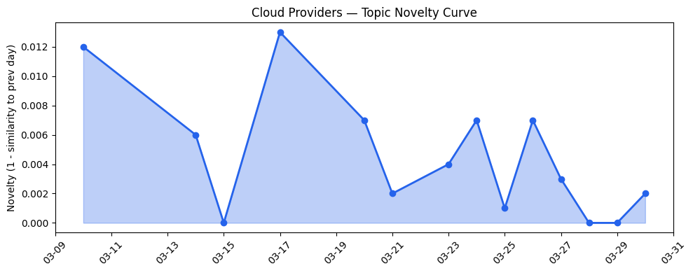
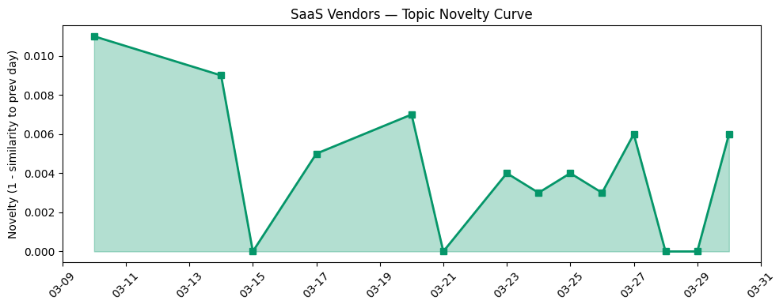

## 今日云计算结构性变化

> 云厂商正通过AI Agent与底层基础设施的深度集成、Serverless快速部署及数据主权精细控制，系统性应对算力需求激增与合规挑战。

这意味着云计算产业正在从"基础设施即服务"向"智能基础设施即服务"演进。今日信号显示，技术层和应用层均出现显著升温，其中技术层连续8天持续增强，近3天话题相似度从0.36跃升至0.69，表明AI Agent与云原生技术的融合已进入加速阶段。核心变化在于：云厂商不再仅提供算力资源，而是构建能够自主优化、安全执行、合规运行的智能基础设施平台。

**趋势信号识别**：
- 📈 **持续趋势**：技术层话题已连续8天增强
- 📈 **持续趋势**：应用层话题已连续8天增强  
- 🔺 **突然升温**：技术层近3天话题集中度显著提升
- 🔺 **突然升温**：应用层近3天话题集中度显著提升
- 🔑 **新关键词**：GPU短缺、基础设施优化、算力效率
- 📈 **上升关键词**：Azure、Kubernetes、Serverless、多云架构、边缘计算

## 技术层信号

🔴 重大突破

Cloudflare通过Dynamic Workers实现AI生成代码的安全沙箱执行，速度提升100倍，标志着AI Agent执行环境正式进入生产就绪阶段。这一突破解决了AI应用在云端的核心安全挑战，为大规模Agent部署扫清了技术障碍。同时，AWS推出Aurora PostgreSQL Serverless秒级创建功能，将数据库部署时间从分钟级压缩到秒级，显著降低了AI应用的启动门槛。

Google Cloud推出生产就绪的AI代理构建方案与MCP服务器，微软Azure则将AI直接集成到SQL和PostgreSQL体验中，显示主流云厂商正在将AI能力深度嵌入数据库层。这种"AI原生数据库"的演进路径，意味着云计算基础设施正在从被动提供资源转向主动提供智能能力。Cloudflare的[一行为Kubernetes修复节省600小时/年](https://blog.cloudflare.com/one-line-kubernetes-fix-saved-600-hours-a-year/)案例，进一步印证了基础设施优化已从宏观架构深入到代码级细节。

## 产业资本信号

🔴 强信号

基础设施效率优化成为资本追逐热点，ScaleOps获1.3亿美元融资应对AI算力需求，凸显GPU短缺背景下云成本优化工具的稀缺价值。资本正从应用层AI向基础设施效率工具迁移，反映出产业对算力成本控制的迫切需求。Uber收购Blacklane强化高端出行服务，显示SaaS厂商通过并购扩展垂直场景的战略转向。

AWS推出2026年AI/ML学者计划，微软与NVIDIA在GTC大会深化合作，表明大厂正在系统性投资AI人才和基础设施生态。Strella完成1400万美元A轮融资且Amazon和Chobani采用其AI访谈技术，验证了垂直领域AI应用的商业化落地能力。资本流向清晰地指向两个方向：基础设施效率工具和垂直场景AI应用，中间层的通用AI工具投资相对降温。

## 潜在拐点判断

今日观察到云计算向"智能基础设施"演进的结构性拐点信号。证据在于：技术层连续8天增强且近3天突然集中，AI Agent从应用层技术转变为基础设施核心组件。Cloudflare的AI安全沙箱、AWS的秒级Serverless数据库、Azure的AI原生数据库，共同指向云厂商正在重构基础设施架构以原生支持AI工作负载。

这一拐点的影响将重塑云计算竞争格局：云厂商的价值主张将从"提供算力"转向"提供智能能力"，基础设施的智能化程度将成为核心差异化因素。同时，GPU短缺和算力效率问题将加速云计算向精细化运营阶段过渡，粗放式的资源供给模式面临终结。

## 明日观察点

1. **AI Agent安全标准演进**：关注各云厂商如何建立AI代码执行的安全标准和认证体系，这将成为企业采用的关键障碍
2. **Serverless数据库性能基准**：观察秒级创建能力在实际业务场景中的性能表现和成本效益
3. **垂直行业AI应用落地速度**：核能、短剧等新兴领域的AI应用能否快速验证商业价值

## 长期趋势坐标

今日信号在月尺度上确认了云计算向智能化、精细化演进的长期趋势。AI Agent与基础设施的深度集成不是短期热点，而是云计算发展的必然路径。随着GPU短缺持续和AI算力需求指数级增长，基础设施优化和数据主权控制将成为云厂商的核心竞争力。

从keyword_trends看，"AI"、"Cloud Computing"等泛化关键词正在消退，而"Kubernetes"、"Serverless"、"多云架构"等具体技术关键词持续上升，表明产业讨论正从概念阶段进入实施细节阶段。这种专业化、细分化趋势预示着云计算产业成熟度的提升。

## 数据洞察

### 云厂商话题演化
今日云厂商话题新颖度得分0.017，平均相似度0.983，延续过去14天的稳定趋势。46篇文章显示云厂商话题高度聚焦，主要围绕AI基础设施集成和性能优化。

### SaaS厂商话题演化  
SaaS厂商话题新颖度得分0.02，平均相似度0.98，同样呈现延续态势。30篇文章表明SaaS厂商正积极将AI能力集成到垂直应用场景。

### 趋势图

## 参考来源

**云厂商技术更新**：
- [Sandboxing AI agents, 100x faster](https://blog.cloudflare.com/dynamic-workers/) — Cloudflare Blog
- [Announcing Amazon Aurora PostgreSQL serverless database creation in seconds](https://aws.amazon.com/blogs/aws/announcing-amazon-aurora-postgresql-serverless-database-creation-in-seconds/) — AWS Blog
- [How to build production-ready AI agents with Google-managed MCP servers](https://cloud.google.com/blog/products/ai-machine-learning/how-to-build-ai-agents-with-google-managed-mcp-servers/) — Google Cloud Blog
- [Advancing agentic AI with Microsoft databases across a unified data estate](https://www.microsoft.com/en-us/sql-server/blog/2026/03/18/advancing-agentic-ai-with-microsoft-databases-across-a-unified-data-estate/) — Microsoft Azure Blog
- [A one-line Kubernetes fix that saved 600 hours a year](https://blog.cloudflare.com/one-line-kubernetes-fix-saved-600-hours-a-year/) — Cloudflare Blog

**基础设施更新**：
- [Launching Cloudflare’s Gen 13 servers: trading cache for cores for 2x edge compute performance](https://blog.cloudflare.com/gen13-launch/) — Cloudflare Blog
- [Introducing Custom Regions for precision data control](https://blog.cloudflare.com/custom-regions/) — Cloudflare Blog
- [Customize your AWS Management Console experience with visual settings including account color, region and service visibility](https://aws.amazon.com/blogs/aws/customize-your-aws-management-console-experience-with-visual-settings-including-account-color-region-and-service-visibility/) — AWS Blog

**应用层进展**：
- [AI for nuclear energy: Powering an intelligent, resilient future](https://www.microsoft.com/en-us/industry/blog/energy-and-resources/2026/03/24/ai-for-nuclear-energy-powering-an-intelligent-resilient-future/) — Microsoft Azure Blog
- [接入Seedance 2.0，短剧生产Agent「火山剧创」正式邀测](https://developer.volcengine.com/articles/7622325633040793641) — 火山引擎 Blog
- [How Salesforce Built, Tested, and Scaled Our IT Support Agents](https://www.salesforce.com/blog/salesforce-ai-agent-development/) — Salesforce Blog

**资本与风险**：
- [ScaleOps raises $130M to improve computing efficiency amid AI demand](https://techcrunch.com/2026/03/30/scaleops-130m-series-c-kubernetes-efficiency-ai-demand-funding/) — TechCrunch
- [Tokenization takes the lead in the fight for data security](https://venturebeat.com/technology/tokenization-takes-the-lead-in-the-fight-for-data-security) — VentureBeat Enterprise
- [Standing up for the open Internet: why we appealed Italy's "Piracy Shield" fine](https://blog.cloudflare.com/standing-up-for-the-open-internet/) — Cloudflare Blog