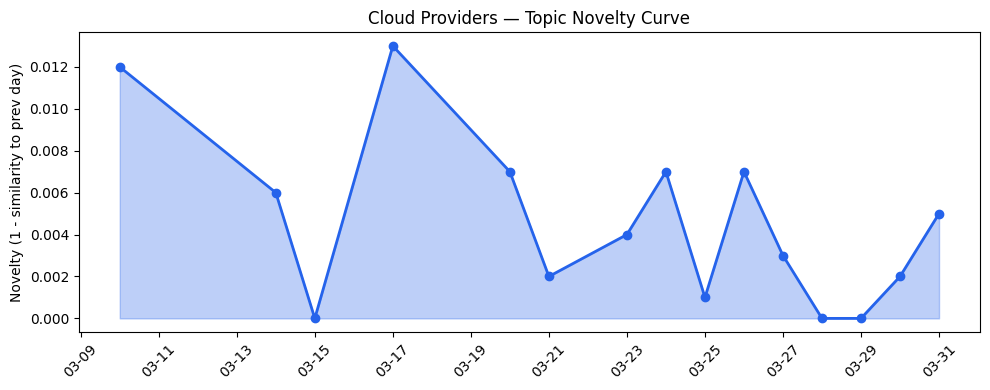
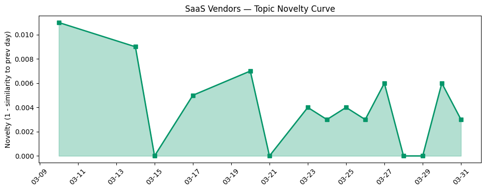

## 今日云计算结构性变化

> AI Agent平台化成为云计算厂商的核心竞争维度，基础设施架构向AI原生演进，同时创纪录融资凸显AI投资热度与地缘政治风险并存。

今日云计算产业呈现出明显的"AI Agent平台化"转向，各大云厂商不再满足于提供基础AI能力，而是构建完整的Agent生态系统。这意味着云计算服务正在从工具层面向平台生态演进，厂商通过[Spanner的多模型优势](https://cloud.google.com/blog/products/databases/spanners-multi-model-advantage-for-agentic-ai/)和[微软的Agentic AI集成](https://www.microsoft.com/en-us/sql-server/blog/2026/03/18/advancing-agentic-ai-with-microsoft-databases-across-a-unified-data-estate/)将AI代理能力深度植入基础设施层。

- 📈 **持续趋势**：技术层话题已连续8天增强，风险信号连续8天升温
- 🆕 **新兴方向**：AI硬件、可持续基础设施、多模型数据库为近期新焦点
- 🔺 **突然升温**：应用层近3天话题集中度显著提升
- 🔑 **新关键词**：AI硬件、OpenAI融资、可持续基础设施
- 📉 **消退关键词**：AI安全、SaaS等泛化概念

## 技术层信号

🟡 渐进改善

云原生技术继续沿着成熟化路径演进，但今日的突破更多体现在AI与基础设施的深度融合。AWS推出[Aurora PostgreSQL秒级Serverless数据库创建](https://aws.amazon.com/blogs/aws/announcing-amazon-aurora-postgresql-serverless-database-creation-in-seconds/)标志着Serverless体验的进一步优化，而Google Cloud的[GKE工作负载扩展性能提升](https://cloud.google.com/blog/products/containers-kubernetes/new-gke-active-buffer-minimizes-scale-out-latency/)则体现了Kubernetes生态的持续精细化。

更重要的信号是数据库层面向AI Agent时代的适应性改造。[Spanner多模型数据库](https://cloud.google.com/blog/products/databases/spanners-multi-model-advantage-for-agentic-ai/)支持统一处理结构化与非结构化数据，为Agent提供更灵活的数据支撑。同时，Cloudflare通过[一行的Kubernetes优化节省600小时运维时间](https://blog.cloudflare.com/one-line-kubernetes-fix-saved-600-hours-a-year/)展示了云原生运维的成熟度提升。火山引擎的[DeerFlow 2.0开源升级](https://developer.volcengine.com/articles/7622159746254307391)则体现了中国厂商在Agent开发框架上的追赶态势。

## 产业资本信号

🔴 强信号

资本层面出现强烈信号，[OpenAI完成1220亿美元创纪录融资](https://techcrunch.com/2026/03/31/openai-not-yet-public-raises-3b-from-retail-investors-in-monster-122b-fund-raise/)将AI初创公司估值推至新高点，8520亿美元的估值创下私有公司纪录。这一融资由Amazon、NVIDIA、软银等巨头领投，显示大厂正通过资本手段强化AI生态布局。

基础设施投资同样活跃，Cloudflare发布[Gen13服务器实现边缘计算性能翻倍](https://blog.cloudflare.com/gen13-launch/)，采用AMD EPYC Turin处理器架构从缓存优先转向核心数优先，体现了边缘算力的持续升级。AWS推出[S3账户区域命名空间](https://aws.amazon.com/blogs/aws/introducing-account-regional-namespaces-for-amazon-s3-general-purpose-buckets/)简化存储管理，而[AI种子初创公司估值普遍提升](https://techcrunch.com/2026/03/31/its-not-your-imagination-ai-seed-startups-are-commanding-higher-valuations/)反映了市场对早期AI项目的追捧。

## 潜在拐点判断

今日观察到AI Agent平台化可能成为产业拐点。各大云厂商同时推进Agent基础设施建设，从数据库支持到开发框架，标志着云计算服务从"提供算力"向"提供智能体生态"的转型。这一转变可能重塑云厂商的竞争格局，拥有更强AI代理能力的厂商将获得差异化优势。

同时，OpenAI的创纪录融资可能标志着AI投资进入新阶段，巨额资本集中于头部企业将加速产业整合，中小AI初创公司面临更严峻的竞争环境。李开复关于[美国在AI硬件战争中落后](https://venturebeat.com/infrastructure/kai-fu-lees-brutal-assessment-america-is-already-losing-the-ai-hardware-war)的警告则暗示地缘政治因素可能成为影响AI发展的关键变量。

## 明日观察点

1. **AI Agent平台竞争态势**：关注各云厂商Agent生态的差异化策略，特别是火山引擎等中国厂商的追赶速度
2. **资本流向变化**：观察创纪录融资后，投资者对AI初创公司的估值预期是否出现调整
3. **地缘政治影响**：关注中美在AI硬件领域的实际差距是否如预警般显著，以及可能的技术管制措施

## 长期趋势坐标

从月度视角看，AI Agent平台化是云计算向智能化演进的自然延伸，但今日的集中爆发表明这一进程正在加速。技术层连续8天的增强趋势印证了基础设施AI化的确定性方向，而风险信号的同步升温提醒我们AI发展仍面临监管与地缘政治挑战。多模型数据库、可持续基础设施等新关键词的出现，反映了产业正从单纯追求算力向综合考虑性能、安全、可持续性的成熟阶段过渡。

## 数据洞察

### 云厂商话题演化
今日云厂商话题新颖度得分0.018，相似度0.982，延续过去15天的稳定趋势。46篇文章显示话题集中度较高，主要围绕AI Agent与基础设施升级。

### SaaS厂商话题演化  
SaaS厂商话题新颖度0.019，相似度0.981，同样呈现延续态势。30篇文章表明SaaS层正积极拥抱AI Agent能力，如Salesforce的IT支持代理实践。

### 趋势图

## 参考来源

**云厂商**
- [Announcing Amazon Aurora PostgreSQL serverless database creation in seconds](https://aws.amazon.com/blogs/aws/announcing-amazon-aurora-postgresql-serverless-database-creation-in-seconds/) — AWS Blog
- [Spanner's multi-model advantage for the era of agentic AI](https://cloud.google.com/blog/products/databases/spanners-multi-model-advantage-for-agentic-ai/) — Google Cloud Blog
- [Advancing agentic AI with Microsoft databases across a unified data estate](https://www.microsoft.com/en-us/sql-server/blog/2026/03/18/advancing-agentic-ai-with-microsoft-databases-across-a-unified-data-estate/) — Microsoft Azure Blog
- [Uplevel your workload scaling performance with GKE active buffer](https://cloud.google.com/blog/products/containers-kubernetes/new-gke-active-buffer-minimizes-scale-out-latency/) — Google Cloud Blog
- [A one-line Kubernetes fix that saved 600 hours a year](https://blog.cloudflare.com/one-line-kubernetes-fix-saved-600-hours-a-year/) — Cloudflare Blog
- [Introducing Programmable Flow Protection: custom DDoS mitigation logic for Magic Transit customers](https://blog.cloudflare.com/programmable-flow-protection/) — Cloudflare Blog
- [Powering the agents: Workers AI now runs large models, starting with Kimi K2.5](https://blog.cloudflare.com/workers-ai-large-models/) — Cloudflare Blog
- [DeerFlow 2.0 开源升级：依托 Harness，让 Agent 不再"半途而废"](https://developer.volcengine.com/articles/7622159746254307391) — 火山引擎 Blog
- [Launching Cloudflare’s Gen 13 servers: trading cache for cores for 2x edge compute performance](https://blog.cloudflare.com/gen13-launch/) — Cloudflare Blog
- [Inside Gen 13: how we built our most powerful server yet](https://blog.cloudflare.com/gen13-config/) — Cloudflare Blog
- [Introducing account regional namespaces for Amazon S3 general purpose buckets](https://aws.amazon.com/blogs/aws/introducing-account-regional-namespaces-for-amazon-s3-general-purpose-buckets/) — AWS Blog
- [Introducing Custom Regions for precision data control](https://blog.cloudflare.com/custom-regions/) — Cloudflare Blog
- [AWS Weekly Roundup: NVIDIA Nemotron 3 Super on Amazon Bedrock, Nova Forge SDK, Amazon Corretto 26, and more](https://aws.amazon.com/blogs/aws/aws-weekly-roundup-nvidia-nemotron-3-super-on-amazon-bedrock-nova-forge-sdk-amazon-corretto-26-and-more-march-23-2026/) — AWS Blog
- [How AI-powered tools are driving the next wave of sustainable infrastructure and reporting](https://cloud.google.com/blog/topics/sustainability/ai-tools-for-sustainable-infrastructure-and-reporting/) — Google Cloud Blog
- [Many agents, one team: Scaling modernization on Azure](https://azure.microsoft.com/en-us/blog/many-agents-one-team-scaling-modernization-on-azure/) — Microsoft Azure Blog
- [AI for nuclear energy: Powering an intelligent, resilient future](https://www.microsoft.com/en-us/industry/blog/energy-and-resources/2026/03/24/ai-for-nuclear-energy-powering-an-intelligent-resilient-future/) — Microsoft Azure Blog

**SaaS厂商**
- [How Salesforce Built, Tested, and Scaled Our IT Support Agents](https://www.salesforce.com/blog/salesforce-ai-agent-development/) — Salesforce Blog
- [How Vail Resorts built an AI assistant to automate personalized recommendations](https://cloud.google.com/blog/products/ai-machine-learning/how-vail-resorts-built-an-ai-assistant-to-automate-personalized-recommendations/) — Google Cloud Blog
- [接入Seedance 2.0，短剧生产Agent「火山剧创」正式邀测](https://developer.volcengine.com/articles/7622325633040793641) — 火山引擎 Blog
- [从"单兵作战"到团队协作：Coding Plan + Agents 团队重构 AI 开发范式](https://developer.volcengine.com/articles/7622375970246230057) — 火山引擎 Blog
- [How ID.me Scaled to 160M Users While Reducing Operational Risk](https://cloud.google.com/blog/products/databases/id-me-scales-and-fights-ai-fraud-with-alloydb/) — Google Cloud Blog

**行业资讯**
- [OpenAI, not yet public, raises $3B from retail investors in monster $122B fund raise](https://techcrunch.com/2026/03/31/openai-not-yet-public-raises-3b-from-retail-investors-in-monster-122b-fund-raise/) — TechCrunch
- [It's not your imagination: AI seed startups are commanding higher valuations](https://techcrunch.com/2026/03/31/its-not-your-imagination-ai-seed-startups-are-commanding-higher-valuations/) — TechCrunch
- [Amazon and Chobani adopt Strella's AI interviews for customer research as fast-growing startup raises $14M](https://venturebeat.com/technology/amazon-and-chobani-adopt-strellas-ai-interviews-for-customer-research-as) — VentureBeat Enterprise
- [Microsoft's Copilot can now build apps and automate your job — here's how it works](https://venturebeat.com/technology/microsofts-copilot-can-now-build-apps-and-automate-your-job-heres-how-it) — VentureBeat Enterprise
- [Kai-Fu Lee's brutal assessment: America is already losing the AI hardware war to China](https://venturebeat.com/infrastructure/kai-fu-lees-brutal-assessment-america-is-already-losing-the-ai-hardware-war) — VentureBeat Enterprise
- [Robotaxi companies refuse to say how often their AVs need remote help](https://techcrunch.com/2026/03/31/robotaxi-companies-refuse-to-say-how-often-their-avs-need-remote-help/) — TechCrunch
- [Tokenization takes the lead in the fight for data security](https://venturebeat.com/technology/tokenization-takes-the-lead-in-the-fight-for-data-security) — VentureBeat Enterprise
- [Yupp shuts down after raising $33M from a16z crypto's Chris Dixon](https://techcrunch.com/2026/03/31/yupp-ai-shuts-down-33m-a16z-crypto-chris-dixon/) — TechCrunch
- [Standing up for the open Internet: why we appealed Italy's "Piracy Shield" fine](https://blog.cloudflare.com/standing-up-for-the-open-internet/) — Cloudflare Blog