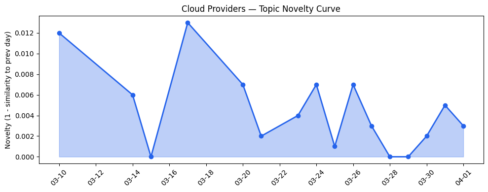
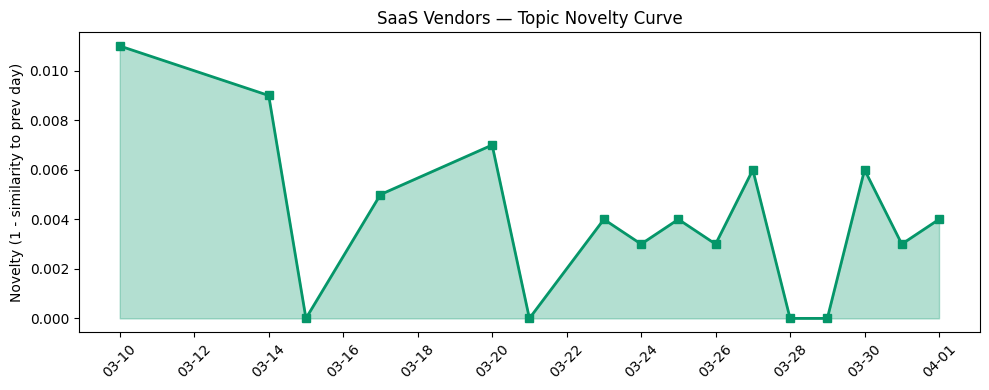

## 今日云计算结构性变化

> 边缘计算基础设施迎来性能翻倍升级，主权AI与模块化数据中心重塑分布式架构，同时AI Agent平台化趋势加速云计算向智能化应用层深度演进。

这意味着云计算产业正在经历从集中式向分布式智能的根本性转变。Cloudflare Gen13服务器采用AMD EPYC Turin处理器实现边缘计算性能翻倍，微软与Armada合作推出Azure Local on Galleon模块化数据中心，这些突破性进展标志着边缘计算正式进入性能竞赛阶段。同时，GKE Inference Gateway统一实时和异步推理、Spanner多模态数据库支持Agentic AI，显示云原生AI基础设施正在向智能化应用层深度演进。

- 📈 **持续趋势**：应用层、基础设施、风险信号话题已连续8天增强
- 🆕 **新兴方向**：主权AI、模块化数据中心、多模态数据库为首次集中出现
- 🔺 **突然升温**：边缘计算与AI Agent平台化趋势明显
- 🔑 **新关键词**：AMD EPYC Turin、Workers AI、数字主权、可持续计算
- 📉 **消退关键词**：传统AI安全、基础云计算概念

## 技术层信号

🔴 重大突破

边缘计算性能实现代际飞跃，Cloudflare Gen13服务器通过采用高核心数AMD EPYC Turin处理器，在边缘节点实现2倍计算性能提升[Launching Cloudflare’s Gen 13 servers: trading cache for cores for 2x edge compute performance](https://blog.cloudflare.com/gen13-launch/)。这种"以缓存换核心"的架构选择反映了边缘计算负载特征的根本变化，从传统的内容分发向复杂AI推理任务演进。

云原生AI基础设施呈现平台化整合趋势，Google Cloud的GKE Inference Gateway统一了实时和异步推理基础设施[Run real-time and async inference on the same infrastructure with GKE Inference Gateway](https://cloud.google.com/blog/products/containers-kubernetes/unifying-real-time-and-async-inference-with-gke-inference-gateway/)，而AWS Aurora PostgreSQL serverless实现秒级数据库创建[Announcing Amazon Aurora PostgreSQL serverless database creation in seconds](https://aws.amazon.com/blogs/aws/announcing-amazon-aurora-postgresql-serverless-database-creation-in-seconds/)，显示无服务器架构正在向更细粒度资源调度演进。

数据库层面向AI Agent工作负载深度优化，Spanner多模态数据库专门针对Agentic AI场景设计[Spanner's multi-model advantage for the era of agentic AI](https://cloud.google.com/blog/products/databases/spanners-multi-model-advantage-for-agentic-ai/)，微软也在推进Agentic AI与数据库的深度融合[Advancing agentic AI with Microsoft databases across a unified data estate](https://www.microsoft.com/en-us/sql-server/blog/2026/03/18/advancing-agentic-ai-with-microsoft-databases-across-a-unified-data-estate/)，标志着数据库技术正在从被动存储向主动参与AI工作流转变。

## 产业资本信号

🔴 强信号

基础设施投资向边缘和主权AI倾斜，微软与Armada合作推出Azure Local on Galleon模块化数据中心[Building sovereign AI at the edge: Microsoft and Armada collaborate to deliver Azure Local on Galleon modular datacenters](https://azure.microsoft.com/en-us/blog/building-sovereign-ai-at-the-edge-microsoft-and-armada-collaborate-to-deliver-azure-local-on-galleon-modular-datacenters/)，这种可部署在任何地点的模块化架构正重塑云计算地理分布格局。同时，AWS推出S3账户区域命名空间简化存储管理，火山引擎强调极致性价比战略，显示基础设施竞争进入精细化运营阶段。

资本大规模流向AI基础设施创新，Q1初创企业融资创纪录[Startup funding shatters all records in Q1](https://techcrunch.com/2026/04/01/startup-funding-shatters-all-records-in-q1/)，其中Cognichip获6000万美元融资专注AI芯片设计自动化[Cognichip wants AI to design the chips that power AI, and just raised $60M to try](https://techcrunch.com/2026/04/01/cognichip-wants-ai-to-design-the-chips-that-power-ai-and-just-raised-60m-to-try/)。SpaceX秘密提交IPO申请潜在估值1.75万亿美元[SpaceX files confidentially for IPO in mega listing potentially valued at $1.75 trillion, report says](https://techcrunch.com/2026/04/01/spacex-files-confidentially-for-ipo-in-mega-listing-potentially-valued-at-1-75-trillion-report-says/)，反映科技巨头资本活动异常活跃。

应用层投资向垂直领域深化，Strella完成1400万美元A轮融资其AI客户研究工具获亚马逊和Chobani采用[Amazon and Chobani adopt Strella's AI interviews for customer research as fast-growing startup raises $14M](https://venturebeat.com/technology/amazon-and-chobani-adopt-strellas-ai-interviews-for-customer-research-as)，火山引擎推出短剧生产Agent「火山剧创」进入垂直内容创作[接入Seedance 2.0，短剧生产Agent「火山剧创」正式邀测](https://developer.volcengine.com/articles/7622325633040793641)，显示AI应用正从通用能力向行业专属解决方案演进。

## 潜在拐点判断

今日观察到边缘计算性能与主权AI部署的拐点信号。Cloudflare边缘计算性能翻倍与微软模块化数据中心的结合，标志着分布式智能基础设施正式进入商业化部署阶段。这一拐点的依据在于：硬件性能突破（AMD EPYC Turin）、架构创新（模块化数据中心）、监管需求（数字主权）三重因素同时成熟。

可能影响在于：传统集中式云数据中心建设节奏可能放缓，边缘计算节点将成为新的竞争焦点；云厂商需要重新平衡中心与边缘的资源分配；主权AI要求将推动区域性云计算生态重构。这一拐点将重塑未来3-5年云计算基础设施投资格局。

## 明日观察点

1. **边缘计算性能基准测试扩散**：关注其他云厂商是否跟进发布类似性能提升方案，特别是Azure和Google Cloud在边缘AI芯片方面的回应
2. **主权AI政策落地进展**：观察各国政府对模块化数据中心合规要求的细化，以及云厂商的适应性调整
3. **AI Agent开发生态成熟度**：监测开发者对GKE Inference Gateway、Workers AI等平台的实际采用情况和使用反馈

## 长期趋势坐标

今日信号在月尺度上确认了云计算向"分布式智能"演进的长期趋势。边缘计算性能突破与主权AI部署的协同，标志着云计算产业正在从"中心化资源池"向"智能能力网络"转型。应用层持续8天的增强趋势显示，企业数字化转型正在从基础设施上云向AI能力嵌入业务工作流深化。

关键词趋势显示，传统云计算概念（AI、Cloud Computing、SaaS）正在被更具体的场景化概念（边缘计算、AI Agent、多模态数据库）替代，反映产业成熟度提升和竞争焦点细化。可持续计算、数字主权等议题的兴起，表明云计算发展正在纳入更广泛的社会责任考量。

## 数据洞察

### 云厂商话题演化
今日云厂商话题新颖度得分0.017，相似度0.983，呈现延续性趋势。过去16天共分析46篇文章，显示云计算话题保持高度一致性，但今日的边缘计算突破和主权AI部署为这一稳定格局注入了新的技术变量。

### SaaS厂商话题演化  
SaaS话题新颖度得分0.02，相似度0.98，同样呈现延续趋势。30篇文章分析显示SaaS厂商正在加速AI能力集成，特别是Salesforce的Agentforce集成模式和火山引擎的垂直行业Agent，反映SaaS产品向智能化工作流助手演进。

### 趋势图

## 参考来源

**云厂商技术更新**
- [Launching Cloudflare’s Gen 13 servers: trading cache for cores for 2x edge compute performance](https://blog.cloudflare.com/gen13-launch/) — Cloudflare Blog
- [Powering the agents: Workers AI now runs large models, starting with Kimi K2.5](https://blog.cloudflare.com/workers-ai-large-models/) — Cloudflare Blog  
- [Inside Gen 13: how we built our most powerful server yet](https://blog.cloudflare.com/gen13-config/) — Cloudflare Blog
- [Announcing Amazon Aurora PostgreSQL serverless database creation in seconds](https://aws.amazon.com/blogs/aws/announcing-amazon-aurora-postgresql-serverless-database-creation-in-seconds/) — AWS Blog
- [Run real-time and async inference on the same infrastructure with GKE Inference Gateway](https://cloud.google.com/blog/products/containers-kubernetes/unifying-real-time-and-async-inference-with-gke-inference-gateway/) — Google Cloud Blog
- [Spanner's multi-model advantage for the era of agentic AI](https://cloud.google.com/blog/products/databases/spanners-multi-model-advantage-for-agentic-ai/) — Google Cloud Blog
- [Advancing agentic AI with Microsoft databases across a unified data estate](https://www.microsoft.com/en-us/sql-server/blog/2026/03/18/advancing-agentic-ai-with-microsoft-databases-across-a-unified-data-estate/) — Microsoft Azure Blog

**基础设施部署**
- [Building sovereign AI at the edge: Microsoft and Armada collaborate to deliver Azure Local on Galleon modular datacenters](https://azure.microsoft.com/en-us/blog/building-sovereign-ai-at-the-edge-microsoft-and-armada-collaborate-to-deliver-azure-local-on-galleon-modular-datacenters/) — Microsoft Azure Blog
- [Introducing account regional namespaces for Amazon S3 general purpose buckets](https://aws.amazon.com/blogs/aws/introducing-account-regional-namespaces-for-amazon-s3-general-purpose-buckets/) — AWS Blog
- [Microsoft at NVIDIA GTC: New solutions for Microsoft Foundry, Azure AI infrastructure and Physical AI](https://blogs.microsoft.com/blog/2026/03/16/microsoft-at-nvidia-gtc-new-solutions-for-microsoft-foundry-azure-ai-infrastructure-and-physical-ai/) — Microsoft Azure Blog

**SaaS与应用创新**
- [接入Seedance 2.0，短剧生产Agent「火山剧创」正式邀测](https://developer.volcengine.com/articles/7622325633040793641) — 火山引擎 Blog
- [从"单兵作战"到团队协作：Coding Plan + Agents 团队重构 AI 开发范式](https://developer.volcengine.com/articles/7622375970246230057) — 火山引擎 Blog
- [How to Choose the Right Integration Pattern for Agentforce](https://www.salesforce.com/blog/how-to-choose-integration-pattern-for-agentforce/) — Salesforce Blog
- [AI for nuclear energy: Powering an intelligent, resilient future](https://www.microsoft.com/en-us/industry/blog/energy-and-resources/2026/03/24/ai-for-nuclear-energy-powering-an-intelligent-resilient-future/) — Microsoft Azure Blog
- [Announcing the AWS Sustainability console: Programmatic access, configurable CSV reports, and Scope 1–3 reporting in one place](https://aws.amazon.com/blogs/aws/announcing-the-aws-sustainability-console-programmatic-access-configurable-csv-reports-and-scope-1-3-reporting-in-one-place/) — AWS Blog
- [How AI-powered tools are driving the next wave of sustainable infrastructure and reporting](https://cloud.google.com/blog/topics/sustainability/ai-tools-for-sustainable-infrastructure-and-reporting/) — Google Cloud Blog

**行业资讯与资本**
- [Startup funding shatters all records in Q1](https://techcrunch.com/2026/04/01/startup-funding-shatters-all-records-in-q1/) — TechCrunch
- [SpaceX files confidentially for IPO in mega listing potentially valued at $1.75 trillion, report says](https://techcrunch.com/2026/04/01/spacex-files-confidentially-for-ipo-in-mega-listing-potentially-valued-at-1-75-trillion-report-says/) — TechCrunch
- [Cognichip wants AI to design the chips that power AI, and just raised $60M to try](https://techcrunch.com/2026/04/01/cognichip-wants-ai-to-design-the-chips-that-power-ai-and-just-raised-60m-to-try/) — TechCrunch
- [Amazon and Chobani adopt Strella's AI interviews for customer research as fast-growing startup raises $14M](https://venturebeat.com/technology/amazon-and-chobani-adopt-strellas-ai-interviews-for-customer-research-as) — VentureBeat Enterprise
- [The reputation of troubled YC startup Delve has gotten even worse](https://techcrunch.com/2026/04/01/the-reputation-of-troubled-yc-startup-delve-has-gotten-even-worse/) — TechCrunch
- [‘System failure’ paralyzes Baidu robotaxis in China](https://techcrunch.com/2026/04/01/system-failure-paralyzes-baidu-robotaxis-in-china/) — TechCrunch
- [North Korea-Nexus Threat Actor Compromises Widely Used Axios NPM Package in Supply Chain Attack](https://cloud.google.com/blog/topics/threat-intelligence/north-korea-threat-actor-targets-axios-npm-package/) — Google Cloud Blog
- [Navigating digital sovereignty at the frontier of transformation](https://www.microsoft.com/en-us/microsoft-cloud/blog/2026/03/25/navigating-digital-sovereignty-at-the-frontier-of-transformation/) — Microsoft Azure Blog
- [Our ongoing commitment to privacy for the 1.1.1.1 public DNS resolver](https://blog.cloudflare.com/1111-privacy-examination-2026/) — Cloudflare Blog
- [ClawSentry 安装和使用说明](https://developer.volcengine.com/articles/7606188681602596907) — 火山引擎 Blog