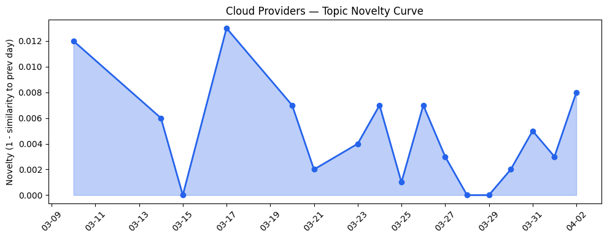
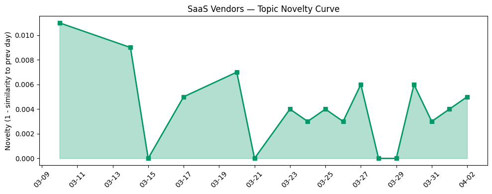

## 今日云计算结构性变化

> 云厂商正加速AI基础设施整合，Spanner多模型数据库、边缘主权AI部署与AI Agent开发平台成为支撑Agentic AI时代的关键结构性突破，同时数据安全与合规风险显著上升。

今日云计算产业正在经历从"AI赋能云"到"AI重构云"的结构性转变。Spanner多模型数据库在Agentic AI时代展现的结构性优势标志着云原生数据库正在从单一模型支持向统一数据平台演进，而边缘主权AI部署则重新定义了云服务的边界和治理模式。这种变化意味着云计算基础设施正在为即将到来的Agentic AI时代进行根本性重构。

- 📈 **持续趋势**：应用层话题已连续8天增强
- 🔺 **突然升温**：基础设施方向近3天突然集中出现
- 🔑 **新关键词**：Spanner、供应链风险、网络安全
- 📈 **上升关键词**：AI Agent、Kubernetes、Serverless、云原生、多云架构、边缘计算

## 技术层信号

🔴 重大突破

云原生基础设施正经历Agentic AI驱动的结构性变革。Google Cloud的[GKE Inference Gateway统一实时与异步推理](https://cloud.google.com/blog/products/containers-kubernetes/unifying-real-time-and-async-inference-with-gke-inference-gateway/)和[GKE Active Buffer优化工作负载扩展性能](https://cloud.google.com/blog/products/containers-kubernetes/new-gke-active-buffer-minimizes-scale-out-latency/)标志着容器编排系统正在从资源调度向AI工作负载智能优化演进。同时，Cloudflare的[Dynamic Workers实现AI生成代码安全沙盒执行性能提升100倍](https://blog.cloudflare.com/dynamic-workers/)展示了边缘计算平台在AI安全隔离方面的重大突破。

数据库架构正在经历多模型融合的关键转折点。[Spanner多模型优势在Agentic AI时代凸显](https://cloud.google.com/blog/products/databases/spanners-multi-model-advantage-for-agentic-ai/)，支持关系型、文档型和图数据模型的统一处理，这解决了AI Agent需要跨数据模型复杂查询的核心痛点。微软同样在[通过统一数据资产推进Agentic AI](https://www.microsoft.com/en-us/sql-server/blog/2026/03/18/advancing-agentic-ai-with-microsoft-databases-across-a-unified-data-estate/)，表明多模型数据库正成为云厂商竞争的新焦点。

硬件基础设施同步升级，Cloudflare的[Gen13服务器采用AMD EPYC Turin处理器实现边缘计算性能翻倍](https://blog.cloudflare.com/gen13-launch/)，结合微软发布的三个新基础模型，显示云厂商正在构建从芯片到模型的完整AI基础设施栈。

## 产业资本信号

🟡 中等信号

基础设施布局呈现主权AI与可持续计算双轨并行。微软与Armada合作推出[Azure Local on Galleon模块化数据中心](https://azure.microsoft.com/en-us/blog/building-sovereign-ai-at-the-edge-microsoft-and-armada-collaborate-to-deliver-azure-local-on-galleon-modular-datacenters/)，实现了边缘主权AI部署的结构性创新，而AWS推出[可持续性控制台整合Scope 1-3碳排放报告](https://aws.amazon.com/blogs/aws/announcing-the-aws-sustainability-console-programmatic-access-configurable-csv-reports-and-scope-1-3-reporting-in-one-place/)则显示环境合规成为云服务新维度。

资本流向显示AI应用层投资活跃但基础设施投资更为谨慎。AI访谈初创公司Strella完成1400万美元A轮融资并获得[Amazon和Chobani采用](https://venturebeat.com/technology/amazon-and-chobani-adopt-strellas-ai-interviews-for-customer-research-as)，而Gateway Capital完成2500万美元Fund II的首轮关闭。值得注意的是，大厂更聚焦内部AI基础设施战略布局而非外部收购，OpenAI收购TBPN的案例表明AI厂商正在构建内容生态而非传统云服务扩张。

## 潜在拐点判断

今日观察到AI基础设施架构的潜在拐点信号。Spanner多模型数据库的成熟标志着云数据库正在从"数据库即服务"向"AI数据平台"转折，这将重构云厂商在AI时代的数据战略。同时，边缘主权AI部署模式的兴起可能预示着云计算从集中式向分布式架构的长期转折，数据主权和合规要求正在驱动基础设施的地理分布重构。

另一个关键拐点是AI Agent开发从工具层向平台层迁移，火山引擎的[DeerFlow 2.0开源升级](https://developer.volcengine.com/articles/7622159746254307391)和[CodingPlan + Agents重构AI开发范式](https://developer.volcengine.com/articles/7622375970246230057)显示Agent开发正在从实验性项目转向标准化平台。

## 明日观察点

1. **多模型数据库采用率**：关注Spanner等多模型数据库在企业的实际落地情况，判断是否真能解决Agentic AI的数据异构挑战
2. **边缘主权AI合规框架**：观察微软Azure Local on Galleon等方案的合规实践，评估主权AI对云计算全球部署模式的影响
3. **AI Agent平台生态竞争**：监控火山引擎、Salesforce等厂商的Agent平台发展，判断标准化与定制化之间的平衡点

## 长期趋势坐标

今日信号在月尺度上确认了AI基础设施重构的加速趋势。应用层话题连续8天增强表明AI正在从技术概念转向实际业务应用，而基础设施近3天的突然升温显示底层支撑系统正在快速响应上层需求。关键词趋势显示"AI Agent"、"Kubernetes"、"Serverless"等技术的融合正在形成新的技术栈，而"供应链风险"、"网络安全"的凸显则反映了AI规模化应用带来的新型风险维度。

从整体新颖度看，云厂商话题延续性较高（新颖度0.022），SaaS厂商同样保持稳定（新颖度0.024），表明当前产业处于技术路径的深化期而非转折期，各方都在既定的AI方向上持续投入和优化。

## 数据洞察

### 云厂商话题演化
云厂商话题新颖度得分0.022，均值相似度0.978，呈现延续趋势。过去17天内46篇文章显示云厂商话题保持高度一致性，主要围绕AI基础设施优化和云原生技术深化。

### SaaS厂商话题演化  
SaaS厂商话题新颖度0.024，均值相似度0.976，同样呈现延续趋势。30篇文章表明SaaS厂商聚焦AI应用落地和垂直行业解决方案，与云基础设施层形成协同演进。

### 趋势图

## 参考来源

**云厂商**
- [Run real-time and async inference on the same infrastructure with GKE Inference Gateway](https://cloud.google.com/blog/products/containers-kubernetes/unifying-real-time-and-async-inference-with-gke-inference-gateway/) — Google Cloud Blog
- [Spanner's multi-model advantage for the era of agentic AI](https://cloud.google.com/blog/products/databases/spanners-multi-model-advantage-for-agentic-ai/) — Google Cloud Blog
- [Sandboxing AI agents, 100x faster](https://blog.cloudflare.com/dynamic-workers/) — Cloudflare Blog
- [Launching Cloudflare’s Gen 13 servers: trading cache for cores for 2x edge compute performance](https://blog.cloudflare.com/gen13-launch/) — Cloudflare Blog
- [Uplevel your workload scaling performance with GKE active buffer](https://cloud.google.com/blog/products/containers-kubernetes/new-gke-active-buffer-minimizes-scale-out-latency/) — Google Cloud Blog
- [Announcing managed daemon support for Amazon ECS Managed Instances](https://aws.amazon.com/blogs/aws/announcing-managed-daemon-support-for-amazon-ecs-managed-instances/) — AWS Blog
- [Microsoft takes on AI rivals with three new foundational models](https://techcrunch.com/2026/04/02/microsoft-takes-on-ai-rivals-with-three-new-foundational-models/) — TechCrunch
- [What’s new with Microsoft in open-source and Kubernetes at KubeCon + CloudNativeCon Europe 2026](https://opensource.microsoft.com/blog/2026/03/24/whats-new-with-microsoft-in-open-source-and-kubernetes-at-kubecon-cloudnativecon-europe-2026/) — Microsoft Azure Blog
- [Advancing agentic AI with Microsoft databases across a unified data estate](https://www.microsoft.com/en-us/sql-server/blog/2026/03/18/advancing-agentic-ai-with-microsoft-databases-across-a-unified-data-estate/) — Microsoft Azure Blog
- [Building sovereign AI at the edge: Microsoft and Armada collaborate to deliver Azure Local on Galleon modular datacenters](https://azure.microsoft.com/en-us/blog/building-sovereign-ai-at-the-edge-microsoft-and-armada-collaborate-to-deliver-azure-local-on-galleon-modular-datacenters/) — Microsoft Azure Blog
- [Announcing the AWS Sustainability console: Programmatic access, configurable CSV reports, and Scope 1–3 reporting in one place](https://aws.amazon.com/blogs/aws/announcing-the-aws-sustainability-console-programmatic-access-configurable-csv-reports-and-scope-1-3-reporting-in-one-place/) — AWS Blog
- [AWS Weekly Roundup: NVIDIA Nemotron 3 Super on Amazon Bedrock, Nova Forge SDK, Amazon Corretto 26, and more](https://aws.amazon.com/blogs/aws/aws-weekly-roundup-nvidia-nemotron-3-super-on-amazon-bedrock-nova-forge-sdk-amazon-corretto-26-and-more-march-23-2026/) — AWS Blog
- [Navigating digital sovereignty at the frontier of transformation](https://www.microsoft.com/en-us/microsoft-cloud/blog/2026/03/25/navigating-digital-sovereignty-at-the-frontier-of-transformation/) — Microsoft Azure Blog
- [Microsoft at NVIDIA GTC: New solutions for Microsoft Foundry, Azure AI infrastructure and Physical AI](https://blogs.microsoft.com/blog/2026/03/16/microsoft-at-nvidia-gtc-new-solutions-for-microsoft-foundry-azure-ai-infrastructure-and-physical-ai/) — Microsoft Azure Blog
- [How AI-powered tools are driving the next wave of sustainable infrastructure and reporting](https://cloud.google.com/blog/topics/sustainability/ai-tools-for-sustainable-infrastructure-and-reporting/) — Google Cloud Blog
- [Inside Gen 13: how we built our most powerful server yet](https://blog.cloudflare.com/gen13-config/) — Cloudflare Blog
- [vSphere and BRICKSTORM Malware: A Defender's Guide](https://cloud.google.com/blog/topics/threat-intelligence/vsphere-brickstorm-defender-guide/) — Google Cloud Blog
- [Our ongoing commitment to privacy for the 1.1.1.1 public DNS resolver](https://blog.cloudflare.com/1111-privacy-examination-2026/) — Cloudflare Blog
- [Introducing Programmable Flow Protection: custom DDoS mitigation logic for Magic Transit customers](https://blog.cloudflare.com/programmable-flow-protection/) — Cloudflare Blog

**SaaS厂商**
- [Proving the Power of Script: How Datasite Agents Achieved 82% Deflection and 4.8/5 CSAT](https://www.salesforce.com/blog/datasite-agentforce/) — Salesforce Blog
- [How Honeylove boosts product quality and service efficiency with BigQuery](https://cloud.google.com/blog/products/data-analytics/how-honeylove-boosts-product-quality-and-service-efficiency-with-bigquery/) — Google Cloud Blog
- [接入Seedance 2.0，短剧生产Agent「火山剧创」正式邀测](https://developer.volcengine.com/articles/7622325633040793641) — 火山引擎 Blog
- [AI for nuclear energy: Powering an intelligent, resilient future](https://www.microsoft.com/en-us/industry/blog/energy-and-resources/2026/03/24/ai-for-nuclear-energy-powering-an-intelligent-resilient-future/) — Microsoft Azure Blog
- [How to Choose the Right Integration Pattern for Agentforce](https://www.salesforce.com/blog/how-to-choose-integration-pattern-for-agentforce/) — Salesforce Blog
- [从"单兵作战"到团队协作：Coding Plan + Agents 团队重构 AI 开发范式](https://developer.volcengine.com/articles/7622375970246230057) — 火山引擎 Blog
- [Activating Your Data Layer for Production-Ready AI](https://cloud.google.com/blog/topics/developers-practitioners/activating-your-data-layer-for-production-ready-ai/) — Google Cloud Blog
- [火山引擎正式推出四款数据产品 将持续完善敏捷数智引擎矩阵](https://www.cnblogs.com/volcengine/p/15640481.html) — 火山引擎博客

**行业资讯**
- [Gateway Capital announces first close of $25M Fund II](https://techcrunch.com/2026/04/02/gateway-capital-dana-guthrie-milwaukee-first-close-fund-ii/) — TechCrunch
- [Amazon and Chobani adopt Strella's AI interviews for customer research as fast-growing startup raises $14M](https://venturebeat.com/technology/amazon-and-chobani-adopt-strellas-ai-interviews-for-customer-research-as) — VentureBeat Enterprise
- [OpenAI acquires TBPN, the buzzy founder-led business talk show](https://techcrunch.com/2026/04/02/openai-acquires-tbpn-the-buzzy-founder-led-business-talk-show/) — TechCrunch
- [Telehealth giant Hims & Hers says its customer support system was hacked](https://techcrunch.com/2026/04/02/telehealth-giant-hims-hers-says-its-customer-support-system-was-hacked/) — TechCrunch
- [Money transfer app Duc exposed thousands of driver’s licenses and passports to the open web](https://techcrunch.com/2026/04/02/canadian-money-transfer-app-duc-expose-drivers-licenses-passports-amazon-server/) — TechCrunch
- [Kai-Fu Lee's brutal assessment: America is already losing the AI hardware war to China](https://venturebeat.com/infrastructure/kai-fu-lees-brutal-assessment-america-is-already-losing-the-ai-hardware-war) — VentureBeat Enterprise