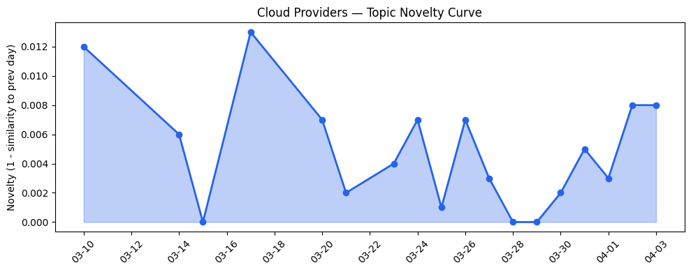
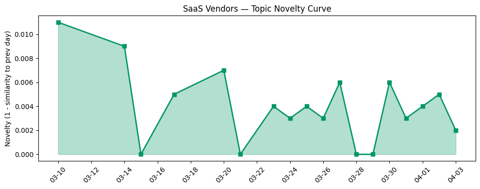

## 今日云计算结构性变化

> 云厂商正加速AI基础设施整合，从推理架构统一、Agent执行环境优化到可持续算力布局，竞争焦点从底层资源转向平台化AI治理与行业应用深化。

今日云计算产业的核心变化在于AI基础设施的深度整合与治理能力的平台化演进。Google Cloud推出GKE Inference Gateway统一实时与异步推理架构，Cloudflare发布Dynamic Workers实现AI代码安全沙箱执行速度提升100倍，标志着云原生AI基础设施正从资源供给转向智能工作流编排。同时，微软将AI应用于核能行业优化关键基础设施，Salesforce Agentforce平台在旅游行业实现企业级部署，显示AI应用正从通用能力向垂直行业深度渗透。

- 📈 **持续趋势**：基础设施话题已连续8天增强，资本信号话题连续8天增强
- 🔺 **突然升温**：基础设施方向近3天突然集中出现，应用层方向近3天突然升温
- 🔑 **新关键词**：AI开发平台、AI治理、Vertex AI、可持续性、数据中心能源
- 📉 **消退关键词**：AI安全、Cloud Computing、NVIDIA、OpenClaw、SaaS

## 技术层信号

🔴 重大突破

云原生AI基础设施迎来重要拐点，Google Cloud的[GKE Inference Gateway](https://cloud.google.com/blog/products/containers-kubernetes/unifying-real-time-and-async-inference-with-gke-inference-gateway/)实现了实时与异步推理架构的统一，解决了AI工作负载编排的核心痛点。Cloudflare的[Dynamic Workers](https://blog.cloudflare.com/dynamic-workers/)通过安全沙箱技术将AI代码执行速度提升100倍，为Agentic AI提供了可靠的执行环境。Envoy网络被重新定位为[Agentic AI时代的基础设施](https://cloud.google.com/blog/products/networking/the-case-for-envoy-networking-in-the-agentic-ai-era/)，显示网络层正在为AI工作流重构。

在数据库层面，Azure SQL深度集成AI能力，AWS推出[Aurora PostgreSQL serverless数据库创建秒级响应](https://aws.amazon.com/blogs/aws/announcing-amazon-aurora-postgresql-serverless-database-creation-in-seconds/)，Gemma 4作为最强大开源模型发布，共同构建了AI原生数据基础设施。Cloudflare还重新思考[AI时代的缓存架构](https://blog.cloudflare.com/rethinking-cache-ai-humans/)，从以人为中心转向AI工作负载优先的设计理念。

## 产业资本信号

🟡 中等信号

资本流向显示AI治理和垂直应用成为投资热点。Anthropic以[4亿美元收购生物科技AI初创Coefficient Bio](https://techcrunch.com/2026/04/03/anthropic-buys-biotech-startup-coefficient-bio-in-400m-deal-reports/)，Moonbounce融资1200万美元开发AI内容审核引擎，显示资本正从通用AI模型转向特定领域的治理工具。Strella完成[1400万美元A轮融资获Amazon和Chobani采用](https://venturebeat.com/technology/amazon-and-chobani-adopt-strellas-ai-interviews-for-customer-research-as)，验证了AI在企业客户研究中的商业化前景。

基础设施投资呈现两极分化：一方面AI公司投资天然气电厂应对算力需求，另一方面Cloudflare Gen 13服务器采用AMD EPYC Turin处理器提升边缘性能。火山引擎强调极致性价比云战略，微软与NVIDIA深化AI基础设施合作，显示头部厂商正在通过差异化定位应对算力成本压力。

## 潜在拐点判断

今日观察到AI基础设施治理能力的拐点信号。云厂商不再满足于提供算力资源，而是通过平台化工具链（如GKE Inference Gateway、Dynamic Workers）深度介入AI工作流编排，这标志着云计算从IaaS向AIaaS的实质性转型。同时，AI治理从安全合规向业务价值证明转变，Salesforce的[Agentforce平台实现82%问题转接率和4.8/5客户满意度](https://www.salesforce.com/blog/datasite-agentforce/)，显示企业级AI应用开始规模化验证。

另一个重要拐点是可持续算力成为竞争维度，AWS推出[可持续性控制台整合碳排放报告](https://aws.amazon.com/blogs/aws/announcing-the-aws-sustainability-console-programmatic-access-configurable-csv-reports-and-scope-1-3-reporting-in-one-place/)，AI公司投资天然气电厂，表明能耗管理从成本问题升级为战略能力。

## 明日观察点

1. **Agentic AI平台化进展**：关注各云厂商如何将孤立的AI能力整合为端到端的Agent工作流平台，特别是跨云协同和行业模板的推出节奏
2. **可持续算力商业模式**：观察火山引擎的极致性价比策略与头部厂商的高性能路线如何分化，以及客户对不同能耗方案的接受度
3. **AI治理投资趋势**：监测Moonbounce等治理工具厂商的后续融资和客户拓展，判断AI治理是否成为独立的投资赛道

## 长期趋势坐标

从月度视角看，云计算产业正经历从"云上AI"到"AI原生云"的深刻转型。基础设施话题连续8天增强表明，算力供给和能耗管理已成为行业瓶颈，推动厂商重构底层架构。新关键词"AI治理"和"可持续性"的涌现，反映了产业从技术竞赛转向责任竞争的大趋势。云厂商话题相似度高达0.978，显示头部玩家在技术路线上的收敛，但应用层0.976的相似度表明在行业落地层面仍存在差异化机会。

## 数据洞察

### 云厂商话题演化
云厂商话题新颖度得分0.022，平均相似度0.978，呈现高度延续性。过去18天内46篇文章显示技术路线稳定，焦点集中在AI基础设施整合与平台化演进。

### SaaS厂商话题演化  
SaaS厂商话题新颖度得分0.024，平均相似度0.976，同样呈现延续趋势。30篇文章表明应用层正从通用工具向行业专用Agent平台深化，Salesforce和火山引擎的行业案例成为典型代表。

### 趋势图

## 参考来源

**云厂商**
- [Run real-time and async inference on the same infrastructure with GKE Inference Gateway](https://cloud.google.com/blog/products/containers-kubernetes/unifying-real-time-and-async-inference-with-gke-inference-gateway/) — Google Cloud Blog
- [Sandboxing AI agents, 100x faster](https://blog.cloudflare.com/dynamic-workers/) — Cloudflare Blog
- [Announcing managed daemon support for Amazon ECS Managed Instances](https://aws.amazon.com/blogs/aws/announcing-managed-daemon-support-for-amazon-ecs-managed-instances/) — AWS Blog
- [Advancing agentic AI with Microsoft databases across a unified data estate](https://www.microsoft.com/en-us/sql-server/blog/2026/03/18/advancing-agentic-ai-with-microsoft-databases-across-a-unified-data-estate/) — Microsoft Azure Blog
- [Introducing Gemma 4 on Google Cloud: Our most capable open models yet](https://cloud.google.com/blog/products/ai-machine-learning/gemma-4-available-on-google-cloud/) — Google Cloud Blog
- [Envoy: A future-ready foundation for agentic AI networking](https://cloud.google.com/blog/products/networking/the-case-for-envoy-networking-in-the-agentic-ai-era/) — Google Cloud Blog
- [How we use Abstract Syntax Trees (ASTs) to turn Workflows code into visual diagrams](https://blog.cloudflare.com/workflow-diagrams/) — Cloudflare Blog
- [Why we're rethinking cache for the AI era](https://blog.cloudflare.com/rethinking-cache-ai-humans/) — Cloudflare Blog
- [Announcing Amazon Aurora PostgreSQL serverless database creation in seconds](https://aws.amazon.com/blogs/aws/announcing-amazon-aurora-postgresql-serverless-database-creation-in-seconds/) — AWS Blog
- [Launching Cloudflare’s Gen 13 servers: trading cache for cores for 2x edge compute performance](https://blog.cloudflare.com/gen13-launch/) — Cloudflare Blog
- [Announcing the AWS Sustainability console: Programmatic access, configurable CSV reports, and Scope 1–3 reporting in one place](https://aws.amazon.com/blogs/aws/announcing-the-aws-sustainability-console-programmatic-access-configurable-csv-reports-and-scope-1-3-reporting-in-one-place/) — AWS Blog
- [Introducing Veo 3.1 Lite and a new Veo upscaling capability on Vertex AI](https://cloud.google.com/blog/products/ai-machine-learning/veo-3-1-lite-and-a-new-veo-upscaling-capability-on-vertex-ai/) — Google Cloud Blog
- [Inside Gen 13: how we built our most powerful server yet](https://blog.cloudflare.com/gen13-config/) — Cloudflare Blog
- [Microsoft at NVIDIA GTC: New solutions for Microsoft Foundry, Azure AI infrastructure and Physical AI](https://blogs.microsoft.com/blog/2026/03/16/microsoft-at-nvidia-gtc-new-solutions-for-microsoft-foundry-azure-ai-infrastructure-and-physical-ai/) — Microsoft Azure Blog
- [What’s new with Microsoft in open-source and Kubernetes at KubeCon + CloudNativeCon Europe 2026](https://opensource.microsoft.com/blog/2026/03/24/whats-new-with-microsoft-in-open-source-and-kubernetes-at-kubecon-cloudnativecon-europe-2026/) — Microsoft Azure Blog
- [谭待：开放云引擎，共创新未来 - 火山引擎](https://www.cnblogs.com/volcengine/p/15640981.html) — 火山引擎博客
- [AI for nuclear energy: Powering an intelligent, resilient future](https://www.microsoft.com/en-us/industry/blog/energy-and-resources/2026/03/24/ai-for-nuclear-energy-powering-an-intelligent-resilient-future/) — Microsoft Azure Blog
- [Many agents, one team: Scaling modernization on Azure](https://azure.microsoft.com/en-us/blog/many-agents-one-team-scaling-modernization-on-azure/) — Microsoft Azure Blog
- [Modernizing regulated industries with cloud and agentic AI](https://www.microsoft.com/en-us/industry/blog/general/2026/03/11/modernizing-regulated-industries-with-cloud-and-agentic-ai/) — Microsoft Azure Blog
- [vSphere and BRICKSTORM Malware: A Defender's Guide](https://cloud.google.com/blog/topics/threat-intelligence/vsphere-brickstorm-defender-guide/) — Google Cloud Blog

**SaaS厂商**
- [Engine Delivers Autonomous Travel Support with Hybrid Development on the Agentforce 360 Platform](https://www.salesforce.com/blog/engine-customer-story/) — Salesforce Blog
- [Proving the Power of Script: How Datasite Agents Achieved 82% Deflection and 4.8/5 CSAT](https://www.salesforce.com/blog/datasite-agentforce/) — Salesforce Blog
- [接入Seedance 2.0，短剧生产Agent「火山剧创」正式邀测](https://developer.volcengine.com/articles/7622325633040793641) — 火山引擎 Blog
- [从“单兵作战”到团队协作：Coding Plan + Agents 团队重构 AI 开发范式](https://developer.volcengine.com/articles/7622375970246230057) — 火山引擎 Blog

**行业资讯**
- [AI companies are building huge natural gas plants to power data centers. What could go wrong?](https://techcrunch.com/2026/04/03/ai-energy-microsoft-meta-google-natural-gas-mining-fomo/) — TechCrunch
- [Inside LinkedIn’s generative AI cookbook: How it scaled people search to 1.3 billion users](https://venturebeat.com/infrastructure/inside-linkedins-generative-ai-cookbook-how-it-scaled-people-search-to-1-3) — VentureBeat Enterprise
- [How Honeylove boosts product quality and service efficiency with BigQuery](https://cloud.google.com/blog/products/data-analytics/how-honeylove-boosts-product-quality-and-service-efficiency-with-bigquery/) — Google Cloud Blog
- [Introducing EmDash — the spiritual successor to WordPress that solves plugin security](https://blog.cloudflare.com/emdash-wordpress/) — Cloudflare Blog
- [Anthropic buys biotech startup Coefficient Bio in $400M deal: Reports](https://techcrunch.com/2026/04/03/anthropic-buys-biotech-startup-coefficient-bio-in-400m-deal-reports/) — TechCrunch
- [Amazon and Chobani adopt Strella's AI interviews for customer research as fast-growing startup raises $14M](https://venturebeat.com/technology/amazon-and-chobani-adopt-strellas-ai-interviews-for-customer-research-as) — VentureBeat Enterprise
- [The Facebook insider building content moderation for the AI era](https://techcrunch.com/2026/04/03/moonbounce-fundraise-content-moderation-for-the-ai-era/) — TechCrunch
- [Europe’s cyber agency blames hacking gangs for massive data breach and leak](https://techcrunch.com/2026/04/03/europes-cyber-agency-blames-hacking-gangs-for-massive-data-breach-and-leak/) — TechCrunch
- [Tokenization takes the lead in the fight for data security](https://venturebeat.com/technology/tokenization-takes-the-lead-in-the-fight-for-data-security) — VentureBeat Enterprise
- [People would rather have an Amazon warehouse in their backyard than a data center](https://techcrunch.com/2026/04/03/people-would-rather-have-an-amazon-warehouse-in-their-backyard-than-a-data-center/) — TechCrunch
- [Kai-Fu Lee's brutal assessment: America is already losing the AI hardware war to China](https://venturebeat.com/infrastructure/kai-fu-lees-brutal-assessment-america-is-already-losing-the-ai-hardware-war) — VentureBeat Enterprise
- [Our ongoing commitment to privacy for the 1.1.1.1 public DNS resolver](https://blog.cloudflare.com/1111-privacy-examination-2026/) — Cloudflare Blog
- [Introducing Programmable Flow Protection: custom DDoS mitigation logic for Magic Transit customers](https://blog.cloudflare.com/programmable-flow-protection/) — Cloudflare Blog