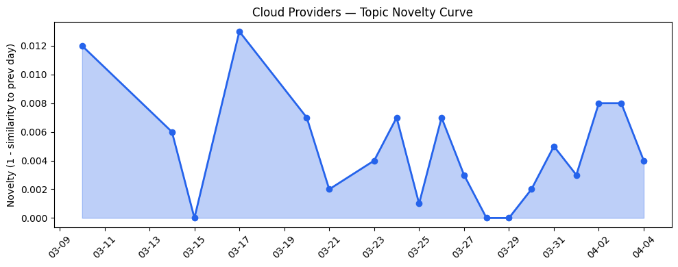
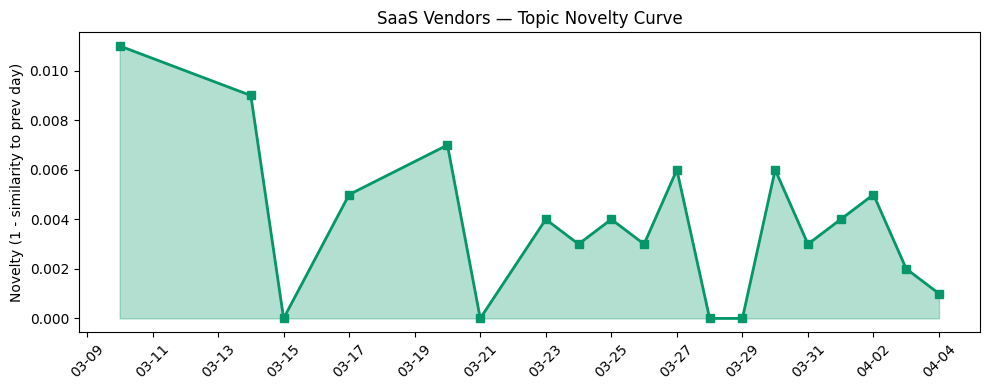

## 今日云计算结构性变化

> 云计算行业正从基础设施竞争转向AI驱动、安全优先、主权合规的综合能力较量。

这意味着云计算厂商的竞争焦点已从单纯的算力规模转向AI原生基础设施、边缘部署能力和数据主权合规性的综合比拼。微软与Armada合作的Azure Local on Galleon模块化数据中心和Cloudflare Gen 13服务器的性能突破，标志着边缘计算正式成为AI基础设施的核心战场。同时，Google Cloud的GKE Inference Gateway和Cloudflare的Dynamic Workers显示云厂商正在重构AI推理基础设施以适应Agent生态需求。

- 📈 **持续趋势**：应用层话题已连续8天增强，风险信号话题已连续8天增强
- 🔺 **突然升温**：技术层、基础设施、应用层、风险信号、资本信号近3天突然集中出现
- 🆕 **新兴方向**：AMD EPYC、Agent生态、Azure Local、云原生安全为30天内首次出现
- 🔑 **新关键词**：数字主权、边缘计算热度显著上升
- 📉 **消退关键词**：AI、AI Agents、AI安全、Cloud Computing、NVIDIA、OpenClaw、SaaS等通用术语热度下降

## 技术层信号

🟡 渐进改善

Cloudflare推出Dynamic Workers实现AI沙箱执行速度提升100倍，这标志着边缘AI推理性能取得实质性突破。Google Cloud的GKE Inference Gateway统一实时和异步推理基础设施，显示云厂商正在重构AI工作负载的部署架构。同时，Cloudflare Gen 13服务器采用AMD EPYC Turin处理器实现边缘计算性能翻倍，硬件层面的创新正在推动边缘AI能力边界扩展。

AWS ECS Managed Daemons提升容器编排运维效率，微软在KubeCon展示的开源贡献，以及Aurora PostgreSQL新增秒级数据库创建功能，共同指向云原生技术栈正在为AI工作负载进行深度优化。特别是Envoy被定位为Agentic AI时代的基础网络层，表明云厂商正在为即将爆发的AI Agent生态构建底层支撑。

## 产业资本信号

🟡 中等信号

Founders Fund向牲畜管理初创公司Halter投资2.2亿美元，亚马逊和Chobani采用Strella的AI客户研究工具，显示资本正流向AI与传统行业的深度融合领域。Anthropic以4亿美元收购生物技术AI初创公司Coefficient Bio，表明头部AI公司开始向垂直领域扩张，生物科技成为AI落地的重要方向。

在基础设施层面，微软与Armada合作的模块化数据中心解决方案和AWS Management Console的可视化定制功能，反映云厂商正在针对主权AI和边缘部署需求优化基础设施布局。火山引擎推出四款数据产品完善敏捷数智引擎矩阵，显示中国云厂商也在加速构建完整的AI基础设施生态。

## 潜在拐点判断

今日观察到边缘计算与主权AI结合的明确拐点信号。微软Azure Local on Galleon模块化数据中心的推出，结合Cloudflare Gen 13服务器的性能突破，标志着边缘AI基础设施从概念验证进入规模化部署阶段。这一拐点的依据在于：主权AI需求推动边缘计算从补充性设施升级为核心基础设施，模块化设计解决了边缘部署的标准化难题，性能提升使边缘AI达到商用要求。

这一拐点可能重构云计算市场格局：传统中心化云服务的优势可能被削弱，拥有强大边缘网络和模块化部署能力的厂商将获得竞争优势。同时，主权AI合规要求将推动区域化、定制化云服务模式的发展。

## 明日观察点

1. **边缘AI性能基准测试**：关注Cloudflare Gen 13与AMD EPYC Turin在实际AI工作负载中的表现数据，判断边缘计算是否真能达到宣称的2倍性能提升
2. **主权AI合规框架演进**：观察微软数字主权方案在具体行业的落地案例，评估模块化数据中心的市场接受度
3. **AI Agent生态标准化**：跟踪GKE Inference Gateway等统一推理基础设施的采用情况，判断Agent生态是否会形成类似Kubernetes的标准架构

## 长期趋势坐标

今日信号在月尺度上确认了云计算向AI原生架构的深度转型。应用层话题连续8天增强表明AI正在从技术概念转化为实际业务价值，而风险信号的同步升温反映行业对AI治理和合规性的重视程度提升。关键词趋势显示，具体的技术方案（如AMD EPYC、Azure Local）正在取代泛化的AI概念，表明产业进入务实落地阶段。

边缘计算与主权AI的结合可能在未来季度成为云计算市场分化的关键变量，拥有边缘部署能力和合规解决方案的厂商将在区域化市场中占据先机。同时，AI Agent生态的基础设施建设刚刚起步，这为云厂商提供了重构市场格局的新机会。

## 数据洞察

### 云厂商话题演化
云厂商话题新颖度得分0.025，相似度0.975，呈现延续性趋势。过去19天共46篇文章显示云厂商话题保持高度一致性，主要围绕AI基础设施和边缘计算深化发展。

### SaaS厂商话题演化  
SaaS厂商话题新颖度得分0.023，相似度0.977，同样呈现延续性趋势。30篇文章表明SaaS厂商重点聚焦AI应用落地和行业解决方案，与云计算基础设施层形成协同演进。

### 趋势图

## 参考来源

**云厂商**
- [Sandboxing AI agents, 100x faster](https://blog.cloudflare.com/dynamic-workers/) — Cloudflare Blog
- [Run real-time and async inference on the same infrastructure with GKE Inference Gateway](https://cloud.google.com/blog/products/containers-kubernetes/unifying-real-time-and-async-inference-with-gke-inference-gateway/) — Google Cloud Blog
- [Inside Gen 13: how we built our most powerful server yet](https://blog.cloudflare.com/gen13-config/) — Cloudflare Blog
- [Introducing Gemma 4 on Google Cloud: Our most capable open models yet](https://cloud.google.com/blog/products/ai-machine-learning/gemma-4-available-on-google-cloud/) — Google Cloud Blog
- [Announcing managed daemon support for Amazon ECS Managed Instances](https://aws.amazon.com/blogs/aws/announcing-managed-daemon-support-for-amazon-ecs-managed-instances/) — AWS Blog
- [Envoy: A future-ready foundation for agentic AI networking](https://cloud.google.com/blog/products/networking/the-case-for-envoy-networking-in-the-agentic-ai-era/) — Google Cloud Blog
- [Announcing Amazon Aurora PostgreSQL serverless database creation in seconds](https://aws.amazon.com/blogs/aws/announcing-amazon-aurora-postgresql-serverless-database-creation-in-seconds/) — AWS Blog
- [What’s new with Microsoft in open-source and Kubernetes at KubeCon + CloudNativeCon Europe 2026](https://opensource.microsoft.com/blog/2026/03/24/whats-new-with-microsoft-in-open-source-and-kubernetes-at-kubecon-cloudnativecon-europe-2026/) — Microsoft Azure Blog
- [Building sovereign AI at the edge: Microsoft and Armada collaborate to deliver Azure Local on Galleon modular datacenters](https://azure.microsoft.com/en-us/blog/building-sovereign-ai-at-the-edge-microsoft-and-armada-collaborate-to-deliver-azure-local-on-galleon-modular-datacenters/) — Microsoft Azure Blog
- [Customize your AWS Management Console experience with visual settings including account color, region and service visibility](https://aws.amazon.com/blogs/aws/customize-your-aws-management-console-experience-with-visual-settings-including-account-color-region-and-service-visibility/) — AWS Blog
- [Launching Cloudflare’s Gen 13 servers: trading cache for cores for 2x edge compute performance](https://blog.cloudflare.com/gen13-launch/) — Cloudflare Blog
- [Microsoft at NVIDIA GTC: New solutions for Microsoft Foundry, Azure AI infrastructure and Physical AI](https://blogs.microsoft.com/blog/2026/03/16/microsoft-at-nvidia-gtc-new-solutions-for-microsoft-foundry-azure-ai-infrastructure-and-physical-ai/) — Microsoft Azure Blog
- [谭待：开放云引擎，共创新未来 - 火山引擎](https://www.cnblogs.com/volcengine/p/15640981.html) — 火山引擎博客
- [Navigating digital sovereignty at the frontier of transformation](https://www.microsoft.com/en-us/microsoft-cloud/blog/2026/03/25/navigating-digital-sovereignty-at-the-frontier-of-transformation/) — Microsoft Azure Blog
- [Introducing Programmable Flow Protection: custom DDoS mitigation logic for Magic Transit customers](https://blog.cloudflare.com/programmable-flow-protection/) — Cloudflare Blog
- [vSphere and BRICKSTORM Malware: A Defender's Guide](https://cloud.google.com/blog/topics/threat-intelligence/vsphere-brickstorm-defender-guide/) — Google Cloud Blog

**SaaS厂商**
- [Engine Delivers Autonomous Travel Support with Hybrid Development on the Agentforce 360 Platform](https://www.salesforce.com/blog/engine-customer-story/) — Salesforce Blog
- [接入Seedance 2.0，短剧生产Agent「火山剧创」正式邀测](https://developer.volcengine.com/articles/7622325633040793641) — 火山引擎 Blog
- [AI for nuclear energy: Powering an intelligent, resilient future](https://www.microsoft.com/en-us/industry/blog/energy-and-resources/2026/03/24/ai-for-nuclear-energy-powering-an-intelligent-resilient-future/) — Microsoft Azure Blog
- [Announcing the AWS Sustainability console: Programmatic access, configurable CSV reports, and Scope 1–3 reporting in one place](https://aws.amazon.com/blogs/aws/announcing-the-aws-sustainability-console-programmatic-access-configurable-csv-reports-and-scope-1-3-reporting-in-one-place/) — AWS Blog
- [火山引擎正式推出四款数据产品 将持续完善敏捷数智引擎矩阵](https://www.cnblogs.com/volcengine/p/15640481.html) — 火山引擎博客
- [Inside LinkedIn’s generative AI cookbook: How it scaled people search to 1.3 billion users](https://venturebeat.com/infrastructure/inside-linkedins-generative-ai-cookbook-how-it-scaled-people-search-to-1-3) — VentureBeat Enterprise
- [How Honeylove boosts product quality and service efficiency with BigQuery](https://cloud.google.com/blog/products/data-analytics/how-honeylove-boosts-product-quality-and-service-efficiency-with-bigquery/) — Google Cloud Blog
- [ArkClaw适配微信，可以在微信上指挥你的龙虾啦](https://developer.volcengine.com/articles/7622680864325517331) — 火山引擎 Blog

**行业资讯**
- [Unpacking Peter Thiel’s big bet on solar-powered cow collars](https://techcrunch.com/2026/04/04/unpacking-peter-thiels-big-bet-on-solar-powered-cow-collars/) — TechCrunch
- [Amazon and Chobani adopt Strella's AI interviews for customer research as fast-growing startup raises $14M](https://venturebeat.com/technology/amazon-and-chobani-adopt-strellas-ai-interviews-for-customer-research-as) — VentureBeat Enterprise
- [Anthropic buys biotech startup Coefficient Bio in $400M deal: Reports](https://techcrunch.com/2026/04/03/anthropic-buys-biotech-startup-coefficient-bio-in-400m-deal-reports/) — TechCrunch
- [Anthropic says Claude Code subscribers will need to pay extra for OpenClaw usage](https://techcrunch.com/2026/04/04/anthropic-says-claude-code-subscribers-will-need-to-pay-extra-for-openclaw-support/) — TechCrunch
- [Kai-Fu Lee's brutal assessment: America is already losing the AI hardware war to China](https://venturebeat.com/infrastructure/kai-fu-lees-brutal-assessment-america-is-already-losing-the-ai-hardware-war) — VentureBeat Enterprise
- [Lucid blames dip in Q1 sales on seat supplier issue](https://techcrunch.com/2026/04/03/lucid-blames-dip-in-q1-sales-on-seat-supplier-issue/) — TechCrunch
- [Embattled startup Delve has ‘parted ways’ with Y Combinator](https://techcrunch.com/2026/04/04/embattled-startup-delve-has-parted-ways-with-y-combinator/) — TechCrunch