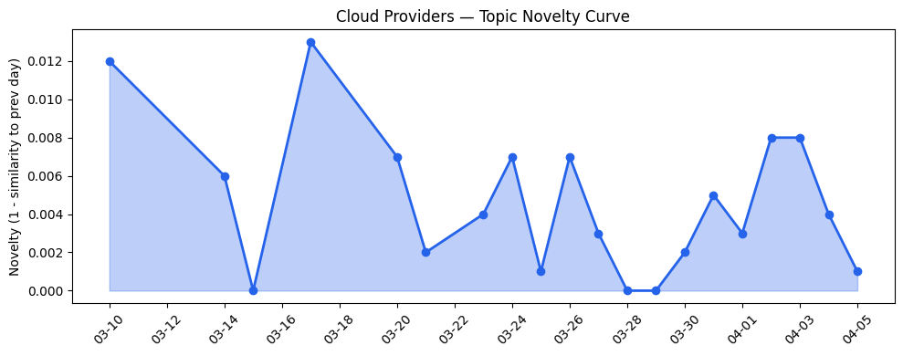
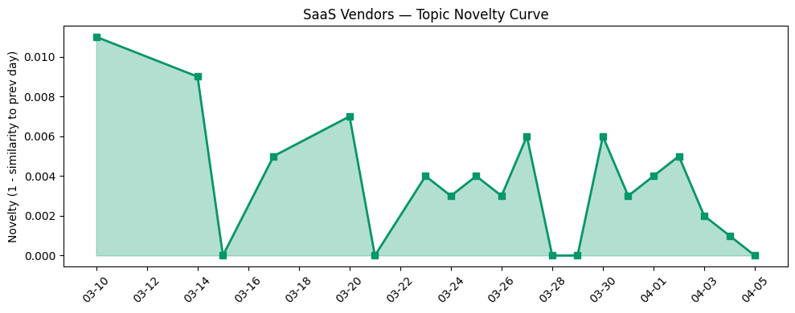

## 今日云计算结构性变化

> AI工作负载的爆发式增长正驱动云计算基础设施从中心向边缘重构，同时AI Agent平台在企业级治理、安全沙箱和垂直行业应用方面实现关键突破。

今天云计算产业的核心变化是AI基础设施架构的重新定义和Agent平台的商业化成熟。这意味着云计算正在从传统的中心化资源池向"边缘智能+中心治理"的混合架构演进，同时AI Agent从概念验证进入规模化企业部署阶段。Cloudflare的Gen 13服务器性能翻倍和微软Azure Local on Galleon模块化数据中心都指向边缘计算能力的重大突破。

- 📈 **持续趋势**：基础设施话题已连续8天增强
- 🔺 **突然升温**：技术层、应用层、风险信号近3天突然集中出现
- 🆕 **新兴方向**：企业AI部署、沙箱技术为30天内首次出现
- 🔑 **新关键词**：AI Agent、主权AI、AI基础设施、AI治理、可持续计算

## 技术层信号

🔴 重大突破

云原生基础设施正经历AI驱动的架构重构。Cloudflare推出的[Dynamic Workers](https://blog.cloudflare.com/dynamic-workers/)实现了AI代码安全沙箱执行，速度提升100倍，这解决了AI Agent在企业环境部署的核心安全瓶颈。Google Cloud的[GKE Inference Gateway](https://cloud.google.com/blog/products/containers-kubernetes/unifying-real-time-and-async-inference-with-gke-inference-gateway/)统一了实时和异步推理基础设施，标志着Kubernetes在AI工作负载编排上的成熟化。

硬件层面，[Cloudflare Gen 13服务器](https://blog.cloudflare.com/gen13-launch/)采用AMD EPYC Turin处理器和100GbE网络，边缘计算性能翻倍，体现了为AI工作负载优化硬件架构的趋势。同时，[AWS Bedrock Guardrails](https://aws.amazon.com/blogs/aws/amazon-bedrock-guardrails-supports-cross-account-safeguards-with-centralized-control-and-management/)支持跨账户安全管控，显示云厂商正在构建企业级AI治理框架。Salesforce的[高效RL训练研究](https://www.salesforce.com/blog/efficient-rl-training-agentic-era/)则为Agent训练提供了新的优化路径。

## 产业资本信号

🟡 中等信号

资本流向显示AI基础设施和垂直应用的双重关注。Founders Fund向牲畜管理初创Halter投资2.2亿美元，以及Strella完成1400万美元A轮融资并获得Amazon和Chobani采用，表明资本正流向AI与传统产业结合的细分领域。SpaceX探索轨道数据中心可能性的讨论，反映了对算力供应链多元化的前瞻性布局。

在基础设施层面，微软与Armada合作推出[Azure Local on Galleon模块化数据中心](https://azure.microsoft.com/en-us/blog/building-sovereign-ai-at-the-edge-microsoft-and-armada-collaborate-to-deliver-azure-local-on-galleon-modular-datacenters/)，推进边缘主权AI建设，这是对地缘政治风险的直接应对。AWS推出[可持续性控制台](https://aws.amazon.com/blogs/aws/announcing-the-aws-sustainability-console-programmatic-access-configurable-csv-reports-and-scope-1-3-reporting-in-one-place/)整合范围1-3碳排放报告，显示ESG因素正成为基础设施投资的重要考量。

## 潜在拐点判断

今日观察到AI基础设施架构的拐点信号。边缘计算性能的突破性提升（Cloudflare Gen 13性能翻倍）与主权AI架构的成熟（Azure模块化数据中心）共同指向云计算从"中心化资源池"向"分布式智能网格"的结构性转变。这一拐点的依据是硬件架构优化、安全沙箱技术、边缘部署方案的同时突破，可能重新定义云厂商的竞争格局，边缘能力将成为新的差异化优势。

## 明日观察点

1. **边缘AI部署成本效益**：关注Gen 13服务器在实际业务场景中的TCO表现，判断边缘计算是否达到规模化经济临界点
2. **AI Agent安全标准演进**：观察各厂商沙箱技术的互操作性和标准化进程，这关系到Agent生态的开放性
3. **主权AI政策落地**：监测各国对模块化数据中心的监管态度，这将影响云厂商的全球布局策略

## 长期趋势坐标

今日信号在月尺度上确认了AI驱动的基础设施重构趋势。基础设施话题连续8天增强显示这不是短期波动，而是结构性转变的开始。新兴的"企业AI部署"和"沙箱技术"关键词表明AI正从技术探索进入规模化应用阶段。主权AI和数字主权话题的升温反映了地缘政治因素对技术架构的深远影响，这一趋势可能会持续重塑全球云计算市场格局。

## 数据洞察

### 云厂商话题演化
云厂商话题新颖度得分0.023，相似度0.977，呈现延续性趋势。20天内46篇文章显示话题稳定性较高，主要围绕AI基础设施和边缘计算的深化演进。

### SaaS厂商话题演化  
SaaS厂商话题新颖度得分0.022，相似度0.978，同样呈现延续趋势。30篇文章表明SaaS层正聚焦AI Agent的企业级应用和垂直行业解决方案。

### 趋势图

## 参考来源

**云厂商**
- [Sandboxing AI agents, 100x faster](https://blog.cloudflare.com/dynamic-workers/) — Cloudflare Blog
- [Run real-time and async inference on the same infrastructure with GKE Inference Gateway](https://cloud.google.com/blog/products/containers-kubernetes/unifying-real-time-and-async-inference-with-gke-inference-gateway/) — Google Cloud Blog
- [Launching Cloudflare’s Gen 13 servers: trading cache for cores for 2x edge compute performance](https://blog.cloudflare.com/gen13-launch/) — Cloudflare Blog
- [Introducing Gemma 4 on Google Cloud: Our most capable open models yet](https://cloud.google.com/blog/products/ai-machine-learning/gemma-4-available-on-google-cloud/) — Google Cloud Blog
- [Amazon Bedrock Guardrails supports cross-account safeguards with centralized control and management](https://aws.amazon.com/blogs/aws/amazon-bedrock-guardrails-supports-cross-account-safeguards-with-centralized-control-and-management/) — AWS Blog
- [Announcing managed daemon support for Amazon ECS Managed Instances](https://aws.amazon.com/blogs/aws/announcing-managed-daemon-support-for-amazon-ecs-managed-instances/) — AWS Blog
- [Introducing Veo 3.1 Lite and a new Veo upscaling capability on Vertex AI](https://cloud.google.com/blog/products/ai-machine-learning/veo-3-1-lite-and-a-new-veo-upscaling-capability-on-vertex-ai/) — Google Cloud Blog
- [Building sovereign AI at the edge: Microsoft and Armada collaborate to deliver Azure Local on Galleon modular datacenters](https://azure.microsoft.com/en-us/blog/building-sovereign-ai-at-the-edge-microsoft-and-armada-collaborate-to-deliver-azure-local-on-galleon-modular-datacenters/) — Microsoft Azure Blog
- [Announcing the AWS Sustainability console: Programmatic access, configurable CSV reports, and Scope 1–3 reporting in one place](https://aws.amazon.com/blogs/aws/announcing-the-aws-sustainability-console-programmatic-access-configurable-csv-reports-and-scope-1-3-reporting-in-one-place/) — AWS Blog
- [Microsoft at NVIDIA GTC: New solutions for Microsoft Foundry, Azure AI infrastructure and Physical AI](https://blogs.microsoft.com/blog/2026/03/16/microsoft-at-nvidia-gtc-new-solutions-for-microsoft-foundry-azure-ai-infrastructure-and-physical-ai/) — Microsoft Azure Blog
- [AI for nuclear energy: Powering an intelligent, resilient future](https://www.microsoft.com/en-us/industry/blog/energy-and-resources/2026/03/24/ai-for-nuclear-energy-powering-an-intelligent-resilient-future/) — Microsoft Azure Blog
- [Modernizing regulated industries with cloud and agentic AI](https://www.microsoft.com/en-us/industry/blog/general/2026/03/11/modernizing-regulated-industries-with-cloud-and-agentic-ai/) — Microsoft Azure Blog
- [Microsoft named a Leader in 2026 Gartner® Magic Quadrant™ for Integration Platform as a Service](https://azure.microsoft.com/en-us/blog/microsoft-named-a-leader-in-2026-gartner-magic-quadrant-for-integration-platform-as-a-service/) — Microsoft Azure Blog
- [Navigating digital sovereignty at the frontier of transformation](https://www.microsoft.com/en-us/microsoft-cloud/blog/2026/03/25/navigating-digital-sovereignty-at-the-frontier-of-transformation/) — Microsoft Azure Blog

**SaaS厂商**
- [Building Efficient RL Training for the Agentic Era](https://www.salesforce.com/blog/efficient-rl-training-agentic-era/) — Salesforce Blog
- [Engine Delivers Autonomous Travel Support with Hybrid Development on the Agentforce 360 Platform](https://www.salesforce.com/blog/engine-customer-story/) — Salesforce Blog
- [Proving the Power of Script: How Datasite Agents Achieved 82% Deflection and 4.8/5 CSAT](https://www.salesforce.com/blog/datasite-agentforce/) — Salesforce Blog

**行业资讯**
- [Kai-Fu Lee's brutal assessment: America is already losing the AI hardware war to China](https://venturebeat.com/infrastructure/kai-fu-lees-brutal-assessment-america-is-already-losing-the-ai-hardware-war) — VentureBeat Enterprise
- [Can orbital data centers help justify a massive valuation for SpaceX?](https://techcrunch.com/2026/04/05/can-orbital-data-centers-help-justify-a-massive-valuation-for-spacex/) — TechCrunch
- [In Japan, the robot isn’t coming for your job; it’s filling the one nobody wants](https://techcrunch.com/2026/04/05/japan-is-proving-experimental-physical-ai-is-ready-for-the-real-world/) — TechCrunch
- [Inside LinkedIn’s generative AI cookbook: How it scaled people search to 1.3 billion users](https://venturebeat.com/infrastructure/inside-linkedins-generative-ai-cookbook-how-it-scaled-people-search-to-1-3) — VentureBeat Enterprise
- [How Anthropic’s ‘Skills’ make Claude faster, cheaper, and more consistent for business workflows](https://venturebeat.com/technology/how-anthropics-skills-make-claude-faster-cheaper-and-more-consistent-for) — VentureBeat Enterprise
- [Peter Thiel’s big bet on solar-powered cow collars](https://techcrunch.com/2026/04/04/unpacking-peter-thiels-big-bet-on-solar-powered-cow-collars/) — TechCrunch
- [Amazon and Chobani adopt Strella's AI interviews for customer research as fast-growing startup raises $14M](https://venturebeat.com/technology/amazon-and-chobani-adopt-strellas-ai-interviews-for-customer-research-as) — VentureBeat Enterprise
- [Embattled startup Delve has ‘parted ways’ with Y Combinator](https://techcrunch.com/2026/04/04/embattled-startup-delve-has-parted-ways-with-y-combinator/) — TechCrunch
- [Anthropic says Claude Code subscribers will need to pay extra for OpenClaw usage](https://techcrunch.com/2026/04/04/anthropic-says-claude-code-subscribers-will-need-to-pay-extra-for-openclaw-support/) — TechCrunch
- [Polymarket took down wagers tied to rescue of downed Air Force officer](https://techcrunch.com/2026/04/05/polymarket-took-down-wagers-tied-to-rescue-of-downed-air-force-officer/) — TechCrunch
- [Copilot is ‘for entertainment purposes only,’ according to Microsoft’s terms of use](https://techcrunch.com/2026/04/05/copilot-is-for-entertainment-purposes-only-according-to-microsofts-terms-of-service/) — TechCrunch