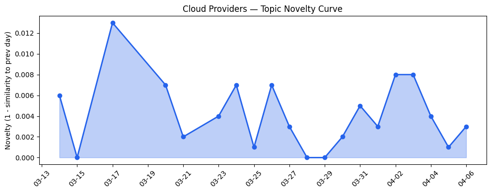
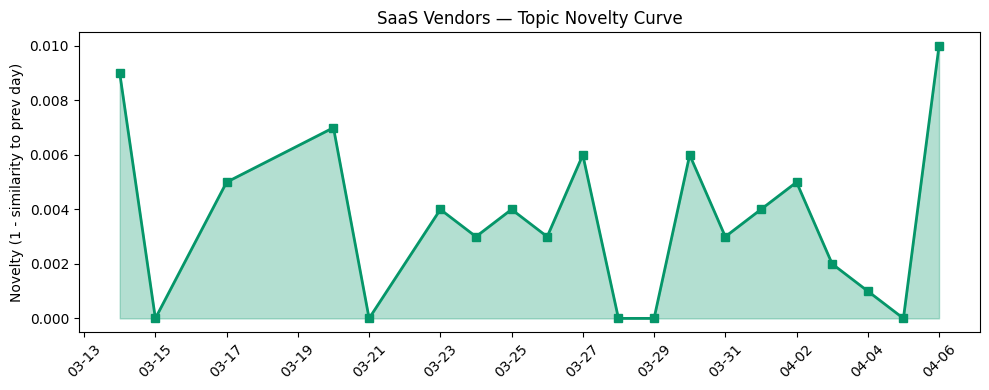

## 今日云计算结构性变化

> 云厂商正加速AI原生基础设施重构，向高效、合规与行业化三轨并进。

今日云计算产业呈现出明显的三轨并行重构态势：Google Cloud在AI算力碳效率上实现重大突破，微软与AWS分别推进主权AI边缘部署和企业级AI治理，同时火山引擎等厂商向短剧等垂直行业深度渗透。这意味着云计算产业正在从通用基础设施向AI原生、合规驱动、行业定制的专业化方向加速分化。

基于趋势对比分析，今日信号显示：
- 📈 **持续趋势**：技术层与应用层话题已连续8天增强
- 🔺 **突然升温**：技术层、应用层、风险信号近3天相似度显著提升
- 🔑 **新关键词**：TPU、低代码开发、垂直行业AI、碳效率
- 📈 **上升关键词**：AI Agent、主权AI、模块化数据中心、边缘计算

## 技术层信号

🔴 重大突破

云原生架构正在为AI Agentic环境进行深度重构。Google Cloud发布Envoy网络架构优化，重新设计Agentic AI环境的网络责任分配；Cloudflare推出Dynamic Workers实现AI代理代码安全沙箱执行，速度提升100倍；AWS推出ECS Managed Daemons提升云原生运维效率。这些技术演进显示云原生基础设施正从支持传统应用向支撑AI Agent自主运行环境转型。

在AI基础设施层面，Google Cloud Ironwood TPUs实现3.7倍碳效率提升，标志着AI算力能效竞赛进入新阶段。同时，Cloudflare重新设计AI时代的缓存架构以应对每周超100亿次AI机器人请求，火山引擎DeerFlow 2.0开源升级提升Agent执行稳定性。技术层连续8天的增强趋势表明，AI原生基础设施的技术迭代正在加速，从单纯追求算力转向效率、稳定性与安全性的综合优化。

## 产业资本信号

🟡 中等信号

基础设施部署呈现明显的区域化与边缘化趋势。微软与Armada合作推出Azure Local on Galleon模块化数据中心，支持主权AI在边缘环境部署；Cloudflare推出Organizations功能帮助企业规模化管理多账户。这些动向显示云厂商正在响应地缘政治压力，通过模块化、边缘化部署满足数据主权要求。

应用层资本流向显示AI正在向垂直行业深度渗透。Strella完成1400万美元A轮融资，Amazon和Chobani采用其AI访谈技术，反映AI驱动客户研究工具获得市场认可。火山引擎进入短剧生产领域，推出"火山剧创"Agent；微软宣布AI for nuclear合作，将AI技术应用于核能行业。资本正从通用AI工具向行业特定解决方案集中，显示AI商业化进入深水区。

## 潜在拐点判断

今日观察到AI基础设施能效拐点的明确信号。Google Cloud Ironwood TPUs实现3.7倍碳效率提升，结合模块化数据中心和边缘计算部署，标志着云计算产业从"算力至上"向"效率优先"的战略转折。这一拐点可能重构云厂商的竞争格局，能效优势将成为下一阶段的核心竞争力。

同时，主权AI边缘部署的加速表明地缘政治风险正在实质性影响技术架构选择。微软将数字主权作为区域化战略核心，模块化数据中心的推出意味着云计算基础设施正在从集中化向分布式、主权合规架构演进。

## 明日观察点

1. **关注其他云厂商的碳效率应对策略**：Google Cloud的TPU能效突破可能引发连锁反应，观察AWS、Azure如何响应绿色算力竞赛
2. **监测主权AI部署的落地案例**：模块化数据中心在实际边缘环境中的性能表现和成本效益将决定这一模式的 scalability
3. **跟踪垂直行业AI应用的商业化进展**：短剧、核能等新兴领域的AI应用能否形成可复制的商业模式

## 长期趋势坐标

从月度尺度看，云计算产业正在经历从"AI上云"到"云为AI生"的根本性重构。技术层连续8天的增强趋势证实了AI原生基础设施建设的加速，而应用层的突然升温则反映了AI技术向行业场景的快速渗透。碳效率、主权合规、垂直行业定制将成为未来季度云计算竞争的三个关键维度。

## 数据洞察

### 云厂商话题演化
今日云厂商话题新颖度得分0.028，相似度均值0.972，呈现延续性趋势。21天历史数据显示云厂商话题保持高度一致性，但内部正经历从通用云服务向AI专用基础设施的结构性转变。

### SaaS厂商话题演化  
SaaS厂商话题新颖度得分0.03，相似度均值0.97，同样呈现延续趋势。30篇文章显示SaaS厂商正加速AI功能集成，从营销自动化向行业垂直解决方案深化。

### 趋势图

## 参考来源

**云厂商**
- [Envoy: A future-ready foundation for agentic AI networking](https://cloud.google.com/blog/products/networking/the-case-for-envoy-networking-in-the-agentic-ai-era/) — Google Cloud Blog
- [Sandboxing AI agents, 100x faster](https://blog.cloudflare.com/dynamic-workers/) — Cloudflare Blog
- [Announcing managed daemon support for Amazon ECS Managed Instances](https://aws.amazon.com/blogs/aws/announcing-managed-daemon-support-for-amazon-ecs-managed-instances/) — AWS Blog
- [AI infrastructure efficiency: Ironwood TPUs deliver 3.7x carbon efficiency gains](https://cloud.google.com/blog/topics/systems/ironwood-tpus-deliver-37x-carbon-efficiency-gains/) — Google Cloud Blog
- [Building sovereign AI at the edge: Microsoft and Armada collaborate to deliver Azure Local on Galleon modular datacenters](https://azure.microsoft.com/en-us/blog/building-sovereign-ai-at-the-edge-microsoft-and-armada-collaborate-to-deliver-azure-local-on-galleon-modular-datacenters/) — Microsoft Azure Blog

**SaaS厂商**
- [Engine Delivers Autonomous Travel Support with Hybrid Development on the Agentforce 360 Platform](https://www.salesforce.com/blog/engine-customer-story/) — Salesforce Blog
- [AI-driven email personalization strategies that actually work](https://blog.hubspot.com/marketing/ai-driven-email-personalization) — HubSpot Blog

**行业资讯**
- [Amazon and Chobani adopt Strella's AI interviews for customer research as fast-growing startup raises $14M](https://venturebeat.com/technology/amazon-and-chobani-adopt-strellas-ai-interviews-for-customer-research-as) — VentureBeat Enterprise
- [Iran threatens 'Stargate' AI data centers](https://techcrunch.com/2026/04/06/iran-threatens-stargate-ai-data-centers/) — TechCrunch
- [Kai-Fu Lee's brutal assessment: America is already losing the AI hardware war to China](https://venturebeat.com/infrastructure/kai-fu-lees-brutal-assessment-america-is-already-losing-the-ai-hardware-war) — VentureBeat Enterprise