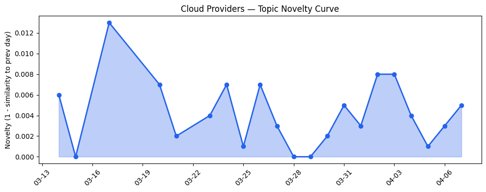
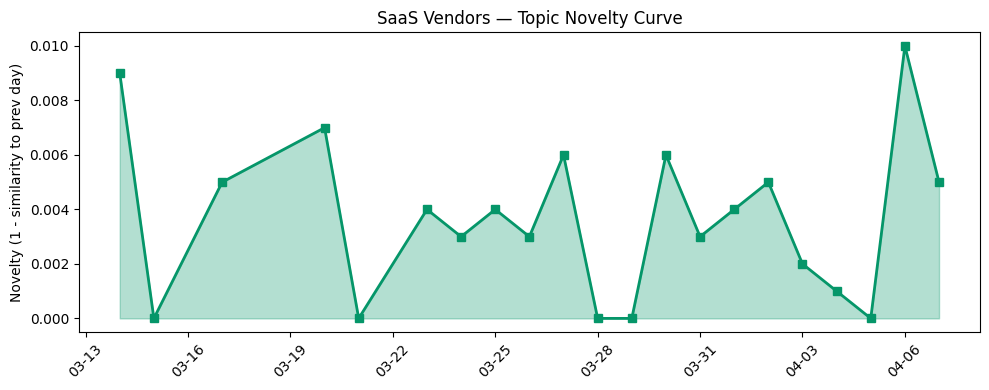

## 今日云计算结构性变化

> AI治理框架与物理AI基础设施投资成为核心驱动力，云计算向规模化安全部署和绿色分布式智能加速转型。

今日云计算产业正在经历从"AI能力建设"向"AI治理与安全部署"的关键转折。AI Agent安全执行环境的突破与绿色基础设施的规模化部署，标志着云计算厂商开始解决AI规模化应用的核心瓶颈——安全可信与可持续性。这种转变意味着产业竞争焦点从单纯的算力竞赛转向全栈AI治理能力。

- 📈 **持续趋势**：风险信号话题已连续8天增强，AI安全治理成为长期焦点
- 🔺 **突然升温**：基础设施话题近3天相似度提升74%，主权AI与边缘部署集中爆发
- 🆕 **新兴方向**：物理AI、安全沙盒、碳效率等关键词首次密集出现
- 🔑 **新关键词**：物理AI, 安全沙盒, 碳效率, 主权AI
- 📉 **消退关键词**：传统SaaS, 基础合规, 通用AI概念

## 技术层信号

🟡 渐进改善

云原生技术正围绕AI Agent的安全执行环境进行重要优化。Cloudflare通过[Dynamic Workers实现AI生成代码安全沙盒执行](https://blog.cloudflare.com/dynamic-workers/)，性能提升100倍，这解决了AI Agent在生成代码执行时的安全隔离难题。同时，AWS推出[S3 Files将对象存储作为高性能文件系统访问](https://aws.amazon.com/blogs/aws/launching-s3-files-making-s3-buckets-accessible-as-file-systems/)，优化了AI工作负载的数据访问模式。

Google Cloud发布[Envoy在智能体AI时代的网络基础架构分析](https://cloud.google.com/blog/products/networking/the-case-for-envoy-networking-in-the-agentic-ai-era/)，为分布式AI Agent通信奠定网络基础。这些技术改进共同指向一个方向：云原生基础设施正在为AI Agent的大规模、安全部署进行深度适配，从存储、网络到计算隔离层进行全面升级。

## 产业资本信号

🔴 强信号

资本正在大规模流向"物理AI"和绿色基础设施领域。Eclipse VC新募[13亿美元专门投资物理AI初创公司](https://techcrunch.com/2026/04/07/vc-eclipse-has-a-new-1-3b-to-back-and-build-physical-ai-startups/)，这标志着资本开始从纯软件AI向AI与物理世界结合的场景迁移。同时，NVIDIA支持的亚洲AI数据中心提供商[Firmus估值达55亿美元](https://techcrunch.com/2026/04/07/firmus-the-southgate-ai-datacenter-builder-backed-by-nvidia-hits-5-5b-valuation/)，反映AI数据中心建设进入加速期。

在企业应用层，[Strella完成1400万美元A轮融资](https://venturebeat.com/technology/amazon-and-chobani-adopt-strellas-ai-interviews-for-customer-research-as)，其AI访谈技术获亚马逊和Chobani采用，显示垂直场景的AI应用开始获得商业验证。资本流向清晰地表明：物理AI、绿色基础设施和垂直场景AI应用成为新的投资热点。

## 潜在拐点判断

今日观察到**绿色计算拐点**的明确信号。Google Cloud [Ironwood TPU实现3.7倍碳效率提升](https://cloud.google.com/blog/topics/systems/ironwood-tpus-deliver-37x-carbon-efficiency-gains/)是一个里程碑事件，标志着AI计算从单纯追求性能转向性能与能效并重。这一突破可能重构云计算厂商的竞争维度，碳效率将成为继算力、价格之后的第三大关键指标。

同时，主权AI向边缘扩展的趋势也达到拐点，微软与Armada合作[在模块化数据中心部署Azure Local](https://azure.microsoft.com/en-us/blog/building-sovereign-ai-at-the-edge-microsoft-and-armada-collaborate-to-deliver-azure-local-on-galleon-modular-datacenters/)，使得主权AI从概念走向实际部署。这两个拐点共同推动云计算向绿色化、分布式化转型。

## 明日观察点

1. **物理AI投资案例落地**：关注Eclipse VC首批投资标的，判断物理AI的实际应用场景和商业化路径
2. **碳效率指标标准化**：观察其他云厂商是否跟进发布类似Google的碳效率指标，形成行业标准
3. **主权AI部署进展**：跟踪Azure Local在边缘场景的实际部署效果和客户反馈

## 长期趋势坐标

今日信号在月尺度上延续了AI治理与安全的核心趋势，但加入了重要的新维度——绿色可持续性。从趋势数据看，云厂商话题延续性高达97.7%，表明主流方向稳定，但创新点集中在执行层突破。物理AI的兴起可能开启云计算与实体经济深度融合的新周期，而碳效率的突破则响应了全球ESG投资趋势，这两个方向都具有长期战略价值。

## 数据洞察

### 云厂商话题演化
云厂商话题新颖度得分0.023，相似度0.977，呈现高度延续性。过去21天共46篇文章显示主流方向稳定，创新集中在执行层优化。

### SaaS厂商话题演化  
SaaS厂商话题新颖度0.029，相似度0.971，延续性同样明显。30篇文章反映SaaS厂商正将AI深度集成到垂直工作流中。

### 趋势图

## 参考来源

**云厂商**
- [Launching S3 Files, making S3 buckets accessible as file systems](https://aws.amazon.com/blogs/aws/launching-s3-files-making-s3-buckets-accessible-as-file-systems/) — AWS Blog
- [Sandboxing AI agents, 100x faster](https://blog.cloudflare.com/dynamic-workers/) — Cloudflare Blog
- [Envoy: A future-ready foundation for agentic AI networking](https://cloud.google.com/blog/products/networking/the-case-for-envoy-networking-in-the-agentic-ai-era/) — Google Cloud Blog
- [AI infrastructure efficiency: Ironwood TPUs deliver 3.7x carbon efficiency gains](https://cloud.google.com/blog/topics/systems/ironwood-tpus-deliver-37x-carbon-efficiency-gains/) — Google Cloud Blog
- [Building sovereign AI at the edge: Microsoft and Armada collaborate to deliver Azure Local on Galleon modular datacenters](https://azure.microsoft.com/en-us/blog/building-sovereign-ai-at-the-edge-microsoft-and-armada-collaborate-to-deliver-azure-local-on-galleon-modular-datacenters/) — Microsoft Azure Blog

**SaaS厂商**
- [The Deskless Revolution: One Year of Agentic Field Service (And What Comes Next)](https://www.salesforce.com/blog/agentic-field-service-success/) — Salesforce Blog
- [接入Seedance 2.0，短剧生产Agent「火山剧创」正式邀测](https://developer.volcengine.com/articles/7622325633040793641) — 火山引擎 Blog

**行业资讯**
- [Firmus, the 'Southgate' AI data center builder backed by Nvidia, hits $5.5B valuation](https://techcrunch.com/2026/04/07/firmus-the-southgate-ai-datacenter-builder-backed-by-nvidia-hits-5-5b-valuation/) — TechCrunch
- [VC Eclipse has a new $1.3B to back — and build — 'physical AI' startups](https://techcrunch.com/2026/04/07/vc-eclipse-has-a-new-1-3b-to-back-and-build-physical-ai-startups/) — TechCrunch
- [Inside LinkedIn’s generative AI cookbook: How it scaled people search to 1.3 billion users](https://venturebeat.com/infrastructure/inside-linkedins-generative-ai-cookbook-how-it-scaled-people-search-to-1-3) — VentureBeat Enterprise