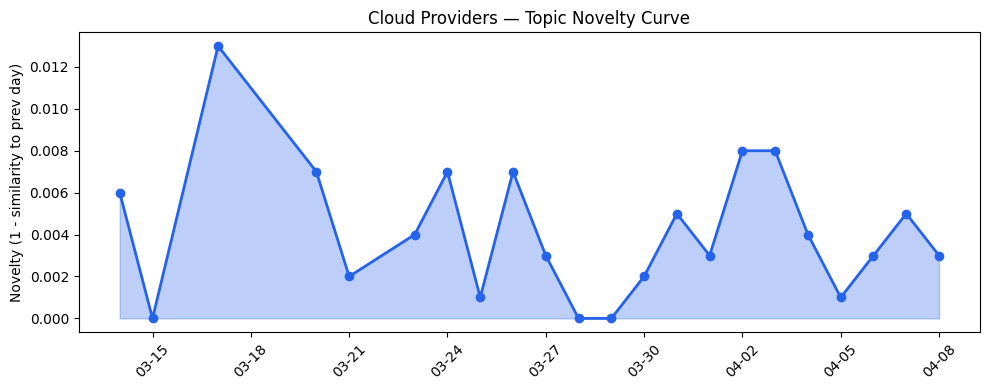
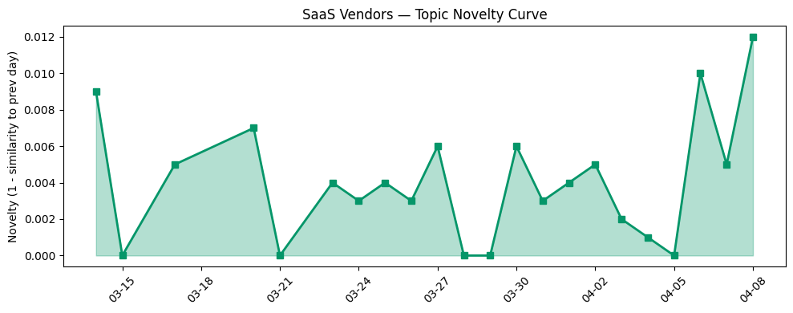

## 今日云计算结构性变化

> 云厂商正通过主权AI基础设施、边缘计算和开源AI Agent工具链三大战略方向，加速AI与云原生基础设施的深度融合，同时应对数字主权合规和量子安全等新型风险。

今日云计算产业格局正在经历从"中心化算力供给"向"分布式智能基础设施"的战略转型。微软与Armada合作推出Azure Local on Galleon模块化数据中心，标志着边缘主权AI基础设施进入实质性部署阶段，而Google Cloud被Forrester评为主权云平台领导者，显示数字主权合规正从可选变为必选。同时，火山引擎开源AI Agent工具链和Cloudflare公布2029年后量子安全路线图，表明产业正在为下一轮技术变革提前布局。

- 📈 **持续趋势**：基础设施话题已连续8天增强，风险信号话题同步升温
- 🆕 **新兴方向**：量子安全、开源工具链为30天内首次出现
- 🔺 **突然升温**：基础设施方向近3天突然集中出现（相似度从0.38跃升至0.65）
- 🔑 **新关键词**：开源工具链、量子安全
- 📉 **消退关键词**：Serverless、合规风险、监管合规

## 技术层信号

🟡 渐进改善

云原生基础设施正从通用化向AI优化演进。AWS推出S3 Files将对象存储转为高性能文件系统，Google Cloud推出GKE Cloud Storage FUSE Profiles专门优化AI/ML存储配置，显示存储层正针对AI工作负载进行深度定制。这种优化不仅体现在性能上，Cloudflare分享的[Kubernetes优化经验](https://blog.cloudflare.com/one-line-kubernetes-fix-saved-600-hours-a-year/)通过单行代码提升重启效率，反映了云原生运维正从粗放式向精细化转变。

在数据平台层面，Azure推进[统一数据平台战略](https://azure.microsoft.com/en-us/blog/fabcon-and-sqlcon-2026-unifying-databases-and-fabric-on-a-single-data-platform/)与Google Cloud在Apache Iceberg Summit提升湖仓一体互操作性，表明多云数据流动正成为产业焦点。Cloudflare推出的[EmDash无服务器CMS](https://blog.cloudflare.com/emdash-wordpress/)和可编程DDoS防护逻辑，则显示边缘计算平台正从内容分发向应用开发生态扩展。

## 产业资本信号

🔴 强信号

产业资本正加速向主权AI基础设施和边缘计算领域集中。微软与Armada合作的[Azure Local on Galleon模块化数据中心](https://azure.microsoft.com/en-us/blog/building-sovereign-ai-at-the-edge-microsoft-and-armada-collaborate-to-deliver-azure-local-on-galleon-modular-datacenters/)布局边缘主权AI，Google Cloud Ironwood TPUs实现3.7倍碳效率提升，显示AI算力投资正从单纯性能竞争转向能效与地理分布并重。

在应用层，资本流向呈现垂直化特征。Strella完成1400万美元A轮融资并获得Amazon和Chobani采用，Canva收购Simtheory和Ortto强化AI营销自动化，表明AI驱动客户研究和营销自动化成为投资热点。AWS对Anthropic和OpenAI的双重投资虽然引发竞争关切，但反映了云厂商通过资本布局构建AI生态的战略意图。

## 潜在拐点判断

今日观察到主权AI基础设施部署的拐点信号。微软Azure Local on Galleon模块化数据中心的推出，结合Google Cloud在主权云平台的领导地位，标志着边缘计算正从技术概念转向实际部署阶段。这一拐点的依据在于：模块化设计解决了边缘部署的标准化难题，主权合规要求驱动了分布式架构需求，AI工作负载对低延迟的需求加速了边缘算力部署。

可能的影响包括：云竞争从中心区域向边缘节点扩展，传统数据中心厂商面临模块化挑战，合规能力成为云厂商的核心竞争力。同时，火山引擎强调极致性价比云战略，可能引发新一轮价格竞争。

## 明日观察点

1. **主权云标准演进**：关注各厂商在数据本地化、合规认证方面的具体实施进度，判断是否形成事实标准
2. **边缘AI落地案例**：观察模块化数据中心在制造业、零售业的具体应用效果，验证边缘计算的商业价值
3. **开源AI工具链生态**：监测火山引擎开源工具链的开发者采纳情况，判断是否形成新的开发范式

## 长期趋势坐标

今日信号显示云计算产业正进入"分布式智能"新阶段。过去30天，基础设施话题持续升温，表明产业投资正从应用层向基础层回流。主权AI、边缘计算、量子安全等新关键词的出现，反映了全球地缘政治和技術安全对云架构的深层影响。从月尺度看，云竞争正从单纯的算力规模转向"算力分布+合规能力+开发者生态"的多维竞争。

## 数据洞察

### 云厂商话题演化
云厂商话题新颖度得分0.02，相似度0.98，呈现延续性特征。22天历史数据显示云厂商话题稳定性较高，46篇文章主要集中在基础设施优化和AI集成方向。

### SaaS厂商话题演化  
SaaS厂商话题新颖度得分0.03，相似度0.97，同样呈现延续趋势。30篇文章显示SaaS厂商正加速AI代理在垂直行业的落地应用。

### 趋势图

## 参考来源

**云厂商**
- [Launching S3 Files, making S3 buckets accessible as file systems](https://aws.amazon.com/blogs/aws/launching-s3-files-making-s3-buckets-accessible-as-file-systems/) — AWS Blog
- [New GKE Cloud Storage FUSE Profiles take the guesswork out of configuring AI storage](https://cloud.google.com/blog/products/containers-kubernetes/optimize-aiml-workloads-with-gke-cloud-storage-fuse-profiles/) — Google Cloud Blog
- [A one-line Kubernetes fix that saved 600 hours a year](https://blog.cloudflare.com/one-line-kubernetes-fix-saved-600-hours-a-year/) — Cloudflare Blog
- [FabCon and SQLCon 2026: Unifying databases and Fabric on a single data platform](https://azure.microsoft.com/en-us/blog/fabcon-and-sqlcon-2026-unifying-databases-and-fabric-on-a-single-data-platform/) — Microsoft Azure Blog
- [Openness without compromises for your Apache Iceberg lakehouse](https://cloud.google.com/blog/products/data-analytics/improved-interoperability-for-your-apache-iceberg-lakehouse/) — Google Cloud Blog
- [Introducing EmDash — the spiritual successor to WordPress that solves plugin security](https://blog.cloudflare.com/emdash-wordpress/) — Cloudflare Blog
- [What’s new with Microsoft in open-source and Kubernetes at KubeCon + CloudNativeCon Europe 2026](https://opensource.microsoft.com/blog/2026/03/24/whats-new-with-microsoft-in-open-source-and-kubernetes-at-kubecon-cloudnativecon-europe-2026/) — Microsoft Azure Blog
- [Experimenting with GPUs: GKE managed DRANET and Inference Gateway AI Deployment](https://cloud.google.com/blog/topics/developers-practitioners/experimenting-with-gpus-gke-managed-dranet-and-inference-gateway-ai-deployment/) — Google Cloud Blog
- [How we use Abstract Syntax Trees (ASTs) to turn Workflows code into visual diagrams](https://blog.cloudflare.com/workflow-diagrams/) — Cloudflare Blog
- [Cloudflare Client-Side Security: smarter detection, now open to everyone](https://blog.cloudflare.com/client-side-security-open-to-everyone/) — Cloudflare Blog
- [Building sovereign AI at the edge: Microsoft and Armada collaborate to deliver Azure Local on Galleon modular datacenters](https://azure.microsoft.com/en-us/blog/building-sovereign-ai-at-the-edge-microsoft-and-armada-collaborate-to-deliver-azure-local-on-galleon-modular-datacenters/) — Microsoft Azure Blog
- [AI infrastructure efficiency: Ironwood TPUs deliver 3.7x carbon efficiency gains](https://cloud.google.com/blog/topics/systems/ironwood-tpus-deliver-37x-carbon-efficiency-gains/) — Google Cloud Blog
- [Microsoft at NVIDIA GTC: New solutions for Microsoft Foundry, Azure AI infrastructure and Physical AI](https://blogs.microsoft.com/blog/2026/03/16/microsoft-at-nvidia-gtc-new-solutions-for-microsoft-foundry-azure-ai-infrastructure-and-physical-ai/) — Microsoft Azure Blog
- [谭待：开放云引擎，共创新未来 - 火山引擎](https://www.cnblogs.com/volcengine/p/15640981.html) — 火山引擎博客
- [How we built Organizations to help enterprises manage Cloudflare at scale](https://blog.cloudflare.com/organizations-beta/) — Cloudflare Blog
- [Claude Mythos Preview: Available in private preview on Vertex AI](https://cloud.google.com/blog/products/ai-machine-learning/claude-mythos-preview-on-vertex-ai/) — Google Cloud Blog
- [Announcing the AWS Sustainability console: Programmatic access, configurable CSV reports, and Scope 1–3 reporting in one place](https://aws.amazon.com/blogs/aws/announcing-the-aws-sustainability-console-programmatic-access-configurable-csv-reports-and-scope-1-3-reporting-in-one-place/) — AWS Blog
- [Google Cloud named a Leader in The Forrester Wave™: Sovereign Cloud Platforms, Q2 2026](https://cloud.google.com/blog/products/identity-security/a-leader-in-forrester-wave-sovereign-cloud-platform-2026/) — Google Cloud Blog
- [Navigating digital sovereignty at the frontier of transformation](https://www.microsoft.com/en-us/microsoft-cloud/blog/2026/03/25/navigating-digital-sovereignty-at-the-frontier-of-transformation/) — Microsoft Azure Blog
- [Cloudflare targets 2029 for full post-quantum security](https://blog.cloudflare.com/post-quantum-roadmap/) — Cloudflare Blog
- [Why we're rethinking cache for the AI era](https://blog.cloudflare.com/rethinking-cache-ai-humans/) — Cloudflare Blog

**SaaS厂商**
- [How SharkNinja builds loyalty with Agentforce Commerce](https://www.salesforce.com/blog/sharkninja-customer-story/) — Salesforce Blog
- [接入Seedance 2.0，短剧生产Agent「火山剧创」正式邀测](https://developer.volcengine.com/articles/7622325633040793641) — 火山引擎 Blog
- [AI for nuclear energy: Powering an intelligent, resilient future](https://www.microsoft.com/en-us/industry/blog/energy-and-resources/2026/03/24/ai-for-nuclear-energy-powering-an-intelligent-resilient-future/) — Microsoft Azure Blog
- [Under one roof: Rightmove reinvents property search with unified data](https://cloud.google.com/blog/products/data-analytics/how-unified-data-is-helping-rightmove-reinvent-property-search/) — Google Cloud Blog
- [火山引擎数智平台 VeDI 空中课程：定期直播公开课，解锁数据应用新技能！](https://developer.volcengine.com/articles/7552807006211178547) — 火山引擎 Blog
- [Build music generation into your apps with Lyria 3 models on Vertex AI](https://cloud.google.com/blog/products/ai-machine-learning/lyria-3-and-lyria-3-pro-on-vertex-ai/) — Google Cloud Blog
- [The Deskless Revolution: One Year of Agentic Field Service (And What Comes Next)](https://www.salesforce.com/blog/agentic-field-service-success/) — Salesforce Blog
- [火山引擎正式推出四款数据产品 将持续完善敏捷数智引擎矩阵](https://www.cnblogs.com/volcengine/p/15640481.html) — 火山引擎博客
- [Best workflow automation software: How to choose the right tool for your growth stage](https://blog.hubspot.com/marketing/workflow-automation-tools) — HubSpot Blog
- [OpenClaw飞书机器人无响应与连接失败：完整排查指南](https://developer.volcengine.com/articles/7618057705978560518) — 火山引擎 Blog
- [Is Your Salesforce Org Overflowing with Data? You Need an ''Attic'' Strategy](https://www.salesforce.com/blog/data-archiving-strategy/) — Salesforce Blog

**行业资讯**
- [Amazon and Chobani adopt Strella's AI interviews for customer research as fast-growing startup raises $14M](https://venturebeat.com/technology/amazon-and-chobani-adopt-strellas-ai-interviews-for-customer-research-as) — VentureBeat Enterprise
- [Canva doubles down on AI and marketing automation with Simtheory, Ortto acquisitions](https://techcrunch.com/2026/04/08/canva-doubles-down-on-ai-and-marketing-automation-with-simtheory-ortto-acquisitions/) — TechCrunch
- [AWS boss explains why investing billions in both Anthropic and OpenAI is an OK conflict](https://techcrunch.com/2026/04/08/aws-boss-explains-why-investing-billions-in-both-anthropic-and-openai-is-an-ok-conflict/) — TechCrunch
- [Kai-Fu Lee's brutal assessment: America is already losing the AI hardware war to China](https://venturebeat.com/infrastructure/kai-fu-lees-brutal-assessment-america-is-already-losing-the-ai-hardware-war) — VentureBeat Enterprise
- [Hack-for-hire group caught targeting Android devices and iCloud backups](https://techcrunch.com/2026/04/08/hack-for-hire-group-caught-targeting-android-devices-and-icloud-backups/) — TechCrunch
- [These are the countries moving to ban social media for children](https://techcrunch.com/2026/04/08/social-media-ban-children-countries-list/) — TechCrunch
- [MCP广场开源版权声明](https://cloud.tencent.com/developer/article/2537547) — Tencent Cloud Blog