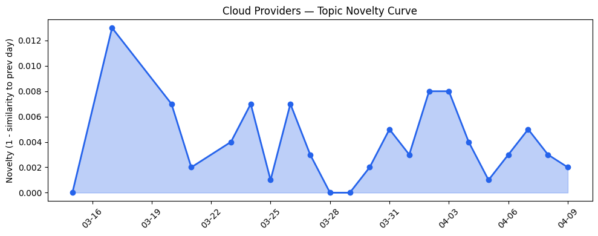
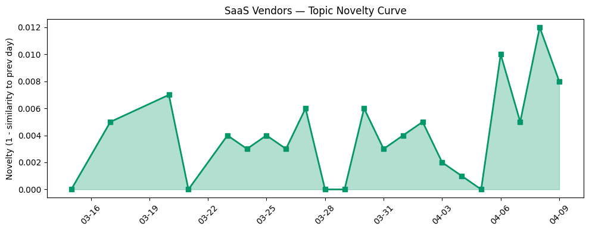

## 今日云计算结构性变化

> 云厂商在AI基础设施安全治理、主权云和边缘计算领域展开激烈竞争，SaaS厂商通过AI代理技术深度渗透金融、零售等垂直行业。

今天云计算产业呈现出明显的"基础设施安全化"和"应用垂直化"双重趋势。云厂商正在从传统的算力提供商向AI安全治理平台转型，[AWS推出S3 Files](https://aws.amazon.com/blogs/aws/launching-s3-files-making-s3-buckets-accessible-as-file-systems/)和[Google Cloud密集发布GKE AI优化功能](https://cloud.google.com/blog/products/identity-security/securing-ai-inference-on-gke-with-model-armor/)显示基础设施层正在为AI工作负载进行深度重构。同时，主权云成为地缘政治压力下的新竞争焦点，[Google Cloud被Forrester评为主权云平台领导者](https://cloud.google.com/blog/products/identity-security/a-leader-in-forrester-wave-sovereign-cloud-platform-2026/)和[微软与Armada合作推出Azure Local边缘数据中心](https://azure.microsoft.com/en-us/blog/building-sovereign-ai-at-the-edge-microsoft-and-armada-collaborate-to-deliver-azure-local-on-galleon-modular-datacenters/)表明基础设施布局正从全球化向本地化转变。

- 📈 **持续趋势**：技术层、资本信号、基础设施、应用层、风险信号五个维度已连续8天持续增强
- 🔺 **突然升温**：基础设施话题近3天相似度显著提升，主权云和边缘计算成为焦点
- 🆕 **新兴方向**：边缘AI、金融SaaS首次出现
- 🔑 **新关键词**：AI基础设施、数据主权、边缘AI、主权云、Agentic AI
- 📉 **消退关键词**：AI Agents、Serverless、合规风险等通用概念让位于更具体的垂直场景

## 技术层信号

🟡 渐进改善

云原生技术正在向AI工作负载深度优化。AWS推出的S3 Files将对象存储转为高性能文件系统，解决了AI训练中大规模数据访问的瓶颈问题。Google Cloud的Model Armor安全框架为GKE上的AI推理提供了硬件级隔离，而Cloud Storage FUSE Profiles则专门针对AI/ML工作负载优化存储配置。这些改进显示云厂商正在从通用的容器编排向AI专用的基础设施堆栈演进。

数据库和存储层也在加速Serverless化。[Amazon Aurora PostgreSQL serverless支持秒级数据库创建](https://aws.amazon.com/blogs/aws/announcing-amazon-aurora-postgresql-serverless-database-creation-in-seconds/)大幅降低了AI应用的数据准备时间，而Azure则强化了PostgreSQL的企业级能力，满足金融等严监管行业的需求。这种"即时可用"的数据库服务模式正成为AI应用快速迭代的基础。

AI与云融合进入安全治理新阶段。[Amazon Bedrock Guardrails新增跨账户安全管控](https://aws.amazon.com/blogs/aws/amazon-bedrock-guardrails-supports-cross-account-safeguards-with-centralized-control-and-management/)和[Cloudflare客户端安全升级AI检测系统](https://blog.cloudflare.com/client-side-security-open-to-everyone/)表明，随着AI应用从实验走向生产，安全治理正成为云平台的核心竞争力。

## 产业资本信号

🟡 中等信号

基础设施投资明显向主权云和边缘计算倾斜。地缘政治因素正驱动云厂商重新布局基础设施，Google Cloud在主权云领域的领导者地位以及微软与Armada的边缘计算合作，显示资本正在流向符合数据本地化要求的基础设施项目。这种转变意味着云服务的全球化模式正在被区域化、主权化的新范式所替代。

应用层投资聚焦垂直行业AI落地。[Salesforce Agentforce在金融服务领域获G2认证最佳软件](https://www.salesforce.com/blog/agentforce-financial-services-tops-g2-rankings/)和[雅诗兰黛使用Cloud Run处理智能代理工作负载](https://cloud.google.com/blog/products/serverless/cloud-run-worker-pools-at-estee-lauder-companies/)表明，资本正从通用的AI平台向特定行业的AI解决方案集中。这种垂直化趋势显示AI技术正在从"能用"向"好用"演进。

资本流向显示AI应用层初创公司获得关注。[Strella完成1400万美元A轮融资](https://venturebeat.com/technology/amazon-and-chobani-adopt-strellas-ai-interviews-for-customer-research-as)并被Amazon和Chobani采用，表明企业愿意为能够解决具体业务问题的AI工具付费。同时，大厂通过技术合作深化AI生态，[Google Cloud与Anthropic深度集成](https://cloud.google.com/blog/products/ai-machine-learning/claude-mythos-preview-on-vertex-ai/)和[微软Copilot功能扩展](https://venturebeat.com/technology/microsofts-copilot-can-now-build-apps-and-automate-your-job-heres-how-it)显示平台化AI战略正在形成。

## 潜在拐点判断

今日观察到主权云从概念验证向大规模部署的拐点信号。随着[Google Cloud被评为主权云平台领导者](https://cloud.google.com/blog/products/identity-security/a-leader-in-forrester-wave-sovereign-cloud-platform-2026/)和[微软Azure Local的推出](https://azure.microsoft.com/en-us/blog/building-sovereign-ai-at-the-edge-microsoft-and-armada-collaborate-to-deliver-azure-local-on-galleon-modular-datacenters/)，主权云不再只是合规需求，而是成为了云厂商的核心竞争力。这一拐点意味着云计算产业将从"一个云服务全球"的标准化模式，转向"多主权云协同"的分布式架构。

同时，AI应用正在从工具层面向工作流层面拐弯。[Salesforce多篇博文强调AI代理在营销、客服、现场服务等场景落地](https://www.salesforce.com/blog/sharkninja-customer-story/)显示，AI正在从单点工具转变为贯穿业务流程的智能代理。这种转变将重新定义SaaS产品的价值主张和竞争格局。

## 明日观察点

1. **主权云落地进展**：关注各云厂商主权云解决方案的实际客户采用情况，特别是金融、政府等敏感行业的迁移案例，判断主权云是否从概念阶段进入规模化增长期。
2. **AI代理工作流成熟度**：观察Salesforce、ServiceNow等SaaS厂商的AI代理在实际业务场景中的表现，特别是在复杂决策流程中的可靠性和效率提升。
3. **AI安全治理标准形成**：注意各云厂商在AI安全框架方面的竞争态势，特别是跨平台的安全标准是否会出现事实标准或行业共识。

## 长期趋势坐标

从月度尺度看，云计算产业正在经历从"AI赋能"向"AI原生"的深度转型。技术层连续8天的增强趋势表明，云基础设施正在为AI工作负载进行系统性重构，而不仅仅是添加AI服务。主权云和边缘计算的兴起反映了地缘政治因素对技术架构的深远影响，这种影响将在未来几个季度持续重塑云厂商的全球布局。

应用层的垂直化趋势显示AI技术正在进入价值兑现期。金融SaaS等新兴关键词的出现，表明AI开始在各个垂直行业产生具体的业务价值。同时，风险信号的持续增强提醒我们，AI技术的快速发展也带来了新的监管和供应链挑战。

## 数据洞察

### 云厂商话题演化
今日云厂商话题新颖度得分0.019，平均相似度0.981，呈现明显的延续趋势。在23天历史数据中，46篇文章显示云厂商话题保持高度一致性，主要聚焦AI基础设施优化和安全治理。

### SaaS厂商话题演化  
SaaS厂商话题新颖度得分0.031，平均相似度0.969，同样呈现延续趋势。30篇文章显示SaaS厂商持续深化垂直行业AI应用，特别是金融、零售等场景的AI代理部署。

### 趋势图

## 参考来源

**云厂商**
- [Launching S3 Files, making S3 buckets accessible as file systems](https://aws.amazon.com/blogs/aws/launching-s3-files-making-s3-buckets-accessible-as-file-systems/) — AWS Blog
- [Guardrails at the gateway: Securing AI inference on GKE with Model Armor](https://cloud.google.com/blog/products/identity-security/securing-ai-inference-on-gke-with-model-armor/) — Google Cloud Blog
- [New GKE Cloud Storage FUSE Profiles take the guesswork out of configuring AI storage](https://cloud.google.com/blog/products/containers-kubernetes/optimize-aiml-workloads-with-gke-cloud-storage-fuse-profiles/) — Google Cloud Blog
- [What’s new with Microsoft in open-source and Kubernetes at KubeCon + CloudNativeCon Europe 2026](https://opensource.microsoft.com/blog/2026/03/24/whats-new-with-microsoft-in-open-source-and-kubernetes-at-kubecon-cloudnativecon-europe-2026/) — Microsoft Azure Blog
- [Cloudflare Client-Side Security: smarter detection, now open to everyone](https://blog.cloudflare.com/client-side-security-open-to-everyone/) — Cloudflare Blog
- [Amazon Bedrock Guardrails supports cross-account safeguards with centralized control and management](https://aws.amazon.com/blogs/aws/amazon-bedrock-guardrails-supports-cross-account-safeguards-with-centralized-control-and-management/) — AWS Blog
- [Announcing Amazon Aurora PostgreSQL serverless database creation in seconds](https://aws.amazon.com/blogs/aws/announcing-amazon-aurora-postgresql-serverless-database-creation-in-seconds/) — AWS Blog
- [From legacy to leadership: How PostgreSQL on Azure powers enterprise agility and innovation](https://azure.microsoft.com/en-us/blog/from-legacy-to-leadership-how-postgresql-on-azure-powers-enterprise-agility-and-innovation/) — Microsoft Azure Blog
- [Google Cloud named a Leader in The Forrester Wave™: Sovereign Cloud Platforms, Q2 2026](https://cloud.google.com/blog/products/identity-security/a-leader-in-forrester-wave-sovereign-cloud-platform-2026/) — Google Cloud Blog
- [Building sovereign AI at the edge: Microsoft and Armada collaborate to deliver Azure Local on Galleon modular datacenters](https://azure.microsoft.com/en-us/blog/building-sovereign-ai-at-the-edge-microsoft-and-armada-collaborate-to-deliver-azure-local-on-galleon-modular-datacenters/) — Microsoft Azure Blog
- [Google and Intel deepen AI infrastructure partnership](https://techcrunch.com/2026/04/09/google-and-intel-deepen-ai-infrastructure-partnership/) — TechCrunch
- [Microsoft at NVIDIA GTC: New solutions for Microsoft Foundry, Azure AI infrastructure and Physical AI](https://blogs.microsoft.com/blog/2026/03/16/microsoft-at-nvidia-gtc-new-solutions-for-microsoft-foundry-azure-ai-infrastructure-and-physical-ai/) — Microsoft Azure Blog
- [How Estée Lauder Companies uses Cloud Run worker pools for its pull-based agentic workloads](https://cloud.google.com/blog/products/serverless/cloud-run-worker-pools-at-estee-lauder-companies/) — Google Cloud Blog
- [AI for nuclear energy: Powering an intelligent, resilient future](https://www.microsoft.com/en-us/industry/blog/energy-and-resources/2026/03/24/ai-for-nuclear-energy-powering-an-intelligent-resilient-future/) — Microsoft Azure Blog
- [Under one roof: Rightmove reinvents property search with unified data](https://cloud.google.com/blog/products/data-analytics/how-unified-data-is-helping-rightmove-reinvent-property-search/) — Google Cloud Blog
- [Claude Mythos Preview: Available in private preview on Vertex AI](https://cloud.google.com/blog/products/ai-machine-learning/claude-mythos-preview-on-vertex-ai/) — Google Cloud Blog
- [Navigating digital sovereignty at the frontier of transformation](https://www.microsoft.com/en-us/microsoft-cloud/blog/2026/03/25/navigating-digital-sovereignty-at-the-frontier-of-transformation/) — Microsoft Azure Blog
- [Cloudflare targets 2029 for full post-quantum security](https://blog.cloudflare.com/post-quantum-roadmap/) — Cloudflare Blog

**SaaS厂商**
- [G2 Crowns Salesforce as Best Financial Services Software](https://www.salesforce.com/blog/agentforce-financial-services-tops-g2-rankings/) — Salesforce Blog
- [How SharkNinja builds loyalty with Agentforce Commerce](https://www.salesforce.com/blog/sharkninja-customer-story/) — Salesforce Blog
- [Field Service Scheduling & Optimization in the Agentforce Era](https://www.salesforce.com/blog/field-service-appointment-booking-agentforce/) — Salesforce Blog
- [AI-driven email personalization strategies that actually work](https://blog.hubspot.com/marketing/ai-driven-email-personalization) — HubSpot Blog

**行业资讯**
- [Amazon and Chobani adopt Strella's AI interviews for customer research as fast-growing startup raises $14M](https://venturebeat.com/technology/amazon-and-chobani-adopt-strellas-ai-interviews-for-customer-research-as) — VentureBeat Enterprise
- [Microsoft’s Copilot can now build apps and automate your job — here’s how it works](https://venturebeat.com/technology/microsofts-copilot-can-now-build-apps-and-automate-your-job-heres-how-it) — VentureBeat Enterprise
- [Kai-Fu Lee's brutal assessment: America is already losing the AI hardware war to China](https://venturebeat.com/infrastructure/kai-fu-lees-brutal-assessment-america-is-already-losing-the-ai-hardware-war) — VentureBeat Enterprise
- [Florida AG announces investigation into OpenAI over shooting that allegedly involved ChatGPT](https://techcrunch.com/2026/04/09/florida-ag-investigation-openai-chatgpt-shooting/) — TechCrunch
- [Is Anthropic limiting the release of Mythos to protect the internet — or Anthropic?](https://techcrunch.com/2026/04/09/is-anthropic-limiting-the-release-of-mythos-to-protect-the-internet-or-anthropic/) — TechCrunch
- [After data breach, $10B-valued startup Mercor is having a month](https://techcrunch.com/2026/04/09/after-data-breach-10b-valued-startup-mercor-is-having-a-month/) — TechCrunch

**国内云厂商**
- [【龙虾部署】ArkClaw x 飞书，唤醒你的龙虾助理](https://developer.volcengine.com/articles/7615509894233325614) — 火山引擎 Blog