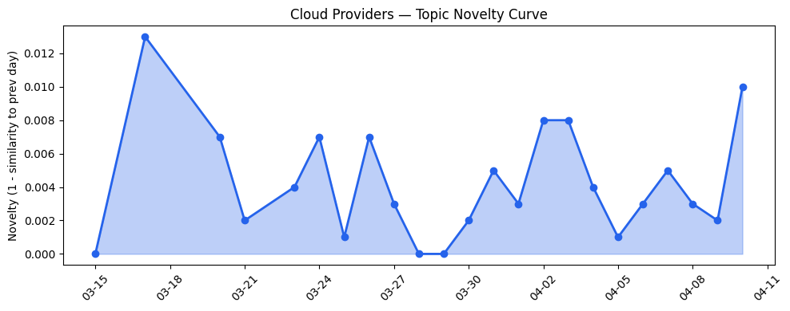
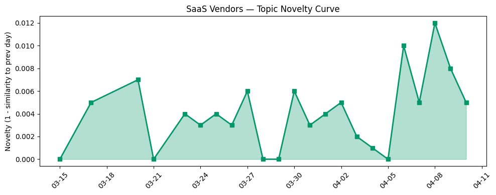

## 今日云计算结构性变化

> 云基础设施正从集中式向主权AI驱动的边缘模块化架构演进，同时量子安全时间表提前至2029年，迫使安全范式重构。

今日云计算产业最显著的结构性变化是边缘AI基础设施的实质性突破与安全范式的根本性转变。微软与Armada合作的Azure Local on Galleon模块化数据中心标志着主权AI部署从概念走向实践，这种"数据中心即集装箱"的模式将彻底改变传统算力部署逻辑。与此同时，Cloudflare将全面后量子安全时间表提前至2029年，反映出量子计算威胁的时间窗口比业界预期更短，迫使整个产业加速安全架构重构。

基于趋势对比分析，今日信号显示：
- 📈 **持续趋势**：主权AI与数字主权话题连续多天增强
- 🆕 **新兴方向**：模块化数据中心、多云管理为近期新焦点
- 🔺 **突然升温**：风险信号近3天相似度显著上升46%
- 🔑 **新关键词**：AWS S3 Files、Google Cloud QueryData、垂直行业SaaS
- 📉 **消退关键词**：Serverless、合规风险等传统话题关注度下降

## 技术层信号

🟡 渐进改善

云原生技术继续沿着提升开发效率与智能化方向演进。AWS推出ECS Managed Daemons优化容器编排运维效率，[Google Cloud QueryData](https://cloud.google.com/blog/products/databases/introducing-querydata-for-near-100-percent-accurate-data-agents/)工具实现自然语言到数据库查询的转换，显示AI与开发工具链的深度融合趋势。Cloudflare Workflows新增可视化流程图功能进一步降低开发门槛，这种"低代码+AI"的组合正在成为云厂商标准化竞争策略。

在基础设施层面，[AWS S3 Files](https://aws.amazon.com/blogs/aws/launching-s3-files-making-s3-buckets-accessible-as-file-systems/)将对象存储转换为高性能文件系统的能力，反映了存储架构向更灵活访问模式演进。Google Cloud默认开启基础AI和云安全功能的做法，体现了安全从可选附加项向基础服务的转变。整体技术演进显示云厂商正从提供基础资源向提供智能化开发平台转型。

## 产业资本信号

🟡 中等信号

产业资本今日显示AI应用层持续获得关注，但缺乏重大并购事件。Strella完成1400万美元A轮融资，其AI访谈技术被亚马逊和Chobani采用，表明AI驱动的客户研究工具正在获得市场验证。这种垂直领域AI应用的融资活动显示资本正从基础设施层向具有明确商业价值的应用层转移。

在基础设施投资方面，模块化数据中心模式的兴起可能改变传统数据中心供应链和资本配置逻辑。微软的Azure Local on Galleon方案支持离线环境AI工作负载，这种边缘部署模式降低了大规模数据中心建设的前期资本投入，使得算力部署更加灵活。同时，Cloudflare网络容量突破500Tbps显示内容分发网络仍在持续扩张，边缘计算基础设施投资保持强劲。

## 潜在拐点判断

今日观察到边缘AI基础设施部署的潜在拐点信号。微软Azure Local on Galleon模块化数据中心代表了一种新的算力交付模式，这种"数据中心即产品"的 approach可能改变传统云服务的区域扩展逻辑。如果模块化边缘数据中心模式获得大规模采用，将显著降低主权AI部署的门槛，加速算力向边缘迁移。

另一个重要拐点是量子安全时间表的提前。Cloudflare将全面后量子安全目标设定为2029年，比业界普遍预期的2030-2035年大幅提前。这一调整可能迫使整个行业重新评估加密标准迁移时间表，引发新一轮安全架构投资浪潮。

## 明日观察点

1. **模块化数据中心采用进展**：关注是否有更多厂商跟进模块化边缘部署模式，以及实际客户采用情况，判断这是否成为边缘AI基础设施的新标准
2. **量子安全生态响应**：观察其他安全厂商和云服务商是否调整量子安全路线图，以及企业客户的安全预算重新分配
3. **垂直行业AI代理落地**：跟踪Salesforce Agentforce等垂直AI工具的实际业务价值验证，判断行业定制化AI的市场接受度

## 长期趋势坐标

今日信号在月尺度上显示云计算产业正经历从"集中化效率"向"分布式主权"的结构性转变。主权AI和数字主权话题的持续增强反映了地缘政治因素对技术架构的深远影响。模块化数据中心和边缘AI基础设施的兴起，可能在未来季度重塑云厂商的竞争格局，从单纯的价格和功能竞争转向合规性、主权性和灵活性的综合比拼。

同时，AI代理与数据治理的工具化趋势表明，云服务正在从基础设施层向智能工作流层渗透。这种"AI原生"的云服务模式可能在未来半年内成为差异化竞争的关键，推动新一轮的平台重构。

## 数据洞察

### 云厂商话题演化
云厂商话题新颖度得分0.024，相似度0.976，显示话题延续性较强，今日更新主要在既有框架内深化。23天历史数据显示云厂商内容稳定性高，创新主要集中在现有技术栈的优化而非突破性变革。

### SaaS厂商话题演化  
SaaS厂商话题新颖度0.033，相似度0.967，延续趋势明显。30篇文章分析显示SaaS厂商正聚焦行业垂直化与AI代理集成，从通用工具向行业专用解决方案转型。

### 趋势图

## 参考来源

**云厂商**
- [Launching S3 Files, making S3 buckets accessible as file systems](https://aws.amazon.com/blogs/aws/launching-s3-files-making-s3-buckets-accessible-as-file-systems/) — AWS Blog
- [QueryData helps agents turn natural language into queries for AlloyDB, Cloud SQL and Spanner](https://cloud.google.com/blog/products/databases/introducing-querydata-for-near-100-percent-accurate-data-agents/) — Google Cloud Blog
- [How we use Abstract Syntax Trees (ASTs) to turn Workflows code into visual diagrams](https://blog.cloudflare.com/workflow-diagrams/) — Cloudflare Blog
- [Announcing managed daemon support for Amazon ECS Managed Instances](https://aws.amazon.com/blogs/aws/announcing-managed-daemon-support-for-amazon-ecs-managed-instances/) — AWS Blog
- [Raising the security baseline: Essential AI and cloud security now on by default](https://cloud.google.com/blog/products/identity-security/essential-ai-and-cloud-security-now-on-by-default/) — Google Cloud Blog
- [From bytecode to bytes: automated magic packet generation](https://blog.cloudflare.com/from-bpf-to-packet/) — Cloudflare Blog
- [What’s new with Microsoft in open-source and Kubernetes at KubeCon + CloudNativeCon Europe 2026](https://opensource.microsoft.com/blog/2026/03/24/whats-new-with-microsoft-in-open-source-and-kubernetes-at-kubecon-cloudnativecon-europe-2026/) — Microsoft Azure Blog
- [Building sovereign AI at the edge: Microsoft and Armada collaborate to deliver Azure Local on Galleon modular datacenters](https://azure.microsoft.com/en-us/blog/building-sovereign-ai-at-the-edge-microsoft-and-armada-collaborate-to-deliver-azure-local-on-galleon-modular-datacenters/) — Microsoft Azure Blog
- [500 Tbps of capacity: 16 years of scaling our global network](https://blog.cloudflare.com/500-tbps-of-capacity/) — Cloudflare Blog
- [Announcing the AWS Sustainability console: Programmatic access, configurable CSV reports, and Scope 1–3 reporting in one place](https://aws.amazon.com/blogs/aws/announcing-the-aws-sustainability-console-programmatic-access-configurable-csv-reports-and-scope-1-3-reporting-in-one-place/) — AWS Blog
- [AI for nuclear energy: Powering an intelligent, resilient future](https://www.microsoft.com/en-us/industry/blog/energy-and-resources/2026/03/24/ai-for-nuclear-energy-powering-an-intelligent-resilient-future/) — Microsoft Azure Blog
- [Navigating digital sovereignty at the frontier of transformation](https://www.microsoft.com/en-us/microsoft-cloud/blog/2026/03/25/navigating-digital-sovereignty-at-the-frontier-of-transformation/) — Microsoft Azure Blog
- [Cloudflare targets 2029 for full post-quantum security](https://blog.cloudflare.com/post-quantum-roadmap/) — Cloudflare Blog
- [Amazon Bedrock Guardrails supports cross-account safeguards with centralized control and management](https://aws.amazon.com/blogs/aws/amazon-bedrock-guardrails-supports-cross-account-safeguards-with-centralized-control-and-management/) — AWS Blog

**SaaS厂商**
- [G2 Crowns Salesforce as Best Financial Services Software](https://www.salesforce.com/blog/agentforce-financial-services-tops-g2-rankings/) — Salesforce Blog
- [The Case for Unified CCaaS and CRM — And Why the Data Makes It Clear](https://www.salesforce.com/blog/ccaas-crm-convergence/) — Salesforce Blog
- [【最佳实践-电商行业】电商智能助手团队版多Agent-ShopClaw](https://developer.volcengine.com/articles/7626684881255039003) — 火山引擎 Blog
- [How SAP Concur automates expense reporting with agentic AI](https://cloud.google.com/blog/products/ai-machine-learning/how-sap-concur-automates-expense-reporting-with-agentic-ai/) — Google Cloud Blog

**行业资讯**
- [France to ditch Windows for Linux to reduce reliance on US tech](https://techcrunch.com/2026/04/10/france-to-ditch-windows-for-linux-to-reduce-reliance-on-us-tech/) — TechCrunch
- [Kai-Fu Lee's brutal assessment: America is already losing the AI hardware war to China](https://venturebeat.com/infrastructure/kai-fu-lees-brutal-assessment-america-is-already-losing-the-ai-hardware-war) — VentureBeat Enterprise
- [Tokenization takes the lead in the fight for data security](https://venturebeat.com/technology/tokenization-takes-the-lead-in-the-fight-for-data-security) — VentureBeat Enterprise
- [Amazon and Chobani adopt Strella's AI interviews for customer research as fast-growing startup raises $14M](https://venturebeat.com/technology/amazon-and-chobani-adopt-strellas-ai-interviews-for-customer-research-as) — VentureBeat Enterprise