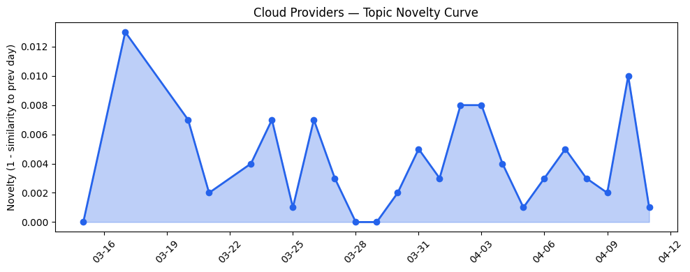
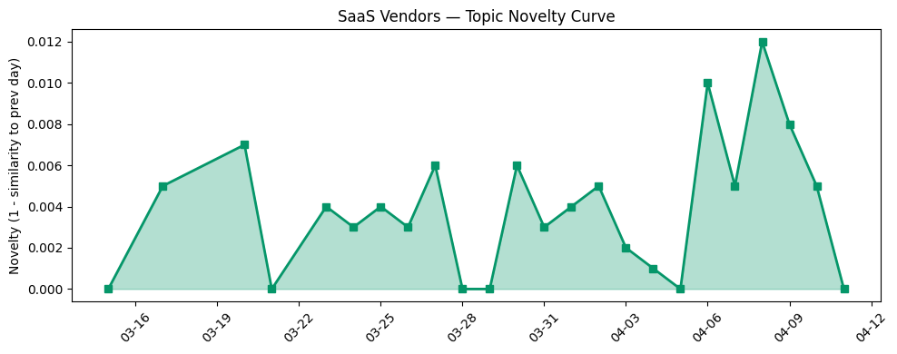

## 今日云计算结构性变化

> 云厂商正加速AI代理基础设施成熟化并向边缘主权AI演进，AI安全治理和垂直行业SaaS专业化成为关键竞争维度。

今日云计算产业格局正经历从集中式AI训练向分布式智能部署的深刻转变。微软与Armada合作推出Azure Local on Galleon模块化数据中心，标志着主权AI从概念验证进入边缘部署阶段，而AWS Bedrock Guardrails的跨账户安全控制则显示云厂商正将AI治理从可选功能升级为核心基础设施。这种"AI代理+主权边缘"的双重演进意味着云计算竞争正从算力规模转向智能分布与合规能力。

- 📈 **持续趋势**：基础设施与应用层话题已连续8天增强
- 🔺 **突然升温**：技术层、基础设施、应用层近3天话题集中爆发
- 🔑 **新关键词**：Bedrock Guardrails、对象存储
- 📈 **上升关键词**：AI治理、主权云、模块化数据中心
- 📉 **消退关键词**：Serverless、可持续计算、监管合规

## 技术层信号

🟡 渐进改善

云原生基础设施正围绕AI代理工作负载进行针对性优化。AWS推出[S3 Files](https://aws.amazon.com/blogs/aws/launching-s3-files-making-s3-buckets-accessible-as-file-systems/)将对象存储转为高性能文件系统，Google Cloud [QueryData](https://cloud.google.com/blog/products/databases/introducing-querydata-for-near-100-percent-accurate-data-agents/)提升AI代理数据访问准确性，显示存储与数据库层正为AI代理的持久化状态管理进行架构重塑。Cloudflare重新设计[AI时代缓存架构](https://blog.cloudflare.com/rethinking-cache-ai-humans/)应对超100亿次/周AI请求，表明边缘网络需为AI工作负载的实时性要求重新设计。

在基础设施层面，AWS Aurora PostgreSQL支持[秒级数据库创建](https://aws.amazon.com/blogs/aws/announcing-amazon-aurora-postgresql-serverless-database-creation-in-seconds/)，Cloudflare网络容量[突破500Tbps](https://blog.cloudflare.com/500-tbps-of-capacity/)，微软在KubeCon展示Kubernetes操作成熟度提升，这些渐进改善共同指向云基础设施正为AI工作负载的弹性需求进行深度优化。技术层近3天相似度从0.46跃升至0.65的突然升温，印证了AI代理基础设施正成为技术竞争焦点。

## 产业资本信号

🔴 强信号

资本正密集流向AI芯片与边缘基础设施硬科技领域。NVIDIA投资的SiFive估值达[36.5亿美元](https://techcrunch.com/2026/04/11/nvidia-backed-sifive-hits-3-65-billion-valuation-for-open-ai-chips/)，基于RISC-V的开放AI芯片设计获市场高估值，显示AI芯片生态多元化趋势加速。同时，电池回收商Ascend Elements申请破产，与Strella完成[1400万美元A轮融资](https://venturebeat.com/technology/amazon-and-chobani-adopt-strellas-ai-interviews-for-customer-research-as)形成鲜明对比，表明资本正从泛科技向AI基础设施等硬科技集中。

基础设施层面，微软与Armada合作推出[Azure Local on Galleon模块化数据中心](https://azure.microsoft.com/en-us/blog/building-sovereign-ai-at-the-edge-microsoft-and-armada-collaborate-to-deliver-azure-local-on-galleon-modular-datacenters/)，实现边缘主权AI部署，微软主权云平台在Forrester Wave评估中获领导者地位。这种模块化边缘数据中心的兴起，标志着云基础设施正从集中式超大规模向分布式主权边缘演进，基础设施话题连续8天增强且近3天突然升温，印证了这一结构性转变的加速。

## 潜在拐点判断

今日观察到主权边缘AI从概念验证到商业化部署的拐点信号。微软Azure Local on Galleon模块化数据中心的推出，结合其在Forrester主权云评估中的领导者地位，表明主权AI正从政策要求转向可部署的基础设施解决方案。这一拐点的依据在于：模块化数据中心解决了边缘AI的部署复杂度问题，而跨云厂商的AI治理工具（如AWS Bedrock Guardrails）为分布式AI提供了统一安全框架。

此拐点可能重塑云计算竞争格局：边缘部署能力将比集中式算力规模更重要，AI治理将成为核心差异化因素。云厂商需重新平衡集中与分布式基础设施投资，而垂直行业SaaS需适配边缘AI工作流。这一转变可能在未来6-12个月内加速行业分化，具备主权边缘能力的厂商将获得监管敏感行业的关键合同。

## 明日观察点

1. **关注主权边缘AI的行业落地进展**：观察是否有关键行业（如金融、医疗、政府）开始大规模部署模块化边缘AI解决方案，这将验证主权边缘从技术概念到商业价值的转化。
2. **监测AI治理工具的采用率**：AWS Bedrock Guardrails等跨账户安全控制的实际采用情况，将反映企业对AI风险管理的真实需求强度。
3. **跟踪AI芯片生态竞争态势**：SiFive等高估值AI芯片公司的技术进展与客户获取，将指示开放AI芯片架构对NVIDIA垄断格局的实际挑战能力。

## 长期趋势坐标

今日信号在月尺度上延续了云计算向AI原生架构演进的长期趋势，但主权边缘与AI治理的突出表现标志着分布式智能正成为新焦点。overall_novelty为0.171显示今日内容在延续中有创新，而消退关键词如"Serverless"、"可持续计算"表明产业注意力正从通用云原生技术向AI特定需求转移。未来一季，主权AI部署与垂直行业AI代理的深度融合将定义云计算竞争新边界。

## 数据洞察

### 云厂商话题演化
云厂商话题新颖度得分0.023，相似度0.977，呈现延续态势。24天历史数据显示云厂商讨论高度连续，今日46篇文章主要围绕AI基础设施与主权云等持续主题深化。

### SaaS厂商话题演化  
SaaS厂商话题新颖度得分0.032，相似度0.968，同样呈现延续趋势。30篇文章显示SaaS厂商正聚焦垂直行业AI代理应用，与云平台的基础设施演进形成协同。

### 趋势图

## 参考来源

**云厂商**
- [Launching S3 Files, making S3 buckets accessible as file systems](https://aws.amazon.com/blogs/aws/launching-s3-files-making-s3-buckets-accessible-as-file-systems/) — AWS Blog
- [QueryData helps agents turn natural language into queries for AlloyDB, Cloud SQL and Spanner](https://cloud.google.com/blog/products/databases/introducing-querydata-for-near-100-percent-accurate-data-agents/) — Google Cloud Blog
- [500 Tbps of capacity: 16 years of scaling our global network](https://blog.cloudflare.com/500-tbps-of-capacity/) — Cloudflare Blog
- [Why we're rethinking cache for the AI era](https://blog.cloudflare.com/rethinking-cache-ai-humans/) — Cloudflare Blog
- [Announcing Amazon Aurora PostgreSQL serverless database creation in seconds](https://aws.amazon.com/blogs/aws/announcing-amazon-aurora-postgresql-serverless-database-creation-in-seconds/) — AWS Blog
- [What’s new with Microsoft in open-source and Kubernetes at KubeCon + CloudNativeCon Europe 2026](https://opensource.microsoft.com/blog/2026/03/24/whats-new-with-microsoft-in-open-source-and-kubernetes-at-kubecon-cloudnativecon-europe-2026/) — Microsoft Azure Blog
- [Introducing Programmable Flow Protection: custom DDoS mitigation logic for Magic Transit customers](https://blog.cloudflare.com/programmable-flow-protection/) — Cloudflare Blog
- [How we use Abstract Syntax Trees (ASTs) to turn Workflows code into visual diagrams](https://blog.cloudflare.com/workflow-diagrams/) — Cloudflare Blog
- [Announcing managed daemon support for Amazon ECS Managed Instances](https://aws.amazon.com/blogs/aws/announcing-managed-daemon-support-for-amazon-ecs-managed-instances/) — AWS Blog
- [Raising the security baseline: Essential AI and cloud security now on by default](https://cloud.google.com/blog/products/identity-security/essential-ai-and-cloud-security-now-on-by-default/) — Google Cloud Blog
- [Building sovereign AI at the edge: Microsoft and Armada collaborate to deliver Azure Local on Galleon modular datacenters](https://azure.microsoft.com/en-us/blog/building-sovereign-ai-at-the-edge-microsoft-and-armada-collaborate-to-deliver-azure-local-on-galleon-modular-datacenters/) — Microsoft Azure Blog
- [Microsoft named a Leader in The Forrester Wave™ for Sovereign Cloud Platforms](https://azure.microsoft.com/en-us/blog/microsoft-named-a-leader-in-the-forrester-wave-for-sovereign-cloud-platforms/) — Microsoft Azure Blog
- [Announcing the AWS Sustainability console: Programmatic access, configurable CSV reports, and Scope 1–3 reporting in one place](https://aws.amazon.com/blogs/aws/announcing-the-aws-sustainability-console-programmatic-access-configurable-csv-reports-and-scope-1-3-reporting-in-one-place/) — AWS Blog
- [Cloudflare targets 2029 for full post-quantum security](https://blog.cloudflare.com/post-quantum-roadmap/) — Cloudflare Blog
- [AI for nuclear energy: Powering an intelligent, resilient future](https://www.microsoft.com/en-us/industry/blog/energy-and-resources/2026/03/24/ai-for-nuclear-energy-powering-an-intelligent-resilient-future/) — Microsoft Azure Blog
- [Behind the Analysis with Google Cloud and Team USA: Architecting AI infrastructure for U.S. Winter Olympians](https://cloud.google.com/blog/products/media-entertainment/architecting-ai-infrastructure-for-us-winter-olympians/) — Google Cloud Blog
- [Amazon Bedrock Guardrails supports cross-account safeguards with centralized control and management](https://aws.amazon.com/blogs/aws/amazon-bedrock-guardrails-supports-cross-account-safeguards-with-centralized-control-and-management/) — AWS Blog
- [Navigating digital sovereignty at the frontier of transformation](https://www.microsoft.com/en-us/microsoft-cloud/blog/2026/03/25/navigating-digital-sovereignty-at-the-frontier-of-transformation/) — Microsoft Azure Blog

**SaaS厂商**
- [G2 Crowns Salesforce as Best Financial Services Software](https://www.salesforce.com/blog/agentforce-financial-services-tops-g2-rankings/) — Salesforce Blog
- [How SAP Concur automates expense reporting with agentic AI](https://cloud.google.com/blog/products/ai-machine-learning/how-sap-concur-automates-expense-reporting-with-agentic-ai/) — Google Cloud Blog
- [The Case for Unified CCaaS and CRM — And Why the Data Makes It Clear](https://www.salesforce.com/blog/ccaas-crm-convergence/) — Salesforce Blog
- [Hidden Insights: The Guide to Tableau For Small Business Owners](https://www.salesforce.com/blog/tableau-for-small-business/) — Salesforce Blog

**行业资讯**
- [Nvidia-backed SiFive hits $3.65 billion valuation for open AI chips](https://techcrunch.com/2026/04/11/nvidia-backed-sifive-hits-3-65-billion-valuation-for-open-ai-chips/) — TechCrunch
- [Amazon and Chobani adopt Strella's AI interviews for customer research as fast-growing startup raises $14M](https://venturebeat.com/technology/amazon-and-chobani-adopt-strellas-ai-interviews-for-customer-research-as) — VentureBeat Enterprise
- [Battery recycler Ascend Elements files for bankruptcy](https://techcrunch.com/2026/04/10/battery-recycler-ascend-elements-files-for-bankruptcy/) — TechCrunch
- [Microsoft's Copilot can now build apps and automate your job — here's how it works](https://venturebeat.com/technology/microsofts-copilot-can-now-build-apps-and-automate-your-job-heres-how-it) — VentureBeat Enterprise
- [Stalking victim sues OpenAI, claims ChatGPT fueled her abuser’s delusions and ignored her warnings](https://techcrunch.com/2026/04/10/stalking-victim-sues-openai-claims-chatgpt-fueled-her-abusers-delusions-and-ignored-her-warnings/) — TechCrunch
- [Kai-Fu Lee's brutal assessment: America is already losing the AI hardware war to China](https://venturebeat.com/infrastructure/kai-fu-lees-brutal-assessment-america-is-already-losing-the-ai-hardware-war) — VentureBeat Enterprise
- [Tokenization takes the lead in the fight for data security](https://venturebeat.com/technology/tokenization-takes-the-lead-in-the-fight-for-data-security) — VentureBeat Enterprise
- [Cloudflare Client-Side Security: smarter detection, now open to everyone](https://blog.cloudflare.com/client-side-security-open-to-everyone/) — Cloudflare Blog

**火山引擎**
- [【龙虾部署】ArkClaw x 飞书，唤醒你的龙虾助理](https://developer.volcengine.com/articles/7615509894233325614) — 火山引擎 Blog
- [火山引擎正式推出四款数据产品 将持续完善敏捷数智引擎矩阵](https://www.cnblogs.com/volcengine/p/15640481.html) — 火山引擎博客
- [火山引擎数智平台 VeDI 空中课程：定期直播公开课，解锁数据应用新技能！](https://developer.volcengine.com/articles/7552807006211178547) — 火山引擎 Blog
- [【权限管理】ArkClaw x 飞书云文档（完整权限清单）](https://developer.volcengine.com/articles/7615511434701340678) — 火山引擎 Blog
- [OpenClaw报API Rate Limit Reached 如何排查？（CodingPlan版)](https://developer.volcengine.com/articles/7618480646865682473) — 火山引擎 Blog
- [ClawSentry 安装和使用说明](https://developer.volcengine.com/articles/7606188681602596907) — 火山引擎 Blog

**腾讯云**
- [MCP广场开源版权声明](https://cloud.tencent.com/developer/article/2537547) — Tencent Cloud Blog