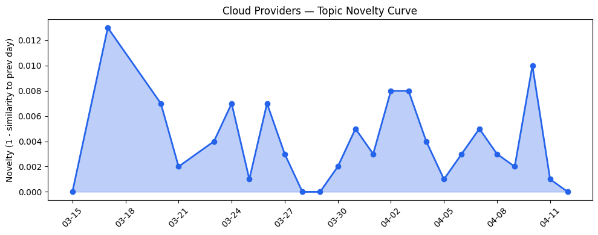
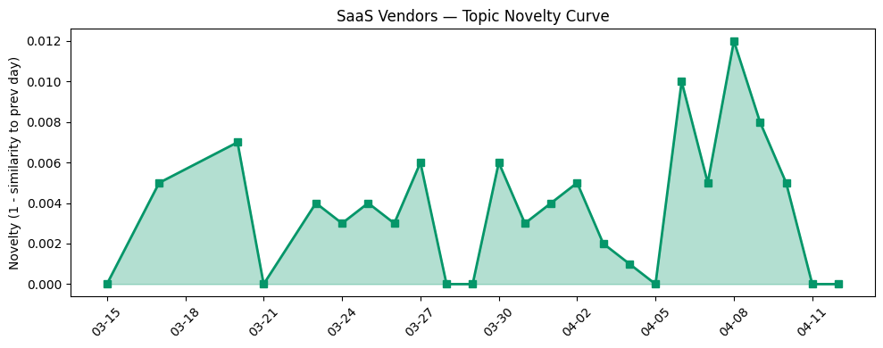

## 今日云计算结构性变化

> AI代理基础设施正从概念验证走向企业级应用，同时云厂商通过边缘AI、主权云和模块化数据中心应对监管与算力分散需求，标志着云计算向智能化、合规化和去中心化演进。

今日云计算产业最显著的结构性变化是AI代理技术从实验室走向生产环境，同时主权云和边缘计算基础设施加速布局。这意味着云厂商正在构建下一代智能化、合规化的基础设施层，以应对日益分散的算力需求和严格的监管环境。AI代理不再仅仅是技术演示，而是开始深度融入企业核心业务流程，从金融服务到核能行业都在探索实际应用场景。

- 📈 **持续趋势**：技术层话题已连续8天增强
- 🔺 **突然升温**：基础设施、技术层、应用层、风险信号近3天突然集中出现
- 🔑 **新关键词**：合规、数据库、无服务器
- 📈 **上升关键词**：AI代理、Salesforce、主权云、模块化数据中心、火山引擎、边缘AI
- 📉 **消退关键词**：AI Agents、NVIDIA、OpenClaw、Serverless、供应链安全

## 技术层信号

🟡 渐进改善

云原生技术正在向更精细化的数据管理和AI融合方向演进。AWS推出[S3 Files将对象存储转换为高性能文件系统](https://aws.amazon.com/blogs/aws/launching-s3-files-making-s3-buckets-accessible-as-file-systems/)，标志着存储层正在打破传统边界，满足AI工作负载对高性能文件访问的需求。Google Cloud的[QueryData工具实现自然语言到数据库查询的精准转换](https://cloud.google.com/blog/products/databases/introducing-querydata-for-near-100-percent-accurate-data-agents/)，显示数据库层正在深度集成AI能力，降低企业使用门槛。

在无服务器和容器编排领域，Cloudflare推出[基于Astro 6.0的全栈无服务器JavaScript CMS EmDash](https://blog.cloudflare.com/emdash-wordpress/)，解决传统CMS的插件安全问题。AWS的[Amazon Aurora PostgreSQL推出秒级创建的Serverless数据库配置](https://aws.amazon.com/blogs/aws/announcing-amazon-aurora-postgresql-serverless-database-creation-in-seconds/)进一步降低了数据库管理复杂度。这些改进表明云厂商正在通过自动化和管理简化来扩大企业采用范围。

## 产业资本信号

🟡 中等信号

在基础设施投资方面，微软与Armada合作推出[Azure Local on Galleon模块化数据中心](https://azure.microsoft.com/en-us/blog/building-sovereign-ai-at-the-edge-microsoft-and-armada-collaborate-to-deliver-azure-local-on-galleon-modular-datacenters/)，实现边缘主权AI部署，显示资本正流向满足监管要求的分布式基础设施。AWS推出[可持续性控制台整合碳排放报告功能](https://aws.amazon.com/blogs/aws/announcing-the-aws-sustainability-console-programmatic-access-configurable-csv-reports-and-scope-1-3-reporting-in-one-place/)，反映ESG投资趋势对云基础设施的影响。

应用层资本流向显示垂直行业AI应用获得关注，AI访谈技术公司[Strella完成1400万美元A轮融资](https://venturebeat.com/technology/amazon-and-chobani-adopt-strellas-ai-interviews-for-customer-research-as)，Amazon和Chobani采用其AI客户研究方案。火山引擎推出[系列AI开发工具](https://www.cnblogs.com/volcengine/p/15640481.html)推动企业AI应用落地，表明资本正支持工具层创新以降低AI应用门槛。

## 潜在拐点判断

今日观察到云计算产业正在经历从集中式云到分布式智能云的拐点。依据是主权云、边缘AI和模块化数据中心的集中出现，结合Cloudflare制定[2029年全面后量子安全路线图](https://blog.cloudflare.com/post-quantum-roadmap/)的前瞻性布局。这一拐点的影响将是深远的：企业将不再依赖单一云区域，而是采用混合主权云架构，云厂商的竞争重点将从规模经济转向合规能力和边缘覆盖。

同时，AI代理技术正从工具层向平台层演进，Google Cloud的QueryData和Salesforce的Agentforce显示AI代理正在成为新的应用开发范式。这可能引发SaaS行业的重构，传统功能型SaaS需要快速集成AI代理能力以避免被淘汰。

## 明日观察点

1. **主权云标准演进**：关注各云厂商在主权云认证和合规框架方面的差异化策略，特别是如何平衡全球服务一致性与本地合规要求
2. **AI代理开发生态**：观察火山引擎、AWS等厂商在降低AI代理开发门槛方面的工具进展，以及开发者社区的接受程度
3. **边缘AI用例验证**：跟踪模块化数据中心在制造业、能源等垂直行业的实际部署效果，判断边缘AI的商业化成熟度

## 长期趋势坐标

将今日信号放到季度尺度观察，云计算正在经历从"云优先"到"智能优先"的范式转移。AI代理基础设施的成熟将重新定义云服务的价值主张，企业选择云厂商的标准将从计算存储成本转向AI能力集成度。同时，地缘政治风险加速了主权云和边缘计算的发展，Cloudflare网络容量[突破500Tbps](https://blog.cloudflare.com/500-tbps-of-capacity/)显示分布式架构正在成为主流。

从数据看，云厂商话题延续性较高（新颖度0.022），SaaS话题也在延续轨道（新颖度0.031），表明当前趋势具有较强持续性。上升关键词中的"火山引擎"显示中国云厂商在全球AI代理生态中开始获得关注。

## 数据洞察

### 云厂商话题演化
云厂商话题延续性较强，25天历史数据显示平均相似度0.978，新颖度得分0.022，表明主流云厂商的技术路线相对稳定，正在现有框架内深化AI和合规能力。

### SaaS厂商话题演化  
SaaS话题同样呈现延续特征，平均相似度0.969，新颖度0.031。Salesforce等厂商正围绕AI代理重构产品矩阵，垂直行业渗透加速。

### 趋势图

## 参考来源

**云厂商**
- [Launching S3 Files, making S3 buckets accessible as file systems](https://aws.amazon.com/blogs/aws/launching-s3-files-making-s3-buckets-accessible-as-file-systems/) — AWS Blog
- [QueryData helps agents turn natural language into queries for AlloyDB, Cloud SQL and Spanner](https://cloud.google.com/blog/products/databases/introducing-querydata-for-near-100-percent-accurate-data-agents/) — Google Cloud Blog
- [Introducing EmDash — the spiritual successor to WordPress that solves plugin security](https://blog.cloudflare.com/emdash-wordpress/) — Cloudflare Blog
- [What’s new with Microsoft in open-source and Kubernetes at KubeCon + CloudNativeCon Europe 2026](https://opensource.microsoft.com/blog/2026/03/24/whats-new-with-microsoft-in-open-source-and-kubernetes-at-kubecon-cloudnativecon-europe-2026/) — Microsoft Azure Blog
- [Announcing Amazon Aurora PostgreSQL serverless database creation in seconds](https://aws.amazon.com/blogs/aws/announcing-amazon-aurora-postgresql-serverless-database-creation-in-seconds/) — AWS Blog
- [500 Tbps of capacity: 16 years of scaling our global network](https://blog.cloudflare.com/500-tbps-of-capacity/) — Cloudflare Blog
- [Raising the security baseline: Essential AI and cloud security now on by default](https://cloud.google.com/blog/products/identity-security/essential-ai-and-cloud-security-now-on-by-default/) — Google Cloud Blog
- [字节跳动是如何建设云的？](https://www.cnblogs.com/volcengine/p/15633967.html) — 火山引擎博客
- [Announcing managed daemon support for Amazon ECS Managed Instances](https://aws.amazon.com/blogs/aws/announcing-managed-daemon-support-for-amazon-ecs-managed-instances/) — AWS Blog
- [Introducing Programmable Flow Protection: custom DDoS mitigation logic for Magic Transit customers](https://blog.cloudflare.com/programmable-flow-protection/) — Cloudflare Blog
- [Building sovereign AI at the edge: Microsoft and Armada collaborate to deliver Azure Local on Galleon modular datacenters](https://azure.microsoft.com/en-us/blog/building-sovereign-ai-at-the-edge-microsoft-and-armada-collaborate-to-deliver-azure-local-on-galleon-modular-datacenters/) — Microsoft Azure Blog
- [Announcing the AWS Sustainability console: Programmatic access, configurable CSV reports, and Scope 1–3 reporting in one place](https://aws.amazon.com/blogs/aws/announcing-the-aws-sustainability-console-programmatic-access-configurable-csv-reports-and-scope-1-3-reporting-in-one-place/) — AWS Blog
- [Microsoft named a Leader in The Forrester Wave™ for Sovereign Cloud Platforms](https://azure.microsoft.com/en-us/blog/microsoft-named-a-leader-in-the-forrester-wave-for-sovereign-cloud-platforms/) — Microsoft Azure Blog
- [Cloudflare targets 2029 for full post-quantum security](https://blog.cloudflare.com/post-quantum-roadmap/) — Cloudflare Blog
- [Amazon Bedrock Guardrails supports cross-account safeguards with centralized control and management](https://aws.amazon.com/blogs/aws/amazon-bedrock-guardrails-supports-cross-account-safeguards-with-centralized-control-and-management/) — AWS Blog
- [Navigating digital sovereignty at the frontier of transformation](https://www.microsoft.com/en-us/microsoft-cloud/blog/2026/03/25/navigating-digital-sovereignty-at-the-frontier-of-transformation/) — Microsoft Azure Blog
- [Cloudflare Client-Side Security: smarter detection, now open to everyone](https://blog.cloudflare.com/client-side-security-open-to-everyone/) — Cloudflare Blog

**SaaS厂商**
- [G2 Crowns Salesforce as Best Financial Services Software](https://www.salesforce.com/blog/agentforce-financial-services-tops-g2-rankings/) — Salesforce Blog
- [AI for nuclear energy: Powering an intelligent, resilient future](https://www.microsoft.com/en-us/industry/blog/energy-and-resources/2026/03/24/ai-for-nuclear-energy-powering-an-intelligent-resilient-future/) — Microsoft Azure Blog
- [How SAP Concur automates expense reporting with agentic AI](https://cloud.google.com/blog/products/ai-machine-learning/how-sap-concur-automates-expense-reporting-with-agentic-ai/) — Google Cloud Blog
- [In the New Era of AI, You Need to Win Over Both Humans and Agents](https://www.salesforce.com/blog/agentic-marketing-innovation/) — Salesforce Blog
- [The Case for Unified CCaaS and CRM — And Why the Data Makes It Clear](https://www.salesforce.com/blog/ccaas-crm-convergence/) — Salesforce Blog
- [火山引擎正式推出四款数据产品 将持续完善敏捷数智引擎矩阵](https://www.cnblogs.com/volcengine/p/15640481.html) — 火山引擎博客
- [【龙虾部署】ArkClaw x 飞书，唤醒你的龙虾助理](https://developer.volcengine.com/articles/7615509894233325614) — 火山引擎 Blog
- [🚀Hermes Agent 爆火真相：19k Star 背后的自学习 Agent 系统](https://developer.volcengine.com/articles/7623357459608518702) — 火山引擎 Blog

**行业资讯**
- [Inside LinkedIn’s generative AI cookbook: How it scaled people search to 1.3 billion users](https://venturebeat.com/infrastructure/inside-linkedins-generative-ai-cookbook-how-it-scaled-people-search-to-1-3) — VentureBeat Enterprise
- [Amazon and Chobani adopt Strella's AI interviews for customer research as fast-growing startup raises $14M](https://venturebeat.com/technology/amazon-and-chobani-adopt-strellas-ai-interviews-for-customer-research-as) — VentureBeat Enterprise
- [Trump officials may be encouraging banks to test Anthropic's Mythos model](https://techcrunch.com/2026/04/12/trump-officials-may-be-encouraging-banks-to-test-anthropics-mythos-model/) — TechCrunch
- [Kai-Fu Lee's brutal assessment: America is already losing the AI hardware war to China](https://venturebeat.com/infrastructure/kai-fu-lees-brutal-assessment-america-is-already-losing-the-ai-hardware-war) — VentureBeat Enterprise
- [MCP广场开源版权声明](https://cloud.tencent.com/developer/article/2537547) — Tencent Cloud Blog