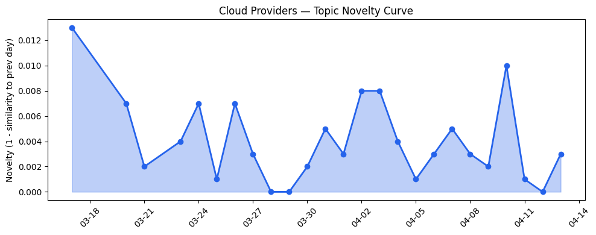
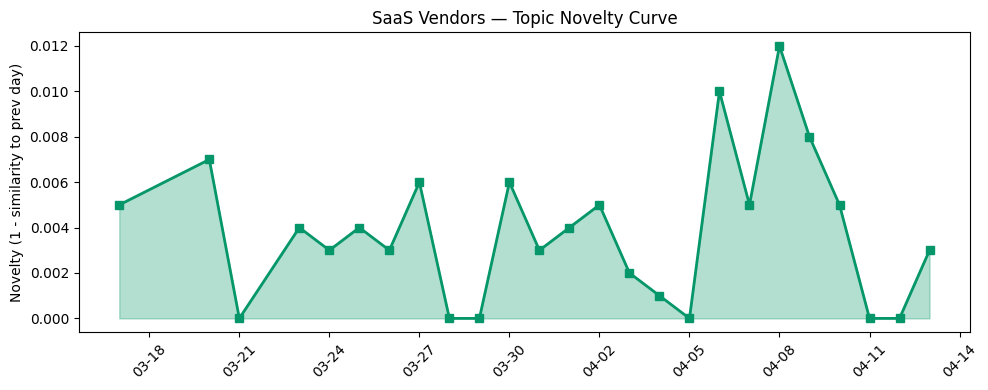

## 今日云计算结构性变化

> AI Agent技术从概念验证进入企业级规模化部署阶段，同时驱动云计算基础设施向边缘AI、智能缓存架构演进，并加速后量子安全等下一代技术路线图的实施。

今日最显著的变化是AI Agent技术正在从实验室走向企业级生产环境，这一转变正在重构云计算的基础架构设计理念。Cloudflare的AI代理沙箱正式上线、Google Cloud推出QueryData工具、AWS优化S3文件系统访问性能，都表明云厂商正在为AI Agent的大规模部署重构底层基础设施。这种重构不仅涉及计算和存储，更延伸到边缘部署、缓存优化和安全架构等核心领域。

- 📈 **持续趋势**：技术层、应用层、资本信号已连续8天增强
- 🔺 **突然升温**：基础设施、技术层、应用层近3天话题集中爆发
- 🆕 **新兴方向**：后量子安全、缓存架构、企业级部署成为新焦点
- 🔑 **新关键词**：企业级部署、后量子安全、智能代理、缓存架构
- 📉 **消退关键词**：AI Agents、NVIDIA、可持续计算、监管合规

## 技术层信号

🔴 重大突破

AI Agent的规模化部署正在推动云计算技术栈的深度重构。Cloudflare推出的[Durable Object Facets和AI代理沙箱技术](https://blog.cloudflare.com/durable-object-facets-dynamic-workers/)实现了动态Worker与持久化数据库的深度集成，为每个AI生成的应用提供独立数据库，这标志着Serverless架构正在向AI原生方向演进。同时，AWS推出[S3 Files将对象存储转换为高性能文件系统](https://aws.amazon.com/blogs/aws/launching-s3-files-making-s3-buckets-accessible-as-file-systems/)，Google Cloud的[QueryData工具将自然语言转换为数据库查询](https://cloud.google.com/blog/products/databases/introducing-querydata-for-near-100-percent-accurate-data-agents/)，这些创新都在解决AI Agent对数据访问性能的新需求。

缓存架构正在经历AI时代的重新设计。Cloudflare在[重新思考AI时代的缓存策略](https://blog.cloudflare.com/rethinking-cache-ai-humans/)中指出，AI-bot流量周超100亿次请求对传统缓存系统构成挑战，需要建立更智能的缓存分层机制。微软在Kubernetes操作成熟度方面的新进展，以及Amazon Aurora PostgreSQL Serverless实现秒级数据库创建，都体现了云原生技术正在为AI工作负载优化。

安全技术路线图也在加速推进，Cloudflare公布[2029年后量子安全路线图](https://blog.cloudflare.com/post-quantum-roadmap/)显示行业对下一代安全威胁的前瞻性布局。这种技术层的集中突破反映了云厂商对AI Agent时代基础设施需求的积极响应。

## 产业资本信号

🟡 中等信号

资本层面显示AI Agent生态正在加速成熟。Vercel CEO[释放IPO准备信号](https://techcrunch.com/2026/04/13/vercel-ceo-guillermo-rauch-signals-ipo-readiness-as-ai-agents-fuel-revenue-surge/)，表明AI Agent技术已经具备商业化规模。Strella完成[1400万美元A轮融资](https://venturebeat.com/technology/amazon-and-chobani-adopt-strellas-ai-interviews-for-customer-research-as)，其AI访谈技术被亚马逊和Chobani采用，显示企业级AI应用正在获得资本认可。

基础设施投资方向明确指向边缘AI和主权云。微软与Armada合作推出[Azure Local on Galleon模块化数据中心](https://azure.microsoft.com/en-us/blog/building-sovereign-ai-at-the-edge-microsoft-and-armada-collaborate-to-deliver-azure-local-on-galleon-modular-datacenters/)，实现边缘主权AI部署，同时微软在[Forrester主权云平台评估中被评为领导者](https://azure.microsoft.com/en-us/blog/microsoft-named-a-leader-in-the-forrester-wave-for-sovereign-cloud-platforms/)。Cloudflare网络容量达到[500Tbps里程碑](https://blog.cloudflare.com/500-tbps-of-capacity/)，可承载全球20%网络流量，这些投资都指向分布式计算架构的强化。

企业级部署成为资本关注焦点，IBM支付[1700万美元和解DEI诉讼](https://techcrunch.com/2026/04/13/ibm-pays-17m-fine-to-end-doj-suit-over-dei-programs/)反映科技公司合规成本上升，微软在[Gartner iPaaS魔力象限被评为领导者](https://azure.microsoft.com/en-us/blog/microsoft-named-a-leader-in-2026-gartner-magic-quadrant-for-integration-platform-as-a-service/)显示集成服务领域的战略地位巩固。

## 潜在拐点判断

今日观察到AI Agent技术从概念验证向企业级部署的拐点信号。依据在于：技术层出现多项针对AI Agent规模化部署的基础设施创新，应用层出现多个行业级落地案例，资本层面出现明确的商业化信号。这个拐点意味着云计算产业正在从"AI ready"向"AI native"架构转型，云服务商需要重新设计其基础设施以适应AI Agent的独特需求。

可能的影响包括：边缘计算基础设施投资加速，智能缓存架构成为新的竞争焦点，后量子安全等长期技术路线图被迫提前。云厂商的竞争格局可能重新洗牌，那些能够快速适应AI Agent架构需求的厂商将获得先发优势。

## 明日观察点

1. **边缘AI部署进展**：关注各云厂商在边缘计算领域的进一步投资和产品发布，特别是模块化数据中心和主权云解决方案的落地情况
2. **AI Agent性能优化**：观察云厂商如何解决AI Agent的大规模并发、低延迟数据访问等核心技术挑战
3. **安全架构演进**：监测后量子密码学在实际产品中的实施进度，以及应对AI时代新型安全威胁的解决方案

## 长期趋势坐标

今日信号表明，云计算产业正在进入以AI Agent为核心驱动的新周期。从月尺度看，技术层、应用层、资本信号的持续增强趋势已经形成，AI Agent正在从技术热点转化为产业现实。新兴关键词如"企业级部署"、"后量子安全"、"缓存架构"的出现，标志着产业关注点从技术可行性转向规模化落地和长期可持续性。

云厂商的竞争焦点正在从单纯的算力供给转向全栈AI基础设施能力，包括边缘部署、数据访问优化、安全合规等综合实力。这种转变可能重塑未来3-5年的云计算市场格局。

## 数据洞察

### 云厂商话题演化
今日云厂商话题新颖度得分0.023，平均相似度0.977，呈现延续性趋势。在过去26天内收录46篇文章，表明云厂商话题保持高度一致性，主要集中在AI基础设施优化方向。

### SaaS厂商话题演化  
SaaS厂商话题新颖度得分0.031，平均相似度0.969，同样呈现延续性趋势。30篇文章显示SaaS厂商正在深度整合AI Agent能力，推动行业解决方案创新。

### 趋势图

## 参考来源

**云厂商**
- [Durable Objects in Dynamic Workers: Give each AI-generated app its own database](https://blog.cloudflare.com/durable-object-facets-dynamic-workers/) — Cloudflare Blog
- [Agents have their own computers with Sandboxes GA](https://blog.cloudflare.com/sandbox-ga/) — Cloudflare Blog
- [What's new with Microsoft in open-source and Kubernetes at KubeCon + CloudNativeCon Europe 2026](https://opensource.microsoft.com/blog/2026/03/24/whats-new-with-microsoft-in-open-source-and-kubernetes-at-kubecon-cloudnativecon-europe-2026/) — Microsoft Azure Blog
- [Cloudflare targets 2029 for full post-quantum security](https://blog.cloudflare.com/post-quantum-roadmap/) — Cloudflare Blog
- [Launching S3 Files, making S3 buckets accessible as file systems](https://aws.amazon.com/blogs/aws/launching-s3-files-making-s3-buckets-accessible-as-file-systems/) — AWS Blog
- [QueryData helps agents turn natural language into queries for AlloyDB, Cloud SQL and Spanner](https://cloud.google.com/blog/products/databases/introducing-querydata-for-near-100-percent-accurate-data-agents/) — Google Cloud Blog
- [Announcing Amazon Aurora PostgreSQL serverless database creation in seconds](https://aws.amazon.com/blogs/aws/announcing-amazon-aurora-postgresql-serverless-database-creation-in-seconds/) — AWS Blog
- [Why we're rethinking cache for the AI era](https://blog.cloudflare.com/rethinking-cache-ai-humans/) — Cloudflare Blog
- [Building sovereign AI at the edge: Microsoft and Armada collaborate to deliver Azure Local on Galleon modular datacenters](https://azure.microsoft.com/en-us/blog/building-sovereign-ai-at-the-edge-microsoft-and-armada-collaborate-to-deliver-azure-local-on-galleon-modular-datacenters/) — Microsoft Azure Blog
- [500 Tbps of capacity: 16 years of scaling our global network](https://blog.cloudflare.com/500-tbps-of-capacity/) — Cloudflare Blog
- [Customize your AWS Management Console experience with visual settings including account color, region and service visibility](https://aws.amazon.com/blogs/aws/customize-your-aws-management-console-experience-with-visual-settings-including-account-color-region-and-service-visibility/) — AWS Blog
- [Microsoft named a Leader in The Forrester Wave™ for Sovereign Cloud Platforms](https://azure.microsoft.com/en-us/blog/microsoft-named-a-leader-in-the-forrester-wave-for-sovereign-cloud-platforms/) — Microsoft Azure Blog
- [Announcing the AWS Sustainability console: Programmatic access, configurable CSV reports, and Scope 1–3 reporting in one place](https://aws.amazon.com/blogs/aws/announcing-the-aws-sustainability-console-programmatic-access-configurable-csv-reports-and-scope-1-3-reporting-in-one-place/) — AWS Blog
- [How we built Organizations to help enterprises manage Cloudflare at scale](https://blog.cloudflare.com/organizations-beta/) — Cloudflare Blog
- [AI for nuclear energy: Powering an intelligent, resilient future](https://www.microsoft.com/en-us/industry/blog/energy-and-resources/2026/03/24/ai-for-nuclear-energy-powering-an-intelligent-resilient-future/) — Microsoft Azure Blog
- [How SAP Concur automates expense reporting with agentic AI](https://cloud.google.com/blog/products/ai-machine-learning/how-sap-concur-automates-expense-reporting-with-agentic-ai/) — Google Cloud Blog
- [A new standard for research: How UC Riverside is securing the path to federal grants with Google Public Sector](https://cloud.google.com/blog/topics/public-sector/a-new-standard-for-research-how-uc-riverside-is-securing-the-path-to-federal-grants-with-google-public-sector/) — Google Cloud Blog
- [Microsoft named a Leader in 2026 Gartner® Magic Quadrant™ for Integration Platform as a Service](https://azure.microsoft.com/en-us/blog/microsoft-named-a-leader-in-2026-gartner-magic-quadrant-for-integration-platform-as-a-service/) — Microsoft Azure Blog

**SaaS厂商**
- [From Break/Fix to Profit Engine: Aftermarket Service for Robot OEMs](https://www.salesforce.com/blog/aftermarket-service-robotics-oem/) — Salesforce Blog
- [The Case for Unified CCaaS and CRM — And Why the Data Makes It Clear](https://www.salesforce.com/blog/ccaas-crm-convergence/) — Salesforce Blog
- [【龙虾部署】ArkClaw x 飞书，唤醒你的龙虾助理](https://developer.volcengine.com/articles/7615509894233325614) — 火山引擎 Blog

**行业资讯**
- [Uber and Nuro begin testing premium robotaxi service in San Francisco](https://techcrunch.com/2026/04/13/uber-nuro-san-francisco-testing-premium-robotaxi-service/) — TechCrunch
- [Vercel CEO Guillermo Rauch signals IPO readiness as AI agents fuel revenue surge](https://techcrunch.com/2026/04/13/vercel-ceo-guillermo-rauch-signals-ipo-readiness-as-ai-agents-fuel-revenue-surge/) — TechCrunch
- [Amazon and Chobani adopt Strella's AI interviews for customer research as fast-growing startup raises $14M](https://venturebeat.com/technology/amazon-and-chobani-adopt-strellas-ai-interviews-for-customer-research-as) — VentureBeat Enterprise
- [IBM pays $17M fine to end DOJ suit over DEI programs](https://techcrunch.com/2026/04/13/ibm-pays-17m-fine-to-end-doj-suit-over-dei-programs/) — TechCrunch
- [Booking.com confirms hackers accessed customers' data](https://techcrunch.com/2026/04/13/booking-com-confirms-hackers-accessed-customers-data/) — TechCrunch
- [Hack at Anodot leaves over a dozen breached companies facing extortion](https://techcrunch.com/2026/04/13/hack-at-anodot-leaves-over-a-dozen-breached-companies-facing-extortion/) — TechCrunch
- [FBI announces takedown of phishing operation that targeted thousands of victims](https://techcrunch.com/2026/04/13/fbi-announces-takedown-of-phishing-operation-that-targeted-thousands-of-victims/) — TechCrunch
- [Kai-Fu Lee's brutal assessment: America is already losing the AI hardware war to China](https://venturebeat.com/infrastructure/kai-fu-lees-brutal-assessment-america-is-already-losing-the-ai-hardware-war) — VentureBeat Enterprise