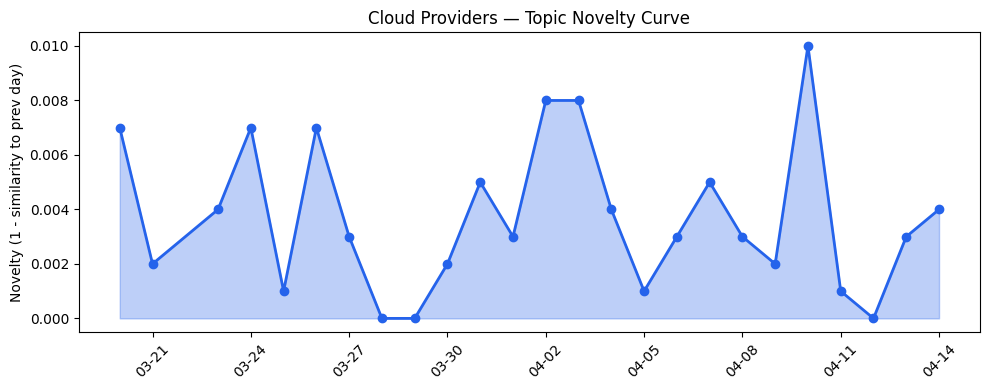
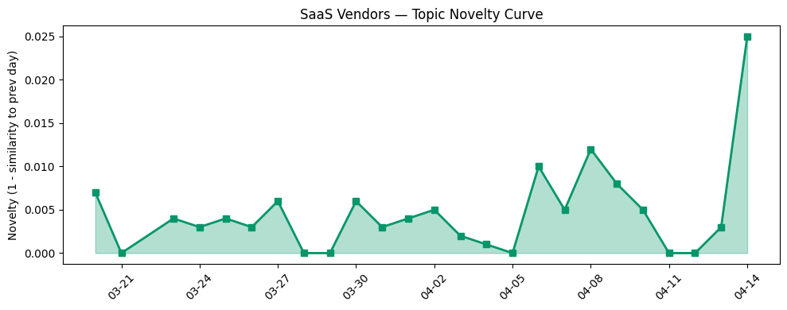

## 今日云计算结构性变化

> 云厂商正从基础设施提供商向AI Agent平台转型，图数据与关系型数据统一分析成为新焦点，AI算力基础设施获资本强烈关注。

今天云计算产业最显著的结构性变化是**AI Agent运行环境的标准化**与**数据分析范式的统一**。Google Cloud推出[BigQuery Graph](https://cloud.google.com/blog/products/data-analytics/introducing-bigquery-graph/)，将图分析能力集成到数据仓库中，标志着云厂商开始解决关系型与图数据的割裂问题；同时Cloudflare推出完整的AI Agent运行环境[Mesh网络和Sandbox GA](https://blog.cloudflare.com/mesh/)，为零信任环境下的AI代理提供标准化基础设施。这意味着云服务正在从通用的计算存储资源向垂直化的AI工作负载专用平台演进。

从趋势信号看：
- 📈 **持续趋势**：基础设施话题已连续8天增强，主权云、边缘计算持续升温
- 📈 **持续趋势**：风险信号连续8天增强，安全治理成为关键挑战
- 🔺 **突然升温**：基础设施、应用层近3天话题集中爆发
- 🔑 **新关键词**：BigQuery Graph、Cloudflare Mesh、Fluidstack、零信任
- 📉 **消退关键词**：Kubernetes、NVIDIA、合规风险等传统话题关注度下降

## 技术层信号

🔴 重大突破

云原生架构正在经历从容器编排向AI Agent运行环境的根本性转变。Cloudflare的[Mesh网络](https://blog.cloudflare.com/mesh/)不仅为用户和节点提供安全连接，更重要的是为AI Agent设计了完整的网络身份认证体系，结合[Sandbox GA](https://blog.cloudflare.com/sandbox-ga/)的隔离环境和[Dynamic Worker](https://blog.cloudflare.com/sandbox-auth/)的身份感知认证，构建了业界首个面向AI代理的零信任运行平台。这种架构变化意味着云服务商开始为"Agentic AI"时代准备基础设施，而不仅仅是优化现有的工作负载。

同时，数据分析领域出现重大范式创新。Google Cloud的[BigQuery Graph](https://cloud.google.com/blog/products/data-analytics/introducing-bigquery-graph/)与[Spanner Graph](https://cloud.google.com/blog/products/data-analytics/the-unified-graph-solution-with-spanner-graph-and-bigquery-graph/)形成统一图解决方案，首次在云上实现关系型数据与图数据的无缝融合分析。这种技术突破解决了长期以来数据分析中的"范式割裂"问题，为企业构建知识图谱和关系分析提供了标准化工具链。AWS则通过[S3 Files](https://aws.amazon.com/blogs/aws/launching-s3-files-making-s3-buckets-accessible-as-file-systems/)优化存储体验，微软在KubeCon展示开源投入，各家都在差异化竞争中找到技术突破口。

## 产业资本信号

🔴 强信号

资本正在以前所未有的速度涌向AI算力基础设施。AI数据中心初创公司[Fluidstack](https://techcrunch.com/2026/04/14/ai-datacenter-startup-fluidstack-in-talks-for-1b-round-at-18b-valuation-months-after-hitting-7-5b-says-report/)在几个月内估值从75亿美元跃升至180亿美元，并寻求10亿美元融资，反映出市场对专用AI算力设施的极度渴求。同时，a16z领投金融风险管理平台[Pillar](https://techcrunch.com/2026/04/14/financial-risk-management-platform-pillar-raises-20m-seed-in-round-led-by-a16z/)2000万美元种子轮，AI访谈技术公司Strella获1400万美元A轮融资，资本在AI基础设施和应用层双线押注。

基础设施层面，主权云成为新的竞争焦点。微软[主权云平台获Forrester认可](https://azure.microsoft.com/en-us/blog/microsoft-named-a-leader-in-the-forrester-wave-for-sovereign-cloud-platforms/)，并与Armada合作推出[Azure Local on Galleon](https://azure.microsoft.com/en-us/blog/building-sovereign-ai-at-the-edge-microsoft-and-armada-collaborate-to-deliver-azure-local-on-galleon-modular-datacenters/)模块化数据中心，推进边缘主权AI部署。这种"主权云+边缘计算"的组合正在重新定义云服务的地理边界和合规框架。AWS推出[可持续性控制台](https://aws.amazon.com/blogs/aws/announcing-the-aws-sustainability-console-programmatic-access-configurable-csv-reports-and-scope-1-3-reporting-in-one-place/)整合碳排放报告，响应绿色数据中心趋势，显示环境合规正在成为基础设施竞争的新维度。

## 潜在拐点判断

今日观察到**AI Agent基础设施标准化**的拐点信号。Cloudflare Mesh和Sandbox的组合首次为AI代理提供了完整的网络、计算和安全基础设施，这意味着云服务正在从"资源供给"向"工作负载环境"转型。这个拐点的依据是：多家云厂商同时推出AI Agent专用服务，技术架构从通用性转向专用化，资本大量涌入相关领域。可能的影响是，未来云服务的竞争将不再是计算资源的性价比，而是AI工作负载的运行效率和安全性。

同时，**数据分析统一化**也出现拐点迹象。BigQuery Graph的推出标志着云厂商开始解决多范式数据分析的集成问题，这种技术突破可能重新定义企业数据架构的最佳实践。传统上需要多个专业工具完成的图分析任务，现在可以在统一的数据平台中完成，这将显著降低企业采用图技术的门槛。

## 明日观察点

1. **AI Agent基础设施的生态建设**：关注各大云厂商是否会推出类似的Agent运行环境标准，以及开发者社区的接受程度，这将决定Agentic AI能否成为主流工作负载。
2. **主权云的落地案例**：观察微软Azure Local on Galleon等主权云解决方案的实际部署情况，特别是在政府、医疗等敏感行业的应用进展。
3. **资本流向的持续性**：监测Fluidstack等AI基础设施公司的融资后续，判断当前资本热度是短期泡沫还是长期趋势。

## 长期趋势坐标

将今日信号放到月尺度观察，云计算产业正在经历从"云原生"向"AI原生"的深刻转型。过去30天，基础设施话题持续增强显示资本和技术资源正在向AI算力层集中，而风险信号的升温反映产业对AI安全治理的重视程度提升。新兴关键词如"零信任"、"主权云"表明合规和安全正在成为云服务的基础要求，而非附加功能。这种趋势意味着云计算的价值链正在重构，基础设施的智能化和安全性将成为核心竞争力。

## 数据洞察

### 云厂商话题演化
今日云厂商话题新颖度得分0.023，相似度0.977，呈现延续性趋势。26天内收录46篇文章，表明云厂商的技术发布保持稳定节奏，BigQuery Graph等创新在现有技术框架内演进而非颠覆。

### SaaS厂商话题演化  
SaaS厂商话题新颖度0.033，相似度0.967，同样呈现延续趋势。30篇文章显示应用层创新主要集中在AI代理治理和行业解决方案优化，如Salesforce的[Agentic AI治理策略](https://www.salesforce.com/blog/data-governance-for-the-agentic-era/)和医疗科技应用。

### 趋势图

## 参考来源

**云厂商**
- [Introducing BigQuery Graph: Unlock hidden relationships in your data](https://cloud.google.com/blog/products/data-analytics/introducing-bigquery-graph/) — Google Cloud Blog
- [From operational to analytical: The unified Spanner Graph and BigQuery Graph solution](https://cloud.google.com/blog/products/data-analytics/the-unified-graph-solution-with-spanner-graph-and-bigquery-graph/) — Google Cloud Blog
- [Secure private networking for everyone: users, nodes, agents, Workers — introducing Cloudflare Mesh](https://blog.cloudflare.com/mesh/) — Cloudflare Blog
- [Agents have their own computers with Sandboxes GA](https://blog.cloudflare.com/sandbox-ga/) — Cloudflare Blog
- [Dynamic, identity-aware, and secure Sandbox auth](https://blog.cloudflare.com/sandbox-auth/) — Cloudflare Blog
- [Launching S3 Files, making S3 buckets accessible as file systems](https://aws.amazon.com/blogs/aws/launching-s3-files-making-s3-buckets-accessible-as-file-systems/) — AWS Blog
- [Announcing managed daemon support for Amazon ECS Managed Instances](https://aws.amazon.com/blogs/aws/announcing-managed-daemon-support-for-amazon-ecs-managed-instances/) — AWS Blog
- [What’s new with Microsoft in open-source and Kubernetes at KubeCon + CloudNativeCon Europe 2026](https://opensource.microsoft.com/blog/2026/03/24/whats-new-with-microsoft-in-open-source-and-kubernetes-at-kubecon-cloudnativecon-europe-2026/) — Microsoft Azure Blog
- [500 Tbps of capacity: 16 years of scaling our global network](https://blog.cloudflare.com/500-tbps-of-capacity/) — Cloudflare Blog
- [Microsoft named a Leader in The Forrester Wave™ for Sovereign Cloud Platforms](https://azure.microsoft.com/en-us/blog/microsoft-named-a-leader-in-the-forrester-wave-for-sovereign-cloud-platforms/) — Microsoft Azure Blog
- [Building sovereign AI at the edge: Microsoft and Armada collaborate to deliver Azure Local on Galleon modular datacenters](https://azure.microsoft.com/en-us/blog/building-sovereign-ai-at-the-edge-microsoft-and-armada-collaborate-to-deliver-azure-local-on-galleon-modular-datacenters/) — Microsoft Azure Blog
- [Announcing the AWS Sustainability console: Programmatic access, configurable CSV reports, and Scope 1–3 reporting in one place](https://aws.amazon.com/blogs/aws/announcing-the-aws-sustainability-console-programmatic-access-configurable-csv-reports-and-scope-1-3-reporting-in-one-place/) — AWS Blog
- [How to find the sweet spot between cost and performance](https://cloud.google.com/blog/products/ai-machine-learning/build-a-robust-and-cost-effective-gen-ai-strategy/) — Google Cloud Blog
- [Azure IaaS: Keep critical applications running with built-in resiliency at scale](https://azure.microsoft.com/en-us/blog/azure-iaas-keep-critical-applications-running-with-built-in-resiliency-at-scale/) — Microsoft Azure Blog
- [AI for nuclear energy: Powering an intelligent, resilient future](https://www.microsoft.com/en-us/industry/blog/energy-and-resources/2026/03/24/ai-for-nuclear-energy-powering-an-intelligent-resilient-future/) — Microsoft Azure Blog
- [A new standard for research: How UC Riverside is securing the path to federal grants with Google Public Sector](https://cloud.google.com/blog/topics/public-sector/a-new-standard-for-research-how-uc-riverside-is-securing-the-path-to-federal-grants-with-google-public-sector/) — Google Cloud Blog
- [How SAP Concur automates expense reporting with agentic AI](https://cloud.google.com/blog/products/ai-machine-learning/how-sap-concur-automates-expense-reporting-with-agentic-ai/) — Google Cloud Blog
- [Navigating digital sovereignty at the frontier of transformation](https://www.microsoft.com/en-us/microsoft-cloud/blog/2026/03/25/navigating-digital-sovereignty-at-the-frontier-of-transformation/) — Microsoft Azure Blog

**SaaS厂商**
- [The Future of MedTech Field Execution is Agentic](https://www.salesforce.com/blog/medtech-field-execution/) — Salesforce Blog
- [From Break/Fix to Profit Engine: Aftermarket Service for Robot OEMs](https://www.salesforce.com/blog/aftermarket-service-robotics-oem/) — Salesforce Blog
- [AI Agents Don’t Just Answer‌ — ‌They Act. Do You Have a Governance Strategy?](https://www.salesforce.com/blog/data-governance-for-the-agentic-era/) — Salesforce Blog
- [How HubSpot became the #1 CRM in AI search [A case study]](https://blog.hubspot.com/marketing/hubspot-aeo-case-study) — HubSpot Blog

**行业资讯**
- [AI datacenter startup Fluidstack in talks for $1B round at $18B valuation months after hitting $7.5B, says report](https://techcrunch.com/2026/04/14/ai-datacenter-startup-fluidstack-in-talks-for-1b-round-at-18b-valuation-months-after-hitting-7-5b-says-report/) — TechCrunch
- [Financial risk management platform Pillar raises $20M seed in round led by a16z](https://techcrunch.com/2026/04/14/financial-risk-management-platform-pillar-raises-20m-seed-in-round-led-by-a16z/) — TechCrunch
- [Amazon and Chobani adopt Strella's AI interviews for customer research as fast-growing startup raises $14M](https://venturebeat.com/technology/amazon-and-chobani-adopt-strellas-ai-interviews-for-customer-research-as) — VentureBeat Enterprise
- [Microsoft’s Copilot can now build apps and automate your job — here’s how it works](https://venturebeat.com/technology/microsofts-copilot-can-now-build-apps-and-automate-your-job-heres-how-it) — VentureBeat Enterprise
- [Anthropic co-founder confirms the company briefed the Trump administration on Mythos](https://techcrunch.com/2026/04/14/anthropic-co-founder-confirms-the-company-briefed-the-trump-administration-on-mythos/) — TechCrunch
- [Someone planted backdoors in dozens of WordPress plug-ins used in thousands of websites](https://techcrunch.com/2026/04/14/someone-planted-backdoors-in-dozens-of-wordpress-plugins-used-in-thousands-of-websites/) — TechCrunch
- [Kai-Fu Lee's brutal assessment: America is already losing the AI hardware war to China](https://venturebeat.com/infrastructure/kai-fu-lees-brutal-assessment-america-is-already-losing-the-ai-hardware-war) — VentureBeat Enterprise

**火山引擎**
- [【龙虾部署】ArkClaw x 飞书，唤醒你的龙虾助理](https://developer.volcengine.com/articles/7615509894233325614) — 火山引擎 Blog
- [火山引擎数智平台 VeDI 空中课程](https://developer.volcengine.com/articles/7552807006211178547) — 火山引擎 Blog
- [火山引擎正式推出四款数据产品 将持续完善敏捷数智引擎矩阵](https://www.cnblogs.com/volcengine/p/15640481.html) — 火山引擎博客

**腾讯云**
- [MCP广场开源版权声明](https://cloud.tencent.com/developer/article/2537547) — Tencent Cloud Blog