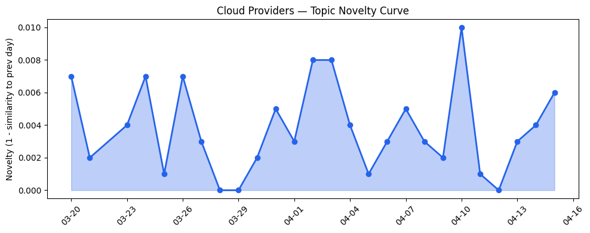
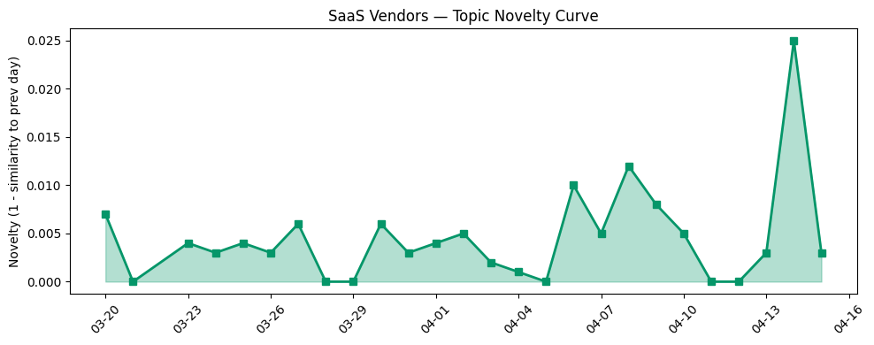

## 今日云计算结构性变化

> AI Agent技术正从概念验证进入企业级规模化部署阶段，各大云厂商通过统一图分析、安全网络层、标准化协议和治理框架的同步推进，标志着企业AI应用进入安全可控的规模化治理时代。

今天最值得注意的结构性变化是云厂商正在为AI Agentic Era构建标准化基础设施层。Google Cloud推出BigQuery Graph与Spanner Graph统一图分析方案，Cloudflare发布Mesh网络将安全私有网络扩展到AI代理，AWS的S3 Files将对象存储转为高性能文件系统，这些技术突破共同指向一个方向：云基础设施正在从支持传统应用转向专门优化AI代理的规模化运行环境。

- 📈 **持续趋势**：技术层、应用层、基础设施话题已连续8天增强
- 🔺 **突然升温**：技术层和应用层近3天相似度显著提升
- 🔑 **新关键词**：AI平台、Azure Smart Tier、MCP、Workflows、多云连接、标准化协议
- 📉 **消退关键词**：AI安全、Kubernetes、可持续性、合规风险等传统关注点

## 技术层信号

🔴 重大突破

云原生技术正经历重大范式转移。Google Cloud的[BigQuery Graph](https://cloud.google.com/blog/products/data-analytics/introducing-bigquery-graph/)能够分析企业80%的非结构化数据，与Spanner Graph形成统一图分析方案，标志着云数据库从关系型向图分析的重大演进。同时，Cloudflare的[Mesh网络](https://blog.cloudflare.com/mesh/)将安全私有网络扩展到AI代理，[Workflows v2](https://blog.cloudflare.com/workflows-v2/)重构控制平面支持更高并发，这些技术突破共同构建了AI代理运行的基础设施层。

AWS的[S3 Files](https://aws.amazon.com/blogs/aws/launching-s3-files-making-s3-buckets-accessible-as-file-systems/)将对象存储转为高性能文件系统，解决了AI工作负载对文件系统性能的苛刻需求。Azure的[智能分层存储](https://azure.microsoft.com/en-us/blog/optimize-object-storage-costs-automatically-with-smart-tier-now-generally-available/)正式上线，AWS Aurora PostgreSQL serverless实现秒级数据库创建，这些改进显示云厂商正在为AI时代优化底层存储和数据库性能。

## 产业资本信号

🟡 中等信号

资本正加速流向AI应用层和基础设施工具链。AI营销工具[Hightouch达到1亿美元ARR](https://techcrunch.com/2026/04/15/hightouch-reaches-100m-arr-fueled-by-marketing-tools-powered-by-ai/)，20个月增长7000万美元，显示企业级AI工具的市场需求爆发。AI学习平台[Gizmo获2200万美元融资](https://techcrunch.com/2026/04/15/ai-learning-app-gizmo-levels-up-with-13m-users-and-a-22m-investment/)，Strella完成1400万美元A轮融资，表明AI客户研究领域投资活跃。

在战略并购方面，[卡特彼勒收购破产的Monarch Tractor](https://techcrunch.com/2026/04/15/monarch-tractors-collapse-ends-in-with-an-acquisition-by-caterpillar/)显示传统企业通过并购获取AI技术能力。微软在[Forrester主权云平台评估中被评为领导者](https://azure.microsoft.com/en-us/blog/microsoft-named-a-leader-in-the-forrester-wave-for-sovereign-cloud-platforms/)，反映监管合规需求提升带来的市场机会。

## 潜在拐点判断

今日观察到明确的产业拐点信号：AI Agent技术从实验室概念正式进入企业级规模化部署阶段。拐点依据包括：技术层出现统一图分析、安全网络层等标准化基础设施；应用层在医疗科技、机器人制造、核能行业等垂直场景深度落地；资本加速流向AI工具链和企业级解决方案。

这一拐点可能带来的影响是：云厂商竞争焦点从通用计算能力转向AI代理专用基础设施；企业数字化转型重点从"上云"转向"AI化"；传统SaaS厂商面临被AI原生应用重构的风险。

## 明日观察点

1. **AI代理标准化协议进展**：关注MCP等协议在各云平台的采纳情况，判断是否形成统一生态
2. **企业AI治理工具成熟度**：观察AWS Bedrock Guardrails、Salesforce治理框架的实际应用效果
3. **垂直行业AI部署速度**：跟踪医疗、制造、能源等行业的AI代理规模化案例

## 长期趋势坐标

今日信号在月尺度上确认了AI Agentic Era的加速到来。过去8天技术层、应用层、基础设施的持续增强趋势，结合今日出现的统一图分析、安全网络层等关键技术突破，表明云产业正在系统性重构以支持AI代理规模化。新出现的"MCP"、"Workflows"、"标准化协议"等关键词，反映了产业从碎片化创新向标准化基础设施演进的重要转变。

## 数据洞察

### 云厂商话题演化
今日云厂商话题新颖度得分0.023，平均相似度0.977，呈现延续趋势。26天历史数据显示云厂商话题保持高度一致性，反映AI Agent基础设施建设的系统性推进。

### SaaS厂商话题演化  
SaaS厂商话题新颖度得分0.033，平均相似度0.967，同样呈现延续趋势。30篇文章显示SaaS厂商正深度融入AI Agent生态，从应用层推动技术落地。

### 趋势图

## 参考来源

**云厂商**
- [Introducing BigQuery Graph: Unlock hidden relationships in your data](https://cloud.google.com/blog/products/data-analytics/introducing-bigquery-graph/) — Google Cloud Blog
- [Secure private networking for everyone: users, nodes, agents, Workers — introducing Cloudflare Mesh](https://blog.cloudflare.com/mesh/) — Cloudflare Blog
- [Launching S3 Files, making S3 buckets accessible as file systems](https://aws.amazon.com/blogs/aws/launching-s3-files-making-s3-buckets-accessible-as-file-systems/) — AWS Blog
- [Rearchitecting the Workflows control plane for the agentic era](https://blog.cloudflare.com/workflows-v2/) — Cloudflare Blog
- [From operational to analytical: The unified Spanner Graph and BigQuery Graph solution](https://cloud.google.com/blog/products/data-analytics/the-unified-graph-solution-with-spanner-graph-and-bigquery-graph/) — Google Cloud Blog
- [Browser Run: give your agents a browser](https://blog.cloudflare.com/browser-run-for-ai-agents/) — Cloudflare Blog
- [Announcing Amazon Aurora PostgreSQL serverless database creation in seconds](https://aws.amazon.com/blogs/aws/announcing-amazon-aurora-postgresql-serverless-database-creation-in-seconds/) — AWS Blog
- [Optimize object storage costs automatically with smart tier—now generally available](https://azure.microsoft.com/en-us/blog/optimize-object-storage-costs-automatically-with-smart-tier-now-generally-available/) — Microsoft Azure Blog
- [AWS Interconnect is now generally available](https://aws.amazon.com/blogs/aws/aws-interconnect-is-now-generally-available-with-a-new-option-to-simplify-last-mile-connectivity/) — AWS Blog
- [Building sovereign AI at the edge: Microsoft and Armada collaborate to deliver Azure Local on Galleon modular datacenters](https://azure.microsoft.com/en-us/blog/building-sovereign-ai-at-the-edge-microsoft-and-armada-collaborate-to-deliver-azure-local-on-galleon-modular-datacenters/) — Microsoft Azure Blog
- [AI for nuclear energy: Powering an intelligent, resilient future](https://www.microsoft.com/en-us/industry/blog/energy-and-resources/2026/03/24/ai-for-nuclear-energy-powering-an-intelligent-resilient-future/) — Microsoft Azure Blog
- [Cool stuff Google Cloud customers built, April edition: BMW big on SLMs, MLB’s Scout Insights AI, personalized resort experiences](https://cloud.google.com/blog/topics/customers/cool-stuff-google-cloud-customers-built-monthly-round-up/) — Google Cloud Blog
- [A new standard for research: How UC Riverside is securing the path to federal grants with Google Public Sector](https://cloud.google.com/blog/topics/public-sector/a-new-standard-for-research-how-uc-riverside-is-securing-the-path-to-federal-grants-with-google-public-sector/) — Google Cloud Blog
- [Amazon Bedrock Guardrails supports cross-account safeguards](https://aws.amazon.com/blogs/aws/amazon-bedrock-guardrails-supports-cross-account-safeguards-with-centralized-control-and-management/) — AWS Blog
- [Microsoft named a Leader in The Forrester Wave™ for Sovereign Cloud Platforms](https://azure.microsoft.com/en-us/blog/microsoft-named-a-leader-in-the-forrester-wave-for-sovereign-cloud-platforms/) — Microsoft Azure Blog
- [Managed OAuth for Access: make internal apps agent-ready in one click](https://blog.cloudflare.com/managed-oauth-for-access/) — Cloudflare Blog

**SaaS厂商**
- [The Future of MedTech Field Execution is Agentic](https://www.salesforce.com/blog/medtech-field-execution/) — Salesforce Blog
- [From Break/Fix to Profit Engine: Aftermarket Service for Robot OEMs](https://www.salesforce.com/blog/aftermarket-service-robotics-oem/) — Salesforce Blog
- [What Is Microproductivity and Why Is It Helping So Many Teams?](https://www.salesforce.com/blog/what-is-microproductivity/) — Salesforce Blog
- [AI Agents Don’t Just Answer — They Act. Do You Have a Governance Strategy?](https://www.salesforce.com/blog/data-governance-for-the-agentic-era/) — Salesforce Blog
- [How HubSpot became the #1 CRM in AI search [A case study]](https://blog.hubspot.com/marketing/hubspot-aeo-case-study) — HubSpot Blog

**行业资讯**
- [Feds will require data centers to show their power bills](https://techcrunch.com/2026/04/15/feds-will-require-data-centers-to-show-their-power-bills/) — TechCrunch
- [Hightouch reaches $100M ARR fueled by marketing tools powered by AI](https://techcrunch.com/2026/04/15/hightouch-reaches-100m-arr-fueled-by-marketing-tools-powered-by-ai/) — TechCrunch
- [AI learning app Gizmo levels up with 13M users and a $22M investment](https://techcrunch.com/2026/04/15/ai-learning-app-gizmo-levels-up-with-13m-users-and-a-22m-investment/) — TechCrunch
- [Monarch Tractor’s collapse ends with an acquisition by Caterpillar](https://techcrunch.com/2026/04/15/monarch-tractors-collapse-ends-in-with-an-acquisition-by-caterpillar/) — TechCrunch
- [Ford EV and tech chief leaving automaker](https://techcrunch.com/2026/04/15/ford-ev-and-tech-chief-leaving-automaker/) — TechCrunch
- [Amazon and Chobani adopt Strella's AI interviews for customer research as fast-growing startup raises $14M](https://venturebeat.com/technology/amazon-and-chobani-adopt-strellas-ai-interviews-for-customer-research-as) — VentureBeat Enterprise
- [Kai-Fu Lee's brutal assessment: America is already losing the AI hardware war to China](https://venturebeat.com/infrastructure/kai-fu-lees-brutal-assessment-america-is-already-losing-the-ai-hardware-war) — VentureBeat Enterprise