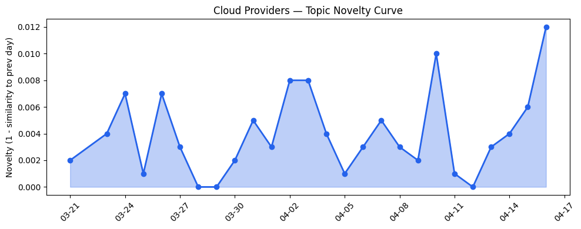
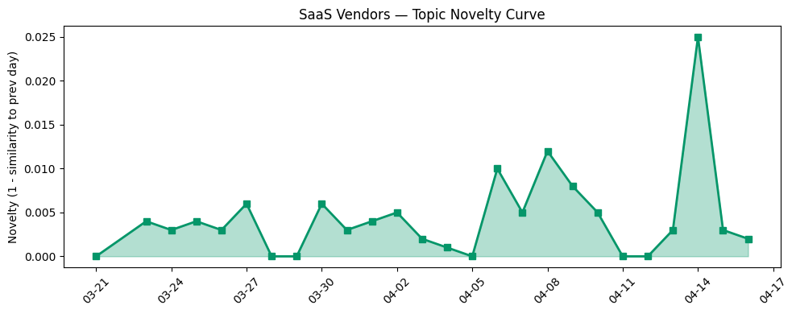

## 今日云计算结构性变化

> AI Agent技术正从模型竞争转向基础设施和工具链的标准化突破，标志着AI原生云服务进入新阶段。

今天最显著的结构性变化是云厂商围绕AI Agent基础设施的竞争全面升级。Cloudflare、AWS、Google Cloud等厂商不再局限于提供单一模型服务，而是构建统一的推理平台和工具链生态系统。这种转变意味着企业级AI应用将从"选模型"转向"选平台"，云厂商通过标准化接口和工具链锁定客户，形成新的竞争壁垒。

- 📈 **持续趋势**：基础设施话题已连续8天增强，主权云、数据治理等方向持续升温
- 🆕 **新兴方向**：Bedrock、企业AI应用、工具链等关键词首次集中出现
- 🔺 **突然升温**：AI Agent基础设施相关话题近3天密集发布
- 🔑 **新关键词**：Bedrock、企业AI应用、工具链
- 📉 **消退关键词**：AI安全、Kubernetes、云原生、可持续性

## 技术层信号

🔴 重大突破

Cloudflare推出AI Agent统一推理平台，构建支持14+模型提供商的推理层，这是云原生AI基础设施成熟度的重大突破。该平台不仅提供统一接口，还发布Artifacts Git兼容存储和AI Search搜索原语，标志着AI工具链标准化进入新阶段。AWS同步推出ECS Managed Daemons提升容器编排运维效率，而Google Cloud在Vertex AI平台推出Claude Opus 4.7多区域端点，体现云厂商在AI基础设施层的全面升级。

在存储和网络层面，AWS发布S3 Files功能使S3桶可作为高性能文件系统访问，Azure智能分层存储正式可用优化对象存储成本，这些改进共同推动AI工作负载的基础设施性能提升。Cloudflare同时推出Agent Lee智能交互界面和Browser Run浏览器渲染能力，为AI Agent提供更完整的执行环境。

## 产业资本信号

🟡 中等信号

资本流向显示AI基础设施公司Upscale AI拟以20亿美元估值融资，企业支出管理平台Slash融资1亿美元估值14亿美元，反映投资者继续押注AI原生基础设施和企业工具。值得注意的是，Anthropic CPO离开Figma董事会可能推出竞争产品，暗示AI厂商开始向上游工具链延伸。

在基础设施布局方面，AWS Interconnect服务正式可用提供跨云私有连接能力，微软与Armada合作推出Azure Local on Galleon模块化数据中心推进边缘主权AI布局。这些投资表明云厂商正通过多云连接和边缘计算构建更分散、更合规的AI基础设施体系。微软主权云平台获Forrester领导者评价，进一步验证了这一战略方向的市场需求。

## 潜在拐点判断

今日观察到AI Agent基础设施从"模型供给"向"平台生态"的拐点信号。依据是Cloudflare、AWS、Google Cloud几乎同步推出统一推理平台和标准化工具链，这种协同行动表明产业共识已经形成。可能的影响是：中小企业AI应用门槛大幅降低，云厂商通过工具链锁定形成新的竞争优势，专用AI芯片和边缘计算需求将加速增长。

这一拐点意味着AI云服务竞争进入新阶段——从提供算力和模型，转向提供完整的开发、部署和管理体验。云厂商需要构建更开放的生态系统，同时确保在关键工具链环节的掌控力。

## 明日观察点

1. **工具链标准化进程**：关注各云厂商AI工具链的兼容性和开放性，判断是否会出现类似容器标准的跨平台协议
2. **边缘AI部署进展**：观察微软Azure Local on Galleon等边缘方案的落地案例，评估主权AI的实际需求规模
3. **资本配置方向**：跟踪AI基础设施初创公司的融资动态，判断资本是否从模型层向工具链层转移

## 长期趋势坐标

将今日信号放到月度尺度观察，基础设施话题已连续8天增强，表明AI Agent基础设施建设进入加速期。新出现的Bedrock、工具链等关键词反映云厂商正从底层技术竞争转向开发者体验竞争。主权云和数据治理话题的持续升温，说明合规性已成为AI基础设施的核心考量因素。

整体来看，云计算产业正在经历从"云上AI"到"AI原生云"的深刻转变，云服务的设计理念和架构都在围绕AI工作负载重新构建。

## 数据洞察

### 云厂商话题演化
今日云厂商话题新颖度得分0.024，相似度0.976，呈现延续性趋势。过去27天共分析46篇文章，显示云厂商话题保持高度一致性，主要围绕AI基础设施和工具链展开。

### SaaS厂商话题演化  
SaaS厂商话题新颖度得分0.033，相似度0.967，同样呈现延续性趋势。30篇文章分析显示SaaS厂商重点布局垂直行业AI应用，特别是医疗科技、媒体娱乐等领域的Agentic解决方案。

### 趋势图

## 参考来源

**云厂商**
- [Cloudflare's AI Platform: an inference layer designed for agents](https://blog.cloudflare.com/ai-platform/) — Cloudflare Blog
- [Artifacts: versioned storage that speaks Git](https://blog.cloudflare.com/artifacts-git-for-agents-beta/) — Cloudflare Blog
- [Launching S3 Files, making S3 buckets accessible as file systems](https://aws.amazon.com/blogs/aws/launching-s3-files-making-s3-buckets-accessible-as-file-systems/) — AWS Blog
- [Multi-region endpoints are available for Claude on Vertex AI](https://cloud.google.com/blog/products/ai-machine-learning/multi-region-endpoints-for-claude-available-on-vertex-ai/) — Google Cloud Blog
- [Optimize object storage costs automatically with smart tier—now generally available](https://azure.microsoft.com/en-us/blog/optimize-object-storage-costs-automatically-with-smart-tier-now-generally-available/) — Microsoft Azure Blog
- [Introducing Agent Lee - a new interface to the Cloudflare stack](https://blog.cloudflare.com/introducing-agent-lee/) — Cloudflare Blog
- [Announcing managed daemon support for Amazon ECS Managed Instances](https://aws.amazon.com/blogs/aws/announcing-managed-daemon-support-for-amazon-ecs-managed-instances/) — AWS Blog
- [Browser Run: give your agents a browser](https://blog.cloudflare.com/browser-run-for-ai-agents/) — Cloudflare Blog
- [AWS Interconnect is now generally available, with a new option to simplify last-mile connectivity](https://aws.amazon.com/blogs/aws/aws-interconnect-is-now-generally-available-with-a-new-option-to-simplify-last-mile-connectivity/) — AWS Blog
- [Building sovereign AI at the edge: Microsoft and Armada collaborate to deliver Azure Local on Galleon modular datacenters](https://azure.microsoft.com/en-us/blog/building-sovereign-ai-at-the-edge-microsoft-and-armada-collaborate-to-deliver-azure-local-on-galleon-modular-datacenters/) — Microsoft Azure Blog
- [Microsoft named a Leader in The Forrester Wave™ for Sovereign Cloud Platforms](https://azure.microsoft.com/en-us/blog/microsoft-named-a-leader-in-the-forrester-wave-for-sovereign-cloud-platforms/) — Microsoft Azure Blog
- [Building the foundation for running extra-large language models](https://blog.cloudflare.com/high-performance-llms/) — Cloudflare Blog
- [Register domains wherever you build: Cloudflare Registrar API now in beta](https://blog.cloudflare.com/registrar-api-beta/) — Cloudflare Blog

**SaaS厂商**
- [The Future of MedTech Field Execution is Agentic](https://www.salesforce.com/blog/medtech-field-execution/) — Salesforce Blog
- [AI for nuclear energy: Powering an intelligent, resilient future](https://www.microsoft.com/en-us/industry/blog/energy-and-resources/2026/03/24/ai-for-nuclear-energy-powering-an-intelligent-resilient-future/) — Microsoft Azure Blog
- [Building the agentic future: A spotlight on Google Cloud’s media & entertainment partner ecosystem](https://cloud.google.com/blog/products/media-entertainment/agentic-media-and-entertainment-is-here-see-how-our-ecosystem-helps-build-it/) — Google Cloud Blog
- [Announcing the AWS Sustainability console: Programmatic access, configurable CSV reports, and Scope 1–3 reporting in one place](https://aws.amazon.com/blogs/aws/announcing-the-aws-sustainability-console-programmatic-access-configurable-csv-reports-and-scope-1-3-reporting-in-one-place/) — AWS Blog
- [Cool stuff Google Cloud customers built, April edition: BMW big on SLMs, MLB’s Scout Insights AI, personalized resort experiences](https://cloud.google.com/blog/topics/customers/cool-stuff-google-cloud-customers-built-monthly-round-up/) — Google Cloud Blog
- [【龙虾部署】ArkClaw x 飞书，唤醒你的龙虾助理](https://developer.volcengine.com/articles/7615509894233325614) — 火山引擎 Blog

**行业资讯**
- [Upscale AI in talks to raise at $2B valuation, says report](https://techcrunch.com/2026/04/16/upscale-ai-in-talks-to-raise-at-2b-valuation-says-report/) — TechCrunch
- [Slash, a Ramp competitor founded by teenagers, raises $100M at $1.4B valuation](https://techcrunch.com/2026/04/16/slash-a-ramp-competitor-founded-by-teenagers-raises-100m-at-1-4b-valuation/) — TechCrunch
- [Amazon and Chobani adopt Strella's AI interviews for customer research as fast-growing startup raises $14M](https://venturebeat.com/technology/amazon-and-chobani-adopt-strellas-ai-interviews-for-customer-research-as) — VentureBeat Enterprise
- [Anthropic CPO leaves Figma’s board after reports he will offer a competing product](https://techcrunch.com/2026/04/16/anthropic-cpo-leaves-figmas-board-after-reports-he-will-offer-a-competing-product/) — TechCrunch
- [Microsoft’s Copilot can now build apps and automate your job — here’s how it works](https://venturebeat.com/technology/microsofts-copilot-can-now-build-apps-and-automate-your-job-heres-how-it) — VentureBeat Enterprise
- [European police email 75,000 people asking them to stop DDoS attacks](https://techcrunch.com/2026/04/16/european-police-email-75000-people-asking-them-to-stop-ddos-attacks/) — TechCrunch
- [Navigating digital sovereignty at the frontier of transformation](https://www.microsoft.com/en-us/microsoft-cloud/blog/2026/03/25/navigating-digital-sovereignty-at-the-frontier-of-transformation/) — Microsoft Azure Blog
- [It’s not just you — Bluesky is (sorta) down](https://techcrunch.com/2026/04/16/its-not-just-you-bluesky-is-sorta-down/) — TechCrunch
- [Kai-Fu Lee's brutal assessment: America is already losing the AI hardware war to China](https://venturebeat.com/infrastructure/kai-fu-lees-brutal-assessment-america-is-already-losing-the-ai-hardware-war) — VentureBeat Enterprise
- [The German Cyber Criminal Überfall: Shifts in Europe's Data Leak Landscape](https://cloud.google.com/blog/topics/threat-intelligence/europe-data-leak-landscape/) — Google Cloud Blog