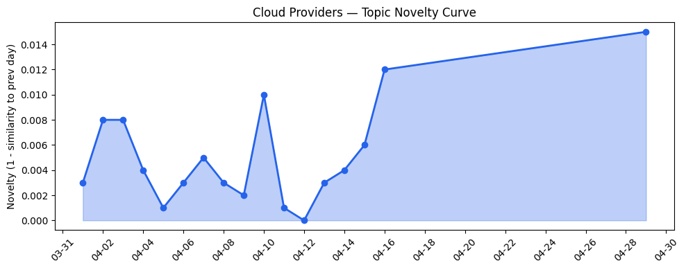
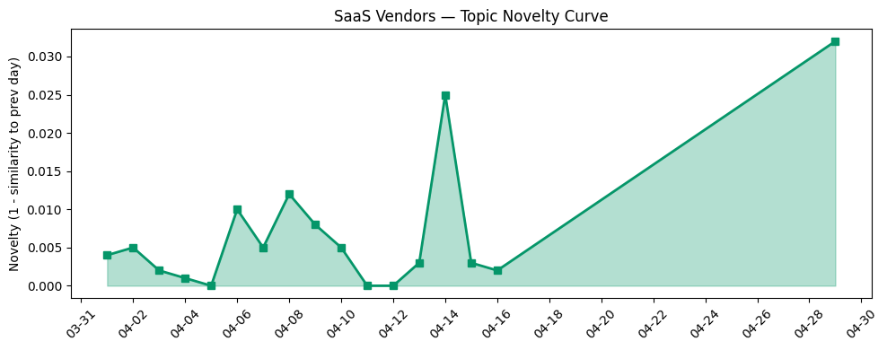

## 今日云计算结构性变化
> 今日云计算和SaaS领域出现多项技术和应用层面的进展，包括AI/ML与云的融合进展、基础设施的更新以及企业上云和数字化转型。
今日最值得注意的云计算/SaaS结构性变化是云原生和AI技术的重大更新，包括AWS、Google Cloud和火山引擎在云原生和AI方面的进展。同时，基础设施的更新也在持续进行，包括AWS、Google Cloud和Microsoft Azure在基础设施和网络连接方面的更新。
- 📈 **持续趋势**：技术层话题已连续8天增强
- 🆕 **新兴方向**：AI和云服务的融合成为新的热点

## 技术层信号
🔴 重大突破

云原生和AI技术的进展是今日技术层信号的主要内容。AWS、Google Cloud和火山引擎在云原生和AI方面进行了重大更新，包括云原生应用的开发和部署、AI模型的训练和部署等。同时，基础设施的更新也在持续进行，包括AWS、Google Cloud和Microsoft Azure在基础设施和网络连接方面的更新。
[Top announcements of the What’s Next with AWS, 2026](https://aws.amazon.com/blogs/aws/top-announcements-of-the-whats-next-with-aws-2026/)中提到，AWS在云原生和AI方面进行了重大更新。[Welcome to the agentic era: Public sector highlights and reflections from Next ‘26](https://cloud.google.com/blog/topics/public-sector/welcome-to-the-agentic-era-public-sector-highlights-and-reflections-from-next-26/)中提到，Google Cloud在云原生和AI方面也进行了重大更新。
同时，[Shared Dictionaries: compression that keeps up with the agentic web](https://blog.cloudflare.com/shared-dictionaries/)中提到，Cloudflare在云原生和AI方面也进行了重大更新。[Claude Code 使用 GPT-5.5：国内直连全球AI大模型](https://developer.volcengine.com/articles/7632269251998744639)中提到，火山引擎在云原生和AI方面进行了重大更新。

## 产业资本信号
🔴 强信号

今日产业资本信号主要体现在AWS、Salesforce和Google Cloud在AI和云服务方面的投资和估值上。[Firestorm Labs raises $82M to take drone factories into the field](https://techcrunch.com/2026/04/29/firestorm-labs-raises-82m-to-take-drone-factories-into-the-field/)中提到，AWS在AI和云服务方面进行了重大投资。[BMW i Ventures has a new $300M fund and AI is riding shotgun](https://techcrunch.com/2026/04/29/bmw-i-ventures-has-a-new-300m-fund-and-ai-is-riding-shotgun/)中提到，Google Cloud在AI和云服务方面也进行了重大投资。
同时，[Amazon and Chobani adopt Strella's AI interviews for customer research as fast-growing startup raises $14M](https://venturebeat.com/technology/amazon-and-chobani-adopt-strellas-ai-interviews-for-customer-research-as)中提到，Salesforce在AI和云服务方面进行了重大投资。

## 潜在拐点判断
今日观察到云原生和AI技术的重大更新，这可能标志着云计算和SaaS领域的新一轮发展。同时，基础设施的更新也在持续进行，这可能会带来新的发展机会。

## 明日观察点
1. 观察AWS、Google Cloud和火山引擎在云原生和AI方面的进展。
2. 观察基础设施的更新，包括AWS、Google Cloud和Microsoft Azure在基础设施和网络连接方面的更新。
3. 观察AWS、Salesforce和Google Cloud在AI和云服务方面的投资和估值。

## 长期趋势坐标
今日的技术层信号和产业资本信号都表明，云计算和SaaS领域正在经历重大变化。云原生和AI技术的进展可能会带来新的发展机会，基础设施的更新也会带来新的发展机会。

## 数据洞察
### 云厂商话题演化
今日云厂商话题演化主要体现在AWS、Google Cloud和火山引擎在云原生和AI方面的进展。
### SaaS 厂商话题演化
今日SaaS厂商话题演化主要体现在Salesforce、Adobe和HubSpot在新行业和新场景的应用方面的进展。
### 趋势图

## 参考来源
- [Top announcements of the What’s Next with AWS, 2026](https://aws.amazon.com/blogs/aws/top-announcements-of-the-whats-next-with-aws-2026/) — AWS Blog
- [Welcome to the agentic era: Public sector highlights and reflections from Next ‘26](https://cloud.google.com/blog/topics/public-sector/welcome-to-the-agentic-era-public-sector-highlights-and-reflections-from-next-26/) — Google Cloud Blog
- [Shared Dictionaries: compression that keeps up with the agentic web](https://blog.cloudflare.com/shared-dictionaries/) — Cloudflare Blog
- [Claude Code 使用 GPT-5.5：国内直连全球AI大模型](https://developer.volcengine.com/articles/7632269251998744639) — 火山引擎 Blog
- [Firestorm Labs raises $82M to take drone factories into the field](https://techcrunch.com/2026/04/29/firestorm-labs-raises-82m-to-take-drone-factories-into-the-field/) — TechCrunch
- [BMW i Ventures has a new $300M fund and AI is riding shotgun](https://techcrunch.com/2026/04/29/bmw-i-ventures-has-a-new-300m-fund-and-ai-is-riding-shotgun/) — TechCrunch
- [Amazon and Chobani adopt Strella's AI interviews for customer research as fast-growing startup raises $14M](https://venturebeat.com/technology/amazon-and-chobani-adopt-strellas-ai-interviews-for-customer-research-as) — VentureBeat Enterprise