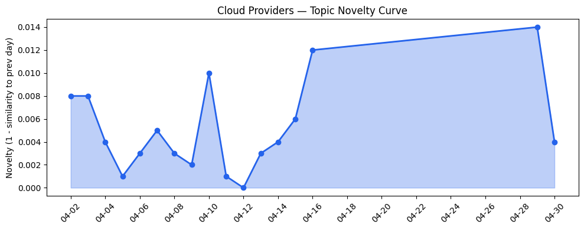
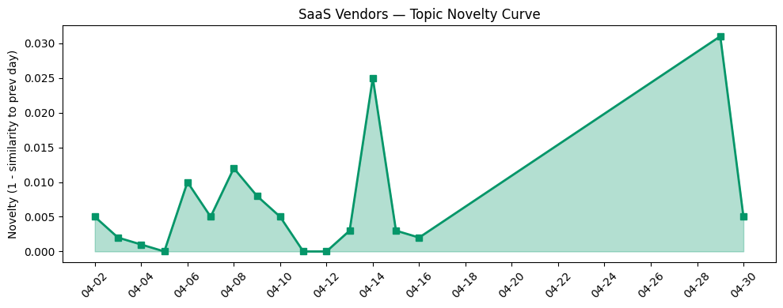

## 今日云计算结构性变化
> 今日云计算领域重点关注AI与代码审查、网站优化以及云原生技术的进展，AWS、Salesforce、Google Cloud和Azure等公司在云计算和SaaS领域取得了显著进展。
今日最值得注意的云计算/SaaS结构性变化是云原生技术和AI的融合，以及基础设施和应用层的更新。这些变化表明云计算和SaaS领域正在迅速发展，企业数字化转型加速，云计算和SaaS需求增加。
- 📈 **持续趋势**：技术层话题已连续8天增强
- 🆕 **新兴方向**：数字化转型话题为30天内首次出现
- 🔺 **突然升温**：基础设施话题近3天突然集中出现
- 🔑 **新关键词**：数字化转型
- 📉 **消退关键词**：AI代理、AI治理、Kubernetes、可持续性、数字主权、数据主权、模块化数据中心

## 技术层信号
🔴 重大突破

云原生技术和AI的融合是今日技术层信号的重点。AWS、Google Cloud和Azure等公司在云原生和容器化方面有所进展，例如AWS的[Top announcements of the What’s Next with AWS, 2026](https://aws.amazon.com/blogs/aws/top-announcements-of-the-whats-next-with-aws-2026/)和Google Cloud的[Cloud CISO Perspectives: At Next ‘26, why we’re multicloud and multi-AI](https://cloud.google.com/blog/products/identity-security/cloud-ciso-perspectives-next-26-why-we-re-multicloud-and-multi-ai/)。此外，火山引擎的[Claude Code 使用 GPT-5.5：国内直连全球AI大模型](https://developer.volcengine.com/articles/7632269251998744639)也体现了云原生技术和AI的融合。

## 产业资本信号
🔴 强信号

今日产业资本信号表明，云计算和SaaS领域的投资和估值正在增加。例如，[Legal AI startup Legora hits $5.6B valuation and its battle with Harvey just got hotter](https://techcrunch.com/2026/04/30/legal-ai-startup-legora-hits-5-6-valuation-and-its-battle-with-harvey-just-got-hotter/)和[Amazon and Chobani adopt Strella's AI interviews for customer research as fast-growing startup raises $14M](https://venturebeat.com/technology/amazon-and-chobani-adopt-strellas-ai-interviews-for-customer-research-as)。这些信号表明，云计算和SaaS领域正在吸引大量投资和关注。

## 潜在拐点判断
今日信号和历史趋势表明，云计算和SaaS领域可能正在经历一个潜在的拐点。云原生技术和AI的融合，基础设施和应用层的更新，以及产业资本信号的增强，都表明云计算和SaaS领域正在迅速发展和变化。这些变化可能会带来新的机会和挑战，企业需要关注这些变化并做出相应的调整。

## 明日观察点
1. 云原生技术和AI的融合会如何继续发展？
2. 基础设施和应用层的更新会带来什么样的影响？
3. 产业资本信号的增强会如何影响云计算和SaaS领域？

## 长期趋势坐标
今日信号和历史趋势表明，云计算和SaaS领域正在经历一个长期的发展和变化过程。云原生技术和AI的融合，基础设施和应用层的更新，以及产业资本信号的增强，都表明云计算和SaaS领域正在迅速发展和变化。这些变化可能会带来新的机会和挑战，企业需要关注这些变化并做出相应的调整。

## 数据洞察
### 云厂商话题演化
今日云厂商话题演化表明，云原生技术和AI的融合是当前的热点话题。AWS、Google Cloud和Azure等公司在云原生和容器化方面有所进展，火山引擎的Claude Code使用GPT-5.5也体现了云原生技术和AI的融合。
### SaaS厂商话题演化
今日SaaS厂商话题演化表明，数字化转型是当前的热点话题。Salesforce、HubSpot等公司在数字化转型方面有所进展，例如[Scaling the Agentforce Life Sciences Ecosystem to Drive the Future of Pharma and MedTech](https://www.salesforce.com/blog/salesforce-scales-agentforce-life-sciences/)。
### 趋势图

## 参考来源
- [Top announcements of the What’s Next with AWS, 2026](https://aws.amazon.com/blogs/aws/top-announcements-of-the-whats-next-with-aws-2026/) — AWS Blog
- [Cloud CISO Perspectives: At Next ‘26, why we’re multicloud and multi-AI](https://cloud.google.com/blog/products/identity-security/cloud-ciso-perspectives-next-26-why-we-re-multicloud-and-multi-ai/) — Google Cloud Blog
- [Microsoft Discovery: Advancing agentic R&D at scale](https://azure.microsoft.com/en-us/blog/microsoft-discovery-advancing-agentic-rd-at-scale/) — Microsoft Azure Blog
- [Orchestrating AI Code Review at scale](https://blog.cloudflare.com/ai-code-review/) — Cloudflare Blog
- [Claude Code 使用 GPT-5.5：国内直连全球AI大模型](https://developer.volcengine.com/articles/7632269251998744639) — 火山引擎 Blog
- [Legal AI startup Legora hits $5.6B valuation and its battle with Harvey just got hotter](https://techcrunch.com/2026/04/30/legal-ai-startup-legora-hits-5-6-valuation-and-its-battle-with-harvey-just-got-hotter/) — TechCrunch
- [Amazon and Chobani adopt Strella's AI interviews for customer research as fast-growing startup raises $14M](https://venturebeat.com/technology/amazon-and-chobani-adopt-strellas-ai-interviews-for-customer-research-as) — VentureBeat Enterprise