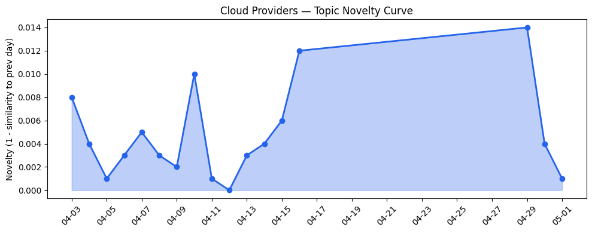
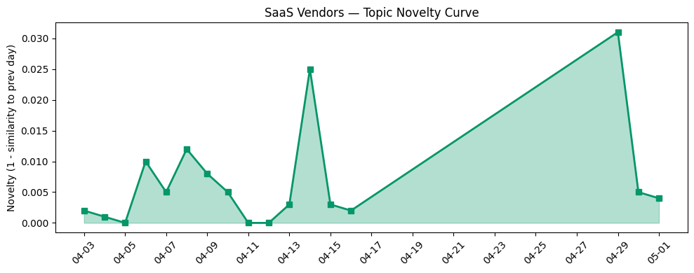

## 今日云计算结构性变化
> 云计算领域重点关注AI工程栈建设、云原生技术应用以及多云战略布局，SaaS领域主要关注点在于AI技术的融合、云基础设施的优化以及企业级应用的扩展。
今日最值得注意的云计算/SaaS结构性变化是技术层、基础设施和应用层的持续升温，尤其是AI技术的融合和云原生技术应用的推进。这些变化表明云计算和SaaS领域正在经历快速的发展和创新。

- 📈 **持续趋势**：技术层、基础设施和应用层话题向量在最近8天内呈现持续增强趋势。
- 🆕 **新兴方向**：多云战略成为新的热点话题。
- 🔺 **突然升温**：AI、AWS、HubSpot和SaaS等关键词近期突然升温。
- 🔑 **新关键词**：多云战略。
- 📉 **消退关键词**：AI代理、AI治理、Kubernetes等。

## 技术层信号
🔴 重大突破

云原生技术应用和AI工程栈建设是当前技术层的两个主要信号。Cloudflare的Agents Week 2026发布会上推出了多项云原生技术应用，包括compute和security等。火山引擎数智平台推出了新功能，包括Claude Code使用GPT-5.5和Coding Plan正式上线GLM-5.1与MiniMax-M2.7。这些发展表明云原生技术和AI正在成为云计算领域的核心驱动力。

根据[Building the agentic cloud: everything we launched during Agents Week 2026](https://blog.cloudflare.com/agents-week-in-review/)和[Claude Code 使用 GPT-5.5：国内直连全球AI大模型](https://developer.volcengine.com/articles/7632269251998744639)，我们可以看到云原生技术和AI的融合正在推动云计算的创新。

## 产业资本信号
🔴 强信号

Anthropic可能获得900亿美元估值，Skio以1.05亿美元现金出售，Amazon和Chobani采用了Strella的AI采访技术，这些信号表明云计算和SaaS领域的资本流动正在加速。这些投资和并购活动表明该领域的创新和发展潜力巨大。

根据[Sources: Anthropic potential $900B+ valuation round could happen within two weeks](https://techcrunch.com/2026/04/30/anthropic-potential-900b-valuation-round-could-happen-within-two-weeks/)和[Y Combinator alum Skio sells for $105M cash, only raised $8M, founder says](https://techcrunch.com/2026/04/30/y-combinator-alum-skio-sells-for-105m-cash-only-raised-8m-founder-says/),我们可以看到云计算和SaaS领域的资本流动正在推动创新和发展。

## 潜在拐点判断
基于今日信号和历史趋势，我们判断当前云计算和SaaS领域存在潜在拐点。技术层、基础设施和应用层的持续升温，尤其是AI技术的融合和云原生技术应用的推进，表明云计算和SaaS领域正在经历快速的发展和创新。同时，资本流动的加速也为这一拐点提供了强有力的支持。

## 明日观察点
1. 观察技术层信号的持续性和强度，特别是AI技术的融合和云原生技术应用的推进。
2. 关注基础设施和应用层的发展，尤其是多云战略的推进和AI技术的应用。
3. 监测资本流动的变化，特别是投资和并购活动的增加。

## 长期趋势坐标
将今日信号放到月/季尺度，我们可以看到云计算和SaaS领域的长期趋势正在形成。技术层、基础设施和应用层的持续升温，尤其是AI技术的融合和云原生技术应用的推进，表明云计算和SaaS领域正在经历快速的发展和创新。同时，资本流动的加速也为这一趋势提供了强有力的支持。

## 数据洞察
### 云厂商话题演化
云厂商的话题向量在最近8天内呈现持续增强趋势，表明云计算领域正在经历快速的发展和创新。根据[Building the agentic cloud: everything we launched during Agents Week 2026](https://blog.cloudflare.com/agents-week-in-review/)和[Claude Code 使用 GPT-5.5：国内直连全球AI大模型](https://developer.volcengine.com/articles/7632269251998744639),我们可以看到云原生技术和AI的融合正在推动云计算的创新。

### SaaS厂商话题演化
SaaS厂商的话题向量在最近8天内呈现持续增强趋势，表明SaaS领域正在经历快速的发展和创新。根据[Great moments in document history: Reimagining the Declaration of Independence as a PDF](https://blog.adobe.com/en/publish/2022/07/01/great-moments-in-document-history-reimagining-the-declaration-of-independence-as-pdf)和[UKG unlocks real-time workforce intelligence at scale with the Agentic Data Cloud](https://cloud.google.com/blog/products/databases/how-ukg-taps-workforce-intelligence-with-the-agentic-data-cloud/),我们可以看到SaaS领域的创新和发展潜力巨大。

### 趋势图

## 参考来源
- [Building the agentic cloud: everything we launched during Agents Week 2026](https://blog.cloudflare.com/agents-week-in-review/) — Cloudflare Blog
- [Claude Code 使用 GPT-5.5：国内直连全球AI大模型](https://developer.volcengine.com/articles/7632269251998744639) — 火山引擎 Blog
- [Sources: Anthropic potential $900B+ valuation round could happen within two weeks](https://techcrunch.com/2026/04/30/anthropic-potential-900b-valuation-round-could-happen-within-two-weeks/) — TechCrunch
- [Y Combinator alum Skio sells for $105M cash, only raised $8M, founder says](https://techcrunch.com/2026/04/30/y-combinator-alum-skio-sells-for-105m-cash-only-raised-8m-founder-says/) — TechCrunch
- [Great moments in document history: Reimagining the Declaration of Independence as a PDF](https://blog.adobe.com/en/publish/2022/07/01/great-moments-in-document-history-reimagining-the-declaration-of-independence-as-pdf) — Adobe Blog
- [UKG unlocks real-time workforce intelligence at scale with the Agentic Data Cloud](https://cloud.google.com/blog/products/databases/how-ukg-taps-workforce-intelligence-with-the-agentic-data-cloud/) — Google Cloud Blog